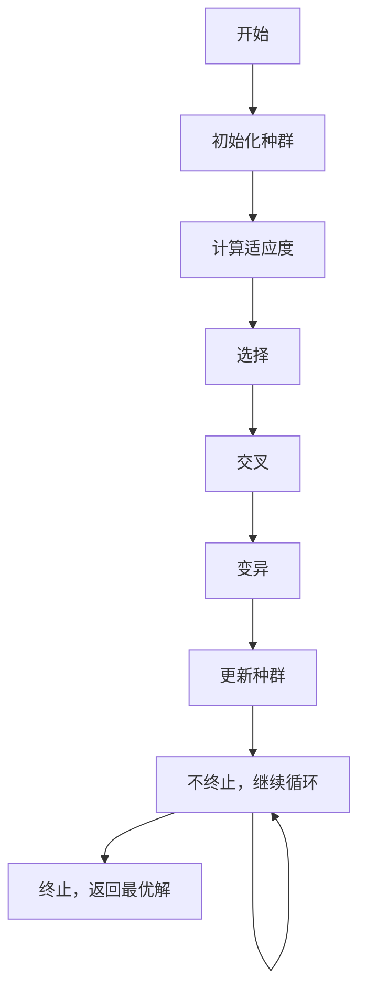
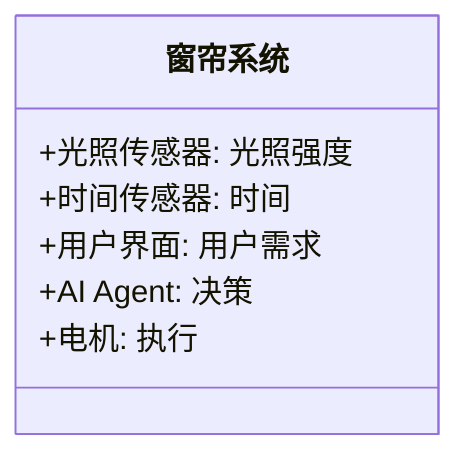
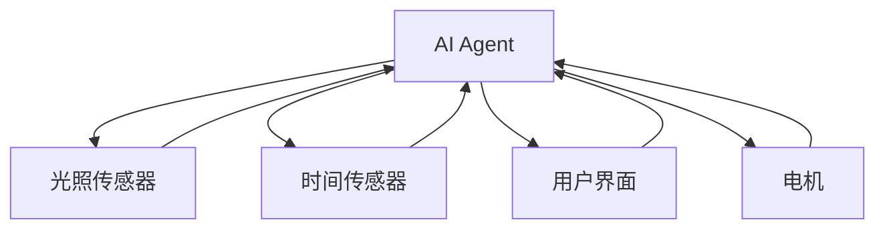
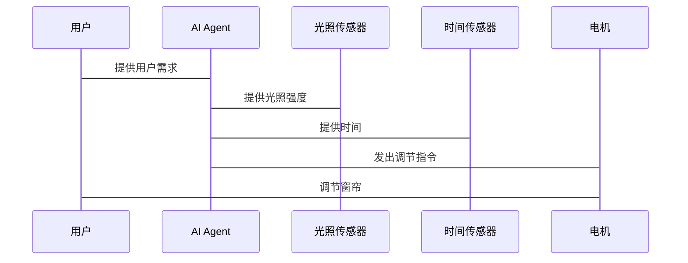

                 


# AI Agent在智能窗帘中的日光优化调节

> 关键词：AI Agent，智能窗帘，日光优化调节，算法原理，系统架构

> 摘要：本文探讨了AI Agent在智能窗帘中的日光优化调节应用，分析了其背景、核心概念、算法原理、系统架构，并通过项目实战展示其具体实现，为智能窗帘的日光调节提供了新的思路。

---

## 第1章: 背景介绍

### 1.1 问题背景

#### 1.1.1 智能窗帘的发展现状
智能窗帘已从简单的手动或遥控操作，发展为集自动化、智能化于一体的家居设备。现代智能窗帘通常配备电机、传感器和智能控制系统，能够根据光照强度、时间、用户习惯等多种因素自动调节开合状态。

#### 1.1.2 日光调节的重要性
日光调节直接影响室内光照环境，影响人们的舒适度和能源消耗。科学的日光调节不仅可以提升居住体验，还能降低能源消耗，减少碳排放。

#### 1.1.3 AI Agent在日光调节中的应用潜力
AI Agent（人工智能代理）具备感知、决策和执行能力，能够根据实时环境数据优化日光调节策略，实现更智能、更高效的调节。

### 1.2 问题描述

#### 1.2.1 日光调节的核心问题
如何根据光照强度、时间、用户需求等因素，优化窗帘的开合角度，以达到最佳的光照效果和能源效率。

#### 1.2.2 智能窗帘调节的挑战
- 多因素影响：光照强度、时间、用户需求、能源效率等多因素需要综合考虑。
- 实时性要求高：需要快速响应环境变化和用户需求。
- 系统集成复杂：需要与传感器、执行器、用户界面等多部分协同工作。

#### 1.2.3 AI Agent在智能窗帘调节中的角色
AI Agent作为系统的核心，负责收集环境数据、分析决策、执行调节，实现智能窗帘的智能化日光调节。

### 1.3 问题解决

#### 1.3.1 AI Agent如何优化日光调节
AI Agent通过实时感知光照强度、时间、用户偏好等信息，利用优化算法计算出最优的窗帘开合角度，实现日光的高效调节。

#### 1.3.2 AI Agent在智能窗帘中的具体应用
- 实时监测光照强度，动态调整窗帘开合状态。
- 根据用户习惯和偏好，预测日光需求，提前调节窗帘。
- 结合能源管理系统，优化日光调节策略，降低能源消耗。

#### 1.3.3 日光优化调节的实现目标
通过AI Agent的优化调节，实现以下目标：
- 提供舒适的室内光照环境。
- 降低能源消耗，提高能源利用效率。
- 提供个性化、智能化的日光调节服务。

### 1.4 边界与外延

#### 1.4.1 AI Agent在智能窗帘中的边界条件
- 系统硬件：智能窗帘需要配备光照传感器、电机、无线通信模块等硬件设备。
- 软件支持：需要AI Agent算法、控制系统软件、用户界面等软件支持。
- 网络环境：依赖稳定的网络连接进行数据传输和远程控制。

#### 1.4.2 日光优化调节的适用范围
适用于各种类型的智能窗帘系统，包括家庭、办公室、酒店等场景。

#### 1.4.3 AI Agent与其他智能家居设备的协同
AI Agent可以与其他智能家居设备协同工作，例如与智能灯具、智能空调等联动，提供更全面的室内环境优化服务。

### 1.5 概念结构与核心要素

#### 1.5.1 AI Agent的构成要素
- 感知模块：感知环境数据，如光照强度、时间、用户需求等。
- 决策模块：基于感知数据，利用优化算法计算出最优调节方案。
- 执行模块：根据决策结果，驱动窗帘执行开合动作。

#### 1.5.2 日光优化调节的核心要素
- 光照强度感知：通过光照传感器获取实时光照数据。
- 调节策略：基于光照数据和用户需求，制定最优的窗帘调节方案。
- 执行机构：驱动窗帘电机，调整窗帘开合角度。

#### 1.5.3 AI Agent与日光调节的交互关系
AI Agent通过感知环境数据，分析决策，驱动执行机构，实现日光调节的智能化控制。这种交互关系形成了一个完整的日光优化调节系统。

---

## 第2章: 核心概念与联系

### 2.1 AI Agent的基本原理

#### 2.1.1 AI Agent的定义与特点
AI Agent是一种智能主体，能够感知环境、自主决策、执行动作，以实现特定目标。其特点是智能化、自主性和适应性。

#### 2.1.2 AI Agent的核心算法
AI Agent的核心算法包括：
- 优化算法：如遗传算法、模拟退火算法等，用于寻找最优解。
- 机器学习算法：如神经网络、支持向量机等，用于模式识别和预测。

#### 2.1.3 AI Agent在智能窗帘中的应用
AI Agent通过感知光照强度、时间、用户需求等信息，利用优化算法计算出最优的窗帘调节方案，实现智能日光调节。

### 2.2 日光优化调节的原理

#### 2.2.1 日光调节的目标函数
目标函数通常包括：
- 最大化室内光照舒适度。
- 最小化能源消耗。
- 满足用户需求。

#### 2.2.2 日光调节的约束条件
约束条件包括：
- 窗帘的开合范围。
- 电机的运行时间限制。
- 网络连接的稳定性。

#### 2.2.3 日光调节的优化方法
优化方法包括：
- 基于模型的优化：建立数学模型，寻找最优解。
- 基于数据的优化：利用历史数据，进行机器学习和预测。

### 2.3 AI Agent与日光调节的关系

#### 2.3.1 AI Agent在日光调节中的作用
AI Agent通过感知、决策和执行，实现日光调节的智能化控制。

#### 2.3.2 AI Agent与日光调节的协同
AI Agent与其他设备协同工作，提供更全面的环境优化服务。

---

## 第3章: 算法原理讲解

### 3.1 优化算法

#### 3.1.1 基于模型的优化算法
基于模型的优化算法通过建立数学模型，寻找最优解。例如，使用遗传算法优化窗帘的开合角度。

#### 3.1.2 基于数据的优化算法
基于数据的优化算法通过分析历史数据，预测未来的需求，进行优化调节。

#### 3.1.3 算法实现
```python
def genetic_algorithm(population_size, fitness_function):
    # 初始化种群
    population = initialize_population(population_size)
    
    # 迭代优化
    while not terminated:
        # 计算适应度
        fitness = [fitness_function(individual) for individual in population]
        
        # 选择
        selected = selection(population, fitness)
        
        # 交叉
        offspring = crossover(selected)
        
        # 变异
        mutated = mutate(offspring)
        
        # 更新种群
        population = mutated
    
    return best_individual(population)
```

#### 3.1.4 算法流程图


### 3.2 数学模型

#### 3.2.1 目标函数
$$ \text{目标函数} = \min \left( \text{能源消耗} \right) + \max \left( \text{光照舒适度} \right) $$

#### 3.2.2 约束条件
$$ 0 \leq \text{开合角度} \leq 180 $$

### 3.3 机器学习算法

#### 3.3.1 神经网络模型
使用神经网络模型预测光照需求，调整窗帘开合角度。

#### 3.3.2 支持向量机
使用支持向量机进行分类，判断光照强度是否需要调节窗帘。

### 3.4 算法实现示例

#### 3.4.1 数据预处理
```python
import pandas as pd

data = pd.read_csv('光照数据.csv')
X = data[['光照强度', '时间']]
y = data['目标开合角度']
```

#### 3.4.2 模型训练
```python
from sklearn import svm

model = svm.SVR()
model.fit(X, y)
```

#### 3.4.3 模型预测
```python
import numpy as np

new_light = np.array([[120, 10]])
predicted_angle = model.predict(new_light)
```

---

## 第4章: 系统分析与架构设计方案

### 4.1 问题场景介绍

#### 4.1.1 用户需求
用户希望智能窗帘能够根据光照强度、时间、个人习惯自动调节开合角度，提供舒适的室内环境。

#### 4.1.2 环境因素
光照强度、时间、天气状况等因素影响日光调节策略。

### 4.2 系统功能设计

#### 4.2.1 领域模型


#### 4.2.2 系统架构


#### 4.2.3 接口设计
- 光照传感器接口：提供光照强度数据。
- 时间传感器接口：提供时间数据。
- 用户界面接口：接收用户需求，反馈调节状态。
- 电机接口：驱动窗帘开合。

#### 4.2.4 交互流程


---

## 第5章: 项目实战

### 5.1 环境安装

#### 5.1.1 安装Python
安装Python 3.8及以上版本。

#### 5.1.2 安装依赖库
安装机器学习库（如scikit-learn、tensorflow）、可视化库（如matplotlib）、数据处理库（如pandas）等。

### 5.2 系统核心实现

#### 5.2.1 数据预处理
```python
import pandas as pd

data = pd.read_csv('光照数据.csv')
X = data[['光照强度', '时间']]
y = data['目标开合角度']
```

#### 5.2.2 模型训练
```python
from sklearn import svm

model = svm.SVR()
model.fit(X, y)
```

#### 5.2.3 模型预测
```python
import numpy as np

new_light = np.array([[120, 10]])
predicted_angle = model.predict(new_light)
```

### 5.3 实际案例分析

#### 5.3.1 案例描述
某用户希望在光照强度为120 lux，时间为上午10点时，窗帘开合角度为45度。

#### 5.3.2 数据分析
根据历史数据，预测目标开合角度。

#### 5.3.3 模型实现
通过机器学习模型，计算出最优开合角度。

### 5.4 项目小结

#### 5.4.1 项目总结
通过AI Agent实现智能窗帘的日光优化调节，能够显著提升室内光照舒适度，降低能源消耗。

#### 5.4.2 经验总结
- 数据质量直接影响模型性能。
- 系统集成需要考虑硬件和软件的协同工作。
- 用户需求的多样性需要模型具备良好的适应性。

---

## 第6章: 最佳实践

### 6.1 小结
AI Agent在智能窗帘中的日光优化调节，通过感知、决策和执行，实现智能化的日光调节，提升用户体验和能源效率。

### 6.2 注意事项
- 确保系统硬件的稳定性。
- 保护用户隐私，避免数据泄露。
- 定期更新模型，保持系统性能。

### 6.3 拓展阅读
推荐阅读以下资料：
- 《机器学习实战》
- 《人工智能：现代方法》
- 《智能家居系统设计》

---

## 结语
通过本文的详细讲解，读者可以深入了解AI Agent在智能窗帘中的日光优化调节的应用，掌握其核心概念、算法原理和系统架构。希望本文能为相关领域的研究和实践提供有价值的参考。

