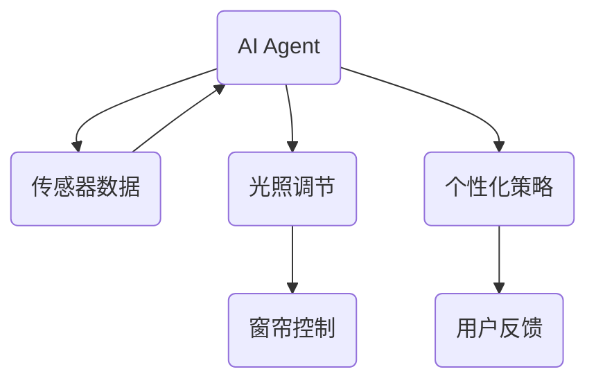
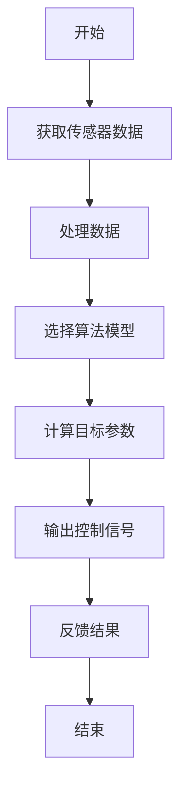
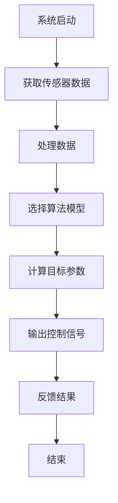
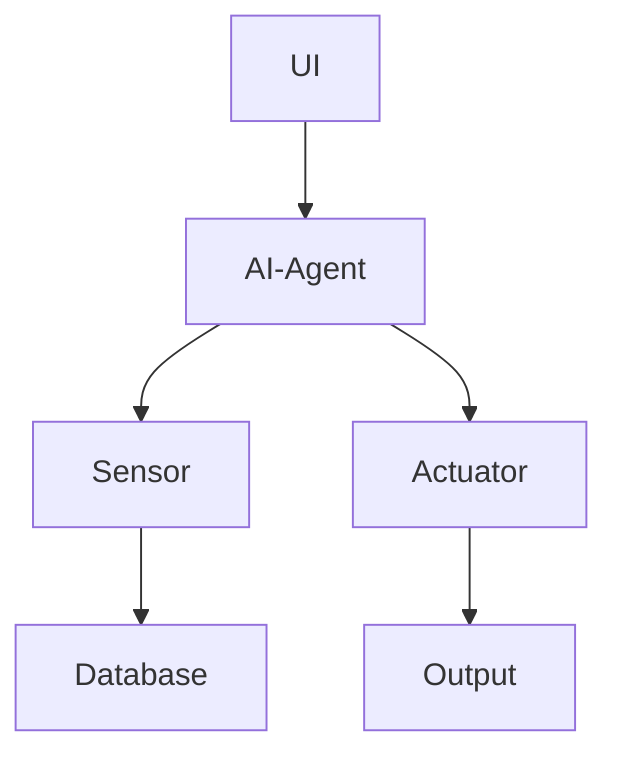
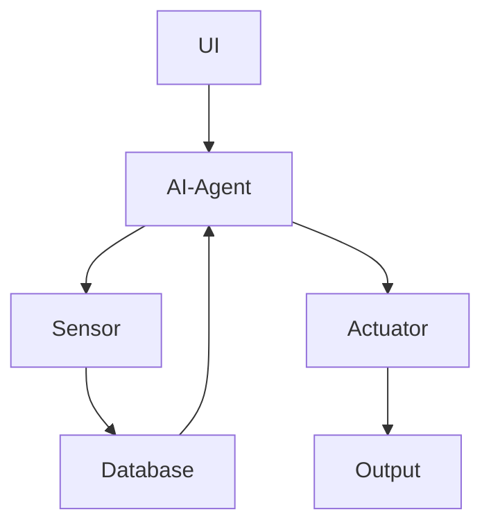
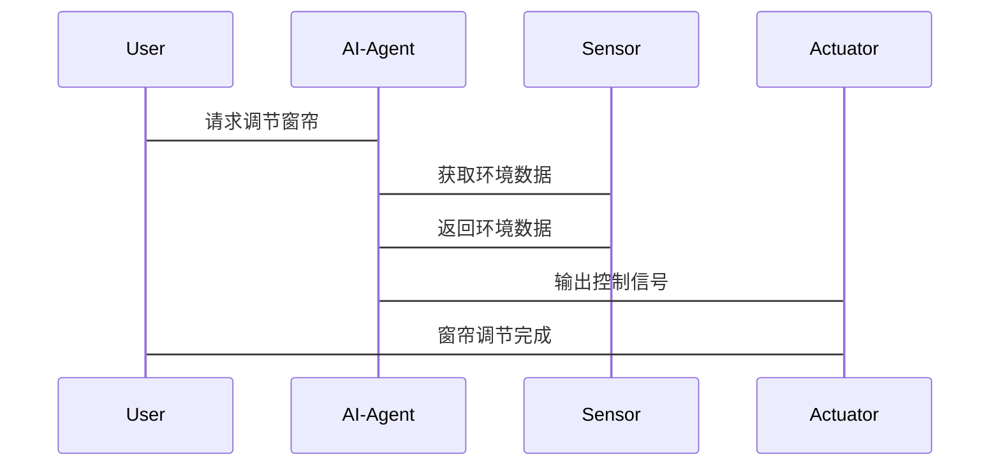

                 


# AI Agent在智能窗帘中的昼夜节律调节

## 关键词：
- AI Agent
- 智能窗帘
- 昼夜节律
- 光照调节
- 个性化调节

## 摘要：
本文详细探讨了AI Agent在智能窗帘中的昼夜节律调节应用。从问题背景出发，分析了AI Agent的基本原理及其在昼夜节律调节中的作用。通过详细阐述算法原理、系统架构设计和项目实战，展示了如何利用AI技术优化智能窗帘的光照调节功能，帮助用户更好地管理昼夜节律，提升生活质量。本文还提供了丰富的代码示例和系统架构图，帮助读者理解和实现这一创新方案。

---

# 目录大纲

---

## 第一部分: 背景介绍

### 第1章: 问题背景与需求分析

#### 1.1 问题背景
- 1.1.1 现代人昼夜节律紊乱的现状
- 1.1.2 智能家居的发展趋势
- 1.1.3 AI Agent在智能家居中的潜力

#### 1.2 问题描述
- 1.2.1 昼夜节律调节的基本原理
- 1.2.2 智能窗帘在昼夜节律调节中的作用
- 1.2.3 当前智能窗帘的痛点与不足

#### 1.3 问题解决思路
- 1.3.1 引入AI Agent的目标
- 1.3.2 AI Agent如何实现昼夜节律调节
- 1.3.3 解决方案的创新点

#### 1.4 边界与外延
- 1.4.1 系统的边界条件
- 1.4.2 相关领域的外延
- 1.4.3 与其他智能家居设备的协同

#### 1.5 核心概念结构
- 1.5.1 核心要素组成
- 1.5.2 概念之间的关系
- 1.5.3 系统整体架构

---

## 第二部分: AI Agent与昼夜节律调节的核心概念与联系

### 第2章: AI Agent的基本原理

#### 2.1 AI Agent的定义与特点
- 2.1.1 AI Agent的定义
- 2.1.2 AI Agent的核心特点
- 2.1.3 AI Agent与传统自动化的区别

#### 2.2 昼夜节律调节的基本原理
- 2.2.1 昼夜节律的生物基础
- 2.2.2 光照对昼夜节律的影响
- 2.2.3 人体生物钟的调节机制

#### 2.3 AI Agent与昼夜节律调节的联系
- 2.3.1 AI Agent在光照调节中的应用
- 2.3.2 AI Agent如何优化昼夜节律
- 2.3.3 AI Agent与其他调节手段的协同

### 第3章: 核心概念的原理与联系

#### 3.1 AI Agent的核心原理
- 3.1.1 传感器数据的采集与处理
- 3.1.2 AI算法的实现过程
- 3.1.3 输出控制信号的机制

#### 3.2 昼夜节律调节的原理
- 3.2.1 光照强度与时间的调节
- 3.2.2 温度与湿度的协同调节
- 3.2.3 个性化调节策略的制定

#### 3.3 AI Agent与昼夜节律调节的实体关系图



---

## 第三部分: AI Agent的算法原理

### 第4章: 算法原理与实现

#### 4.1 AI Agent的算法选择
- 4.1.1 强化学习算法
- 4.1.2 模糊逻辑算法
- 4.1.3 支持向量机算法

#### 4.2 算法流程图



#### 4.3 算法数学模型

##### 4.3.1 强化学习模型
$$ R = r_t + \gamma \max_{a'} Q(s',a') $$
其中，$R$ 表示奖励，$r_t$ 表示即时奖励，$\gamma$ 表示折扣因子，$Q(s',a')$ 表示状态 $s'$ 下动作 $a'$ 的价值。

##### 4.3.2 模糊逻辑模型
$$ \text{隶属度} = \frac{1}{1 + e^{-k(x - c)}} $$
其中，$k$ 是比例常数，$c$ 是隶属度中心，$x$ 是输入变量。

#### 4.4 算法实现代码示例

##### 4.4.1 强化学习代码示例

```python
import numpy as np

class AI-Agent:
    def __init__(self, state_space, action_space):
        self.state_space = state_space
        self.action_space = action_space
        self.Q_table = np.zeros((state_space, action_space))
    
    def choose_action(self, state, epsilon=0.1):
        if np.random.random() < epsilon:
            return np.random.randint(self.action_space)
        else:
            return np.argmax(self.Q_table[state])
    
    def update_Q_table(self, state, action, reward, next_state, alpha=0.1):
        self.Q_table[state][action] += alpha * (reward + np.max(self.Q_table[next_state]) - self.Q_table[state][action])
```

##### 4.4.2 模糊逻辑代码示例

```python
def fuzzy_adjust(brightness, temperature):
    import fuzzy
    from fuzzy import control as ctrl
    brightness fuzzy_set = ctrl.FuzzySet()
    temperature fuzzy_set = ctrl.FuzzySet()
    # 定义隶属度函数并进行推理
    rule = ctrl.Rule(brightness.fuzzy AND temperature.fuzzy, adjust blinds)
    control = ctrl.ControlSystem([rule])
    control.input['brightness'] = brightness_value
    control.input['temperature'] = temperature_value
    control.compute()
    return control.output['adjust blinds']
```

---

## 第四部分: 系统分析与架构设计

### 第5章: 系统架构设计

#### 5.1 项目场景介绍
- 5.1.1 智能窗帘的使用场景
- 5.1.2 用户需求分析
- 5.1.3 系统目标设定

#### 5.2 系统功能设计
- 5.2.1 系统功能模块划分
- 5.2.2 系统功能流程图



#### 5.3 系统架构设计
- 5.3.1 系统架构图



#### 5.4 系统接口设计
- 5.4.1 系统接口定义
- 5.4.2 接口交互流程图



#### 5.5 系统交互设计
- 5.5.1 用户与系统交互流程
- 5.5.2 系统内部交互流程
- 5.5.3 交互序列图



---

## 第五部分: 项目实战

### 第6章: 项目实现与案例分析

#### 6.1 环境安装与配置
- 6.1.1 安装Python环境
- 6.1.2 安装必要的库（如numpy、pandas、scikit-learn等）
- 6.1.3 配置开发环境（如PyCharm、Jupyter Notebook）

#### 6.2 系统核心实现
- 6.2.1 传感器数据采集与处理代码
- 6.2.2 AI Agent算法实现代码
- 6.2.3 窗帘控制接口代码

##### 6.2.1 传感器数据采集代码

```python
import serial

ser = serial.Serial('COM3', 9600)
data = ser.readline().decode().strip()
print(data)
```

##### 6.2.2 AI Agent算法实现代码

```python
class AI-Agent:
    def __init__(self):
        self.sensors = ['光照强度', '温度', '湿度']
        self.actions = ['打开窗帘', '关闭窗帘', '调节亮度']
    
    def decide_action(self, data):
        # 数据处理与分析
        # 调用算法模型进行决策
        return action
```

##### 6.2.3 窗帘控制接口代码

```python
import RPi.GPIO as GPIO

def control_blinds(action):
    if action == '打开窗帘':
        GPIO.output(17, GPIO.HIGH)
    elif action == '关闭窗帘':
        GPIO.output(17, GPIO.LOW)
    elif action == '调节亮度':
        # 调节PWM信号
        pass
```

#### 6.3 项目代码解读与分析
- 6.3.1 代码结构分析
- 6.3.2 核心算法解读
- 6.3.3 系统功能实现

#### 6.4 实际案例分析
- 6.4.1 案例背景介绍
- 6.4.2 数据采集与处理过程
- 6.4.3 算法运行结果展示
- 6.4.4 结果分析与优化建议

#### 6.5 项目小结
- 6.5.1 项目实现的成果
- 6.5.2 项目中的问题与解决方案
- 6.5.3 项目经验总结

---

## 第六部分: 最佳实践与拓展

### 第7章: 最佳实践

#### 7.1 小结
- 7.1.1 核心知识点回顾
- 7.1.2 系统设计要点总结
- 7.1.3 项目实施经验总结

#### 7.2 注意事项
- 7.2.1 系统部署中的注意事项
- 7.2.2 算法优化的建议
- 7.2.3 用户体验的优化方向

#### 7.3 拓展阅读
- 7.3.1 相关技术领域推荐
- 7.3.2 进一步学习的资源
- 7.3.3 未来研究方向展望

---

## 第七部分: 参考文献与致谢

### 7.1 参考文献
- [1] 《人工智能: 理论与实践》
- [2] 《智能家居系统设计与实现》
- [3] 《昼夜节律调节的生物医学研究》

### 7.2 致谢
感谢读者的支持，感谢团队的协作，感谢导师的指导。

---

## 结束语

通过本文的详细阐述，读者可以全面了解AI Agent在智能窗帘中的昼夜节律调节应用。从理论到实践，从系统设计到项目实现，本文为读者提供了丰富的知识和实用的代码示例。希望本文能为智能家居领域的研究与实践提供有价值的参考。

