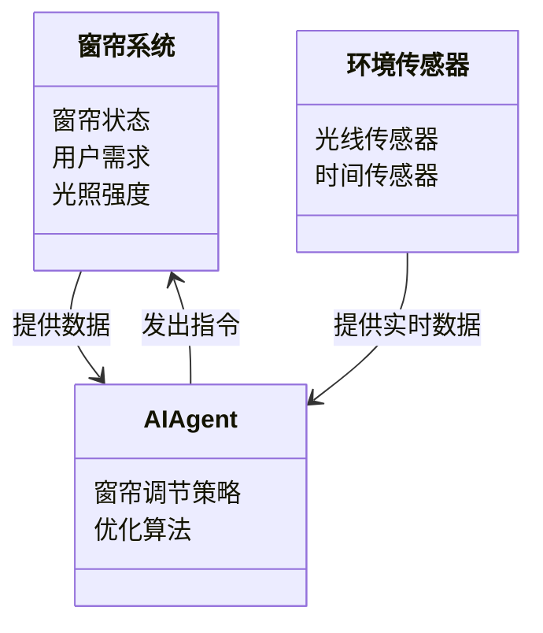
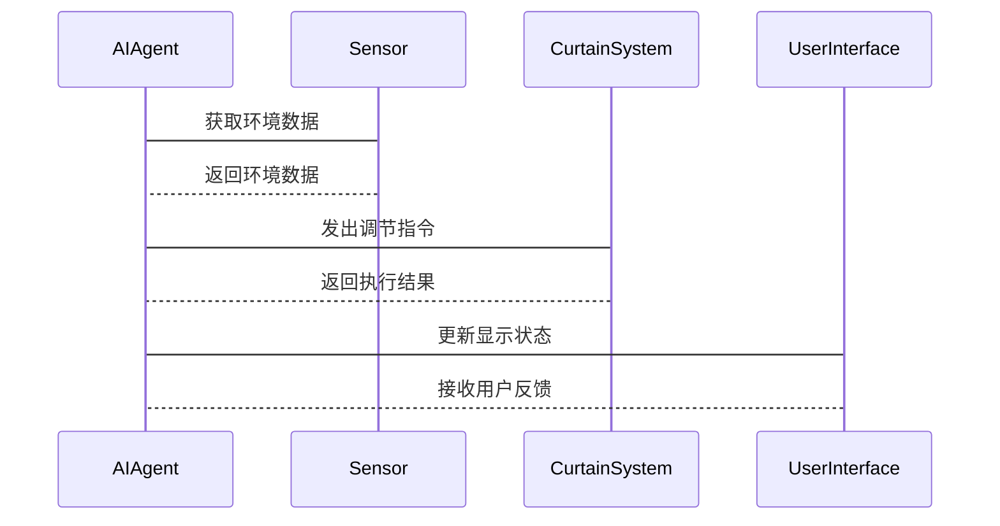

                 


# AI Agent在智能窗帘中的自然光利用优化

## 关键词：
AI Agent, 智能窗帘, 自然光优化, 能源效率, 智能家居, 自然采光

## 摘要：
本文探讨AI Agent在智能窗帘中的应用，重点分析如何通过优化自然光利用来提升能源效率和居住舒适度。文章从背景、原理到实现，详细阐述AI Agent在智能窗帘中的优化策略，包括算法设计、系统架构和实际案例，为智能家居提供新的视角。

---

# 第一部分：背景介绍

## 第1章：背景介绍

### 1.1 问题背景
#### 1.1.1 自然光利用的重要性
自然光不仅节约能源，还能改善室内环境，提升居住舒适度。科学利用自然光可减少照明能耗，促进绿色建筑发展。

#### 1.1.2 当前智能窗帘的现状
现有智能窗帘多基于固定程序，无法根据光照条件动态调节。缺乏智能化的自然光优化策略，难以满足个性化需求。

#### 1.1.3 问题提出的背景与意义
随着能源危机和环保需求，优化自然光利用成为重要课题。AI Agent的引入为智能窗帘带来了智能化的解决方案，具有重要的研究价值。

### 1.2 问题描述
#### 1.2.1 智能窗帘自然光利用的挑战
光照强度、日晒时间、用户需求等因素复杂多变，传统方法难以有效优化。

#### 1.2.2 当前存在的主要问题
窗帘调节策略固定，无法动态优化；缺乏实时环境感知能力；未能有效平衡采光与遮阳需求。

#### 1.2.3 问题的边界与外延
限定在智能窗帘系统中，考虑光照强度、日照时间、用户需求等因素。外延包括智能家电协同优化，但本文主要聚焦于窗帘系统。

### 1.3 问题解决
#### 1.3.1 引入AI Agent的必要性
AI Agent能够实时感知环境变化，动态调整窗帘状态，实现自然光的最优利用。

#### 1.3.2 AI Agent在智能窗帘中的作用
AI Agent通过实时数据分析，制定最佳窗帘调节策略，提升能源效率和居住舒适度。

#### 1.3.3 解决方案的可行性分析
技术可行性：AI Agent已成熟应用于多个领域；数据采集可行性：智能窗帘系统具备必要的传感器；系统兼容性：可与其他智能家居设备协同工作。

### 1.4 概念结构与核心要素
#### 1.4.1 AI Agent的基本概念
AI Agent是具备感知、决策和执行能力的智能体，能够根据环境变化做出优化决策。

#### 1.4.2 智能窗帘系统的组成
包括窗帘驱动模块、光照传感器、用户交互界面和AI Agent控制模块。

#### 1.4.3 核心要素的相互关系
AI Agent通过传感器数据优化窗帘状态，调节室内光照，实现自然光的有效利用。

---

# 第二部分：核心概念与联系

## 第2章：核心概念与联系

### 2.1 AI Agent的核心原理
#### 2.1.1 AI Agent的基本原理
AI Agent通过感知环境、分析数据、制定策略并执行操作，实现智能化控制。

#### 2.1.2 AI Agent在智能窗帘中的应用原理
AI Agent实时分析光照数据，动态调整窗帘开合程度，优化自然光利用。

#### 2.1.3 自然光利用的优化算法
基于强化学习的优化算法，通过奖励机制不断优化窗帘调节策略。

### 2.2 核心概念对比
#### 2.2.1 AI Agent与传统控制算法的对比
AI Agent具备学习和自适应能力，而传统算法基于固定规则。

#### 2.2.2 自然光利用的指标对比
对比不同窗帘调节策略下的光照强度、能耗和舒适度指标。

#### 2.2.3 不同智能窗帘系统的对比分析
分析基于AI Agent、基于规则引擎和传统手动调节三种窗帘系统的优缺点。

### 2.3 ER实体关系图
```mermaid
er
  %%{ init: { 'width': 420, 'height': 240 } }%%
  title 实体关系图
  rectangle 窗帘系统 {
    窗帘状态
    用户需求
    光照强度
  }
  rectangle AI Agent {
    窗帘调节策略
    优化算法
  }
  rectangle 环境传感器 {
    光线传感器
    时间传感器
  }
  窗帘系统 --> AI Agent: 提供数据
  AI Agent --> 窗帘系统: 发出指令
  环境传感器 --> AI Agent: 提供实时数据
```

---

## 第三章：算法原理讲解

### 3.1 AI Agent优化算法
#### 3.1.1 算法的基本流程
1. 数据采集：获取光照强度、时间等数据。
2. 数据分析：AI Agent分析数据，生成优化策略。
3. 策略执行：调整窗帘状态，实现自然光优化。
4. 反馈学习：根据效果反馈，优化算法模型。

#### 3.1.2 算法的数学模型
光照强度 $I(t)$ 随时间 $t$ 变化，窗帘开合程度 $C(t)$ 由AI Agent决定：
$$
C(t) = f(I(t), t, C(t-1))
$$
其中，$f$ 是基于强化学习的优化函数。

#### 3.1.3 算法的优化策略
使用强化学习，通过奖励机制不断优化窗帘调节策略：
$$
R = \alpha I(t) + \beta E(t) + \gamma C(t)
$$
其中，$R$ 是奖励值，$\alpha, \beta, \gamma$ 是权重系数，$I(t)$ 是光照强度，$E(t)$ 是能耗，$C(t)$ 是舒适度评分。

### 3.2 算法实现
#### 3.2.1 算法实现的步骤
1. 安装必要的库：
   ```bash
   pip install numpy matplotlib
   ```
2. 编写AI Agent代码：
   ```python
   import numpy as np

   class AIAgent:
       def __init__(self):
           self.state = 0
           self.learning_rate = 0.1

       def perceive(self, light_intensity):
           return light_intensity

       def decide(self, light_intensity):
           if light_intensity > 80:
               return 1  # 完全打开
           elif light_intensity > 50:
               return 0.5  # 半开
           else:
               return 0  # 关闭

       def learn(self, light_intensity, reward):
           self.state = self.state + self.learning_rate * (reward - self.state)
   ```

---

## 第四章：系统分析与架构设计

## 第4章：系统分析与架构设计

### 4.1 问题场景介绍
设计一个智能窗帘系统，利用AI Agent优化自然光利用，提升能源效率和舒适度。

### 4.2 项目介绍
开发一个基于AI Agent的智能窗帘系统，集成光照传感器、时间传感器和用户交互界面。

### 4.3 系统功能设计
#### 4.3.1 领域模型类图


### 4.4 系统架构设计
#### 4.4.1 系统架构图
```mermaid
graph TD
    AIAgent --> CurtainSystem: 发出调节指令
    CurtainSystem --> AIAgent: 提供状态反馈
    Sensor --> AIAgent: 提供环境数据
```

### 4.5 系统接口设计
定义标准接口，确保各模块协同工作。

### 4.6 系统交互序列图


---

## 第五章：项目实战

### 5.1 环境安装
安装必要的库：
```bash
pip install numpy pandas scikit-learn matplotlib
```

### 5.2 核心代码实现
AI Agent实现：
```python
import numpy as np

class AIAgent:
    def __init__(self):
        self.state = 0
        self.learning_rate = 0.1

    def perceive(self, light_intensity):
        return light_intensity

    def decide(self, light_intensity):
        if light_intensity > 80:
            return 1
        elif light_intensity > 50:
            return 0.5
        else:
            return 0

    def learn(self, light_intensity, reward):
        self.state = self.state + self.learning_rate * (reward - self.state)
```

窗帘系统实现：
```python
class CurtainSystem:
    def __init__(self):
        self.state = 0

    def set_state(self, state):
        self.state = state

    def get_state(self):
        return self.state
```

### 5.3 代码解读与分析
AI Agent感知环境数据，动态调整窗帘状态，通过强化学习不断优化策略。

### 5.4 案例分析
实际案例分析AI Agent在不同光照条件下的调节策略，展示优化效果。

### 5.5 项目小结
总结项目实现过程，强调AI Agent的优势，为未来研究提供参考。

---

## 第六章：总结与展望

### 6.1 总结
AI Agent显著提升了智能窗帘的自然光利用效率，优化了能源管理和用户体验。

### 6.2 展望
未来可进一步优化算法，引入更多环境因素，探索与其他智能家居设备的协同优化。

### 6.3 注意事项
确保数据安全和用户隐私，定期更新算法模型，适应环境变化。

### 6.4 拓展阅读
推荐相关领域的书籍和论文，鼓励深入研究。

---

# 结语

通过本文的详细讲解，读者可以深入了解AI Agent在智能窗帘中的应用，掌握自然光优化的核心技术。未来，随着技术进步，AI Agent将为智能家居带来更多的创新和便利。

