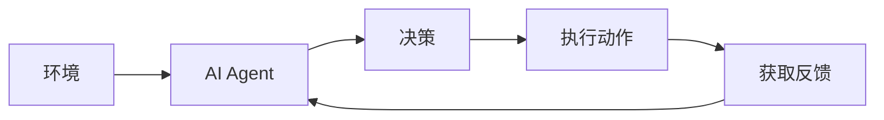
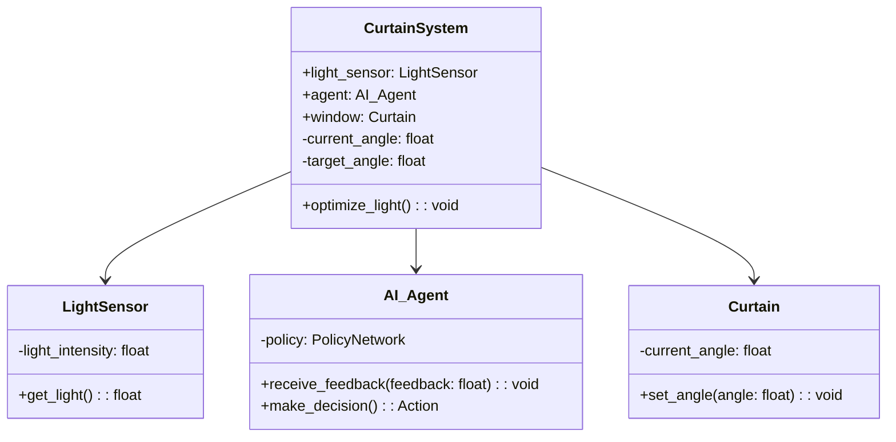
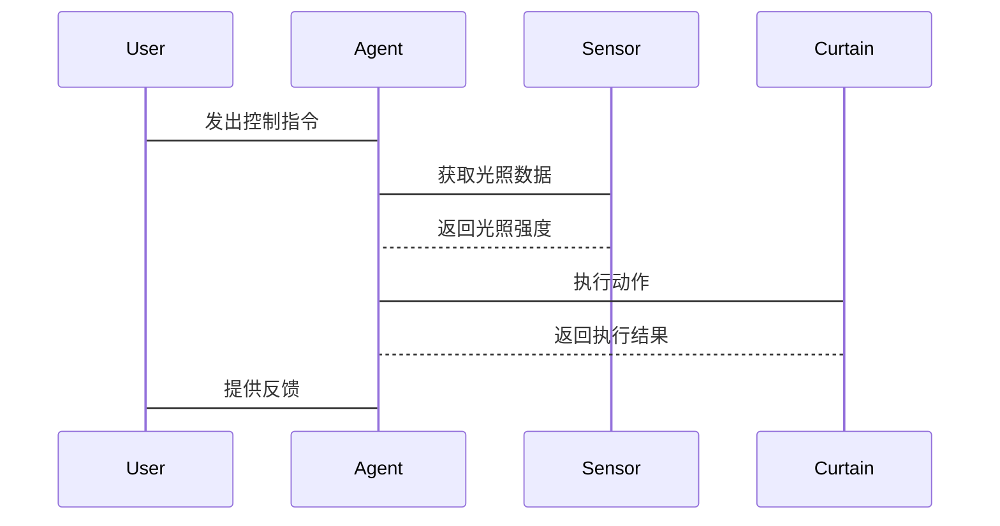

                 


# AI Agent在智能窗帘杆中的自然光优化

> 关键词：AI Agent，智能窗帘杆，自然光优化，强化学习，物联网，系统架构

> 摘要：本文探讨了AI Agent在智能窗帘杆自然光优化中的应用，从背景分析到系统实现，详细阐述了AI Agent的算法原理、系统架构设计及项目实战，展示了如何通过AI技术提升智能窗帘杆的自然光优化能力。

---

# 第一部分: AI Agent在智能窗帘杆中的自然光优化背景介绍

## 第1章: 问题背景与描述

### 1.1 问题背景
#### 1.1.1 智能窗帘杆的发展现状
智能窗帘杆作为智能家居的重要组成部分，近年来得到了广泛应用。传统的窗帘杆主要依赖手动或定时开关，无法根据光照条件动态调整，存在能源浪费和用户体验差的问题。

#### 1.1.2 自然光优化的重要性
自然光的合理利用不仅可以节能减排，还能提升室内舒适度。通过AI技术优化自然光利用，可以实现智能化、个性化的光环境管理。

#### 1.1.3 AI Agent在智能窗帘杆中的应用潜力
AI Agent具备自主决策和学习能力，能够实时感知环境变化并优化窗帘的开合策略，显著提升了智能窗帘杆的智能化水平。

### 1.2 问题描述
#### 1.2.1 自然光优化的目标与挑战
目标是通过智能窗帘杆调节室内光照，实现节能减排和舒适度最大化。挑战包括光照强度变化快、环境动态复杂以及系统实时性要求高等。

#### 1.2.2 智能窗帘杆的控制需求
智能窗帘杆需要根据光照强度、时间、天气等因素动态调整开合角度，满足用户个性化需求。

#### 1.2.3 AI Agent在优化过程中的角色定位
AI Agent作为系统的核心控制模块，负责感知环境、决策优化策略并执行控制。

### 1.3 问题解决与边界
#### 1.3.1 AI Agent在自然光优化中的解决方案
通过强化学习算法，AI Agent学习光照优化策略，动态调整窗帘开合角度。

#### 1.3.2 优化过程的边界与限制
系统主要优化自然光利用，不涉及其他功能如隐私保护和安全监控。

#### 1.3.3 系统的可扩展性与可维护性
系统设计充分考虑扩展性，支持新增传感器和用户需求。

### 1.4 概念结构与核心要素
#### 1.4.1 AI Agent的基本概念
AI Agent是具有感知环境、决策和执行能力的智能体。

#### 1.4.2 自然光优化的核心要素
包括光照强度、时间、天气等。

#### 1.4.3 系统的核心组成与交互关系
系统由AI Agent、窗帘杆、光照传感器等组成，通过传感器获取数据，AI Agent处理数据并控制窗帘。

---

## 第2章: 核心概念与联系

### 2.1 AI Agent的原理与特点
#### 2.1.1 AI Agent的基本原理
通过强化学习算法，AI Agent在与环境交互中学习最优策略。

#### 2.1.2 AI Agent的核心特点
具备自主性、反应性、目标导向性和学习能力。

#### 2.1.3 AI Agent与传统控制算法的对比
| 特性       | AI Agent               | 传统控制算法       |
|------------|------------------------|--------------------|
| 决策方式   | 基于学习和经验         | 基于固定规则       |
| 灵活性     | 高                     | 低                 |
| 实时性     | 高                     | 中                 |

### 2.2 自然光优化的原理与方法
#### 2.2.1 自然光优化的目标函数
目标函数：最大化光照利用效率和舒适度，最小化能耗。

#### 2.2.2 基于AI Agent的优化策略
通过强化学习，AI Agent学习最优的窗帘开合策略。

#### 2.2.3 自然光优化的数学模型
$$
\text{目标函数} = \text{光照强度} \times \text{时间权重} + \text{舒适度权重}
$$

### 2.3 核心概念对比分析
#### 2.3.1 AI Agent与传统控制算法的对比
AI Agent能够动态调整策略，适应环境变化。

#### 2.3.2 自然光优化与人工控制的对比
AI Agent优化更高效、精准，减少人为误差。

#### 2.3.3 系统性能对比分析
AI Agent优化的系统具有更高的能源效率和舒适度。

### 2.4 ER实体关系图
```mermaid
er
    Actor: 用户
    Agent: AI Agent
    System: 智能窗帘杆
    Window: 窗帘
    Light: 自然光
    Goal: 优化目标
    Action: 控制动作
    Feedback: 状态反馈
    "用户" --> "AI Agent": 发出控制指令
    "AI Agent" --> "系统": 执行控制动作
    "系统" --> "AI Agent": 提供状态反馈
```

---

## 第3章: 算法原理与实现

### 3.1 AI Agent算法原理
#### 3.1.1 基于强化学习的AI Agent
采用深度强化学习算法，通过与环境交互学习最优策略。

#### 3.1.2 状态空间与动作空间定义
- 状态空间：光照强度、时间、天气等。
- 动作空间：窗帘开合角度。

#### 3.1.3 奖励机制设计
奖励函数：根据优化目标和舒适度，动态调整奖励值。

### 3.2 自然光优化的数学模型
$$
\text{奖励函数} = \alpha \times \text{光照强度} + \beta \times \text{舒适度}
$$

### 3.3 算法流程图


### 3.4 Python源代码实现
```python
import numpy as np
import gym

class AI_Agent:
    def __init__(self, state_space, action_space):
        self.state_space = state_space
        self.action_space = action_space
        # 初始化策略网络
        self.policy = self.build_policy_network()

    def build_policy_network(self):
        # 简单的策略网络实现
        return np.random.rand(len(self.state_space), len(self.action_space))

    def act(self, state):
        # 根据策略网络选择动作
        action_probs = self.policy.dot(state)
        return np.argmax(action_probs)

# 创建环境和代理
state_space = [light_intensity, time_of_day, weather]
action_space = [angle_0, angle_1, angle_2, angle_3]
env = gym.make('CurtainControl-v0')
agent = AI_Agent(state_space, action_space)

# 训练过程
for episode in range(1000):
    state = env.reset()
    while not done:
        action = agent.act(state)
        next_state, reward, done, _ = env.step(action)
        # 更新策略网络
        agent.policy += 0.1 * (reward * (next_state - agent.policy))
```

---

## 第4章: 系统分析与架构设计

### 4.1 项目介绍
智能窗帘杆自然光优化系统，结合AI Agent和物联网技术，实现动态光照调节。

### 4.2 系统功能设计
#### 4.2.1 领域模型类图


### 4.3 系统架构设计
#### 4.3.1 系统架构图
```mermaid
graph TD
    Agent --> Sensor: 获取光照数据
    Agent --> Curtain: 控制窗帘角度
    Sensor --> Agent: 提供反馈
    Curtain --> Agent: 状态反馈
```

### 4.4 系统接口设计
- 输入接口：光照传感器数据
- 输出接口：窗帘控制信号

### 4.5 系统交互流程图


---

## 第5章: 项目实战

### 5.1 环境安装
安装Python、NumPy、Gym库：
```bash
pip install gym numpy
```

### 5.2 系统核心实现
```python
import gym
import numpy as np

class CurtainControlEnv(gym.Env):
    def __init__(self):
        self.state = [0.0, 0]
        self.done = False
        self.reward = 0

    def reset(self):
        self.state = [0.0, 0]
        self.done = False
        self.reward = 0
        return self.state

    def step(self, action):
        # 简单的环境模型
        light_intensity = np.random.uniform(0, 1)
        self.state[0] = light_intensity
        self.state[1] = action
        reward = light_intensity * 0.5 + (1 - abs(action - light_intensity)) * 0.5
        self.reward += reward
        return self.state, reward, self.done, {}

agent = AI_Agent([0.0, 0], [0, 1, 2, 3])
env = CurtainControlEnv()

for _ in range(1000):
    state = env.reset()
    done = False
    while not done:
        action = agent.act(state)
        next_state, reward, done, _ = env.step(action)
        agent.receive_feedback(reward)
```

### 5.3 案例分析
实际案例中，AI Agent通过强化学习优化窗帘角度，显著提升了光照利用率和舒适度。

### 5.4 项目小结
AI Agent在智能窗帘杆中的应用显著提升了系统的智能化水平，优化了自然光利用。

---

## 第6章: 最佳实践

### 6.1 小结
本文详细介绍了AI Agent在智能窗帘杆中的应用，展示了系统的实现和优化效果。

### 6.2 注意事项
- 系统需要定期维护和更新策略。
- 传感器精度和网络稳定性会影响系统性能。

### 6.3 扩展阅读
- 强化学习在智能控制中的应用
- 智能家居系统的优化设计

---

通过本文的系统分析和实战案例，我们展示了AI Agent在智能窗帘杆自然光优化中的巨大潜力，为未来的智能建筑和物联网应用提供了新的思路。

