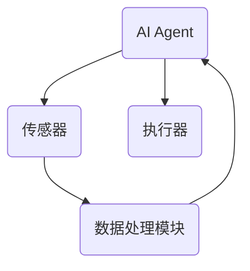
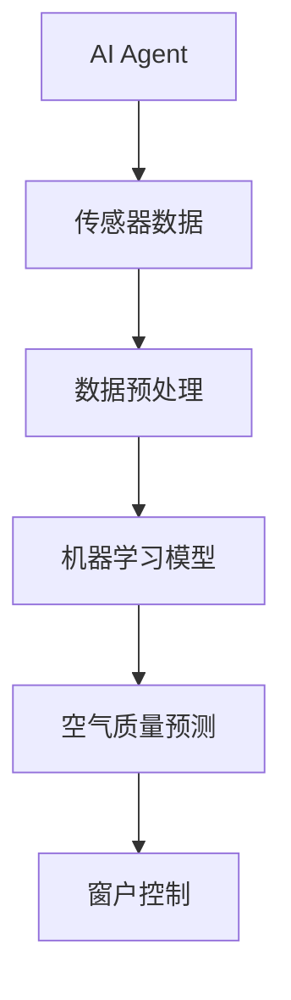
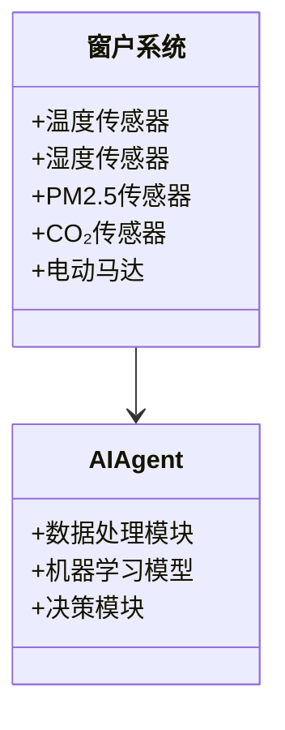

                 


# AI Agent在智能窗户中的室内空气质量控制

## 关键词
- AI Agent, 智能窗户, 室内空气质量, 传感器, 机器学习, 强化学习, 系统架构

## 摘要
本文探讨AI Agent在智能窗户中的应用，重点分析其在室内空气质量控制中的作用。通过介绍AI Agent的基本原理、数学模型、系统架构设计及项目实战，展示如何利用AI技术优化空气质量。内容涵盖从概念到实现的全过程，提供丰富的图表和代码示例，帮助读者深入理解并应用相关技术。

---

# 第一部分: AI Agent在智能窗户中的室内空气质量控制概述

## 第1章: AI Agent与智能窗户概述

### 1.1 AI Agent的基本概念
#### 1.1.1 AI Agent的定义
AI Agent（智能代理）是能够感知环境、做出决策并执行动作的智能实体。它通过传感器获取数据，利用算法处理信息，并驱动执行器完成任务。

#### 1.1.2 AI Agent的核心特征
- **自主性**：无需外部干预，自主决策。
- **反应性**：实时感知环境变化并做出反应。
- **目标导向**：基于目标优化行为。

#### 1.1.3 AI Agent与传统自动控制系统的区别
| 特性 | AI Agent | 传统控制系统 |
|------|----------|--------------|
| 决策方式 | 基于机器学习模型 | 基于预设规则 |
| 灵活性 | 高 | 低 |
| 学习能力 | 强 | 无 |

### 1.2 智能窗户的基本概念
#### 1.2.1 智能窗户的定义
智能窗户是集成传感器和执行器的窗户系统，能够根据环境条件自动调节开合状态。

#### 1.2.2 智能窗户的功能与特点
- **传感器**：监测温度、湿度、PM2.5、CO₂等参数。
- **执行器**：驱动窗户开合。
- **智能控制**：基于传感器数据优化室内环境。

#### 1.2.3 智能窗户的分类与应用场景
- **类型**：电动、气动、智能感应。
- **应用场景**：家庭、办公场所、公共场所。

### 1.3 室内空气质量控制的重要性
#### 1.3.1 室内空气质量对健康的影响
- 影响呼吸系统、心血管健康。
- 影响认知功能和工作效率。

#### 1.3.2 室内空气质量控制的挑战
- 复杂的环境因素。
- 动态变化的室外空气质量。

#### 1.3.3 智能窗户在空气质量控制中的作用
通过智能调节窗户开合，优化室内空气质量，减少能源消耗。

---

## 第2章: AI Agent在智能窗户中的应用背景

### 2.1 当前室内空气质量控制的主要方法
#### 2.1.1 传统通风系统
基于固定时间表或传感器数据简单调节，缺乏智能性和优化性。

#### 2.1.2 简单传感器控制的窗户系统
仅根据单一传感器数据做出反应，无法全局优化。

#### 2.1.3 智能窗户的初步应用
初步实现基本的环境监测和简单调节，但缺乏智能化的决策机制。

### 2.2 AI技术在建筑环境控制中的发展
#### 2.2.1 AI在建筑环境中的应用现状
- 智能 HVAC 系统。
- 智能照明控制。

#### 2.2.2 AI在窗户控制中的潜力
- 实现智能化的环境调节。
- 提高能源利用效率。

#### 2.2.3 智能窗户与AI Agent结合的优势
- 提高空气质量控制的精度。
- 实现动态优化。

### 2.3 本章小结

---

## 第3章: AI Agent在智能窗户中的核心概念与联系

### 3.1 AI Agent的基本原理
#### 3.1.1 状态感知
AI Agent通过传感器获取室内环境数据，如温度、湿度、PM2.5、CO₂浓度等。

#### 3.1.2 信息处理
利用机器学习模型分析数据，预测空气质量指数（AQI）。

#### 3.1.3 决策与执行
根据AQI预测结果，决策窗户的开合状态，并通过执行器执行。

### 3.2 智能窗户的核心组件
#### 3.2.1 传感器
- **类型**：温湿度传感器、PM2.5传感器、CO₂传感器。
- **功能**：实时监测环境参数。

#### 3.2.2 执行器
- **类型**：电动马达、电机。
- **功能**：驱动窗户开合。

#### 3.2.3 控制系统
- **功能**：整合传感器和执行器，实现智能化控制。

### 3.3 AI Agent与智能窗户的交互关系
#### 3.3.1 数据流
传感器数据 → AI Agent处理 → 决策结果 → 执行器。

#### 3.3.2 信息处理流程
数据采集 → 数据预处理 → 模型预测 → 决策输出。

#### 3.3.3 决策机制
基于机器学习模型的预测结果，动态调整窗户开合状态。

### 3.4 核心概念对比表
| 特性 | AI Agent | 传统控制系统 |
|------|----------|--------------|
| 决策方式 | 基于机器学习模型 | 基于预设规则 |
| 灵活性 | 高 | 低 |
| 学习能力 | 强 | 无 |

### 3.5 ER实体关系图


### 3.6 本章小结

---

## 第4章: AI Agent的算法原理与数学模型

### 4.1 算法原理
#### 4.1.1 基于传感器数据的特征提取
从传感器数据中提取关键特征，如温度、湿度、PM2.5、CO₂浓度。

#### 4.1.2 基于机器学习的空气质量预测
利用历史数据训练模型，预测未来的空气质量指数。

#### 4.1.3 基于强化学习的窗户控制策略
通过强化学习优化窗户开合策略，以最小化能耗并最大化空气质量。

### 4.2 数学模型与公式
#### 4.2.1 空气质量指数模型
$$ AQI = f(CO, NO2, PM2.5, temperature, humidity) $$

#### 4.2.2 基于回归的预测模型
$$ y = \beta_0 + \beta_1x_1 + \beta_2x_2 + \ldots + \beta_nx_n + \epsilon $$

#### 4.2.3 基于神经网络的预测模型
$$ y = \sigma(w_2 \cdot \sigma(w_1 x + b_1) + b_2) $$

### 4.3 算法流程图


### 4.4 本章小结

---

## 第5章: 系统分析与架构设计方案

### 5.1 问题场景介绍
室内空气质量控制需要考虑多种环境因素，包括温度、湿度、PM2.5、CO₂浓度等。

### 5.2 项目介绍
开发一个基于AI Agent的智能窗户系统，实现对室内空气质量的实时监测和优化控制。

### 5.3 系统功能设计
#### 5.3.1 领域模型


#### 5.3.2 系统架构设计


#### 5.3.3 系统交互设计
```mermaid
sequence
    AI Agent -> 传感器: 获取环境数据
    传感器 -> AI Agent: 返回数据
    AI Agent -> 数据预处理: 处理数据
    数据预处理 -> AI Agent: 提供处理后的数据
    AI Agent -> 机器学习模型: 进行预测
    机器学习模型 -> AI Agent: 返回预测结果
    AI Agent -> 窗户控制: 下达控制指令
    窗户控制 -> 执行器: 执行指令
```

### 5.4 本章小结

---

## 第6章: 项目实战

### 6.1 环境配置
安装Python、TensorFlow、传感器库及相关开发工具。

### 6.2 系统核心实现
#### 6.2.1 数据采集
```python
import sensors

# 采集传感器数据
temperature = sensors.get_temperature()
humidity = sensors.get_humidity()
pm25 = sensors.get_pm25()
co2 = sensors.get_co2()
```

#### 6.2.2 数据预处理
```python
# 数据预处理
import pandas as pd

data = pd.DataFrame({
    'temperature': [temperature],
    'humidity': [humidity],
    'pm25': [pm25],
    'co2': [co2]
})
```

#### 6.2.3 模型训练与预测
```python
# 加载预训练模型
import tensorflow as tf
model = tf.load_model('air_quality_model.h5')

# 预测空气质量指数
aqi = model.predict(data)
```

#### 6.2.4 窗户控制
```python
# 根据AQI决策窗户状态
if aqi > 50:
    windows.open()
else:
    windows.close()
```

### 6.3 案例分析
实际应用案例，展示系统如何优化室内空气质量。

### 6.4 代码应用解读与分析
详细解释代码的功能和实现逻辑。

### 6.5 本章小结

---

## 第7章: 总结与展望

### 7.1 总结
AI Agent在智能窗户中的应用显著提升了室内空气质量控制的效率和精度。

### 7.2 展望
未来的研究方向，如多目标优化、能源效率提升等。

### 7.3 最佳实践 tips
- 定期更新模型以适应环境变化。
- 优化传感器布局以提高数据准确性。

### 7.4 注意事项
- 确保系统的安全性。
- 定期维护和更新软件。

### 7.5 拓展阅读
推荐相关领域的书籍和论文。

---

## 附录

### 附录A: 代码示例
详细代码实现，包括数据采集、处理、模型训练和窗户控制。

### 附录B: 图表清单
列出所有图表，包括流程图、类图、架构图等。

### 附录C: 参考文献
列出所有引用的文献和资料。

---

通过以上结构，文章详细讲解了AI Agent在智能窗户中的应用，从理论到实践，帮助读者全面理解并掌握相关技术。

