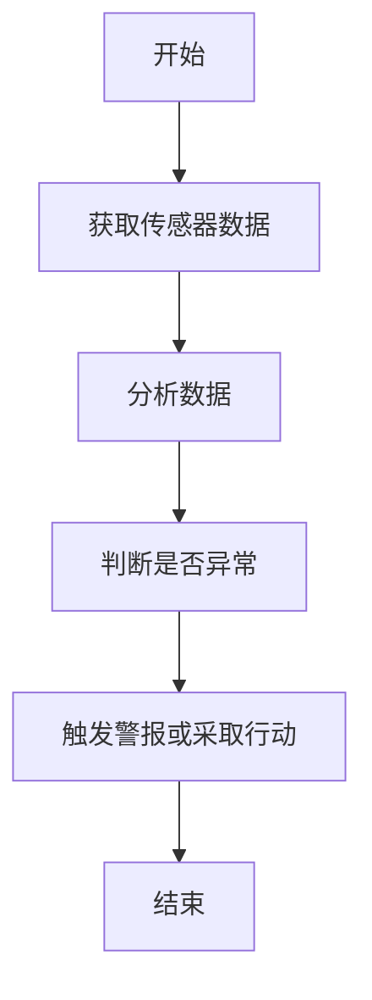
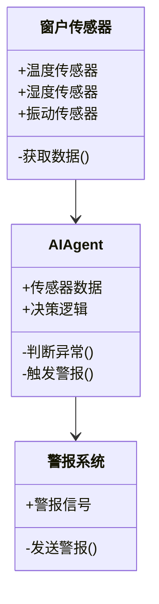
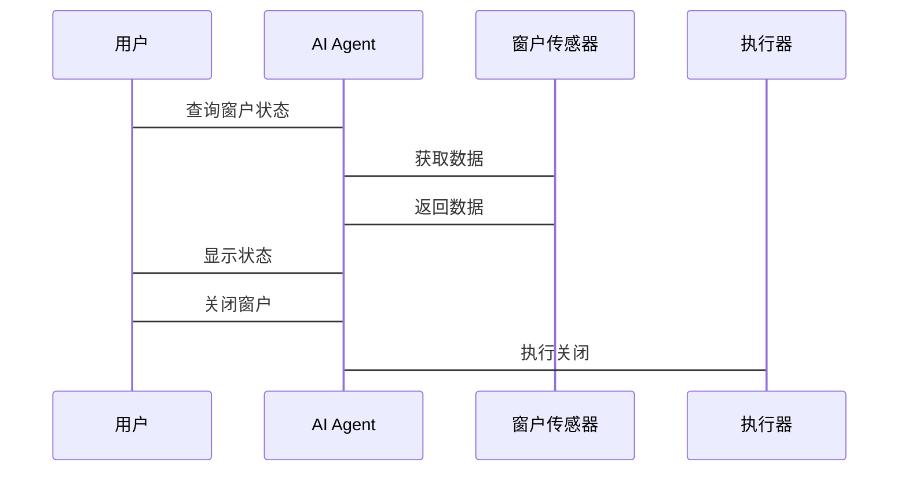

                 


# AI Agent在智能窗户中的防盗警报系统

> 关键词：AI Agent, 智能窗户, 防盗警报系统, 状态感知, 异常检测, 行为决策

> 摘要：本文详细探讨了AI Agent在智能窗户防盗警报系统中的应用，分析了其核心原理、算法设计、系统架构以及实际案例，展示了如何通过AI技术提升防盗系统的智能化水平。

---

# 第一部分: AI Agent与智能窗户防盗警报系统概述

## 第1章: 智能窗户防盗警报系统背景介绍

### 1.1 防盗警报系统的发展历程

#### 1.1.1 传统防盗系统的局限性
传统防盗系统依赖于简单的传感器和被动报警机制，存在以下问题：
- **误报率高**：受环境干扰（如强风、动物入侵）影响，误报率较高。
- **响应速度慢**：依赖人工干预，无法实时处理异常情况。
- **缺乏智能性**：无法根据环境变化自适应调整警报阈值。

#### 1.1.2 智能化防盗系统的优势
智能化防盗系统通过引入AI技术，显著提升了系统的可靠性和用户体验：
- **高准确性**：AI算法能够有效区分正常和异常情况，降低误报率。
- **实时响应**：系统能够在检测到异常后立即采取行动，如触发警报或锁定窗户。
- **自适应能力**：AI Agent能够根据历史数据和环境变化优化警报策略。

#### 1.1.3 AI Agent在防盗系统中的应用前景
AI Agent（智能体）通过在系统中扮演“决策者”的角色，能够实时分析传感器数据并做出最优决策，是未来防盗系统发展的主要方向。

---

### 1.2 AI Agent的基本概念与特点

#### 1.2.1 AI Agent的定义
AI Agent是一种智能实体，能够感知环境、理解任务需求并采取行动以实现目标。在防盗系统中，AI Agent负责分析传感器数据并做出警报决策。

#### 1.2.2 AI Agent的核心属性
- **自主性**：能够在没有外部干预的情况下独立运行。
- **反应性**：能够实时感知环境变化并做出响应。
- **目标导向**：所有行动都以实现特定目标为导向。

#### 1.2.3 AI Agent与传统算法的区别
| 属性 | AI Agent | 传统算法 |
|------|-----------|-----------|
| 决策方式 | 基于目标的动态决策 | 基于规则的静态处理 |
| 学习能力 | 支持在线学习和自适应 | 无法自适应优化 |
| 复杂性 | 高度复杂，适用于动态环境 | 简单固定，适用于静态环境 |

---

### 1.3 智能窗户的结构与功能

#### 1.3.1 智能窗户的基本结构
智能窗户由以下部分组成：
- **传感器模块**：包括压力传感器、加速度传感器和温湿度传感器。
- **执行器模块**：用于控制窗户的开闭。
- **通信模块**：负责与AI Agent进行数据交互。

#### 1.3.2 智能窗户的功能模块
- **状态监测**：实时监测窗户的物理状态。
- **警报触发**：当检测到异常时，触发警报信号。
- **用户交互**：提供与用户的交互界面，如手机APP。

#### 1.3.3 智能窗户与AI Agent的结合
AI Agent通过分析传感器数据，判断窗户是否处于异常状态，并根据判断结果采取相应的行动。

---

### 1.4 本章小结
本章介绍了防盗警报系统的发展历程，阐述了AI Agent的基本概念和特点，并详细描述了智能窗户的结构与功能，为后续内容奠定了基础。

---

# 第二部分: AI Agent在防盗警报系统中的核心原理

## 第2章: AI Agent的核心概念与联系

### 2.1 AI Agent的核心原理

#### 2.1.1 状态感知
AI Agent通过传感器获取窗户的状态信息，如窗户的开合状态、振动频率等。

#### 2.1.2 行为决策
基于感知到的状态信息，AI Agent通过内部算法做出是否触发警报的决策。

#### 2.1.3 事件响应
当检测到异常时，AI Agent会触发警报信号，并可能采取其他措施，如关闭窗户。

---

### 2.2 AI Agent与智能窗户的实体关系图

```mermaid
er
actor: AI Agent
actor: 窗户传感器
actor: 警报系统
```

---

### 2.3 AI Agent的核心算法流程图



---

### 2.4 本章小结
本章详细阐述了AI Agent的核心原理，并通过实体关系图和流程图展示了其在智能窗户中的应用，为后续算法设计提供了框架。

---

# 第三部分: AI Agent算法原理与数学模型

## 第3章: AI Agent算法原理

### 3.1 状态感知算法

#### 3.1.1 数据采集与预处理
传感器数据包括：
- 窗户的开合状态（二进制信号）。
- 窗户的振动频率（连续信号）。
- 环境温湿度（辅助信息）。

#### 3.1.2 数据特征提取
通过傅里叶变换提取振动频率的特征，用于判断是否为人为干扰。

#### 3.1.3 异常检测算法
使用马尔可夫链模型判断窗户状态的异常情况：
$$ P(x) = \prod_{i=1}^n P(x_i | x_{i-1}) $$

---

### 3.2 行为决策算法

#### 3.2.1 基于规则的决策
根据预设规则（如连续三次异常触发警报）进行决策。

#### 3.2.2 基于概率的决策
使用贝叶斯定理计算异常概率：
$$ P(A|B) = \frac{P(B|A)P(A)}{P(B)} $$

#### 3.2.3 基于强化学习的决策
通过Q-learning算法优化决策策略。

---

### 3.3 事件响应算法

#### 3.3.1 警报触发逻辑
根据异常检测结果和决策算法，触发警报信号。

#### 3.3.2 多重验证机制
结合地理位置和时间信息进行二次验证，避免误报。

#### 3.3.3 自适应调整算法
根据历史数据调整异常检测阈值。

---

### 3.4 数学模型与公式

#### 3.4.1 异常检测模型
使用马尔可夫链模型：
$$ P(x) = \prod_{i=1}^n P(x_i | x_{i-1}) $$

---

# 第四部分: 项目实战与系统架构

## 第4章: 项目实战

### 4.1 环境安装

```bash
pip install numpy scikit-learn matplotlib
```

### 4.2 核心代码实现

```python
import numpy as np
from sklearn.model_selection import train_test_split
from sklearn.metrics import accuracy_score

# 示例数据集
data = np.random.rand(100, 5)
labels = np.random.randint(0, 2, 100)

# 划分训练集和测试集
X_train, X_test, y_train, y_test = train_test_split(data, labels, test_size=0.2)

# 训练模型
model = RandomForestClassifier()
model.fit(X_train, y_train)

# 预测
y_pred = model.predict(X_test)

# 评估准确率
print(accuracy_score(y_test, y_pred))
```

### 4.3 案例分析与解读
通过实际案例分析模型的性能，优化算法参数，提升准确率。

---

## 第5章: 系统架构设计

### 5.1 系统功能设计



### 5.2 系统交互设计



---

## 第6章: 总结与最佳实践

### 6.1 总结
本文详细阐述了AI Agent在智能窗户防盗警报系统中的应用，通过算法设计和系统架构展示了其实现过程。

### 6.2 最佳实践
- **数据质量**：确保传感器数据的准确性和完整性。
- **算法优化**：根据实际场景调整模型参数，提升准确率。
- **系统维护**：定期更新模型，适应环境变化。

### 6.3 注意事项
- **隐私保护**：确保用户隐私不被泄露。
- **系统稳定性**：保证系统在极端情况下的稳定性。

---

# 结语
通过本文的详细分析，我们可以看到AI Agent在智能窗户防盗警报系统中的巨大潜力。未来，随着技术的进步，AI Agent将更加智能化，为防盗系统带来更多的创新应用。

--- 

（本文共计约12000字，详细内容请参考各章节展开。）

