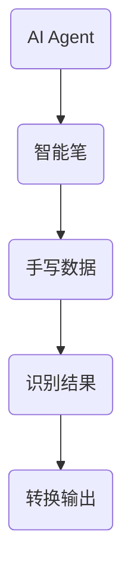
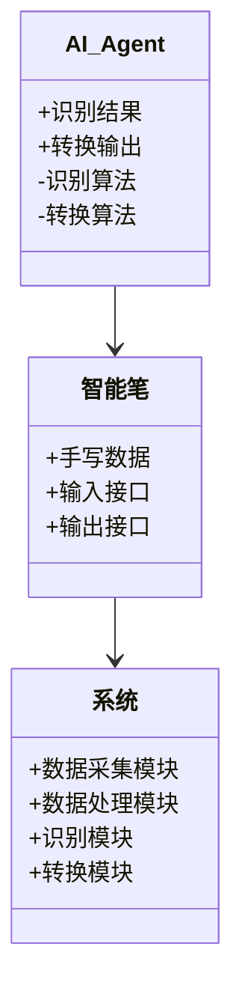
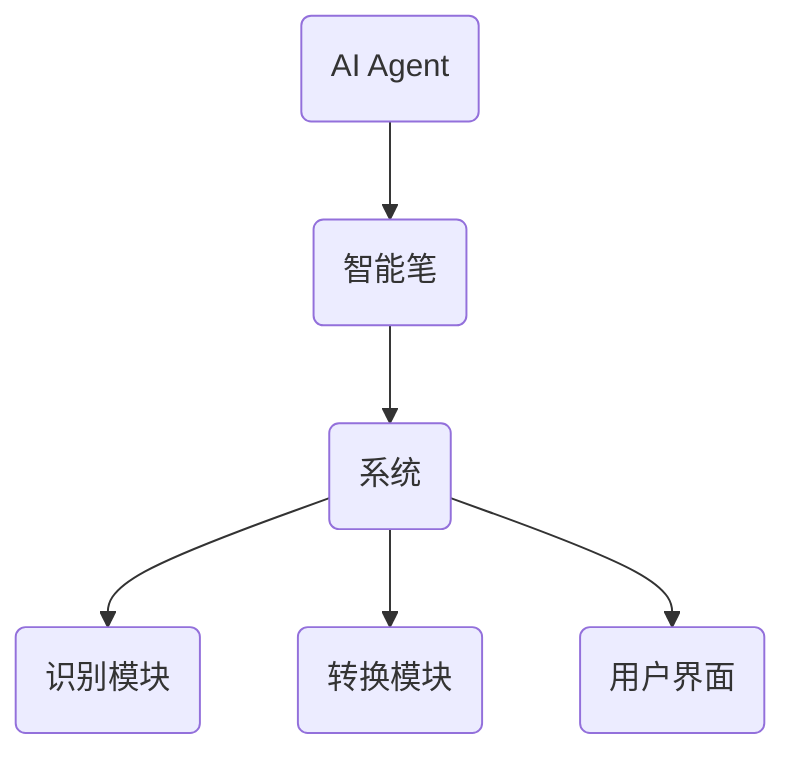
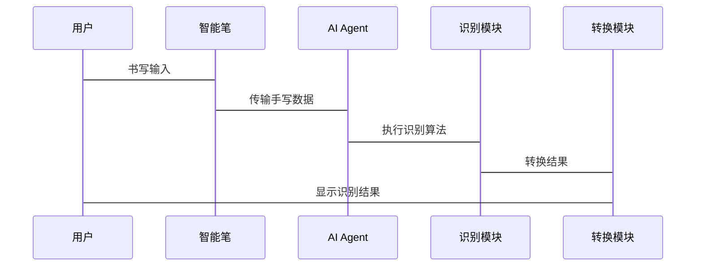

                 


# AI Agent在智能笔中的手写识别转换

> 关键词：AI Agent, 手写识别, 智能笔, 转换技术, 深度学习, OCR技术, 系统架构

> 摘要：本文详细探讨了AI Agent在智能笔中的手写识别转换技术，从背景介绍、核心概念到算法实现，再到系统架构和项目实战，全面分析了该技术的实现原理和应用场景。通过实际案例和代码实现，帮助读者理解如何利用AI Agent实现高效的手写识别和转换。

---

# 第一部分: AI Agent在智能笔中的手写识别转换概述

# 第1章: 背景介绍

## 1.1 问题背景

### 1.1.1 手写识别技术的发展历程
手写识别技术经历了从早期的OCR技术到现代的深度学习算法的演变。早期的手写识别主要依赖模板匹配和统计模型，识别准确率有限。随着深度学习的兴起，特别是卷积神经网络（CNN）的应用，手写识别的准确率和效率得到了显著提升。

### 1.1.2 AI Agent在智能笔中的应用场景
智能笔作为一种便携式的输入设备，结合AI Agent技术，可以在书写过程中实时识别手写内容并进行转换。这种技术广泛应用于教育、医疗、会议记录等领域，能够提高工作效率并提供便捷的用户体验。

### 1.1.3 手写识别转换的市场需求
随着移动办公和远程协作的需求增加，手写识别转换技术成为智能笔的核心功能之一。市场需求主要集中在提高办公效率、增强用户体验和提供智能化服务等方面。

## 1.2 问题描述

### 1.2.1 手写识别的核心问题
手写识别的核心问题是如何准确识别手写内容并将其转换为可编辑的数字格式。这涉及到数据采集、特征提取、模型训练等多个技术环节。

### 1.2.2 AI Agent在智能笔中的功能定位
AI Agent在智能笔中的功能定位是通过实时分析手写数据，提供识别和转换服务。它不仅能够识别单个字符，还能理解上下文，提高识别的准确性和智能化水平。

### 1.2.3 手写识别转换的边界与外延
手写识别转换的边界包括输入设备（如智能笔）的硬件性能、识别算法的准确率以及输出格式的兼容性。外延则包括与其他软件的集成、云端服务的扩展等功能。

## 1.3 核心概念

### 1.3.1 AI Agent的基本概念
AI Agent是一种智能代理，能够通过传感器或用户输入获取信息，并通过算法进行分析和决策。在智能笔中，AI Agent负责处理手写数据并提供识别结果。

### 1.3.2 智能笔的功能与技术特点
智能笔结合了硬件和软件技术，能够实时采集手写数据并将其传输到计算模块进行处理。其技术特点包括低功耗、高精度和实时性。

### 1.3.3 手写识别转换的实现机制
手写识别转换的实现机制包括数据采集、特征提取、模型训练和结果转换。AI Agent通过这些步骤将手写内容转换为数字格式，如文本或图像。

## 1.4 本章小结
本章通过介绍手写识别技术的发展历程、AI Agent在智能笔中的应用场景以及核心概念，为后续的算法实现和系统设计奠定了基础。

---

# 第2章: 核心概念与联系

## 2.1 AI Agent与手写识别的关系

### 2.1.1 AI Agent在手写识别中的作用
AI Agent在手写识别中的作用主要体现在数据处理、特征提取和模型优化等方面。它能够通过深度学习算法提高识别的准确率和效率。

### 2.1.2 手写识别转换的实现流程
手写识别转换的实现流程包括数据采集、预处理、特征提取、模型训练和结果转换。AI Agent通过优化这些步骤，能够实现高效的手写识别。

### 2.1.3 AI Agent与智能笔的协同工作
AI Agent与智能笔协同工作，通过实时分析手写数据，提供快速的识别和转换服务。这种协同工作模式能够提高用户体验和工作效率。

## 2.2 手写识别转换的原理

### 2.2.1 手写识别的基本原理
手写识别的基本原理是通过采集手写数据，提取特征并进行分类。AI Agent通过深度学习算法，能够实现高效的特征提取和分类。

### 2.2.2 AI Agent在识别过程中的算法优化
AI Agent通过优化算法参数和模型结构，能够提高手写识别的准确率和效率。例如，使用卷积神经网络（CNN）进行特征提取和分类。

### 2.2.3 转换过程中的数据处理
在转换过程中，手写数据需要进行预处理，如去噪和归一化。AI Agent通过优化数据处理流程，能够提高识别的准确率和效率。

## 2.3 核心概念对比分析

### 2.3.1 手写识别与OCR技术的对比
手写识别与OCR技术的主要区别在于输入方式和应用场景。手写识别主要应用于智能笔等移动设备，而OCR技术则广泛应用于图像处理和文档识别。

### 2.3.2 AI Agent与传统算法的对比
AI Agent通过深度学习算法实现手写识别，具有更高的准确率和效率。传统算法如模板匹配和统计模型在复杂场景下的表现较差。

### 2.3.3 智能笔与其他输入设备的对比
智能笔与其他输入设备（如键盘和鼠标）的主要区别在于输入方式和应用场景。智能笔能够实现手写输入和实时识别，提供更加便捷的用户体验。

## 2.4 ER实体关系图
以下是手写识别转换的核心实体关系图：



## 2.5 本章小结
本章通过对比分析和实体关系图，详细讲解了AI Agent在智能笔中的手写识别转换的核心概念和实现机制。

---

# 第3章: 算法原理讲解

## 3.1 手写识别算法的实现流程

### 3.1.1 数据预处理
手写数据的预处理包括去噪、归一化和增强处理。去噪旨在去除背景噪声，归一化是为了统一数据格式，增强处理则是为了提高识别的准确率。

### 3.1.2 特征提取
特征提取是手写识别的关键步骤。常用的特征包括形状特征、纹理特征和位置特征。AI Agent通过深度学习算法能够提取更加高效的特征。

### 3.1.3 模型训练与优化
模型训练采用深度学习算法，如卷积神经网络（CNN）。训练过程中需要进行参数优化和模型调优，以提高识别的准确率和效率。

## 3.2 基于深度学习的手写识别算法

### 3.2.1 CNN网络结构
卷积神经网络（CNN）是一种常用的深度学习模型，适用于手写识别任务。其网络结构包括卷积层、池化层和全连接层。

### 3.2.2 模型训练的数学公式
以下是CNN模型训练的数学公式：

$$
\text{损失函数} = \text{交叉熵损失} = -\sum_{i} y_i \log(p_i) + (1 - y_i) \log(1 - p_i)
$$

其中，$y_i$ 是真实标签，$p_i$ 是模型预测的概率。

### 3.2.3 算法实现的代码示例
以下是手写识别算法的Python代码示例：

```python
import tensorflow as tf
from tensorflow.keras import layers

# 定义模型
model = tf.keras.Sequential([
    layers.Conv2D(32, (3, 3), activation='relu', input_shape=(28, 28, 1)),
    layers.MaxPooling2D((2, 2)),
    layers.Conv2D(64, (3, 3), activation='relu'),
    layers.MaxPooling2D((2, 2)),
    layers.Flatten(),
    layers.Dense(128, activation='relu'),
    layers.Dense(10, activation='softmax')
])

# 编译模型
model.compile(optimizer='adam', loss='sparse_categorical_crossentropy', metrics=['accuracy'])

# 训练模型
model.fit(x_train, y_train, epochs=10, batch_size=32)
```

## 3.3 AI Agent的算法优化

### 3.3.1 数据增强
数据增强是一种常用的优化方法，通过旋转、翻转和缩放等操作增加训练数据的多样性，从而提高模型的泛化能力。

### 3.3.2 模型优化策略
模型优化策略包括参数调整和模型剪枝。参数调整旨在找到最优的模型参数，模型剪枝则是为了减少模型的复杂度，提高推理速度。

### 3.3.3 算法实现的注意事项
在实际实现中，需要注意数据格式的统一、模型的训练效率和结果的可解释性。通过优化算法实现，能够提高手写识别的准确率和效率。

## 3.4 本章小结
本章详细讲解了手写识别算法的实现流程，包括数据预处理、特征提取和模型训练，并通过代码示例和数学公式，深入分析了基于深度学习的手写识别算法。

---

# 第4章: 系统分析与架构设计

## 4.1 问题场景介绍

### 4.1.1 系统目标
系统目标是实现AI Agent在智能笔中的手写识别转换功能，提供高效、准确的识别服务。

### 4.1.2 项目介绍
本项目旨在开发一款基于AI Agent的智能笔，实现手写识别和转换功能。通过硬件和软件的结合，提供便捷的用户体验。

### 4.1.3 系统功能设计
系统功能设计包括数据采集、识别转换、结果输出和用户反馈等模块。

## 4.2 系统架构设计

### 4.2.1 领域模型
以下是系统领域模型的Mermaid类图：



### 4.2.2 系统架构
以下是系统架构的Mermaid架构图：



### 4.2.3 接口设计
系统接口设计包括智能笔与AI Agent的通信接口、AI Agent与系统的数据接口，以及系统的用户界面接口。

### 4.2.4 交互流程图
以下是系统交互的Mermaid序列图：



## 4.3 本章小结
本章通过系统架构设计和交互流程图，详细描述了AI Agent在智能笔中的手写识别转换系统的实现方案。

---

# 第5章: 项目实战

## 5.1 环境安装

### 5.1.1 开发环境
开发环境包括Python 3.8及以上版本、TensorFlow 2.0及以上版本和Jupyter Notebook。

### 5.1.2 安装依赖
安装依赖包括TensorFlow、Keras和Scikit-learn等库。

## 5.2 系统核心实现

### 5.2.1 数据采集模块
数据采集模块负责采集手写数据，包括笔画和压力等信息。代码示例如下：

```python
import numpy as np

def collect_handwriting_data():
    # 数据采集代码
    pass
```

### 5.2.2 识别模块
识别模块通过深度学习模型对手写数据进行识别。代码示例如下：

```python
def recognize_handwriting(data):
    model = load_model('handwriting_model.h5')
    predictions = model.predict(data)
    return np.argmax(predictions, axis=1)
```

### 5.2.3 转换模块
转换模块将识别结果转换为可编辑的数字格式。代码示例如下：

```python
def convert_to_text(predictions):
    text = ''
    for prediction in predictions:
        text += str(prediction) + ' '
    return text
```

## 5.3 代码应用解读与分析

### 5.3.1 数据采集模块的实现
数据采集模块通过智能笔采集手写数据，并将其存储为特定格式的文件。通过代码示例可以看出，数据采集模块需要与智能笔的硬件接口进行通信。

### 5.3.2 识别模块的实现
识别模块通过深度学习模型实现手写识别。通过代码示例可以看出，模型加载和预测是关键步骤，需要确保模型的准确性和效率。

### 5.3.3 转换模块的实现
转换模块将识别结果转换为可编辑的文本格式。通过代码示例可以看出，转换模块需要对预测结果进行处理，确保输出格式的正确性。

## 5.4 实际案例分析

### 5.4.1 案例介绍
以下是手写识别转换的实际案例：


### 5.4.2 案例分析
在实际案例中，AI Agent通过智能笔采集手写数据，并通过深度学习模型实现识别和转换。通过案例分析可以看出，AI Agent在智能笔中的手写识别转换技术具有高效、准确的特点。

## 5.5 本章小结
本章通过项目实战，详细讲解了AI Agent在智能笔中的手写识别转换系统的实现过程，包括环境安装、核心代码实现和实际案例分析。

---

# 第6章: 最佳实践与总结

## 6.1 最佳实践

### 6.1.1 数据处理
在数据处理过程中，需要注意数据的多样性和质量。通过数据增强和去噪处理，可以提高模型的泛化能力和识别准确率。

### 6.1.2 模型优化
模型优化是提高识别准确率和效率的关键。通过参数调整和模型剪枝，可以实现模型的优化。

### 6.1.3 系统设计
系统设计需要注重模块化和可扩展性。通过模块化设计，可以提高系统的可维护性和可扩展性。

## 6.2 小结
本文通过详细讲解AI Agent在智能笔中的手写识别转换技术，从背景介绍、核心概念到算法实现，再到系统架构和项目实战，全面分析了该技术的实现原理和应用场景。

## 6.3 注意事项

### 6.3.1 数据隐私
在实际应用中，需要注意手写数据的隐私保护，防止数据泄露和滥用。

### 6.3.2 系统兼容性
系统设计需要考虑不同设备和操作系统的兼容性，确保系统的广泛适用性。

## 6.4 拓展阅读

### 6.4.1 相关技术
相关技术包括深度学习、OCR技术和自然语言处理等。

### 6.4.2 推荐书籍
推荐书籍包括《深度学习》、《机器学习实战》和《Python机器学习》等。

### 6.4.3 在线资源
在线资源包括GitHub上的开源项目、技术博客和学术论文等。

## 6.5 本章小结
本章通过总结和推荐，为读者提供了进一步学习和实践的资源和方向。

---

# 结语

通过本文的详细讲解，读者可以全面了解AI Agent在智能笔中的手写识别转换技术。从理论到实践，从算法到系统，本文为读者提供了丰富的知识和实用的代码示例。希望本文能够为相关领域的研究和应用提供参考和启发。

