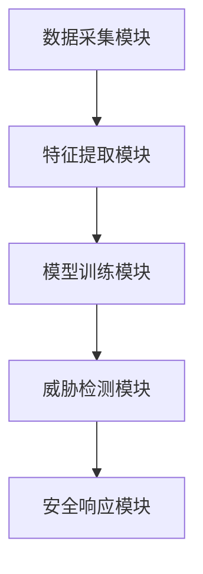
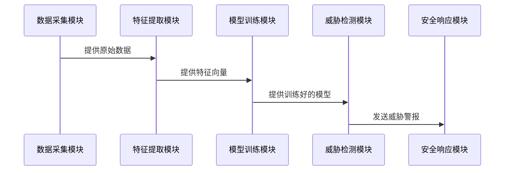

                 


# AI Agent在智能网络安全中的应用

> **关键词**：AI Agent，智能网络安全，机器学习，强化学习，网络安全，异常检测

> **摘要**：随着人工智能技术的快速发展，AI Agent在智能网络安全中的应用越来越广泛。本文从AI Agent的基本概念出发，深入探讨其在网络安全中的核心原理、算法实现、系统架构设计以及实际应用场景。通过详细分析AI Agent在智能网络安全中的优势与挑战，为读者提供一个全面的视角，帮助其理解并掌握AI Agent在网络安全中的应用技巧。

---

# 第一部分: AI Agent在智能网络安全中的应用概述

## 第1章: AI Agent与智能网络安全概述

### 1.1 AI Agent的基本概念

#### 1.1.1 AI Agent的定义与特点
AI Agent（人工智能代理）是一种能够感知环境、自主决策并执行任务的智能体。其核心特点包括：
- **自主性**：能够自主决策和行动，无需外部干预。
- **反应性**：能够实时感知环境并做出响应。
- **学习能力**：通过数据和经验不断优化自身的决策能力。
- **协作性**：能够与其他Agent或系统协同工作，共同完成复杂任务。

#### 1.1.2 AI Agent在网络安全中的作用
AI Agent在网络安全中的应用主要体现在以下几个方面：
- **威胁检测**：通过机器学习算法实时检测网络中的异常行为和潜在威胁。
- **安全防护**：根据检测结果采取主动防御措施，如防火墙配置优化、入侵防御策略调整等。
- **安全响应**：在检测到威胁后，快速启动应急响应机制，最小化损失。

#### 1.1.3 智能网络安全的背景与发展趋势
随着网络安全威胁的日益复杂化，传统的基于规则的安全防护手段已难以应对新型威胁。AI Agent通过其强大的学习和推理能力，能够有效应对未知威胁，成为智能安全的核心技术之一。未来，AI Agent在网络安全中的应用将更加广泛，涵盖威胁检测、漏洞挖掘、安全策略优化等多个领域。

---

## 第2章: AI Agent的核心原理与结构

### 2.1 AI Agent的核心原理

#### 2.1.1 数据驱动的决策机制
AI Agent通过收集网络流量、日志数据等信息，利用机器学习算法进行分析，生成安全策略和行动方案。其核心在于数据的处理和分析能力。

#### 2.1.2 多智能体协作
在复杂的网络安全场景中，单个AI Agent往往难以应对所有威胁。通过多智能体协作，能够实现任务分解、资源共享和协同决策，提升整体防护能力。

### 2.2 AI Agent的结构设计

#### 2.2.1 感知层
感知层负责收集和处理网络环境中的数据，包括：
- **数据采集**：通过网络传感器、日志系统等采集原始数据。
- **特征提取**：将原始数据转化为可分析的特征向量，如流量特征、行为特征等。

#### 2.2.2 决策层
决策层基于感知层提供的数据，利用机器学习模型进行威胁分析和策略生成。常见的决策算法包括：
- **监督学习**：如随机森林、支持向量机（SVM）等。
- **无监督学习**：如聚类分析、主成分分析（PCA）等。
- **强化学习**：通过强化学习优化安全策略。

#### 2.2.3 执行层
执行层负责根据决策层生成的策略执行具体的安全操作，如：
- **防火墙配置**：动态调整防火墙规则，阻止异常流量。
- **入侵防御**：部署入侵检测系统（IDS）或入侵防御系统（IPS）。
- **应急响应**：启动应急预案，隔离受感染节点。

### 2.3 AI Agent的核心概念对比表

| **概念**         | **监督学习**               | **强化学习**              | **无监督学习**             |
|------------------|---------------------------|--------------------------|---------------------------|
| 数据需求         | 标签数据                   | 环境反馈                 | 无标签数据                |
| 任务类型         | 分类、回归                 | 最大化累计奖励            | 聚类、异常检测             |
| 应用场景         | �威脅分类、恶意代码检测     | 安全策略优化              | 异常流量检测               |

---

## 第3章: AI Agent的算法原理与数学模型

### 3.1 监督学习算法

#### 3.1.1 支持向量机（SVM）
SVM是一种常用的监督学习算法，适用于分类任务。其核心思想是通过构建超平面将数据分成两类，适用于网络流量分类和恶意代码检测。

公式：
$$
\text{SVM目标函数：} \quad \text{minimize} \quad \frac{1}{2} \|\mathbf{w}\|^2 + C \sum_{i=1}^n \xi_i
$$

其中，$\mathbf{w}$为权重向量，$C$为惩罚系数，$\xi_i$为松弛变量。

#### 3.1.2 随机森林
随机森林是一种基于决策树的集成学习算法，适用于分类和回归任务。其优势在于能够处理高维数据，适用于网络流量分析。

### 3.2 强化学习算法

#### 3.2.1 Q-learning
Q-learning是一种经典的强化学习算法，适用于离散动作空间的问题。其核心是通过更新Q值表来学习最优策略。

公式：
$$
Q(s, a) = Q(s, a) + \alpha \left( r + \gamma \max Q(s', a') - Q(s, a) \right)
$$

其中，$\alpha$为学习率，$\gamma$为折扣因子。

---

## 第4章: AI Agent的系统架构设计

### 4.1 系统功能设计

#### 4.1.1 系统功能模块
- **数据采集模块**：负责采集网络流量、日志等数据。
- **特征提取模块**：将原始数据转化为特征向量。
- **模型训练模块**：基于特征向量训练机器学习模型。
- **威胁检测模块**：利用训练好的模型实时检测威胁。
- **安全响应模块**：根据检测结果执行防御措施。

### 4.2 系统架构设计

#### 4.2.1 系统架构图


#### 4.2.2 系统接口设计
- 数据采集模块接口：接收网络流量数据。
- 威胁检测模块接口：向安全响应模块发送威胁警报。

### 4.3 系统交互流程

#### 4.3.1 系统交互序列图


---

## 第5章: AI Agent在智能网络安全中的项目实战

### 5.1 环境配置与安装

#### 5.1.1 环境需求
- 操作系统：Linux或Windows
- 数据集：KDD Cup 1999网络安全数据集
- 工具：Python、TensorFlow、Scikit-learn

### 5.2 核心代码实现

#### 5.2.1 数据预处理
```python
import pandas as pd

# 读取数据集
data = pd.read_csv('network_traffic.csv')

# 数据清洗
data = data.dropna()
```

#### 5.2.2 模型训练
```python
from sklearn.svm import SVC
from sklearn.model_selection import train_test_split

# 数据分割
X_train, X_test, y_train, y_test = train_test_split(data.drop('label', axis=1), data['label'], test_size=0.2)

# 训练SVM模型
model = SVC()
model.fit(X_train, y_train)
```

#### 5.2.3 模型评估
```python
from sklearn.metrics import classification_report

# 模型预测
y_pred = model.predict(X_test)

# 评估指标
print(classification_report(y_test, y_pred))
```

### 5.3 实际案例分析

#### 5.3.1 案例：网络异常流量检测
通过训练好的SVM模型，对实时网络流量进行分类，识别出异常流量并触发安全响应机制。

---

## 第6章: AI Agent在智能网络安全中的最佳实践

### 6.1 最佳实践总结

- **数据质量**：确保数据的完整性和准确性，避免数据偏差。
- **模型优化**：根据实际场景调整模型参数，提升检测精度。
- **实时性**：优化系统架构，确保实时检测和响应能力。
- **可解释性**：选择可解释性较高的模型，便于分析和调整。

### 6.2 注意事项

- **数据隐私**：在处理敏感数据时，需遵守相关隐私保护法规。
- **模型鲁棒性**：加强模型的鲁棒性，防止对抗攻击。
- **持续学习**：定期更新模型，应对新型威胁。

### 6.3 未来展望

随着AI技术的不断进步，AI Agent在智能网络安全中的应用将更加广泛。未来，AI Agent将与区块链、边缘计算等技术结合，构建更加智能化、分布化的安全防护体系。

---

## 第7章: 总结与展望

### 7.1 总结

AI Agent作为一种智能化的安全解决方案，凭借其强大的数据处理能力和自主决策能力，在智能网络安全中发挥着越来越重要的作用。通过本文的详细分析，读者可以全面了解AI Agent的核心原理、算法实现以及实际应用场景。

### 7.2 展望

尽管AI Agent在智能网络安全中展现出巨大潜力，但仍面临诸多挑战，如模型解释性、数据隐私等问题。未来，随着技术的不断进步，AI Agent将在智能安全领域发挥更大的作用，为网络安全防护提供更加智能化的解决方案。

---

**END**

