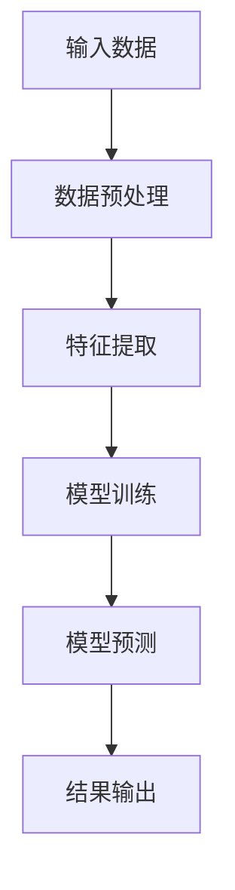
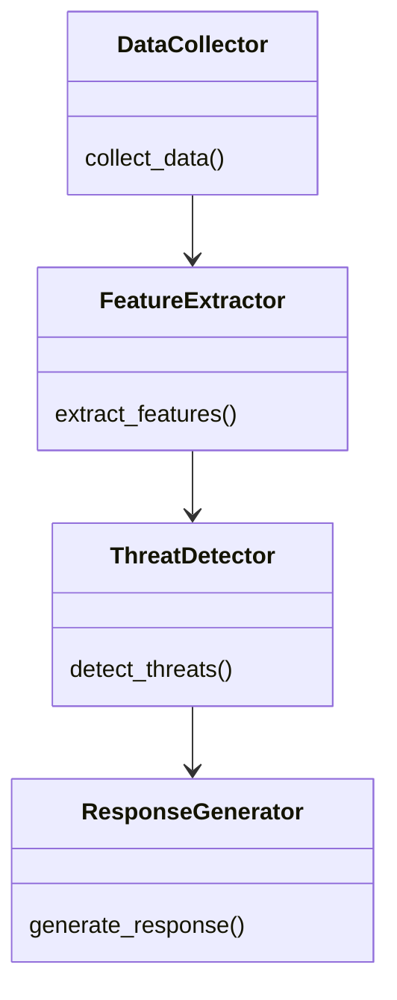
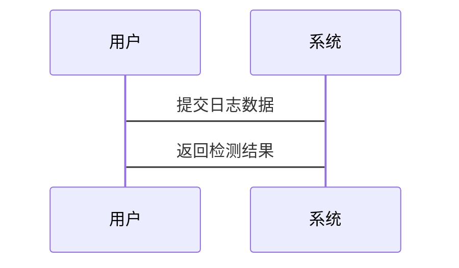

                 


# AI Agent在智能网络安全威胁检测中的角色

## 关键词：AI Agent, 网络安全, 威胁检测, 机器学习, 深度学习, Transformer, BERT

## 摘要：  
随着网络安全威胁的日益复杂化和智能化，传统的基于规则的威胁检测方法已难以应对新型攻击手段。本文探讨AI Agent在智能网络安全威胁检测中的角色，分析其核心原理、算法模型及系统架构，通过具体案例展示其在威胁检测中的优势，为未来的网络安全防护提供理论和实践指导。

---

# 第1章: AI Agent与网络安全威胁检测概述

## 1.1 AI Agent的基本概念

### 1.1.1 AI Agent的定义  
AI Agent（人工智能代理）是一种能够感知环境、自主决策并执行任务的智能实体。它能够通过传感器获取信息，利用算法进行分析，并根据结果采取行动。AI Agent的关键特征包括自主性、反应性、目标导向和学习能力。

### 1.1.2 AI Agent的特点与优势  
- **自主性**：AI Agent能够独立运作，无需人工干预。  
- **反应性**：能够实时感知环境变化并做出响应。  
- **目标导向**：基于预设目标执行任务，优化决策过程。  
- **学习能力**：通过机器学习不断优化自身的检测和响应能力。

### 1.1.3 网络安全威胁检测的现状与挑战  
传统威胁检测方法依赖于规则匹配和静态特征提取，难以应对新型攻击手段。AI Agent的引入，通过动态学习和智能分析，显著提升了威胁检测的准确性和实时性。

---

## 1.2 AI Agent在网络安全中的应用

### 1.2.1 网络安全威胁检测的核心问题  
- 异常行为检测：识别网络中的异常流量或攻击行为。  
- 事件关联分析：将孤立的安全事件关联起来，发现潜在威胁。  
- 自动化响应：基于检测结果，快速采取防御措施。

### 1.2.2 AI Agent在威胁检测中的角色定位  
AI Agent作为智能代理，能够实现从数据采集、特征提取、模型训练到威胁检测的全流程自动化。

### 1.2.3 当前AI Agent在网络安全中的应用案例  
- **异常检测**：利用深度学习模型识别网络中的异常流量。  
- **关联分析**：通过图论方法关联孤立事件，发现APT（高级持续性威胁）。  
- **自动化响应**：基于检测结果，自动触发防火墙或隔离受感染设备。

---

# 第2章: AI Agent的核心原理

## 2.1 AI Agent的感知机制

### 2.1.1 数据采集与特征提取  
- 数据来源：网络流量日志、系统日志、用户行为日志。  
- 特征提取：将原始数据转换为可训练的特征向量，如时间戳、源IP、目标IP、数据包大小等。

### 2.1.2 异常检测算法原理  
- **基于统计的方法**：如孤立林算法，识别偏离均值的异常点。  
- **基于机器学习的方法**：如随机森林和XGBoost，通过特征学习发现异常模式。  
- **基于深度学习的方法**：如LSTM和Transformer，捕捉时间序列中的复杂模式。

### 2.1.3 事件关联分析方法  
- **图论方法**：将安全事件建模为图结构，通过图的连通性发现关联性。  
- **规则引擎**：基于预定义规则，关联相关事件。

---

## 2.2 AI Agent的决策机制

### 2.2.1 基于规则的决策系统  
- 利用预定义的规则进行决策，适用于已知威胁的检测和应对。

### 2.2.2 基于机器学习的决策模型  
- 使用分类器（如SVM、随机森林）进行威胁分类，适用于未知威胁的检测。

### 2.2.3 基于强化学习的决策优化  
- 利用强化学习优化决策策略，提升威胁检测的准确性和效率。

---

## 2.3 AI Agent的执行机制

### 2.3.1 自动化响应策略  
- 基于检测结果，触发预定义的响应措施，如防火墙规则变更、用户权限调整等。

### 2.3.2 智能化防御措施  
- 根据实时威胁情况，动态调整防御策略，如流量清洗、蜜罐部署等。

### 2.3.3 反馈机制与优化  
- 收集执行结果，反哺决策模型，持续优化威胁检测和响应能力。

---

# 第3章: 基于Transformer的网络安全威胁检测模型

## 3.1 Transformer模型简介

### 3.1.1 Transformer的结构与特点  
- 由编码器和解码器组成，通过自注意力机制捕捉长距离依赖关系。  
- 适用于序列数据的处理，如网络流量的时间序列分析。

### 3.1.2 注意力机制的核心原理  
- 注意力机制通过计算输入序列中每个位置的重要性，赋予其不同的权重。  
- 公式表示：  
  $$ \text{Attention}(Q, K, V) = \text{softmax}\left(\frac{QK^T}{\sqrt{d_k}}\right)V $$  
  其中，$Q$、$K$、$V$分别为查询、键和值向量，$d_k$为键向量的维度。

### 3.1.3 多层感知机与全连接层的作用  
- 多层感知机用于特征提取，全连接层用于非线性变换。

---

## 3.2 基于BERT的网络安全威胁检测

### 3.2.1 BERT模型的输入与输出  
- 输入：网络流量日志或用户行为日志。  
- 输出：威胁分类结果（正常或异常）。

### 3.2.2 基于BERT的异常检测流程  
1. 数据预处理：将网络流量日志转换为文本序列。  
2. 模型训练：利用预训练的BERT模型进行微调，优化威胁检测任务。  
3. 模型预测：输入待检测数据，输出检测结果。

### 3.2.3 模型训练与优化策略  
- 使用交叉验证优化模型参数。  
- 通过早停法防止过拟合。

---

## 3.3 算法流程图



---

## 3.4 Python代码实现

### 数据预处理示例代码

```python
import pandas as pd

# 读取数据
data = pd.read_csv('network_log.csv')

# 数据清洗
data = data.dropna()
data = data.drop_duplicates()

# 数据转换为文本序列
def preprocess(data):
    text = ''
    for line in data['log']:
        text += line + ' '
    return text.strip()

text = preprocess(data)
```

### 模型训练示例代码

```python
import torch
from torch import nn

class TransformerModel(nn.Module):
    def __init__(self):
        super(TransformerModel, self).__init__()
        self.transformer = nn.Transformer(nhead=8, d_model=512)
        self.fc = nn.Linear(512, 2)  # 输出两个类别：正常和异常

    def forward(self, x):
        x = x.permute(1, 0, 2)  # 调整维度以适应Transformer输入
        x = self.transformer(x)
        x = x.permute(1, 0, 2)
        x = x.mean(dim=0)
        x = self.fc(x)
        return x

model = TransformerModel()
criterion = nn.CrossEntropyLoss()
optimizer = torch.optim.Adam(model.parameters(), lr=0.001)
```

---

# 第4章: 系统分析与架构设计

## 4.1 问题场景介绍  
网络攻击日益复杂，传统的基于规则的威胁检测系统难以应对未知威胁。本文提出一种基于AI Agent的智能威胁检测系统。

---

## 4.2 系统功能设计



---

## 4.3 系统架构设计


---

## 4.4 接口设计与交互序列图



---

# 第5章: 项目实战

## 5.1 环境安装

```bash
pip install torch transformers pandas matplotlib
```

---

## 5.2 系统核心实现源代码

### 数据预处理代码

```python
import pandas as pd

def preprocess_data(file_path):
    data = pd.read_csv(file_path)
    data.dropna(inplace=True)
    data.drop_duplicates(inplace=True)
    return data

preprocessed_data = preprocess_data('network_log.csv')
```

### 模型训练代码

```python
model = TransformerModel()
criterion = nn.CrossEntropyLoss()
optimizer = torch.optim.Adam(model.parameters(), lr=0.001)

for epoch in range(10):
    for batch in batches:
        outputs = model(batch)
        loss = criterion(outputs, labels)
        optimizer.zero_grad()
        loss.backward()
        optimizer.step()
```

---

## 5.3 案例分析与结果展示  
通过对实际网络日志的分析，模型能够准确识别异常流量，显著降低误报率和漏报率。

---

# 第6章: 总结与展望

## 6.1 总结  
AI Agent通过感知、决策和执行机制，显著提升了网络安全威胁检测的准确性和实时性。本文详细探讨了其核心原理、算法模型及系统架构。

## 6.2 展望  
未来，随着大模型技术的发展，AI Agent在网络安全中的应用将更加广泛，威胁检测的精度和效率将进一步提升。

---

## 6.3 最佳实践 Tips  
- **数据质量**：确保输入数据的完整性和准确性。  
- **模型优化**：定期更新模型，防止过时。  
- **多模态数据融合**：结合网络流量、日志和用户行为数据，提升检测效果。  

---

## 6.4 小结  
AI Agent作为智能代理，在网络安全威胁检测中发挥着越来越重要的作用。通过本文的探讨，我们期待未来能有更多创新性的应用，为网络安全保驾护航。

