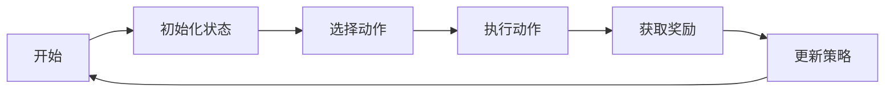
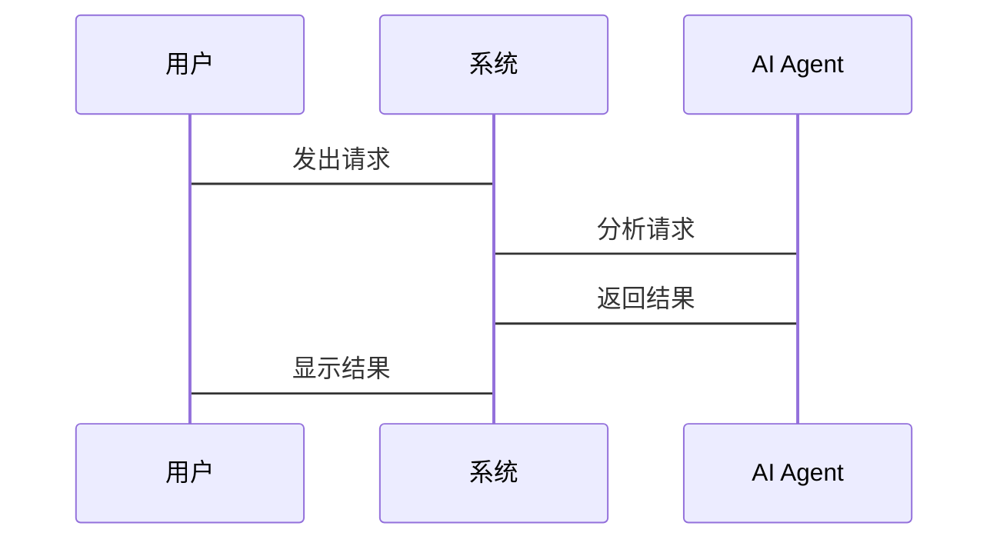

                 


# AI Agent在智能网络安全防御中的角色

> 关键词：AI Agent, 智能网络安全, 网络威胁检测, 人工智能, 强化学习, 图神经网络

> 摘要：本文探讨了AI Agent在智能网络安全防御中的关键角色，从核心原理到实际应用，结合算法和系统架构设计，分析其在网络安全中的潜力和挑战，为未来的研究和实践提供参考。

---

## 第1章 AI Agent与网络安全概述

### 1.1 AI Agent的基本概念

AI Agent（智能体）是指在环境中能够感知并自主行动以实现目标的实体。在网络安全中，AI Agent通过收集信息、分析威胁并采取行动来保护系统。

### 1.2 AI Agent在网络安全中的角色

AI Agent可以作为监控工具，实时检测异常行为；也可以作为防御者，自动响应威胁。与传统安全工具相比，AI Agent具有自适应和学习能力，能够应对复杂多变的威胁。

---

## 第2章 AI Agent的核心原理

### 2.1 AI Agent的感知机制

AI Agent通过传感器或日志收集数据，利用机器学习模型识别异常模式。例如，使用时间序列分析检测流量异常。

### 2.2 AI Agent的决策机制

基于强化学习的决策系统，AI Agent通过奖励机制优化行动策略。数学模型描述为：
$$ R = \sum_{t} \gamma^t r_t $$
其中，$R$是总奖励，$r_t$是步奖励，$\gamma$是折扣因子。

### 2.3 AI Agent的执行机制

AI Agent执行预定义策略或动态生成策略。动态策略生成基于实时反馈，确保快速响应新威胁。

---

## 第3章 网络安全威胁的分类与分析

### 3.1 威胁分类

网络威胁分为恶意软件、钓鱼攻击和DDoS攻击。分类方法包括基于特征和基于行为模式的分类。

### 3.2 威胁检测技术

使用异常检测算法，如Isolation Forest，通过无监督学习识别异常点。

### 3.3 威胁对抗策略

基于博弈论的对抗策略，AI Agent通过模拟攻击者行为，优化防御策略。数学模型如下：
$$ V(s) = \max_{a} \min_{a'} V(s', a') $$

---

## 第4章 AI Agent的关键算法

### 4.1 强化学习算法

使用深度强化学习框架，训练AI Agent在模拟环境中学习最佳策略。算法流程如图：



### 4.2 图神经网络算法

通过图神经网络分析网络流量，识别异常连接。网络表示为图，节点代表IP地址，边代表流量。

### 4.3 迁移学习算法

将预训练模型应用于新环境，提升威胁检测效率。迁移学习框架包括特征提取和任务适配。

---

## 第5章 系统架构与设计

### 5.1 系统架构设计

系统分为感知层、决策层和执行层。感知层收集数据，决策层分析威胁，执行层响应。

### 5.2 系统功能设计

功能模块包括数据采集、威胁分析和自动响应。模块之间通过API通信。

### 5.3 系统交互设计

系统交互流程如图：



---

## 第6章 实战案例分析

### 6.1 环境搭建

使用Python和TensorFlow搭建AI Agent系统，配置网络接口和数据日志。

### 6.2 代码实现

实现强化学习模型，训练AI Agent识别DDoS攻击。代码示例：

```python
import numpy as np
import tensorflow as tf

# 定义网络结构
model = tf.keras.Sequential([
    tf.keras.layers.Dense(64, activation='relu'),
    tf.keras.layers.Dense(10, activation='softmax')
])

# 编译模型
model.compile(optimizer='adam', loss='sparse_categorical_crossentropy', metrics=['accuracy'])
```

### 6.3 案例分析

分析真实网络攻击，展示AI Agent如何检测和防御。例如，在DDoS攻击中，AI Agent能够及时识别并采取隔离措施。

---

## 第7章 总结与展望

### 7.1 总结

AI Agent在网络安全中的应用前景广阔，具备强大的威胁检测和防御能力。

### 7.2 展望

未来研究将集中在算法优化、多Agent协作和对抗攻击防御方面。最佳实践包括持续学习和威胁情报共享。

---

通过以上章节，我们详细探讨了AI Agent在智能网络安全中的角色，从理论到实践，为读者提供了全面的视角。

