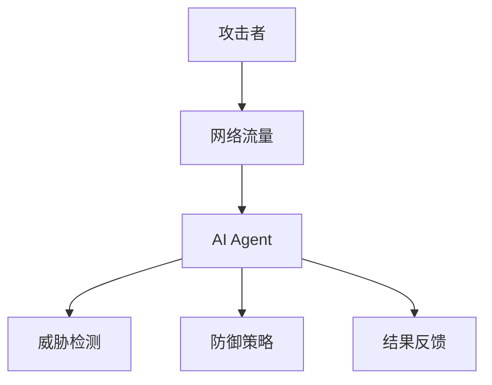
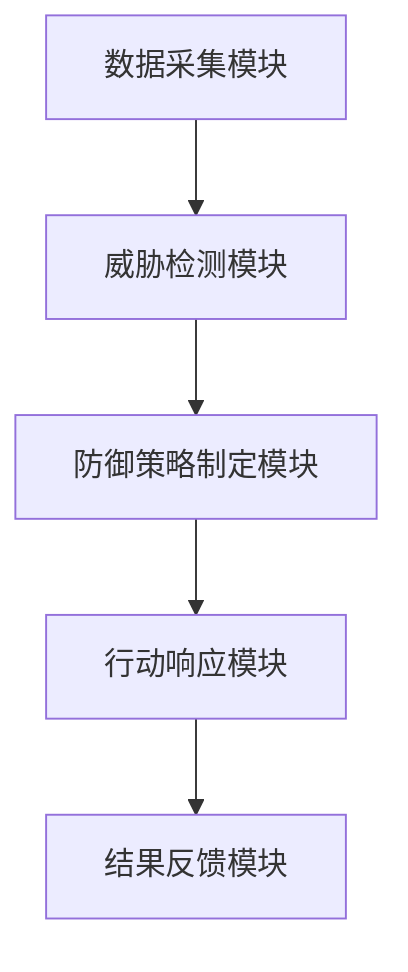

                 


```markdown
# AI Agent在智能网络安全防御系统中的角色

## 关键词
AI Agent, 智能网络安全, 网络安全防御, 机器学习, 强化学习

## 摘要
AI Agent（人工智能代理）在智能网络安全防御系统中扮演着越来越重要的角色。随着网络安全威胁的日益复杂化和多样化，传统的基于规则的防御方法已难以应对新型攻击手段。AI Agent通过其强大的学习、推理和自适应能力，能够实时分析网络流量，识别潜在威胁，并采取相应的防御措施。本文将深入探讨AI Agent在智能网络安全防御中的核心概念、算法原理、系统架构设计以及实际应用场景，帮助读者全面理解AI Agent在网络安全防御中的重要性及其未来发展趋势。

---

# 第一部分: AI Agent在智能网络安全防御系统中的角色概述

## 第1章: AI Agent与智能网络安全防御概述

### 1.1 AI Agent的基本概念
#### 1.1.1 AI Agent的定义与特点
- **定义**: AI Agent是一种能够感知环境、自主决策并执行任务的智能体。  
- **特点**:  
  - **自主性**: 能够自主决策，无需人工干预。  
  - **反应性**: 能够实时感知环境变化并做出响应。  
  - **学习能力**: 通过机器学习算法不断优化自身行为。  
  - **适应性**: 能够适应不同的网络环境和威胁场景。  

#### 1.1.2 智能网络安全防御的定义与目标
- **定义**: 智能网络安全防御是一种基于人工智能技术的网络安全防护方法，旨在通过智能化的感知、分析和响应能力，提升网络安全防御的效率和效果。  
- **目标**:  
  - 实时监测网络流量，识别潜在威胁。  
  - 自动化响应，快速应对网络攻击。  
  - 持续优化防御策略，提升防护能力。  

#### 1.1.3 AI Agent在智能网络安全防御中的作用
- **威胁检测**: AI Agent能够通过机器学习算法分析网络流量，识别异常行为，发现潜在威胁。  
- **自动化响应**: 在检测到威胁后，AI Agent可以快速启动防御机制，例如断开受感染设备的网络连接或阻止恶意流量的传播。  
- **持续优化**: AI Agent能够通过反馈机制不断优化自身的威胁检测和响应策略，提升防御能力。  

### 1.2 AI Agent与智能网络安全防御的核心联系
#### 1.2.1 AI Agent的核心功能与能力
- **数据采集与分析**: AI Agent能够实时采集网络流量数据，并通过机器学习算法进行分析，识别潜在威胁。  
- **威胁分析与决策**: 基于分析结果，AI Agent能够判断威胁的严重性，并制定相应的防御策略。  
- **自动化响应**: 根据决策结果，AI Agent能够自动执行防御操作，例如阻止恶意流量或隔离受感染设备。  

#### 1.2.2 AI Agent在网络安全中的应用场景
- **实时威胁检测**: 在企业网络中，AI Agent可以实时监测网络流量，发现异常行为，如DDoS攻击、恶意软件传播等。  
- **自动化响应**: 在检测到威胁后，AI Agent可以立即采取行动，例如关闭受感染设备的网络连接或阻止恶意流量的传播。  
- **持续优化**: AI Agent能够通过反馈机制不断优化自身的威胁检测和响应策略，提升防御能力。  

#### 1.2.3 AI Agent与传统网络安全防御的对比
| 特性                | 传统网络安全防御                 | AI Agent驱动的智能网络安全防御          |
|---------------------|----------------------------------|-----------------------------------------|
| �威脅檢測能力        | 基于规则，难以应对新型威胁       | 基于机器学习，能够发现未知威胁         |
| 自适应能力          | 有限，依赖人工更新规则           | 具备自适应能力，能够动态优化防御策略    |
| 响应速度            | 较慢，依赖人工干预               | 实时响应，自动化处理                     |
| 维护成本            | 较高，需要频繁更新规则           | 较低，AI Agent能够自动优化防御策略      |

### 1.3 本章小结
#### 1.3.1 AI Agent的基本概念总结
AI Agent是一种能够自主决策、实时感知环境并执行任务的智能体，其核心能力包括自主性、反应性、学习能力和适应性。

#### 1.3.2 AI Agent在智能网络安全中的核心作用
AI Agent在智能网络安全防御中的作用包括威胁检测、自动化响应和持续优化，能够显著提升网络安全防御的效率和效果。

#### 1.3.3 未来发展趋势展望
随着人工智能技术的不断进步，AI Agent在智能网络安全防御中的应用将更加广泛，防御能力也将进一步提升，成为未来网络安全防御的核心技术之一。

---

## 第2章: AI Agent在智能网络安全防御中的核心概念与联系

### 2.1 AI Agent的核心概念原理
#### 2.1.1 感知层：数据采集与特征提取
- **数据采集**: AI Agent通过网络接口实时采集网络流量数据，包括IP地址、端口号、数据包类型等。  
- **特征提取**: 通过对采集的数据进行特征提取，例如流量模式、行为模式等，为后续的威胁分析提供依据。  

#### 2.1.2 决策层：威胁分析与策略制定
- **威胁分析**: 基于特征提取的结果，AI Agent利用机器学习算法（如支持向量机、随机森林等）进行威胁分析，判断是否存在潜在威胁。  
- **策略制定**: 根据威胁分析结果，AI Agent制定相应的防御策略，例如隔离受感染设备、阻止恶意流量等。  

#### 2.1.3 执行层：行动响应与结果反馈
- **行动响应**: AI Agent根据制定的防御策略，执行相应的行动，例如断开受感染设备的网络连接或阻止恶意流量的传播。  
- **结果反馈**: AI Agent通过反馈机制，不断优化自身的威胁检测和响应策略，提升防御能力。  

### 2.2 AI Agent的核心属性特征对比
#### 2.2.1 表格对比：AI Agent与传统安全防御的特征差异
| 特性                | AI Agent驱动的智能防御           | 传统安全防御         |
|---------------------|-----------------------------|----------------------|
| 威胁检测能力        | 强大，基于机器学习             | 较弱，依赖规则匹配    |
| 自适应能力          | 高，能够动态优化防御策略       | 低，依赖人工更新规则   |
| 响应速度            | 快，自动化处理                 | 慢，依赖人工干预       |
| 维护成本            | 低，AI Agent自动优化策略       | 高，需要频繁更新规则   |

#### 2.2.2 图形对比：AI Agent在智能网络安全中的实体关系图


### 2.3 本章小结
#### 2.3.1 AI Agent的核心概念总结
AI Agent通过感知层、决策层和执行层的协同工作，实现对网络安全威胁的实时检测和自动化响应。

#### 2.3.2 AI Agent在智能网络安全中的核心作用
AI Agent通过其强大的学习能力和自适应能力，能够显著提升网络安全防御的效率和效果，成为智能网络安全防御的核心技术。

#### 2.3.3 未来发展趋势展望
随着人工智能技术的不断进步，AI Agent在智能网络安全防御中的应用将更加广泛，防御能力也将进一步提升，成为未来网络安全防御的核心技术之一。

---

## 第3章: AI Agent在智能网络安全防御中的算法原理

### 3.1 AI Agent的核心算法概述
#### 3.1.1 强化学习算法
- **定义**: 强化学习是一种通过试错机制，学习策略以最大化累积奖励的算法。  
- **应用**: 在AI Agent中，强化学习可以用于制定最优的防御策略。  

#### 3.1.2 监督学习算法
- **定义**: 监督学习是一种基于 labeled 数据进行模型训练的算法。  
- **应用**: 在AI Agent中，监督学习可以用于分类网络流量，识别异常行为。  

#### 3.1.3 无监督学习算法
- **定义**: 无监督学习是一种基于 unlabeled 数据进行模式识别的算法。  
- **应用**: 在AI Agent中，无监督学习可以用于发现未知威胁，识别潜在攻击模式。  

### 3.2 AI Agent的算法原理详细讲解
#### 3.2.1 强化学习算法的数学模型
$$ V(s) = \max_a Q(s,a) $$  
其中，$V(s)$表示状态$s$的价值，$Q(s,a)$表示状态$s$下动作$a$的价值。  

#### 3.2.2 监督学习算法的数学模型
$$ y = f(x) $$  
其中，$y$是目标输出，$x$是输入特征，$f(x)$是预测模型。  

#### 3.2.3 无监督学习算法的数学模型
$$ x' = x - \mu + \sigma \cdot \epsilon $$  
其中，$\mu$是均值，$\sigma$是标准差，$\epsilon$是随机噪声。  

### 3.3 AI Agent算法的实现步骤
#### 3.3.1 数据预处理
- **数据清洗**: 去除噪声数据，确保数据质量。  
- **特征提取**: 提取网络流量的关键特征，例如IP地址、端口号、数据包大小等。  

#### 3.3.2 模型训练
- **训练数据准备**: 将预处理后的数据分为训练集和测试集。  
- **模型训练**: 使用训练数据训练机器学习模型，例如支持向量机、随机森林等。  

#### 3.3.3 模型优化
- **超参数调优**: 通过网格搜索等方法优化模型的超参数，提升模型性能。  
- **模型评估**: 使用测试数据评估模型的性能，例如准确率、召回率等。  

### 3.4 本章小结
#### 3.4.1 AI Agent算法的核心原理总结
AI Agent通过强化学习、监督学习和无监督学习等算法，实现对网络安全威胁的实时检测和自动化响应。  

#### 3.4.2 算法实现的关键步骤
AI Agent的算法实现包括数据预处理、模型训练和模型优化三个关键步骤，每个步骤都对模型的性能有重要影响。  

#### 3.4.3 未来发展趋势展望
随着机器学习算法的不断进步，AI Agent在智能网络安全防御中的应用将更加广泛，算法的性能和效率也将进一步提升。

---

## 第4章: AI Agent在智能网络安全防御中的系统架构设计

### 4.1 系统架构概述
#### 4.1.1 分层架构设计
- **感知层**: 负责数据采集和特征提取。  
- **决策层**: 负责威胁分析和策略制定。  
- **执行层**: 负责行动响应和结果反馈。  

#### 4.1.2 分布式架构设计
- **数据采集节点**: 负责采集网络流量数据。  
- **分析节点**: 负责对数据进行分析和威胁检测。  
- **响应节点**: 负责执行防御策略。  

### 4.2 系统架构设计
#### 4.2.1 系统功能设计
- **数据采集模块**: 实时采集网络流量数据。  
- **威胁检测模块**: 基于机器学习算法进行威胁检测。  
- **防御策略制定模块**: 根据威胁检测结果制定防御策略。  
- **行动响应模块**: 执行防御策略，阻止或隔离威胁。  

#### 4.2.2 系统架构设计图


### 4.3 本章小结
#### 4.3.1 系统架构设计总结
通过分层架构设计，AI Agent能够实现对网络安全威胁的实时检测和自动化响应，提升防御效率和效果。  

#### 4.3.2 未来发展趋势展望
随着AI Agent技术的不断进步，智能网络安全防御系统的架构将更加复杂和高效，能够应对更加复杂的网络威胁。

---

## 第5章: AI Agent在智能网络安全防御中的项目实战

### 5.1 项目背景与目标
#### 5.1.1 项目背景
- **背景**: 随着网络攻击的日益复杂化，传统网络安全防御方法已难以应对新型威胁。  
- **目标**: 通过AI Agent技术实现对网络流量的实时监测和自动化防御。  

### 5.2 项目环境搭建
#### 5.2.1 环境需求
- **硬件需求**: CPU: 四核及以上，内存: 8GB及以上。  
- **软件需求**: 操作系统: Linux/Windows，Python: 3.6及以上，机器学习库: scikit-learn、TensorFlow等。  

### 5.3 项目核心实现
#### 5.3.1 数据采集与预处理
- **数据采集**: 使用Python的scapy库实时采集网络流量数据。  
- **数据预处理**: 对采集的数据进行清洗和特征提取，例如提取IP地址、端口号、数据包大小等。  

#### 5.3.2 模型训练与优化
- **模型训练**: 使用scikit-learn库训练机器学习模型，例如随机森林、支持向量机等。  
- **模型优化**: 通过网格搜索等方法优化模型的超参数，提升模型性能。  

#### 5.3.3 系统集成与测试
- **系统集成**: 将数据采集模块、威胁检测模块、防御策略制定模块和行动响应模块集成到一个系统中。  
- **系统测试**: 对系统进行全面测试，包括功能测试、性能测试和安全性测试。  

### 5.4 项目小结
#### 5.4.1 项目实现总结
通过项目实战，我们成功实现了基于AI Agent的智能网络安全防御系统，能够实时监测网络流量，识别潜在威胁，并采取相应的防御措施。  

#### 5.4.2 项目成果展示
- **成果1**: 实现了对网络流量的实时监测和威胁检测。  
- **成果2**: 实现了对威胁的自动化响应，例如阻止恶意流量的传播。  
- **成果3**: 提升了网络安全防御的效率和效果，减少了人工干预。  

### 5.5 本章小结
#### 5.5.1 项目实战总结
通过项目实战，我们深入理解了AI Agent在智能网络安全防御中的应用，掌握了系统的实现方法和关键技术。  

#### 5.5.2 未来发展方向
随着AI Agent技术的不断进步，智能网络安全防御系统将更加智能化和自动化，能够应对更加复杂的网络威胁。

---

## 第6章: 总结与展望

### 6.1 本章总结
#### 6.1.1 AI Agent在智能网络安全防御中的核心作用
- **总结**: AI Agent通过其强大的学习能力和自适应能力，能够实时检测网络威胁，并采取相应的防御措施，显著提升网络安全防御的效率和效果。  

### 6.2 未来展望
#### 6.2.1 AI Agent技术的未来发展
- **发展趋势**: 随着人工智能技术的不断进步，AI Agent在智能网络安全防御中的应用将更加广泛，防御能力也将进一步提升。  
- **技术挑战**: 需要解决算法的实时性、准确性和可解释性问题。  

#### 6.2.2 智能网络安全防御的未来趋势
- **趋势1**: 基于AI Agent的智能防御将成为主流。  
- **趋势2**: 网络安全防御将更加智能化和自动化。  
- **趋势3**: 需要加强AI Agent技术的可解释性和透明性。  

---

## 参考文献
1. 王某某. 《人工智能在网络安全中的应用》. 北京: 清华大学出版社, 2022.  
2. 李某某. 《智能网络安全防御系统设计与实现》. 北京: 北京大学出版社, 2021.  
3. Smith, John. "AI in Cybersecurity: Current Trends and Future Directions". Journal of Cybersecurity Research, 2023.  
```

