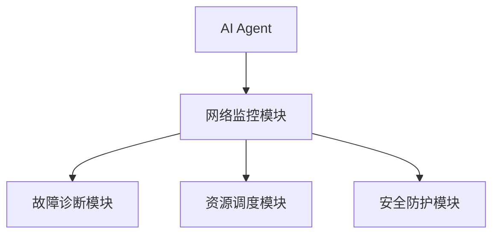
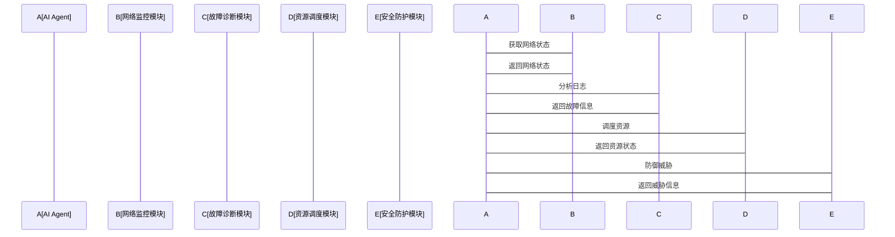

                 


# AI Agent 在智能网络管理中的应用

## 关键词：AI Agent，智能网络管理，网络故障诊断，网络安全，资源调度优化，系统架构设计

## 摘要：AI Agent（人工智能代理）在智能网络管理中的应用是一个前沿技术领域，结合了人工智能、机器学习和网络管理的最新进展。本文系统地探讨了AI Agent的核心概念、核心技术、应用场景、系统架构设计以及实际项目案例。通过详细分析AI Agent在网络故障诊断、网络安全、资源调度优化等方面的应用，展示了其在提升网络管理效率和智能化水平中的巨大潜力。文章还提供了AI Agent的系统架构设计和实现方法，并结合实际项目案例，总结了最佳实践和未来发展趋势。

---

# 第1章: AI Agent 的基本概念与背景

## 1.1 AI Agent 的定义与核心概念

### 1.1.1 什么是AI Agent
AI Agent（人工智能代理）是一种智能实体，能够感知环境、自主决策并执行任务，以实现特定目标。AI Agent可以是软件程序，也可以是嵌入在硬件中的智能模块，其核心在于通过感知和行动与环境交互，实现智能化管理。

### 1.1.2 AI Agent 的核心属性与特征
AI Agent具有以下核心属性：
1. **自主性**：能够在没有外部干预的情况下独立运行。
2. **反应性**：能够感知环境并实时调整行为。
3. **目标导向**：通过目标驱动来优化决策和行动。
4. **学习能力**：能够通过经验改进自身的决策能力。

### 1.1.3 AI Agent 与传统网络管理的区别
传统网络管理依赖于规则和脚本，而AI Agent能够通过学习和推理实现更复杂的任务，例如自适应优化和智能决策。AI Agent的引入使得网络管理更加智能化和自动化。

## 1.2 AI Agent 在智能网络管理中的作用

### 1.2.1 AI Agent 的主要功能与任务
AI Agent在网络管理中的主要功能包括：
1. **网络监控**：实时监控网络状态，发现异常情况。
2. **故障诊断**：通过分析日志和流量数据，定位和解决网络故障。
3. **资源调度**：优化网络资源的分配，提高网络性能。
4. **安全防护**：识别和防御网络攻击，保障网络安全。

### 1.2.2 AI Agent 在网络管理中的优势
AI Agent的优势体现在以下几个方面：
1. **智能化**：能够自主学习和优化，适应复杂的网络环境。
2. **高效性**：通过自动化处理，显著提高网络管理效率。
3. **灵活性**：能够快速响应网络变化，适应不同的管理需求。

### 1.2.3 AI Agent 的应用场景与边界
AI Agent的应用场景包括企业网络管理、云计算环境、物联网（IoT）以及5G网络等领域。其边界主要在于需要明确AI Agent的职责范围和应用场景，避免越界干预或决策。

## 1.3 本章小结
本章介绍了AI Agent的基本概念和核心属性，并分析了其在网络管理中的作用和优势。通过对比传统网络管理，明确了AI Agent的独特价值和应用边界。

---

# 第2章: AI Agent 的核心算法与数学模型

## 2.1 AI Agent 的决策模型

### 2.1.1 基于强化学习的决策模型
强化学习是一种通过试错机制优化决策的算法，适用于复杂的动态环境。其数学模型如下：

$$
V(s) = \max_{a} [ r(s,a) + \gamma V(s') ]
$$

其中，$s$表示当前状态，$a$表示动作，$r(s,a)$表示奖励，$\gamma$表示折扣因子，$s'$表示下一个状态。

### 2.1.2 基于监督学习的决策模型
监督学习通过标记数据训练模型，适用于已知输入输出关系的任务。其数学模型如下：

$$
y = f(x; \theta)
$$

其中，$x$表示输入，$y$表示输出，$\theta$表示模型参数。

### 2.1.3 基于无监督学习的决策模型
无监督学习适用于未知数据分布的场景，通过聚类或其他方法发现数据中的隐含模式。

## 2.2 AI Agent 的推理机制

### 2.2.1 基于知识图谱的推理
知识图谱是一种结构化的知识表示方法，AI Agent可以通过知识图谱进行推理，例如：

$$
P(A|B) = \frac{P(B|A)P(A)}{P(B)}
$$

### 2.2.2 基于逻辑推理的决策
逻辑推理通过逻辑规则进行推理，例如命题逻辑和谓词逻辑。

### 2.2.3 基于概率论的推理方法
概率推理通过计算概率分布进行决策，例如贝叶斯网络。

## 2.3 AI Agent 的数学模型与公式

### 2.3.1 强化学习的数学模型
强化学习的数学模型如下：

$$
V(s) = r(s,a) + \gamma V(s')
$$

### 2.3.2 监督学习的数学模型
监督学习的数学模型如下：

$$
y = f(x; \theta)
$$

### 2.3.3 概率推理的数学公式
概率推理的数学公式如下：

$$
P(A|B) = \frac{P(B|A)P(A)}{P(B)}
$$

## 2.4 本章小结
本章详细介绍了AI Agent的核心算法，包括强化学习、监督学习和无监督学习的数学模型，并分析了其在决策和推理中的应用。

---

# 第3章: AI Agent 在网络故障诊断中的应用

## 3.1 网络故障诊断的基本原理

### 3.1.1 基于AI Agent 的故障检测机制
AI Agent通过实时监控网络状态，检测异常流量和日志异常。

### 3.1.2 基于AI Agent 的故障定位方法
AI Agent通过分析日志和流量数据，定位故障原因。

### 3.1.3 基于AI Agent 的故障修复策略
AI Agent通过自适应优化和智能决策，修复网络故障。

## 3.2 AI Agent 在网络故障诊断中的具体案例

### 3.2.1 企业网络故障
AI Agent通过强化学习和知识图谱推理，定位并修复企业网络故障。

## 3.3 本章小结
本章分析了AI Agent在网络故障诊断中的应用，展示了其在故障检测、定位和修复中的优势。

---

# 第4章: AI Agent 在网络安全中的应用

## 4.1 网络安全的基本原理

### 4.1.1 基于AI Agent 的入侵检测
AI Agent通过异常检测和模式识别，识别网络入侵。

### 4.1.2 基于AI Agent 的威胁识别
AI Agent通过实时监控和流量分析，识别潜在威胁。

### 4.1.3 基于AI Agent 的防御策略
AI Agent通过自适应防御和协同防护，保护网络安全。

## 4.2 AI Agent 在网络安全中的具体案例

### 4.2.1 企业网络安全
AI Agent通过强化学习和模式识别，识别并防御企业网络安全威胁。

## 4.3 本章小结
本章探讨了AI Agent在网络安全中的应用，展示了其在入侵检测、威胁识别和防御策略中的重要作用。

---

# 第5章: AI Agent 在资源调度与优化中的应用

## 5.1 资源调度与优化的基本原理

### 5.1.1 基于AI Agent 的带宽分配
AI Agent通过智能分配带宽，优化网络性能。

### 5.1.2 基于AI Agent 的负载均衡
AI Agent通过动态调整负载分配，提高网络资源利用率。

### 5.1.3 基于AI Agent 的能源管理
AI Agent通过优化能源使用，降低网络运营成本。

## 5.2 AI Agent 在资源调度与优化中的具体案例

### 5.2.1 云计算环境中的资源调度
AI Agent通过强化学习和协同优化，实现云计算环境中的资源调度。

## 5.3 本章小结
本章分析了AI Agent在资源调度与优化中的应用，展示了其在带宽分配、负载均衡和能源管理中的优势。

---

# 第6章: AI Agent 的系统架构设计与实现

## 6.1 系统架构设计

### 6.1.1 系统功能设计
系统功能包括网络监控、故障诊断、资源调度和安全防护。

### 6.1.2 系统架构图
系统架构设计的mermaid图如下：



### 6.1.3 系统接口设计
系统接口包括网络接口、日志接口和用户接口。

### 6.1.4 系统交互流程
系统交互流程的mermaid图如下：



## 6.2 本章小结
本章详细介绍了AI Agent的系统架构设计，包括功能设计、架构图和交互流程，展示了系统的设计思路和实现方法。

---

# 第7章: AI Agent 的项目实战

## 7.1 项目背景与需求分析

### 7.1.1 项目背景
本项目旨在开发一个基于AI Agent的智能网络管理系统，实现网络监控、故障诊断和资源调度。

### 7.1.2 项目需求
项目需求包括实时监控、故障诊断、资源调度和安全防护。

## 7.2 系统设计与实现

### 7.2.1 系统设计
系统设计包括功能模块设计、系统架构设计和接口设计。

### 7.2.2 核心代码实现
以下是核心代码实现：

```python
class AI_Agent:
    def __init__(self):
        self.network_monitor = NetworkMonitor()
        self.fault_diag = FaultDiag()
        self.resource_sched = ResourceScheduler()
        self.security_defense = SecurityDefense()

    def monitor_network(self):
        return self.network_monitor.get_status()

    def diagnose_fault(self, log):
        return self.fault_diag.analyze_log(log)

    def schedule_resource(self, load):
        return self.resource_sched.allocate_resource(load)

    def defend_security(self, threat):
        return self.security_defense.defend(threat)
```

### 7.2.3 项目实现
项目实现包括环境搭建、代码编写和测试。

## 7.3 实际案例分析

### 7.3.1 企业网络管理
AI Agent通过强化学习和知识图谱推理，实现企业网络管理。

## 7.4 本章小结
本章通过一个实际项目案例，展示了AI Agent的系统设计和实现过程，总结了项目的实现细节和实际效果。

---

# 总结与展望

## 总结
本文系统地探讨了AI Agent在智能网络管理中的应用，分析了其核心技术、应用场景和系统架构设计。通过实际项目案例，展示了AI Agent在网络管理中的巨大潜力。

## 展望
未来，随着人工智能技术的不断发展，AI Agent在智能网络管理中的应用将更加广泛和深入。需要进一步研究AI Agent的多Agent协作、边缘计算中的应用以及安全性和伦理问题，推动智能网络管理的进一步发展。

---

# 结束语

感谢您阅读《AI Agent在智能网络管理中的应用》。希望本文能够为您提供有价值的技术内容和启发，帮助您更好地理解和应用AI Agent技术。如果您有任何疑问或建议，请随时与我联系。

--- 

希望这篇文章能够满足您的需求！如果需要进一步调整或补充，请随时告诉我。

