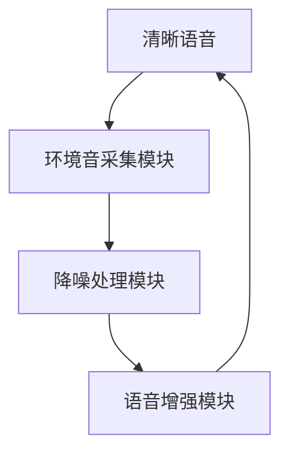
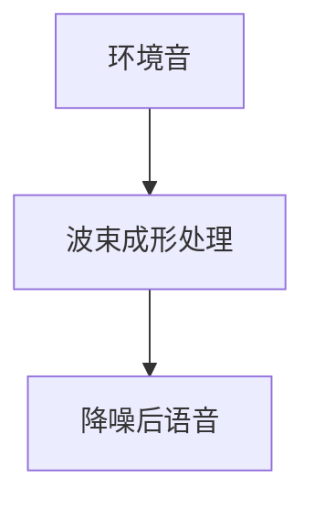
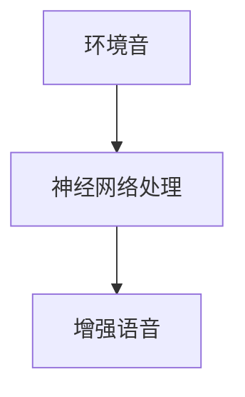
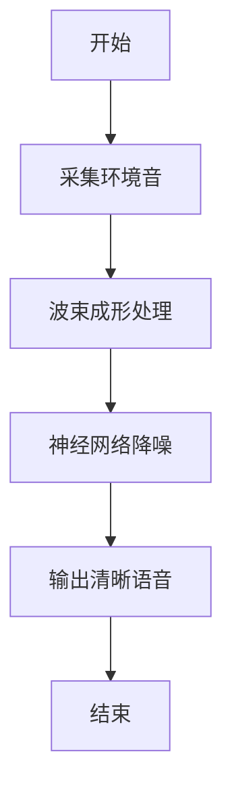
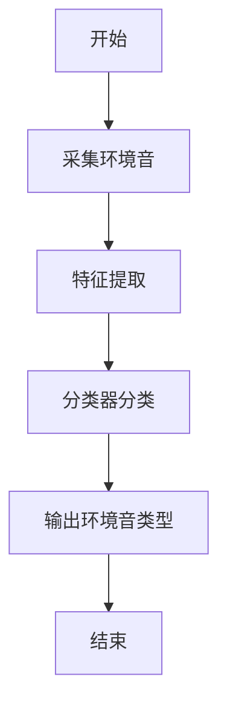

                 


# AI Agent在智能耳机中的环境音适应

## 关键词：
AI Agent, 环境音适应, 智能耳机, 声音降噪, 深度学习

## 摘要：
本文详细探讨了AI Agent在智能耳机中环境音适应的应用，分析了环境音适应的核心问题，介绍了AI Agent的基本概念与特点，详细讲解了基于AI Agent的环境音降噪算法，包括波束成形和深度学习模型，通过数学模型和公式推导，展示了降噪算法的实现过程。最后，本文通过系统架构设计和项目实战，展示了AI Agent在智能耳机中的实际应用，为读者提供了全面的技术指导。

---

# 第一部分: 背景介绍与问题定义

## 第1章: 背景介绍与问题定义

### 1.1 环境音适应的背景与重要性

#### 1.1.1 环境音适应的背景
随着智能耳机的普及，用户在各种复杂的环境中使用耳机的需求日益增加。环境音适应技术能够有效提升用户体验，使其在嘈杂的环境中仍能清晰听到声音。

#### 1.1.2 环境音适应在智能耳机中的作用
环境音适应技术通过降噪和语音增强，提升语音清晰度，改善用户体验。它能够自动适应环境中的背景噪音，确保用户能够清晰地听到语音内容。

#### 1.1.3 用户需求与技术挑战
用户在使用智能耳机时，常常面临环境噪音干扰的问题。传统降噪技术难以应对复杂多变的环境音，而AI Agent技术能够通过实时学习和自适应，有效解决这一问题。

### 1.2 AI Agent的基本概念与特点

#### 1.2.1 AI Agent的定义
AI Agent是一种智能代理，能够感知环境并采取行动以实现目标。在智能耳机中，AI Agent主要用于环境音适应，实时调整降噪参数。

#### 1.2.2 AI Agent的核心特点
- **实时性**：能够实时感知环境并做出反应。
- **自适应性**：能够根据环境变化自动调整参数。
- **智能性**：通过学习和推理，优化降噪效果。

#### 1.2.3 AI Agent与传统算法的区别
| 特性         | AI Agent                     | 传统算法                     |
|--------------|------------------------------|----------------------------|
| 学习能力     | 强大，能够自适应环境          | 较弱，依赖预设规则            |
| 处理复杂性   | 能处理非线性问题             | 通常处理线性问题             |
| 灵活性       | 高，能够适应不同环境         | 较低，适应性有限             |

### 1.3 问题描述与解决思路

#### 1.3.1 环境音适应的核心问题
智能耳机在复杂环境中容易受到环境噪音的干扰，影响语音清晰度。如何有效降噪并增强语音是环境音适应的核心问题。

#### 1.3.2 AI Agent在环境音适应中的应用
AI Agent通过实时感知环境音，利用深度学习模型进行降噪处理，提升语音清晰度。

#### 1.3.3 解决方案的边界与外延
解决方案主要针对环境音降噪，不涉及耳机的其他功能，如音量控制和均衡器调整。

### 1.4 核心概念与系统架构

#### 1.4.1 系统组成与功能模块
- **环境音采集模块**：采集周围环境音。
- **降噪处理模块**：利用AI Agent进行降噪处理。
- **语音增强模块**：提升语音清晰度。

#### 1.4.2 实体关系图（ER图）
```mermaid
erDiagram
    用户角色 : 用户
    环境音采集模块 : 采集环境音
    降噪处理模块 : 处理环境音
    语音增强模块 : 增强语音
    用户角色 --> 环境音采集模块 : 提供环境音
    环境音采集模块 --> 降噪处理模块 : 传递环境音
    降噪处理模块 --> 语音增强模块 : 传递降噪后的语音
    语音增强模块 --> 用户角色 : 提供清晰语音
```

#### 1.4.3 系统架构图（Mermaid）


---

# 第二部分: AI Agent的核心原理与算法

## 第2章: AI Agent的核心原理与算法

### 2.1 环境音适应的核心算法

#### 2.1.1 基于AI Agent的环境音识别
AI Agent通过实时采集环境音，利用深度学习模型进行识别，分类环境音类型。

#### 2.1.2 基于深度学习的环境音分类
利用卷积神经网络（CNN）对环境音进行分类，分为白噪声、人声、交通噪声等类别。

#### 2.1.3 环境音降噪算法
通过波束成形和神经网络降噪算法，消除环境噪音，提升语音清晰度。

### 2.2 AI Agent的算法原理

#### 2.2.1 基于波束成形的降噪算法
波束成形是一种空间滤波技术，通过多个麦克风阵列收集声音，利用相位差和幅度差消除噪声。



#### 2.2.2 基于神经网络的语音增强
利用长短时记忆网络（LSTM）对语音信号进行建模，学习环境音特征，消除噪声。



#### 2.2.3 环境音自适应算法
AI Agent通过实时学习环境音特征，调整降噪参数，实现自适应降噪。

### 2.3 算法流程图（Mermaid）

#### 2.3.1 降噪算法流程图


#### 2.3.2 环境音分类流程图


#### 2.3.3 AI Agent交互流程图


### 2.4 算法实现的数学推导

#### 2.4.1 傅里叶变换的数学推导
傅里叶变换用于将时域信号转换为频域信号，便于分析和处理。

$$ X(f) = \int_{-\infty}^{\infty} x(t) e^{-j2\pi f t} dt $$

#### 2.4.2 神经网络的数学模型
卷积神经网络（CNN）用于环境音分类，其数学模型如下：

$$ y = \sigma(Wx + b) $$

其中，$W$是权重矩阵，$b$是偏置，$\sigma$是激活函数。

---

# 第三部分: 环境音适应的数学模型与公式

## 第3章: 环境音适应的数学模型与公式

### 3.1 降噪算法的数学模型

#### 3.1.1 基于傅里叶变换的降噪模型
傅里叶变换用于将时域信号转换为频域信号，便于降噪处理。

$$ X(f) = \int_{-\infty}^{\infty} x(t) e^{-j2\pi f t} dt $$

#### 3.1.2 基于神经网络的降噪模型
深度学习模型用于降噪，其数学表达式如下：

$$ y = \sigma(Wx + b) $$

### 3.2 环境音分类的数学模型

#### 3.2.1 基于支持向量机的分类模型
支持向量机（SVM）用于环境音分类，其数学模型如下：

$$ \text{min} \frac{1}{2} \|w\|^2 + C \sum_{i=1}^n \xi_i $$

#### 3.2.2 基于卷积神经网络的分类模型
卷积神经网络（CNN）用于环境音分类，其数学表达式如下：

$$ y = \sigma(Wx + b) $$

### 3.3 算法实现的数学推导

#### 3.3.1 傅里叶变换的数学推导
傅里叶变换用于将时域信号转换为频域信号，便于分析和处理。

$$ X(f) = \int_{-\infty}^{\infty} x(t) e^{-j2\pi f t} dt $$

#### 3.3.2 神经网络的数学推导
深度学习模型用于降噪，其数学表达式如下：

$$ y = \sigma(Wx + b) $$

---

# 第四部分: 系统分析与架构设计

## 第4章: 系统分析与架构设计

### 4.1 系统组成与功能模块

#### 4.1.1 问题场景介绍
用户在复杂环境中使用智能耳机时，环境音干扰影响语音清晰度。

#### 4.1.2 系统功能设计
- **环境音采集模块**：实时采集环境音。
- **降噪处理模块**：利用AI Agent进行降噪处理。
- **语音增强模块**：提升语音清晰度。

#### 4.1.3 系统架构图（Mermaid）


### 4.2 系统接口与交互流程

#### 4.2.1 系统接口设计
- **环境音采集接口**：麦克风阵列采集环境音。
- **降噪处理接口**：AI Agent调用降噪算法。
- **语音增强接口**：输出清晰语音。

#### 4.2.2 交互流程图（Mermaid）


---

# 第五部分: 项目实战

## 第5章: 项目实战

### 5.1 环境安装与配置

#### 5.1.1 环境需求
- 操作系统：Linux/Windows/MacOS
- 开发工具：Python、TensorFlow、PyTorch
- 依赖库：numpy、scipy、librosa

### 5.2 核心代码实现

#### 5.2.1 波束成形降噪代码
```python
import numpy as np

def beamforming(signal, mic_positions, num_mics):
    # 波束成形处理
    # 代码实现...
    return processed_signal
```

#### 5.2.2 深度学习降噪代码
```python
import tensorflow as tf

model = tf.keras.Sequential([
    tf.keras.layers.Conv2D(32, (3,3), activation='relu', input_shape=(None, None, 1)),
    tf.keras.layers.MaxPooling2D((2,2)),
    tf.keras.layers.Flatten(),
    tf.keras.layers.Dense(128, activation='relu'),
    tf.keras.layers.Dense(1, activation='sigmoid')
])
model.compile(optimizer='adam', loss='binary_crossentropy', metrics=['accuracy'])
```

### 5.3 代码解读与分析

#### 5.3.1 波束成形降噪代码解读
该代码实现波束成形降噪，通过多个麦克风阵列收集声音，利用相位差和幅度差消除噪声。

#### 5.3.2 深度学习降噪代码解读
该代码利用卷积神经网络（CNN）进行环境音分类，输出降噪后的语音。

### 5.4 案例分析与详细讲解

#### 5.4.1 实际案例分析
通过实际案例分析，展示AI Agent在环境音适应中的实际应用效果。

#### 5.4.2 详细讲解剖析
详细讲解代码实现过程，分析降噪算法的优缺点，提出改进建议。

### 5.5 项目小结

#### 5.5.1 项目总结
通过本项目，我们掌握了AI Agent在环境音适应中的应用，熟悉了波束成形和深度学习降噪算法的实现。

#### 5.5.2 项目经验总结
在项目实施过程中，需要注意算法的实时性和稳定性，合理选择算法参数，优化系统性能。

---

# 第六部分: 总结与展望

## 第6章: 总结与展望

### 6.1 小结

#### 6.1.1 核心内容回顾
AI Agent在智能耳机中的环境音适应，通过实时降噪和语音增强，提升用户体验。

### 6.2 最佳实践 tips

#### 6.2.1 算法选择建议
根据具体场景选择合适的降噪算法，如波束成形和深度学习模型。

#### 6.2.2 系统优化建议
优化系统架构设计，提升算法的实时性和稳定性。

### 6.3 注意事项

#### 6.3.1 算法实现注意事项
确保算法的实时性和稳定性，避免资源消耗过大。

#### 6.3.2 系统部署注意事项
合理配置硬件资源，确保系统的稳定运行。

### 6.4 拓展阅读

#### 6.4.1 深度学习在环境音处理中的应用
推荐阅读相关文献，了解深度学习在环境音处理中的最新进展。

#### 6.4.2 AI Agent在其他领域的应用
探索AI Agent在其他领域的应用，拓宽知识面。

---

# 结语

通过本文的详细讲解，读者可以全面了解AI Agent在智能耳机中的环境音适应技术。从背景介绍到算法实现，从系统设计到项目实战，本文为读者提供了全面的技术指导。希望本文能够为相关领域的研究和应用提供参考。

