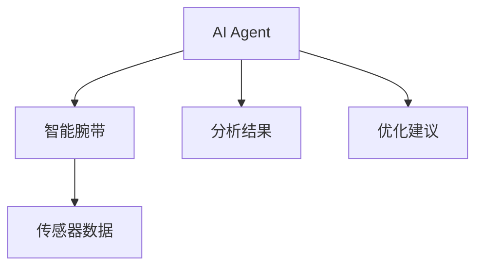
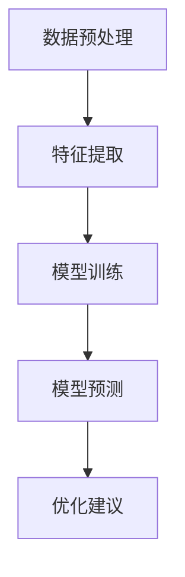
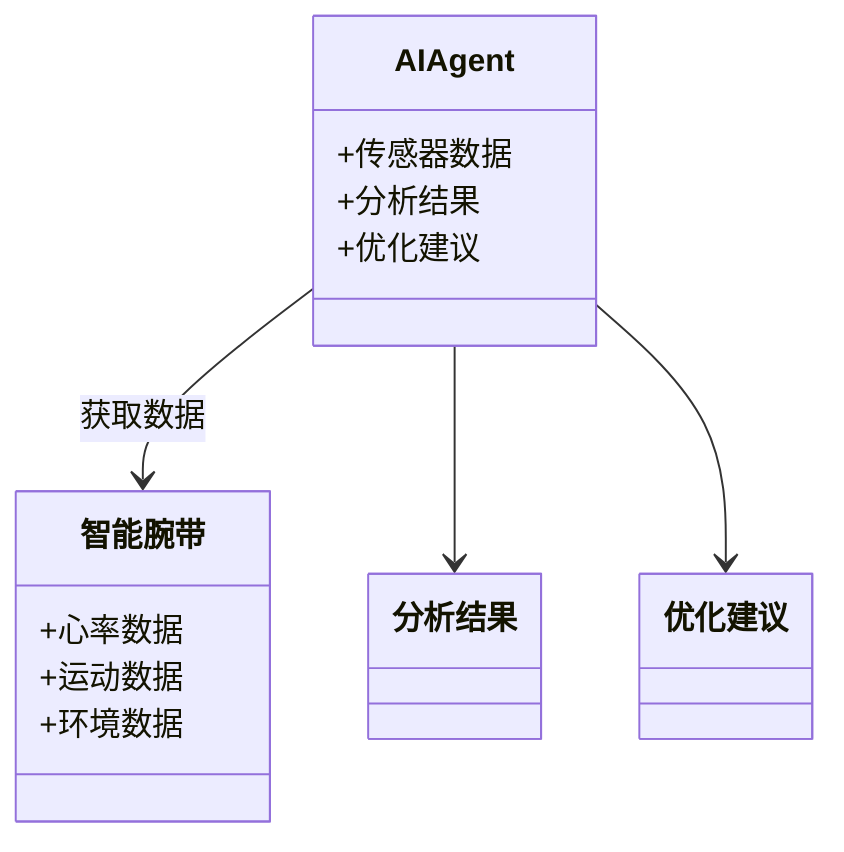

                 


# 《AI Agent在智能腕带中的工作效率监测》

---

## 关键词：AI Agent、智能腕带、工作效率监测、算法原理、系统架构、项目实战

---

## 摘要：  
本文系统地探讨了AI Agent在智能腕带中的工作效率监测应用。通过分析现代工作效率监测的背景与问题，结合AI Agent的核心原理与智能腕带的功能模块，详细阐述了AI Agent在智能腕带中的算法实现、系统架构设计以及实际项目中的应用。文章内容涵盖AI Agent的基本概念、算法原理、系统架构、项目实战和总结，旨在为读者提供全面的技术解析，帮助其理解并掌握AI Agent在智能腕带中的工作效率监测方法。

---

# 第一部分: AI Agent与智能腕带的背景与概念

---

## 第1章: 工作效率监测的背景与问题背景

### 1.1 问题背景

#### 1.1.1 现代工作效率监测的重要性  
在现代职场中，工作效率是衡量个人和团队绩效的重要指标。随着工作压力的增加和工作模式的多样化，如何高效地监测和提升工作效率成为企业和个人的共同需求。工作效率监测不仅有助于优化工作流程，还能帮助员工更好地管理时间和精力，从而提高整体生产力。

#### 1.1.2 传统工作效率监测的局限性  
传统的效率监测方法通常依赖于手动记录、简单的传感器设备或基于时间的任务跟踪工具。这些方法存在以下局限性：  
- 数据采集范围有限，无法全面反映工作状态。  
- 数据分析能力不足，难以提供个性化的改进建议。  
- 缺乏实时性，无法及时反馈员工的工作状态。  

#### 1.1.3 AI Agent在效率监测中的潜力  
AI Agent（人工智能代理）是一种能够感知环境、自主决策并执行任务的智能系统。通过结合智能腕带的传感器数据，AI Agent可以实时分析员工的工作状态，提供个性化的工作效率优化建议。其潜力体现在以下几个方面：  
- 实时数据采集与分析。  
- 个性化反馈与优化建议。  
- 自适应学习能力，能够根据员工的习惯动态调整监测策略。

---

### 1.2 问题描述

#### 1.2.1 工作效率监测的核心目标  
工作效率监测的核心目标是通过实时数据分析，识别影响工作效率的关键因素，并提供有效的解决方案。具体目标包括：  
- 监测员工的工作状态，识别疲劳、压力过大或注意力分散的情况。  
- 分析工作流程中的瓶颈，优化任务分配。  
- 提供个性化的效率提升建议，帮助员工提高生产力。  

#### 1.2.2 智能腕带在工作效率监测中的角色  
智能腕带作为一种可穿戴设备，具备以下功能：  
- 数据采集：通过传感器获取生理数据，如心率、运动量、皮肤温度等。  
- 数据传输：将采集的数据传输到云端或本地系统进行分析。  
- 反馈交互：通过震动、灯光或手机通知的形式，向用户反馈分析结果。  

智能腕带在工作效率监测中的角色主要体现在数据采集和用户反馈两个方面。

#### 1.2.3 AI Agent在智能腕带中的具体应用场景  
AI Agent在智能腕带中的应用场景包括：  
- 实时监测员工的工作状态，识别潜在的工作压力或疲劳。  
- 根据传感器数据，预测工作效率的变化趋势。  
- 提供个性化的提醒和建议，帮助员工调整工作节奏。  

---

### 1.3 问题解决与边界

#### 1.3.1 AI Agent如何解决工作效率监测问题  
AI Agent通过以下方式解决工作效率监测问题：  
- 实时分析传感器数据，识别影响效率的关键因素。  
- 基于历史数据，构建个性化的工作效率模型。  
- 提供实时反馈和优化建议，帮助员工提升效率。  

#### 1.3.2 AI Agent在智能腕带中的边界与限制  
AI Agent在智能腕带中的应用存在以下边界与限制：  
- 数据采集范围有限，无法全面反映工作环境的影响。  
- 算法依赖历史数据，可能无法完全适应突发情况。  
- 隐私问题：传感器数据可能包含敏感信息，需要严格保护。  

#### 1.3.3 AI Agent与智能腕带的结合方式  
AI Agent与智能腕带的结合方式主要包括：  
- 数据采集：AI Agent通过智能腕带获取生理数据和环境信息。  
- 数据分析：AI Agent对数据进行处理和分析，生成工作报告。  
- 用户反馈：AI Agent通过智能腕带向用户发送实时提醒和优化建议。  

---

### 1.4 概念结构与核心要素

#### 1.4.1 AI Agent的定义与核心要素  
AI Agent是一种智能系统，具备以下核心要素：  
- 感知能力：通过传感器获取环境数据。  
- 决策能力：基于数据进行分析和决策。  
- 执行能力：根据决策结果执行相应操作。  

#### 1.4.2 智能腕带的功能模块与数据采集能力  
智能腕带的功能模块包括：  
- 传感器模块：采集心率、运动量、皮肤温度等数据。  
- 数据传输模块：将数据传输到云端或本地系统。  
- 用户反馈模块：通过震动、灯光或通知提醒用户。  

#### 1.4.3 工作效率监测的系统架构与流程  
工作效率监测的系统架构包括：  
1. 数据采集：智能腕带采集员工的生理数据和环境信息。  
2. 数据分析：AI Agent对数据进行处理和分析，识别工作效率的关键因素。  
3. 反馈与优化：系统向用户发送实时提醒和优化建议，帮助员工调整工作状态。  

---

## 第2章: AI Agent与智能腕带的核心概念

### 2.1 AI Agent的基本原理

#### 2.1.1 AI Agent的定义与分类  
AI Agent可以分为以下几类：  
- **简单反射型AI Agent**：基于预设规则进行决策。  
- **基于模型的AI Agent**：通过构建模型进行预测和决策。  
- **学习型AI Agent**：通过机器学习算法不断优化决策策略。  

#### 2.1.2 AI Agent的核心功能与技术特征  
AI Agent的核心功能包括：  
- 数据采集与处理：通过传感器获取数据，并进行清洗和预处理。  
- 数据分析与预测：基于机器学习算法，分析数据并预测工作效率。  
- 自适应调整：根据反馈结果，动态调整监测策略。  

#### 2.1.3 AI Agent在智能腕带中的具体实现方式  
AI Agent在智能腕带中的实现方式包括：  
- 数据采集：通过传感器获取生理数据。  
- 数据分析：基于机器学习算法，分析数据并生成工作报告。  
- 用户反馈：通过震动、灯光或通知提醒用户。  

---

### 2.2 AI Agent与智能腕带的对比分析

#### 2.2.1 AI Agent与传统监测工具的对比  
| 特性                | AI Agent                   | 传统监测工具               |
|---------------------|---------------------------|--------------------------|
| 数据处理能力        | 强大，支持实时分析        | 有限，仅支持简单统计       |
| 自适应能力          | 具备，能够动态调整策略     | 无，基于固定规则           |
| 个性化能力          | 强，支持个性化反馈         | 弱，通常提供通用建议         |

#### 2.2.2 AI Agent与智能腕带的实体关系图  


---

## 第3章: AI Agent的核心算法与实现

### 3.1 AI Agent的核心算法

#### 3.1.1 算法原理概述  
AI Agent的核心算法基于机器学习，主要包括以下步骤：  
1. 数据预处理：清洗和归一化数据。  
2. 特征提取：从传感器数据中提取有效特征。  
3. 模型训练：基于特征数据训练机器学习模型。  
4. 模型预测：利用模型对工作效率进行预测。  

#### 3.1.2 算法实现步骤  


---

### 3.2 算法的数学模型与公式

#### 3.2.1 数据预处理与特征提取  
数据预处理的公式如下：  
$$ x_{\text{processed}} = \frac{x_{\text{raw}} - \mu}{\sigma} $$  
其中，$\mu$ 是原始数据的均值，$\sigma$ 是标准差。  

#### 3.2.2 机器学习模型的构建  
常用的机器学习模型包括线性回归、支持向量机（SVM）和随机森林等。以下是一个简单的线性回归模型：  
$$ y = \beta_0 + \beta_1 x_1 + \beta_2 x_2 + \epsilon $$  
其中，$y$ 是工作效率预测值，$x_1$ 和 $x_2$ 是特征变量，$\beta_0$ 和 $\beta_1$ 是回归系数，$\epsilon$ 是误差项。  

---

## 第4章: AI Agent在智能腕带中的系统架构设计

### 4.1 系统功能设计

#### 4.1.1 系统功能模块  
系统功能模块包括：  
- 数据采集模块：采集传感器数据。  
- 数据分析模块：分析数据并生成工作报告。  
- 用户反馈模块：向用户发送实时提醒和优化建议。  

#### 4.1.2 领域模型图  


---

### 4.2 系统架构设计

#### 4.2.1 系统架构图  


---

## 第5章: 项目实战与应用案例

### 5.1 项目实战

#### 5.1.1 环境安装  
安装Python和必要的库：  
```bash
pip install numpy pandas scikit-learn
```

#### 5.1.2 核心代码实现  
```python
import numpy as np
import pandas as pd
from sklearn.model import LinearRegression

# 数据预处理
def preprocess_data(data):
    data = data.dropna()
    data = (data - data.mean()) / data.std()
    return data

# 模型训练
def train_model(X, y):
    model = LinearRegression()
    model.fit(X, y)
    return model

# 模型预测
def predict_efficiency(model, X):
    return model.predict(X)
```

---

### 5.2 应用案例分析

#### 5.2.1 案例分析  
假设我们有一个员工的工作效率数据，通过AI Agent进行分析，识别出其在下午的工作效率较低。AI Agent会建议员工在下午增加短暂的休息时间，以缓解疲劳。

---

## 第6章: 总结与展望

### 6.1 总结  
本文系统地探讨了AI Agent在智能腕带中的工作效率监测应用，分析了AI Agent的核心原理和系统架构，并通过实际案例展示了其在项目中的应用。AI Agent通过实时数据分析和个性化反馈，能够有效提升工作效率。

### 6.2 展望  
未来，AI Agent在智能腕带中的应用将更加广泛，可能的方向包括：  
- 结合更多传感器数据，提高监测精度。  
- 引入更复杂的机器学习模型，提升预测能力。  
- 优化用户反馈机制，提供更个性化的优化建议。  

---

## 结语  
AI Agent在智能腕带中的应用为工作效率监测提供了新的可能性。通过实时数据分析和个性化反馈，AI Agent能够帮助员工更好地管理时间，提高工作效率，从而为企业和个人带来更大的价值。

