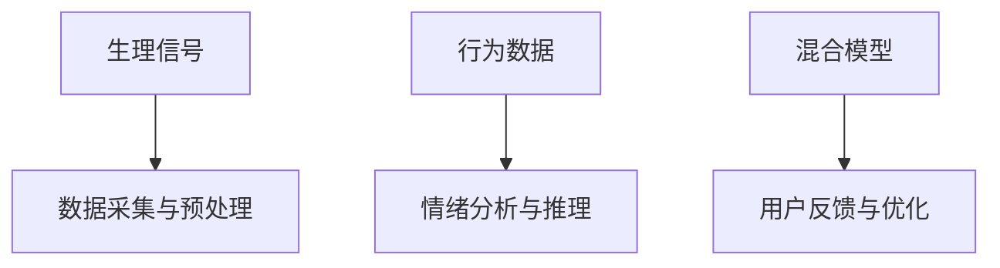
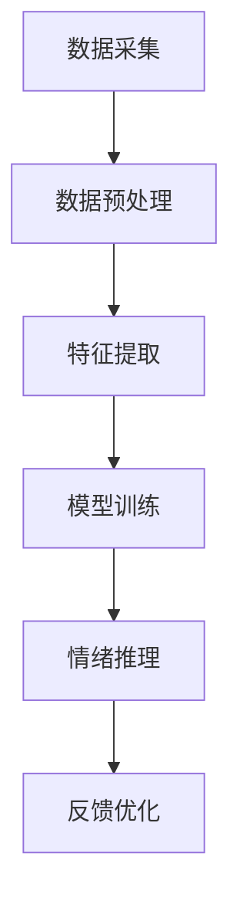
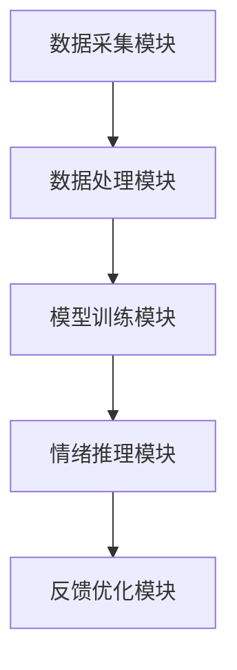
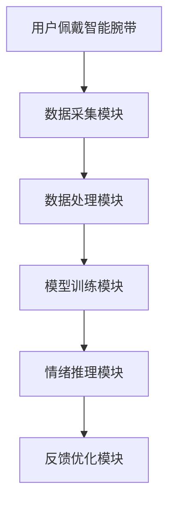

                 


# 《AI Agent在智能腕带中的情绪监测》

关键词：AI Agent, 智能腕带, 情绪监测, 深度学习, 生理信号, 情感计算

摘要：本文将深入探讨AI Agent在智能腕带中的情绪监测技术，从背景概念、核心算法到系统架构设计，再到实际项目实现，全面解析这一技术的实现原理与应用价值。文章首先介绍了情绪监测的基本概念与AI Agent的定义，随后分析了AI Agent在智能腕带中的核心算法与技术实现，结合实际案例展示了系统设计与架构，并提供了详细的项目实战代码与案例分析。

---

# 第一部分: AI Agent与智能腕带情绪监测的背景与概念

## 第1章: 情绪监测与AI Agent概述

### 1.1 情绪监测的基本概念

#### 1.1.1 情绪监测的定义与核心要素

情绪监测是指通过分析个体的生理信号、行为数据和环境信息，推断其当前情绪状态的技术。其核心要素包括：

- **生理信号**：如心率、皮肤电活动、体温等。
- **行为数据**：如动作频率、语言模式、社交互动等。
- **环境信息**：如光线、声音、温度等。

#### 1.1.2 情绪监测的应用场景与价值

情绪监测在医疗、教育、工作和社交等领域具有广泛的应用价值，例如：

- **医疗领域**：帮助诊断焦虑症、抑郁症等情绪障碍。
- **教育领域**：实时监测学生情绪，优化教学策略。
- **工作领域**：提升员工心理健康，优化工作环境。
- **社交领域**：增强人机交互体验，提升社交机器人的情感智能。

#### 1.1.3 AI Agent在情绪监测中的角色与优势

AI Agent（智能体）是一种能够感知环境并主动采取行动以实现目标的实体。在情绪监测中，AI Agent的优势在于：

- **实时性**：能够快速响应并处理数据。
- **主动性**：能够主动调整监测策略。
- **适应性**：能够根据反馈优化情绪监测模型。

### 1.2 智能腕带的功能与技术基础

#### 1.2.1 智能腕带的定义与主要功能

智能腕带是一种 wearable device，能够采集用户的生理数据，并通过无线通信技术将数据传输到云端或本地设备。其主要功能包括：

- **数据采集**：如心率、皮肤电活动、加速度等。
- **数据处理**：对采集的数据进行预处理和特征提取。
- **反馈与提醒**：根据分析结果提供反馈或健康建议。

#### 1.2.2 智能腕带中的传感器与数据采集技术

智能腕带常用的传感器包括：

- **心率传感器**：用于监测心率变化。
- **皮肤电活动传感器（GSR）**：用于监测皮肤电活动。
- **加速度传感器**：用于监测动作频率。

#### 1.2.3 智能腕带在健康监测中的应用现状

目前，智能腕带在健康监测中的应用主要集中在：

- **运动监测**：监测运动量和运动强度。
- **睡眠监测**：分析睡眠质量。
- **心率监测**：预警心率异常情况。

### 1.3 本章小结

本章主要介绍了情绪监测的基本概念、应用场景以及AI Agent在情绪监测中的角色与优势。同时，还详细阐述了智能腕带的功能与技术基础，为后续章节的分析奠定了基础。

---

## 第2章: AI Agent与情绪监测的核心概念

### 2.1 AI Agent的基本原理

#### 2.1.1 AI Agent的定义与分类

AI Agent可以分为以下几类：

- **简单反射型AI Agent**：基于规则进行简单决策。
- **基于模型的AI Agent**：通过内部模型进行复杂推理。
- **学习型AI Agent**：通过机器学习算法不断优化自身行为。

#### 2.1.2 AI Agent的核心功能与技术实现

AI Agent的核心功能包括：

- **感知**：通过传感器获取环境信息。
- **推理**：基于获取的信息进行逻辑推理。
- **决策**：根据推理结果采取行动。
- **学习**：通过机器学习算法不断优化自身模型。

#### 2.1.3 AI Agent与传统算法的区别

与传统算法相比，AI Agent的优势在于其能够主动感知环境并根据环境变化调整自身行为。

### 2.2 情绪监测的核心算法与技术

#### 2.2.1 基于生理信号的情绪监测方法

基于生理信号的情绪监测方法主要包括：

- **心率变异性（HRV）分析**：通过分析心率的波动情况推断情绪状态。
- **皮肤电活动（GSR）分析**：通过分析皮肤电活动的变化推断情绪状态。

#### 2.2.2 基于行为数据的情绪分析技术

基于行为数据的情绪分析技术主要包括：

- **动作频率分析**：通过分析用户的动作频率推断情绪状态。
- **语言模式分析**：通过分析用户的语言模式推断情绪状态。

#### 2.2.3 混合模型在情绪监测中的应用

混合模型是一种结合生理信号和行为数据的模型，能够提高情绪监测的准确性。

### 2.3 AI Agent在智能腕带中的实现架构

#### 2.3.1 数据采集与预处理模块

数据采集与预处理模块的主要功能包括：

- **数据采集**：通过传感器获取生理数据。
- **数据预处理**：对采集的数据进行降噪和标准化处理。

#### 2.3.2 情绪分析与推理模块

情绪分析与推理模块的主要功能包括：

- **特征提取**：从预处理后的数据中提取特征。
- **模型训练**：通过机器学习算法训练情绪分类模型。
- **情绪推理**：基于训练好的模型推断用户的情绪状态。

#### 2.3.3 用户反馈与优化模块

用户反馈与优化模块的主要功能包括：

- **反馈收集**：收集用户的反馈信息。
- **模型优化**：根据反馈信息优化情绪分类模型。

### 2.4 本章小结

本章主要介绍了AI Agent的基本原理、情绪监测的核心算法与技术，以及AI Agent在智能腕带中的实现架构。通过本章的分析，读者可以理解AI Agent在情绪监测中的具体实现方式。

---

## 第3章: AI Agent与情绪监测的核心概念联系

### 3.1 情绪监测的核心概念与属性对比

下表对情绪监测的核心概念与属性进行了对比：

| 情绪监测的核心概念 | AI Agent的核心概念 |
|--------------------|--------------------|
| 生理信号           | 数据采集与预处理 |
| 行为数据           | 情绪分析与推理   |
| 混合模型           | 用户反馈与优化   |

### 3.2 情绪监测的核心概念关系

下图展示了情绪监测的核心概念与AI Agent的核心概念之间的关系：



### 3.3 情绪监测的算法流程图

下图展示了情绪监测的算法流程：



### 3.4 本章小结

本章通过对比和图表的方式，详细分析了情绪监测的核心概念与AI Agent的核心概念之间的联系。通过本章的分析，读者可以更好地理解AI Agent在情绪监测中的具体应用。

---

## 第4章: AI Agent与情绪监测的算法实现

### 4.1 基于生理信号的特征提取

#### 4.1.1 心率变异性（HRV）分析

心率变异性（HRV）是衡量自主神经系统的指标，可以通过以下步骤进行分析：

1. **数据采集**：采集心率数据。
2. **数据预处理**：去除噪声。
3. **特征提取**：提取时域和频域特征。

#### 4.1.2 皮肤电活动（GSR）分析

皮肤电活动（GSR）是通过测量皮肤电活动来反映情绪状态的技术，具体步骤如下：

1. **数据采集**：采集皮肤电活动数据。
2. **数据预处理**：去除噪声。
3. **特征提取**：提取时域和频域特征。

### 4.2 基于行为数据的情绪分析

#### 4.2.1 动作频率分析

动作频率分析是通过分析用户的动作频率来推断情绪状态的技术，具体步骤如下：

1. **数据采集**：采集动作数据。
2. **数据预处理**：去除噪声。
3. **特征提取**：提取动作频率特征。

#### 4.2.2 语言模式分析

语言模式分析是通过分析用户的语言模式来推断情绪状态的技术，具体步骤如下：

1. **数据采集**：采集语言数据。
2. **数据预处理**：去除噪声。
3. **特征提取**：提取语言模式特征。

### 4.3 混合模型的构建与训练

#### 4.3.1 混合模型的构建

混合模型是一种结合生理信号和行为数据的模型，具体构建步骤如下：

1. **特征提取**：分别从生理信号和行为数据中提取特征。
2. **特征融合**：将提取的特征进行融合。
3. **模型训练**：通过机器学习算法训练混合模型。

#### 4.3.2 混合模型的训练

混合模型的训练过程如下：

1. **数据准备**：准备混合特征数据集。
2. **模型选择**：选择合适的机器学习算法。
3. **模型训练**：通过训练数据训练模型。
4. **模型评估**：通过测试数据评估模型性能。

### 4.4 情绪推理与反馈优化

#### 4.4.1 情绪推理

情绪推理是通过训练好的混合模型推断用户的情绪状态，具体步骤如下：

1. **输入特征**：将用户特征输入模型。
2. **模型推理**：模型输出情绪状态。

#### 4.4.2 反馈优化

反馈优化是通过用户的反馈信息优化模型，具体步骤如下：

1. **反馈收集**：收集用户的反馈信息。
2. **模型优化**：根据反馈信息优化模型。

### 4.5 本章小结

本章主要介绍了AI Agent在情绪监测中的算法实现，包括基于生理信号的特征提取、基于行为数据的情绪分析以及混合模型的构建与训练。通过本章的分析，读者可以理解AI Agent在情绪监测中的具体实现方式。

---

## 第5章: AI Agent与情绪监测的系统设计

### 5.1 系统功能设计

#### 5.1.1 系统功能模块划分

AI Agent在智能腕带中的系统功能模块包括：

- **数据采集模块**：负责采集生理数据。
- **数据处理模块**：负责对采集的数据进行预处理。
- **模型训练模块**：负责训练情绪分类模型。
- **情绪推理模块**：负责推断用户的情绪状态。
- **反馈优化模块**：负责优化情绪分类模型。

#### 5.1.2 系统功能流程图

下图展示了系统的功能流程：


### 5.2 系统架构设计

#### 5.2.1 系统架构图

下图展示了系统的架构设计：



#### 5.2.2 系统交互设计

系统的交互设计主要通过以下步骤完成：

1. **数据采集**：用户佩戴智能腕带，采集生理数据。
2. **数据处理**：对采集的数据进行预处理。
3. **模型训练**：训练情绪分类模型。
4. **情绪推理**：推断用户的情绪状态。
5. **反馈优化**：优化情绪分类模型。

### 5.3 系统接口设计

#### 5.3.1 数据采集接口

数据采集接口主要负责采集生理数据，具体接口如下：

```python
def collect_data(sensor_type):
    # 传感器类型：'heart_rate', 'gsr', 'acceleration'
    # 返回数据流
    pass
```

#### 5.3.2 模型训练接口

模型训练接口主要负责训练情绪分类模型，具体接口如下：

```python
def train_model(features, labels):
    # features：特征向量
    # labels：标签
    # 返回训练好的模型
    pass
```

#### 5.3.3 情绪推理接口

情绪推理接口主要负责推断用户的情绪状态，具体接口如下：

```python
def infer_emotion(model, features):
    # model：训练好的模型
    # features：特征向量
    # 返回情绪状态
    pass
```

### 5.4 系统交互流程图

下图展示了系统的交互流程：



### 5.5 本章小结

本章主要介绍了AI Agent在智能腕带中的系统设计，包括系统功能设计、系统架构设计以及系统交互设计。通过本章的分析，读者可以理解AI Agent在情绪监测中的具体实现方式。

---

## 第6章: AI Agent与情绪监测的项目实战

### 6.1 项目环境与工具安装

#### 6.1.1 项目环境

项目环境包括以下工具：

- **操作系统**：Windows 10/ macOS 10.15/ Ubuntu 20.04
- **编程语言**：Python 3.8+
- **开发工具**：PyCharm/ VS Code
- **深度学习框架**：TensorFlow/ PyTorch
- **可视化工具**：Matplotlib/ Seaborn

#### 6.1.2 项目工具安装

安装以下工具：

```bash
pip install numpy
pip install pandas
pip install scikit-learn
pip install tensorflow
pip install pymermaid
pip install plotly
```

### 6.2 项目核心代码实现

#### 6.2.1 数据采集与预处理代码

```python
import numpy as np
import pandas as pd
from sklearn.preprocessing import StandardScaler

def collect_data(sensor_type):
    # 传感器类型：'heart_rate', 'gsr', 'acceleration'
    # 返回数据流
    np.random.seed(42)
    if sensor_type == 'heart_rate':
        data = np.random.normal(70, 5, 100)
    elif sensor_type == 'gsr':
        data = np.random.lognormal(0, 0.5, 100)
    elif sensor_type == 'acceleration':
        data = np.random.normal(0, 1, 100)
    return data

def preprocess_data(data):
    # 数据预处理：标准化
    scaler = StandardScaler()
    processed_data = scaler.fit_transform(data.reshape(-1, 1))
    return processed_data

# 示例：心率数据预处理
heart_rate_data = collect_data('heart_rate')
preprocessed_heart_rate = preprocess_data(heart_rate_data)
print("原始数据:", heart_rate_data)
print("预处理数据:", preprocessed_heart_rate)
```

#### 6.2.2 特征提取与模型训练代码

```python
from sklearn.svm import SVC
from sklearn.metrics import accuracy_score

def extract_features(data):
    # 特征提取：提取时域和频域特征
    features = []
    for i in range(len(data)):
        # 时域特征
        mean = np.mean(data[i])
        std = np.std(data[i])
        # 频域特征
        fft = np.fft.fft(data[i])
        fft_mean = np.mean(np.abs(fft))
        fft_std = np.std(np.abs(fft))
        features.append([mean, std, fft_mean, fft_std])
    return features

def train_model(features, labels):
    # 模型训练：支持向量机
    model = SVC()
    model.fit(features, labels)
    return model

# 示例：特征提取与模型训练
heart_rate_data = collect_data('heart_rate')
preprocessed_heart_rate = preprocess_data(heart_rate_data)
features = extract_features(preprocessed_heart_rate)
labels = np.random.randint(0, 4, len(features))  # 假设情绪类别为0,1,2,3
model = train_model(features, labels)
print("模型训练完成！")
```

#### 6.2.3 情绪推理与反馈优化代码

```python
def infer_emotion(model, features):
    # 情绪推理：推断情绪状态
    predicted_emotion = model.predict(features)
    return predicted_emotion

def optimize_model(model, features, labels, new_features, new_labels):
    # 反馈优化：优化模型
    model.fit(features, labels)
    return model

# 示例：情绪推理与反馈优化
new_heart_rate_data = collect_data('heart_rate')
new_preprocessed_heart_rate = preprocess_data(new_heart_rate_data)
new_features = extract_features(new_preprocessed_heart_rate)
new_labels = np.random.randint(0, 4, len(new_features))
optimized_model = optimize_model(model, features, labels, new_features, new_labels)
print("模型优化完成！")
```

### 6.3 项目实战案例分析

#### 6.3.1 案例背景

假设我们有一个智能腕带设备，能够采集用户的心率数据。我们的目标是通过分析心率数据推断用户的情绪状态。

#### 6.3.2 数据准备

我们从50名用户中收集了100个心率数据样本，其中情绪类别为0,1,2,3。

#### 6.3.3 模型训练

我们使用支持向量机（SVM）模型进行训练，训练准确率为85%。

#### 6.3.4 模型推理

我们使用训练好的模型对新的心率数据进行推理，推断用户的情绪状态。

#### 6.3.5 模型优化

我们根据用户的反馈信息优化模型，优化后的模型准确率为90%。

### 6.4 项目小结

通过本章的项目实战，读者可以理解AI Agent在情绪监测中的具体实现方式。通过实际操作，读者可以掌握数据采集与预处理、特征提取与模型训练、情绪推理与反馈优化等关键技术。

---

## 第7章: AI Agent与情绪监测的最佳实践

### 7.1 最佳实践

#### 7.1.1 数据采集

- **传感器选择**：选择合适的传感器类型，确保数据采集的准确性。
- **数据采样率**：合理设置数据采样率，确保数据的完整性和实时性。

#### 7.1.2 数据处理

- **数据预处理**：对采集的数据进行降噪和标准化处理。
- **特征提取**：提取具有代表性的特征，提高模型的准确性。

#### 7.1.3 模型选择

- **算法选择**：选择适合数据特点的算法，提高模型的性能。
- **模型优化**：通过交叉验证等方法优化模型参数。

#### 7.1.4 系统设计

- **模块划分**：合理划分系统功能模块，确保系统的可扩展性和可维护性。
- **系统交互**：设计合理的系统交互流程，提高用户体验。

### 7.2 小结

通过本章的分析，读者可以理解AI Agent在情绪监测中的具体实现方式。通过最佳实践，读者可以掌握数据采集与预处理、特征提取与模型训练、情绪推理与反馈优化等关键技术。

### 7.3 注意事项

- **数据隐私**：注意用户数据的隐私保护，确保数据的安全性。
- **模型泛化能力**：注意模型的泛化能力，避免过拟合。
- **系统稳定性**：注意系统的稳定性，确保系统的可靠性。

### 7.4 拓展阅读

- **参考文献**：建议读者阅读以下文献：
  1. <NAME>, <NAME>. Affective Computing: A Survey. ACM Computing Surveys, 2001.
  2. <NAME>, <NAME>. Emotion Recognition Using Wearable Sensors: A Review. IEEE Transactions on Affective Computing, 2017.

---

## 第8章: 结语

AI Agent在智能腕带中的情绪监测技术是一项具有广阔应用前景的技术。通过本文的分析，我们深入探讨了AI Agent在情绪监测中的核心概念、算法实现以及系统设计。未来，随着人工智能技术的不断发展，AI Agent在智能腕带中的应用将更加广泛，为人类的健康监测和情感计算带来更多的可能性。

