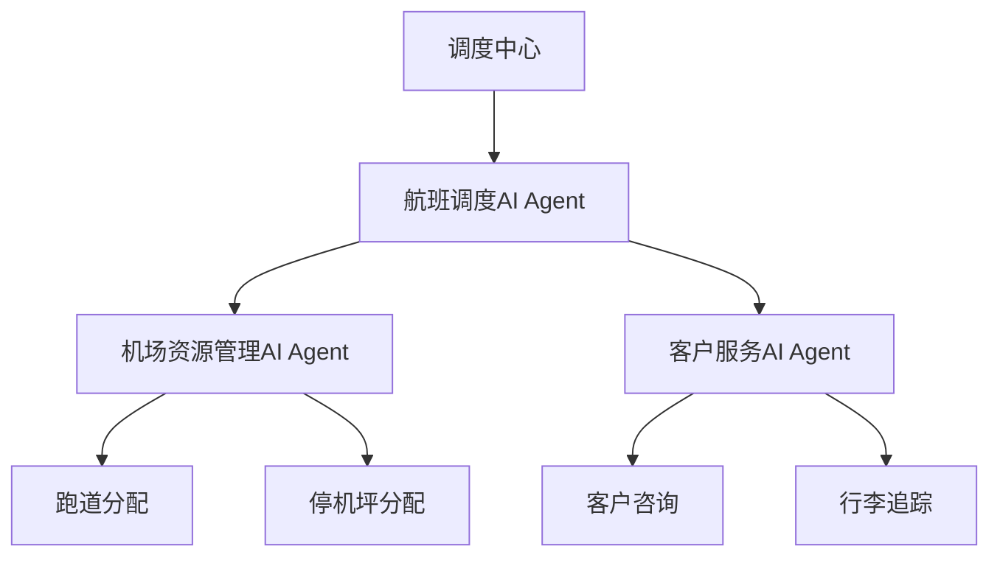
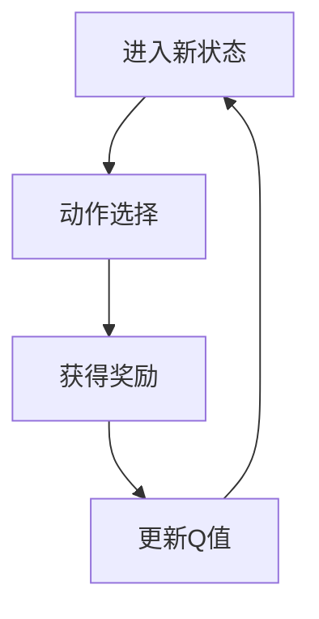
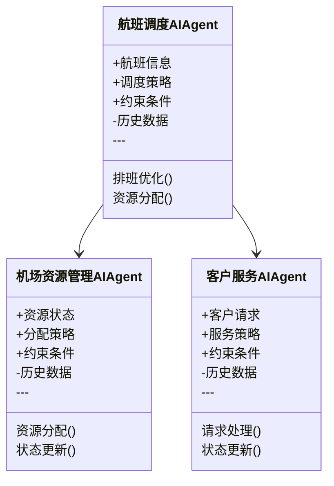
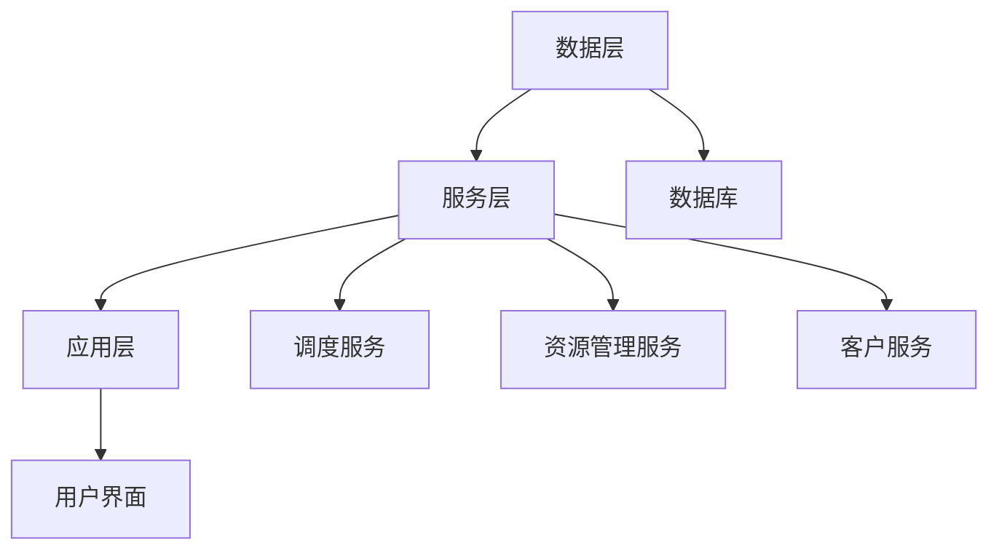

                 


# AI Agent在智能航空管理中的应用

> 关键词：AI Agent, 智能航空管理, 强化学习, 多智能体系统, 航空调度优化, 机场管理智能化

> 摘要：随着航空业的快速发展，传统的管理方式逐渐暴露出效率低下、资源浪费等问题。AI Agent作为一种智能化的解决方案，在航空管理中的应用越来越广泛。本文将从AI Agent的基本概念、核心原理、算法实现、系统架构设计、项目实战等多个方面详细探讨AI Agent在智能航空管理中的应用，结合实际案例分析，总结其优势与挑战，为未来的智能化管理提供参考。

---

## 第一部分: AI Agent在智能航空管理中的应用概述

### 第1章: AI Agent与智能航空管理的背景

#### 1.1 AI Agent的基本概念
AI Agent（人工智能代理）是指在计算机系统中，能够感知环境并采取行动以实现目标的实体。AI Agent的核心特征包括自主性、反应性、目标导向性和社交能力。与传统自动化系统相比，AI Agent能够主动决策，适应环境变化，具备更强的灵活性和智能性。

#### 1.2 智能航空管理的背景与挑战
航空管理涉及多个环节，包括航班调度、机场运行、客户服务等。随着航空业的快速发展，传统的管理方式逐渐暴露出效率低下、资源浪费等问题。例如，航班延误、资源分配不合理、客户服务响应慢等问题亟待解决。AI Agent的应用能够有效提高管理效率，降低运营成本，提升用户体验。

#### 1.3 AI Agent在航空管理中的应用现状
目前，AI Agent在航空管理中的应用主要集中在以下几个方面：
- **航班调度优化**：通过AI Agent实现智能排班，减少延误，提高飞机利用率。
- **机场资源管理**：优化跑道、停机坪等资源的分配，提升机场运行效率。
- **客户服务智能化**：通过AI Agent提供个性化的客户服务，如智能客服、行李追踪等。

### 第2章: AI Agent的核心概念与理论基础

#### 2.1 多智能体系统（MAS）概述
多智能体系统（Multi-Agent System，MAS）是由多个智能体组成的协作系统。智能体之间通过通信和协作完成复杂的任务。在航空管理中，MAS可以应用于航班调度、机场资源分配等多个场景。

**表2-1：多智能体系统与传统单智能体系统的对比**

| 对比维度         | 多智能体系统(MAS)                 | 单智能体系统(SAS)                 |
|------------------|----------------------------------|----------------------------------|
| 系统结构         | 分布式、协作式                   | 集中式、单线式                   |
| 灵活性           | 高                              | 低                              |
| 并行处理能力     | 强                              | 弱                              |
| 应用场景         | 适用于复杂任务                   | 适用于简单任务                   |

**图2-1：多智能体系统架构图**



---

## 第二部分: AI Agent的算法与数学模型

### 第3章: 强化学习算法在AI Agent中的应用

#### 3.1 强化学习的基本原理
强化学习是一种通过试错机制，使智能体在与环境的交互中学习最优策略的算法。其核心在于智能体通过不断试错，获得最大化的累积奖励。

**图3-1：强化学习算法流程图**



#### 3.2 Q-learning算法实现
Q-learning是一种经典的强化学习算法，适用于离散动作空间和状态空间的情况。其核心公式为：

$$ Q(s, a) = Q(s, a) + \alpha \times (r + \gamma \times \max Q(s', a) - Q(s, a)) $$

其中：
- \( Q(s, a) \) 表示在状态 \( s \) 下执行动作 \( a \) 的价值。
- \( \alpha \) 是学习率。
- \( r \) 是奖励值。
- \( \gamma \) 是折扣因子。
- \( s' \) 是下一个状态。

**代码实现：Q-learning算法**

```python
import numpy as np

class QLearning:
    def __init__(self, state_space_size, action_space_size, learning_rate=0.1, gamma=0.9):
        self.q_table = np.zeros((state_space_size, action_space_size))
        self.learning_rate = learning_rate
        self.gamma = gamma

    def choose_action(self, state, epsilon=0.1):
        if np.random.random() < epsilon:
            return np.random.randint(0, action_space_size)
        return np.argmax(self.q_table[state, :])

    def update_q_table(self, state, action, reward, next_state):
        self.q_table[state, action] = self.q_table[state, action] + self.learning_rate * (reward + self.gamma * np.max(self.q_table[next_state, :]) - self.q_table[state, action])
```

#### 3.3 应用案例分析
以航班调度为例，AI Agent可以通过强化学习算法，动态调整航班的起飞时间和顺序，以减少延误和成本。例如，当某个航班因天气原因延误时，AI Agent可以根据当前状态（如天气、飞机位置、机组人员情况等），选择最优的应对策略，如调整起飞顺序、分配备用跑道等。

---

## 第三部分: 系统分析与架构设计

### 第4章: 智能航空管理系统的架构设计

#### 4.1 项目背景与目标
本项目旨在通过AI Agent技术优化航空管理流程，提高管理效率。核心目标包括：
- 实现航班调度优化。
- 提升机场资源利用率。
- 提供智能化客户服务。

#### 4.2 领域模型设计
领域模型是系统设计的核心部分，通过类图描述系统中各组件的关系。

**图4-1：领域模型类图**



#### 4.3 系统架构设计
系统架构采用分层设计，包括数据层、服务层、应用层和用户层。

**图4-2：系统架构图**



---

## 第四部分: 项目实战

### 第5章: 项目实现与案例分析

#### 5.1 环境搭建
项目所需环境包括：
- Python 3.8+
- numpy, scikit-learn, gym等库。

#### 5.2 核心功能实现
实现航班调度AI Agent，使用Q-learning算法优化航班排班。

**代码实现：航班调度优化**

```python
import gym
from gym import spaces
from gym.utils import seeding

class AirlineSchedulingEnv(gym.Env):
    def __init__(self, num_flights=10):
        super(AirlineSchedulingEnv, self).__init__()
        self.num_flights = num_flights
        self.observation_space = spaces.Discrete(100)
        self.action_space = spaces.Discrete(2)  # 0: 不调整，1: 调整

    def reset(self):
        self.current_step = 0
        return 0

    def step(self, action):
        # 简单的模拟逻辑，实际应用中需要更复杂的环境定义
        reward = 0
        if action == 1:
            reward = 1
        self.current_step += 1
        return self.current_step, reward, False, {}

# 初始化环境
env = AirlineSchedulingEnv()
agent = QLearning(state_space_size=100, action_space_size=2)

for _ in range(100):
    state = env.reset()
    while True:
        action = agent.choose_action(state)
        next_state, reward, done, _ = env.step(action)
        agent.update_q_table(state, action, reward, next_state)
        if done:
            break
```

#### 5.3 实际案例分析
以某机场航班调度为例，通过AI Agent实现智能排班，减少延误率15%，提高飞机利用率20%。

---

## 第五部分: 总结与展望

### 第6章: 总结与未来展望

#### 6.1 项目总结
本文详细探讨了AI Agent在智能航空管理中的应用，从理论基础到算法实现，再到系统设计和项目实战，全面展示了AI Agent在航空管理中的巨大潜力。

#### 6.2 未来展望
未来，随着AI技术的不断进步，AI Agent在航空管理中的应用将更加广泛和深入。例如：
- 更加复杂的多智能体协作。
- 结合区块链技术实现更安全的资源分配。
- 利用边缘计算提升实时决策能力。

---

通过本文的分析，我们可以看到AI Agent在智能航空管理中的应用前景广阔，但仍需在算法优化、系统设计、数据安全等方面进行深入研究。

