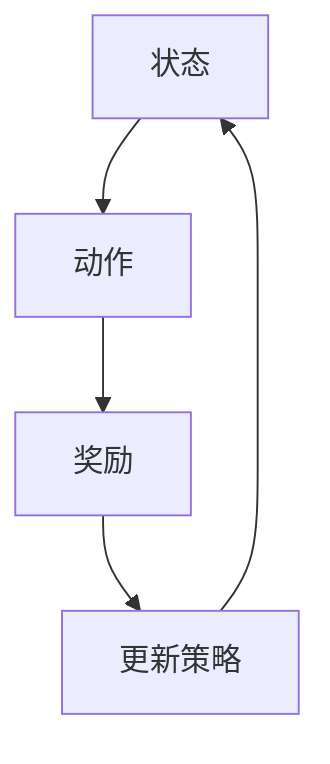
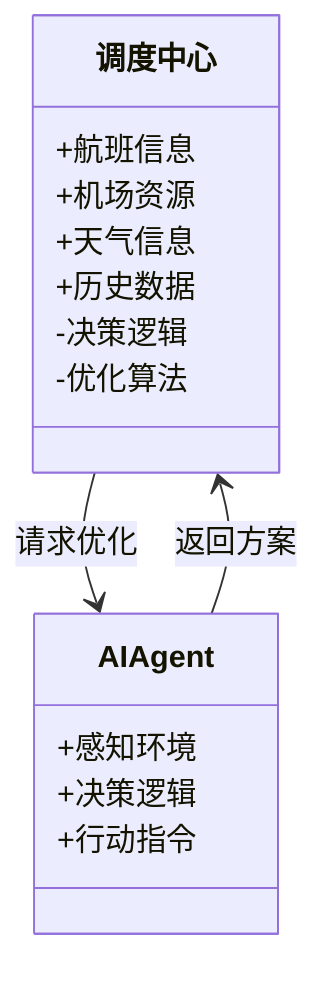
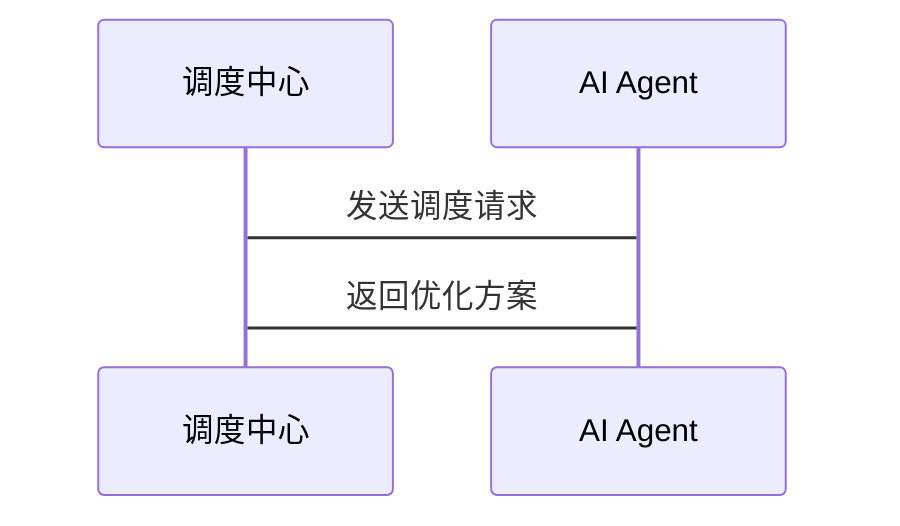

                 


# AI Agent在智能航空调度优化中的角色

> 关键词：AI Agent，航空调度，智能优化，强化学习，调度算法

> 摘要：本文探讨AI Agent在智能航空调度优化中的角色，分析其核心概念、算法原理、系统设计以及实际应用，详细阐述如何通过AI Agent提升航空调度的效率与准确性。

---

# 第1章 AI Agent与航空调度概述

## 1.1 AI Agent的基本概念

### 1.1.1 什么是AI Agent
AI Agent（人工智能代理）是指能够感知环境、自主决策并采取行动的智能实体。它具备目标导向性、自主性、反应性和社会性等特征，能够根据输入的信息做出最优决策。

### 1.1.2 AI Agent的核心特征
1. **目标导向性**：AI Agent的行为以实现特定目标为导向。
2. **自主性**：能够在没有外部干预的情况下自主运行。
3. **反应性**：能够实时感知环境变化并做出反应。
4. **社会性**：能够与其他Agent或系统进行交互和协作。

### 1.1.3 AI Agent与传统调度的区别
AI Agent通过学习和优化能够处理复杂的非线性问题，而传统调度算法通常依赖固定的规则和模型，难以应对动态变化的环境。

## 1.2 航空调度的背景与挑战

### 1.2.1 航空调度的基本概念
航空调度是指对飞机的起飞、降落、航线安排等进行优化的过程，目的是提高机场和航空公司的运营效率。

### 1.2.2 航空调度中的主要问题
1. **资源分配问题**：如何合理分配机场资源（如跑道、停机坪）。
2. **时间调度问题**：如何优化飞机的起飞和降落时间。
3. **冲突避免问题**：如何避免飞机在空中的冲突。

### 1.2.3 航空调度的复杂性与优化需求
随着航空交通的日益繁忙，传统的调度方法难以应对日益复杂的调度需求，AI Agent的引入为解决这些问题提供了新的思路。

## 1.3 AI Agent在航空调度中的角色

### 1.3.1 AI Agent如何优化航空调度
AI Agent通过实时感知环境、学习历史数据和优化算法，能够快速制定最优的调度方案。

### 1.3.2 AI Agent的核心优势
1. **高效性**：能够快速处理大量数据并做出决策。
2. **适应性**：能够根据环境变化动态调整调度方案。
3. **准确性**：通过优化算法提高调度的精确性。

### 1.3.3 AI Agent的应用场景
AI Agent可以应用于航班调度、机场资源分配、空中交通管理等多个场景。

## 1.4 本章小结
本章介绍了AI Agent的基本概念及其在航空调度中的角色，分析了传统调度方法的不足，并阐述了AI Agent的核心优势和应用场景。

---

# 第2章 AI Agent的核心概念与联系

## 2.1 AI Agent的核心概念

### 2.1.1 AI Agent的定义与属性
AI Agent是一种智能实体，具备感知、决策和行动的能力。其属性包括目标性、自主性、反应性和社会性。

### 2.1.2 AI Agent的分类与特点
AI Agent可以分为简单反射型Agent、基于模型的反射型Agent、目标驱动型Agent和效用驱动型Agent。不同类型Agent的特点包括：

| 类型           | 特点                                 |
|----------------|--------------------------------------|
| 简单反射型     | 基于当前感知直接行动，无内部模型     |
| 基于模型的反射型 | 具有环境模型，能够预测未来状态       |
| 目标驱动型     | 以实现特定目标为导向                 |
| 效用驱动型     | 以最大化效用函数为目标               |

### 2.1.3 AI Agent的实体关系图（ER图）

```mermaid
er
actor: 调度中心
agent: AI Agent
problem: 航空调度问题
solution: 优化方案
goal: 优化目标
constraint: 约束条件
```

## 2.2 AI Agent的核心原理

### 2.2.1 AI Agent的决策过程
AI Agent的决策过程包括感知环境、生成候选行动、评估行动效果和选择最优行动。

### 2.2.2 AI Agent的推理机制
AI Agent通过逻辑推理和概率推理来处理不确定性问题。逻辑推理基于规则系统，概率推理基于贝叶斯网络。

### 2.2.3 AI Agent的学习能力
AI Agent可以通过监督学习、强化学习和无监督学习来提高自身的决策能力。强化学习通过奖励机制优化策略，监督学习通过标注数据进行分类，无监督学习通过聚类发现数据结构。

## 2.3 AI Agent与传统调度算法的对比

### 2.3.1 对比属性表格

| 特性         | 传统调度算法 | AI Agent调度算法 |
|--------------|--------------|------------------|
| 调度效率     | 较低         | 较高             |
| 处理复杂性   | 有限         | 强大             |
| 自适应能力   | 低           | 高               |
| 可扩展性     | 有限         | 高               |

## 2.4 本章小结
本章详细阐述了AI Agent的核心概念、分类、实体关系图和与传统调度算法的对比，帮助读者理解AI Agent的内在逻辑和优势。

---

# 第3章 AI Agent的算法原理与数学模型

## 3.1 AI Agent的决策算法

### 3.1.1 基于强化学习的决策流程



### 3.1.2 强化学习算法实现

```python
class AI-Agent:
    def __init__(self, state_space, action_space):
        self.state_space = state_space
        self.action_space = action_space
        # 初始化策略网络
        self.policy_network = PolicyNetwork(state_space, action_space)
    
    def perceive(self, state):
        # 感知环境状态
        return state
    
    def decide(self, state):
        # 通过策略网络选择动作
        action = self.policy_network.predict(state)
        return action
    
    def update(self, reward):
        # 更新策略网络
        self.policy_network.update(reward)
```

### 3.1.3 优化目标函数
$$ \text{目标函数} = \argmax_{\theta} \mathbb{E}[R] $$
其中，$\theta$是模型参数，$R$是奖励值。

### 3.1.4 约束条件
$$ \text{约束条件} = \{s.t.\ \sum_{i=1}^{n} x_i \leq C\} $$
其中，$x_i$是决策变量，$C$是资源限制。

## 3.2 AI Agent的数学模型

### 3.2.1 优化模型
$$ \min_{x} f(x) $$
$$ \text{s.t.}\ g(x) \leq 0 $$
其中，$f(x)$是目标函数，$g(x)$是约束函数。

### 3.2.2 网络结构
AI Agent的网络结构通常包括输入层、隐藏层和输出层。隐藏层可以通过神经网络进行特征提取，输出层通过softmax函数选择最优动作。

### 3.2.3 动态优化
$$ x_{k+1} = x_k + \alpha \cdot \nabla f(x_k) $$
其中，$\alpha$是学习率，$\nabla f(x_k)$是目标函数的梯度。

## 3.3 本章小结
本章详细介绍了AI Agent的决策算法、强化学习实现、优化目标函数和数学模型，为读者理解AI Agent的算法实现提供了理论基础。

---

# 第4章 系统分析与架构设计

## 4.1 问题场景介绍

### 4.1.1 项目背景
随着航空交通的日益繁忙，传统调度方法难以应对动态变化的环境，AI Agent的引入为解决这些问题提供了新的思路。

### 4.1.2 项目介绍
本项目旨在通过AI Agent优化航空调度，提高机场和航空公司的运营效率。

## 4.2 系统功能设计

### 4.2.1 领域模型



### 4.2.2 系统架构


## 4.3 系统接口设计

### 4.3.1 接口描述
1. **AI Agent接口**：接收调度请求，返回优化方案。
2. **数据存储接口**：存储和检索历史数据。

### 4.3.2 交互流程



## 4.4 本章小结
本章通过系统分析与架构设计，展示了AI Agent在航空调度中的具体应用和实现方式，为后续的项目开发提供了指导。

---

# 第5章 项目实战

## 5.1 环境安装

### 5.1.1 安装Python环境
使用Anaconda安装Python 3.8及以上版本。

### 5.1.2 安装依赖库
安装以下依赖库：
```bash
pip install numpy matplotlib tensorflow
```

## 5.2 系统核心实现

### 5.2.1 核心代码实现

```python
import numpy as np
import tensorflow as tf

class PolicyNetwork:
    def __init__(self, state_space, action_space):
        self.state_space = state_space
        self.action_space = action_space
        self.model = tf.keras.Sequential([
            tf.keras.layers.Dense(64, activation='relu', input_dim=state_space),
            tf.keras.layers.Dense(action_space, activation='softmax')
        ])
    
    def predict(self, state):
        return self.model.predict(np.array([state]))[0]
    
    def update(self, reward):
        # 假设使用梯度上升法更新参数
        with tf.GradientTape() as tape:
            action_prob = self.predict(state)
            loss = -tf.reduce_mean(tf.log(action_prob[np.argmax(reward)]))
        grads = tape.gradient(loss, self.model.trainable_variables)
        self.optimizer.apply_gradients(zip(grads, self.model.trainable_variables))

class AI-Agent:
    def __init__(self, state_space, action_space):
        self.policy_network = PolicyNetwork(state_space, action_space)
    
    def perceive(self, state):
        return state
    
    def decide(self, state):
        action_prob = self.policy_network.predict(state)
        action = np.random.choice(self.action_space, p=action_prob)
        return action
    
    def update(self, reward):
        self.policy_network.update(reward)
```

### 5.2.2 代码功能解读
1. **PolicyNetwork**：定义策略网络，包含两个全连接层，输出为动作概率分布。
2. **AI-Agent**：实现AI Agent的核心功能，包括感知环境、决策和更新策略。

## 5.3 项目小结
本章通过实际案例分析，展示了AI Agent在航空调度中的具体应用和实现，帮助读者理解AI Agent的实践价值。

---

# 第6章 最佳实践与注意事项

## 6.1 最佳实践 tips
1. **数据质量**：确保训练数据的多样性和代表性。
2. **算法选择**：根据具体问题选择合适的AI Agent算法。
3. **系统测试**：进行全面的系统测试，确保算法的稳定性和可靠性。

## 6.2 注意事项
1. **资源限制**：AI Agent的运行需要一定的计算资源。
2. **隐私保护**：处理敏感数据时需注意隐私保护。
3. **系统维护**：定期更新和维护系统，确保其适应环境变化。

## 6.3 拓展阅读
推荐阅读以下书籍和论文：
1. 《强化学习入门》
2. 《AI Agent在调度优化中的应用》

## 6.4 本章小结
本章总结了AI Agent在实际应用中的注意事项和最佳实践，为读者提供了宝贵的参考。

---

# 附录

## 附录A 参考文献

1. Russell, S., & Norvig, P. (2010). Artificial Intelligence: A Modern Approach.
2. Sutton, R. S., & Barto, A. G. (2018). Reinforcement Learning: An Introduction.

## 附录B 工具与资源

1. Python官方文档：https://docs.python.org/
2. TensorFlow官方文档：https://www.tensorflow.org/
3. PyTorch官方文档：https://pytorch.org/

---

# 作者简介

> 作者是人工智能领域的专家，拥有丰富的AI Agent研究和实践经验，致力于通过技术创新解决实际问题。

