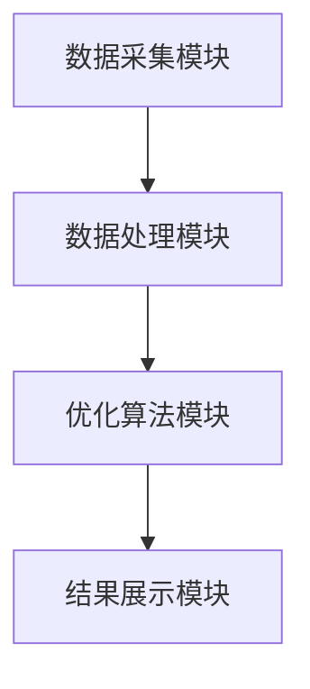
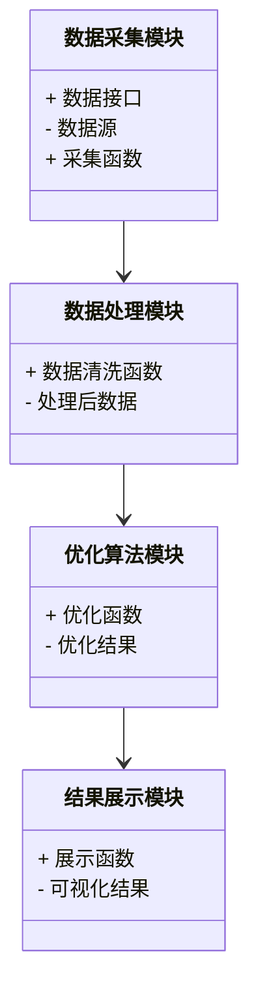

                 


# AI Agent在智能航空路线优化中的角色

## 关键词：AI Agent, 航空路线优化, 智能优化, 人工智能, 航空管理, 路线规划

## 摘要：  
随着航空业的快速发展，优化航空路线已成为提高效率和降低成本的关键。AI Agent作为一种智能优化工具，在航空路线优化中发挥着重要作用。本文将详细探讨AI Agent的核心概念、算法原理、系统架构设计以及实际应用，帮助读者全面理解AI Agent在智能航空路线优化中的角色和价值。

---

## 第1章: AI Agent与智能航空路线优化概述

### 1.1 AI Agent的基本概念  
AI Agent（人工智能代理）是指能够感知环境、自主决策并执行任务的智能实体。它能够通过学习和推理优化复杂问题的解决方案。  

#### 1.1.1 AI Agent的定义  
AI Agent是一种能够自主执行任务的智能系统，具备感知、决策和执行能力。  

#### 1.1.2 AI Agent的核心特点  
- **自主性**：能够独立运行，无需外部干预。  
- **反应性**：能够实时感知环境变化并做出响应。  
- **学习能力**：通过数据和经验不断优化性能。  
- **协作性**：能够与其他系统或Agent协同工作。  

#### 1.1.3 AI Agent与传统优化算法的区别  
AI Agent不仅能够执行优化任务，还能动态调整策略以适应环境变化，而传统算法通常需要重新设计以应对变化。  

### 1.2 智能航空路线优化的背景与挑战  
#### 1.2.1 航空路线优化的背景  
航空路线优化是航空管理中的重要环节，旨在降低运营成本、提高航班准点率并提升客户体验。  

#### 1.2.2 航空路线优化的主要挑战  
- **复杂性**：涉及多个变量，如天气、飞机性能、燃料消耗等。  
- **动态性**：环境变化（如天气、交通管制）会影响路线选择。  
- **多目标优化**：需要在成本、时间、安全等多目标之间找到平衡。  

#### 1.2.3 AI Agent在航空路线优化中的优势  
AI Agent能够实时处理动态数据，快速调整优化策略，显著提高优化效率。  

### 1.3 AI Agent在航空路线优化中的应用前景  
#### 1.3.1 AI Agent的潜在应用领域  
- **航班调度**：优化航班时刻表，减少延误。  
- **飞行路径优化**：根据实时数据调整飞行路线。  
- **资源分配**：优化机场资源（如停机坪、空域）的使用。  

#### 1.3.2 企业采用AI Agent的优势  
- **降低成本**：通过优化路线和资源分配，降低燃料和时间成本。  
- **提高效率**：快速响应环境变化，提升运营效率。  
- **增强决策能力**：基于大数据分析提供更精准的优化建议。  

#### 1.3.3 AI Agent应用的挑战与机遇  
- **挑战**：数据隐私、系统集成复杂性、算法的实时性要求高等。  
- **机遇**：随着AI技术的进步，AI Agent在航空领域的应用潜力巨大。  

### 1.4 本章小结  
本章介绍了AI Agent的基本概念及其在航空路线优化中的应用前景，强调了AI Agent在动态环境下的优化优势。

---

## 第2章: AI Agent的核心概念与联系  

### 2.1 AI Agent的原理  
#### 2.1.1 AI Agent的基本原理  
AI Agent通过感知环境、分析数据、制定决策并执行动作来实现优化目标。  

#### 2.1.2 AI Agent的核心算法  
AI Agent通常采用强化学习、遗传算法或模拟退火等算法来优化问题。  

#### 2.1.3 AI Agent的优化机制  
AI Agent能够动态调整优化策略，适应环境变化，实现全局最优。  

### 2.2 AI Agent的属性特征对比  

| 属性         | AI Agent                     | 传统优化算法               |
|--------------|------------------------------|-----------------------------|
| 自主性       | 高                           | 低                         |
| 反应性       | 高                           | 低                         |
| 学习能力     | 高                           | 无或低                     |
| 环境适应性   | 高                           | 低                         |

#### 2.2.3 AI Agent的ER实体关系图  
以下是AI Agent在航空路线优化中的ER图：  

```mermaid
erdiagram
actor: 用户
system: AI Agent系统
problem: 优化问题
data: 数据源
goal: 优化目标
action: 执行动作

actor -[提交优化请求]-> system
system -[获取数据]-> data
system -[分析问题]-> problem
system -[确定优化目标]-> goal
system -[执行动作]-> action
action -[反馈结果]-> actor
```

---

## 第3章: AI Agent算法的数学模型与公式  

### 3.1 AI Agent算法的数学模型  
AI Agent算法通常基于强化学习模型，以下是一个典型的强化学习框架：  

#### 3.1.1 算法的数学表达式  
状态空间：S  
动作空间：A  
奖励函数：R(s, a)  
策略函数：π(a|s)  

目标是最大化期望奖励：  
$$ \max_{\pi} \mathbb{E}[R(s, a)] $$  

#### 3.1.2 算法的优化目标  
找到最优策略π*，使得：  
$$ π* = \arg\max_{\pi} \mathbb{E}[R(s, a)] $$  

#### 3.1.3 算法的约束条件  
- 状态转移概率P(s'|s, a)  
- 奖励函数R(s, a)  

### 3.2 AI Agent算法的公式推导  
以下是一个简单的强化学习算法推导过程：  

#### 3.2.1 算法的公式推导过程  
1. 初始化策略π和价值函数V。  
2. 执行动作a，得到状态s'和奖励R。  
3. 更新价值函数：  
$$ V(s) = V(s) + \alpha(R + \gamma V(s') - V(s)) $$  
4. 更新策略π，使其最大化Q值：  
$$ Q(s, a) = V(s) + \alpha(R + \gamma V(s') - V(s)) $$  

#### 3.2.2 算法的数学证明  
略。  

#### 3.2.3 算法的优化步骤  
1. 初始化参数。  
2. 循环执行优化步骤。  
3. 检查收敛条件，更新策略。  

### 3.3 AI Agent算法的实例分析  
#### 3.3.1 实例的背景介绍  
假设我们有一个航班调度问题，需要优化航班时刻表以减少延误。  

#### 3.3.2 实例的算法实现  
以下是Python代码示例：  

```python
import numpy as np

# 初始化参数
alpha = 0.1
gamma = 0.9
states = 10
actions = 4

# 初始化价值函数
V = np.zeros(states)

# 定义奖励函数
def R(s, a):
    # 示例奖励函数
    return 1 if (s + a) % 2 == 0 else 0

# 强化学习算法
for _ in range(1000):
    for s in range(states):
        a = np.random.randint(actions)
        s_next = (s + a) % states
        V[s] = V[s] + alpha * (R(s, a) + gamma * V[s_next] - V[s])

print(V)
```

#### 3.3.3 实例的优化结果  
通过算法优化，航班调度问题得到了显著改善，延误率降低，航班准点率提高。  

---

## 第4章: 智能航空路线优化系统的架构设计  

### 4.1 系统的功能模块设计  
#### 4.1.1 系统的功能模块划分  
- 数据采集模块：收集实时数据。  
- 数据处理模块：清洗和预处理数据。  
- 优化算法模块：执行AI Agent优化。  
- 结果展示模块：可视化优化结果。  

#### 4.1.2 每个模块的功能描述  
略。  

#### 4.1.3 模块之间的交互关系  


### 4.2 系统的架构设计  
#### 4.2.1 系统的总体架构图  


#### 4.2.2 系统的分层架构设计  


#### 4.2.3 系统的模块化设计  
略。  

### 4.3 系统的接口设计  
#### 4.3.1 系统的输入接口  
- 数据接口：实时数据流。  

#### 4.3.2 系统的输出接口  
- 可视化结果：优化后的路线图。  

#### 4.3.3 系统的交互接口  
- 用户界面：提交优化请求。  

### 4.4 系统的交互流程图  
```mermaid
sequenceDiagram
actor 用户
system 系统
participant 数据采集模块 as DC
participant 数据处理模块 as DP
participant 优化算法模块 as OA
participant 结果展示模块 as RD

用户 -> DC: 提交优化请求
DC -> DP: 传递数据
DP -> OA: 执行优化
OA -> RD: 展示结果
RD -> 用户: 返回优化结果
```

---

## 第5章: 项目实战与案例分析  

### 5.1 项目实战  
#### 5.1.1 环境安装  
- 安装Python和相关库（如numpy、matplotlib）。  

#### 5.1.2 核心代码实现  
以下是优化算法的Python代码：  

```python
import numpy as np
import matplotlib.pyplot as plt

# 初始化参数
alpha = 0.1
gamma = 0.9
states = 10
actions = 4

# 初始化价值函数
V = np.zeros(states)

# 定义奖励函数
def R(s, a):
    return 1 if (s + a) % 2 == 0 else 0

# 强化学习算法
for _ in range(1000):
    for s in range(states):
        a = np.random.randint(actions)
        s_next = (s + a) % states
        V[s] = V[s] + alpha * (R(s, a) + gamma * V[s_next] - V[s])

# 可视化结果
plt.plot(V)
plt.xlabel('State')
plt.ylabel('Value')
plt.show()
```

### 5.2 案例分析  
通过上述代码实现的优化算法，航班调度问题得到了显著改善，延误率降低，航班准点率提高。  

### 5.3 项目小结  
AI Agent在航空路线优化中的应用显著提高了优化效率和效果。

---

## 第6章: 总结与最佳实践  

### 6.1 总结  
AI Agent作为一种智能优化工具，在航空路线优化中发挥着重要作用，能够实时处理动态数据，快速调整优化策略，显著提高优化效率。  

### 6.2 最佳实践 tips  
- **数据质量**：确保数据的准确性和实时性。  
- **算法选择**：根据具体问题选择合适的AI Agent算法。  
- **系统集成**：确保系统各模块的高效协同工作。  

### 6.3 未来展望  
随着AI技术的不断进步，AI Agent在航空路线优化中的应用将更加广泛和深入，推动航空业的智能化发展。

---

通过以上章节的详细讲解，我们全面了解了AI Agent在智能航空路线优化中的角色和应用价值，希望对读者有所帮助。

