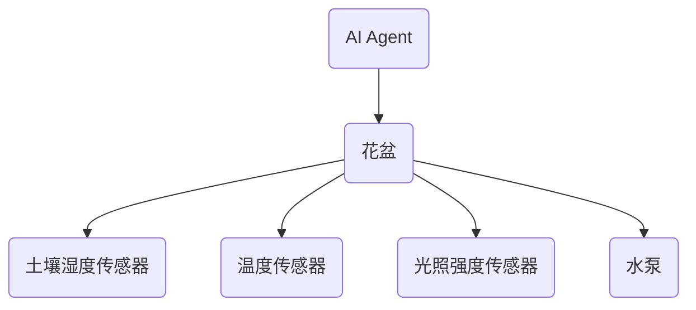
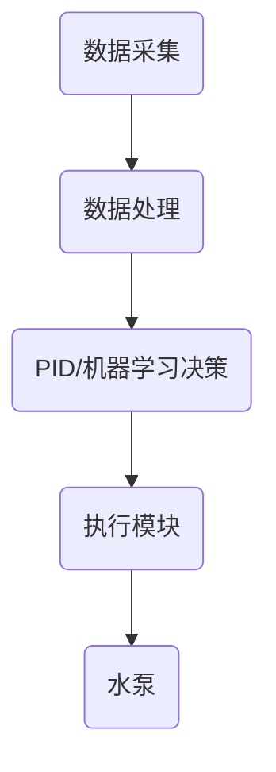
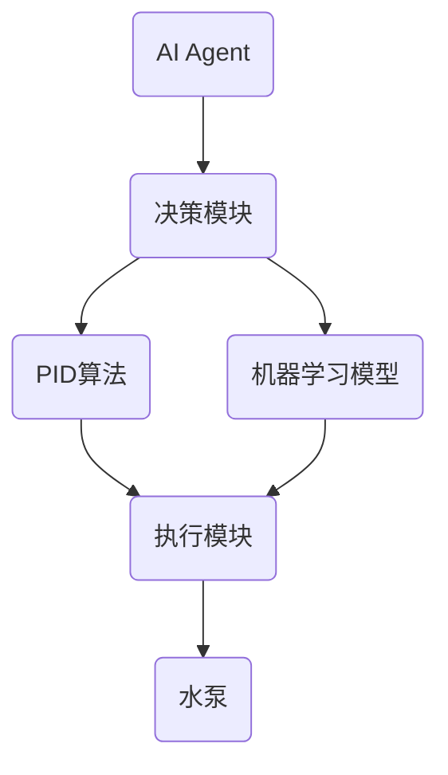
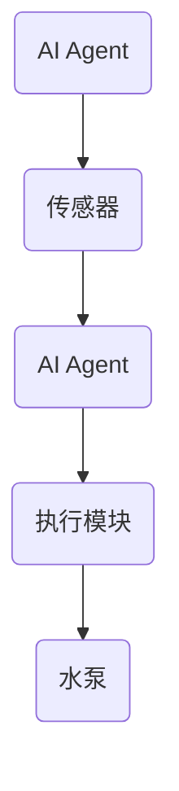

                 


# AI Agent在智能花盆中的自动浇水系统

> 关键词：AI Agent，智能花盆，自动浇水，PID控制，机器学习，物联网

> 摘要：本文详细介绍了AI Agent在智能花盆自动浇水系统中的应用。通过分析背景、核心概念、算法原理、系统架构和项目实战，阐述了如何利用AI Agent实现智能浇水。文章结合理论与实践，为读者提供了从设计到实现的完整指导。

---

# 第1章: 背景介绍与问题分析

## 1.1 问题背景

### 1.1.1 智能花盆的背景与现状

智能花盆近年来备受关注，尤其是在城市化进程中，人们越来越重视室内植物的养护。传统的浇水方式依赖人工操作，容易因疏忽导致植物缺水或过水。随着物联网和AI技术的发展，智能花盆逐渐普及，其核心功能之一就是自动浇水。

### 1.1.2 自动浇水系统的必要性

人工浇水存在以下问题：
1. **易遗忘**：用户可能忘记按时浇水。
2. **水量不均**：不同植物的需水量不同，人工操作难以精确控制。
3. **效率低下**：对于多盆植物，人工浇水耗时费力。

自动浇水系统通过传感器和AI Agent实现智能化管理，解决了上述问题。

### 1.1.3 AI Agent在智能花盆中的作用

AI Agent（智能代理）通过感知环境数据（如土壤湿度、光照强度等），结合历史数据和当前状态，做出浇水决策，实现精准控制。

## 1.2 问题描述

### 1.2.1 花盆浇水的痛点分析

- 植物种类多样，需水量差异大。
- 环境因素复杂，如温度、湿度、光照等。
- 系统需要实时感知和快速响应。

### 1.2.2 用户需求与期望

- 精准控制浇水时间与量。
- 系统具备自我学习能力，适应不同植物需求。
- �易用性强，操作简单。

### 1.2.3 系统设计的目标与边界

目标：
1. 实现智能化浇水，减少人工干预。
2. 提高浇水效率，避免浪费。
3. 系统具备自我优化能力。

边界：
- 仅针对室内植物。
- 仅支持本地部署，不考虑远程控制。

## 1.3 问题解决思路

### 1.3.1 AI Agent的核心作用

AI Agent作为系统的核心，负责数据采集、决策制定和执行控制。

### 1.3.2 自动化浇水的实现路径

1. **数据采集**：土壤湿度、光照强度、温度等传感器数据。
2. **数据处理**：分析数据，判断是否需要浇水。
3. **决策制定**：基于规则或机器学习模型做出决策。
4. **执行控制**：通过水泵实现浇水。

### 1.3.3 系统设计的可行性分析

- 技术可行性：现有传感器和AI技术成熟。
- 经济可行性：硬件成本低，适合家庭使用。
- 操作可行性：用户友好，无需专业技能。

## 1.4 系统的核心概念与结构

### 1.4.1 AI Agent的定义与属性

- **定义**：AI Agent是一种能够感知环境并采取行动以实现目标的智能实体。
- **属性**：
  - 感知能力：采集环境数据。
  - 决策能力：基于数据做出决策。
  - 执行能力：通过执行机构完成任务。

### 1.4.2 系统的组成要素与关系

| 组成要素 | 描述 |
|----------|------|
| 传感器   | 采集环境数据（土壤湿度、光照强度等） |
| AI Agent | 处理数据，制定决策 |
| 执行机构 | 执行浇水任务（水泵） |
| 数据存储 | 存储历史数据和决策日志 |

### 1.4.3 系统的边界与外延

- 系统边界：仅限于智能花盆内部。
- 外延：可扩展到其他智能家居设备。

---

# 第2章: AI Agent的核心概念与原理

## 2.1 AI Agent的基本原理

### 2.1.1 AI Agent的定义与分类

- **定义**：AI Agent是具备智能决策能力的实体。
- **分类**：
  - 基于规则的代理。
  - 基于机器学习的代理。

### 2.1.2 AI Agent的核心属性与特征

| 属性 | 描述 |
|------|------|
| 感知能力 | 能够感知环境数据 |
| 决策能力 | 能够根据数据做出决策 |
| 学习能力 | 能够通过数据优化决策 |

### 2.1.3 AI Agent的决策机制

决策机制包括：
1. 基于规则的决策。
2. 基于机器学习的决策。

---

## 2.2 AI Agent与智能花盆的结合

### 2.2.1 AI Agent在花盆中的应用场景

- 自动浇水。
- 花盆状态监控。
- 数据记录与分析。

### 2.2.2 花盆环境数据的采集与处理

- 传感器数据采集。
- 数据预处理与特征提取。

### 2.2.3 AI Agent的决策逻辑与反馈机制

- 采集数据 -> 数据分析 -> 决策 -> 执行 -> 反馈。

---

## 2.3 AI Agent的实体关系图



---

# 第3章: 自动浇水系统的算法原理

## 3.1 算法原理概述

### 3.1.1 基于反馈的控制算法

PID控制是一种常用的反馈控制算法。

### 3.1.2 基于规则的决策算法

通过预设规则实现简单决策。

### 3.1.3 基于机器学习的优化算法

通过训练模型优化决策。

## 3.2 PID控制算法实现

### 3.2.1 PID算法的基本原理

PID算法由比例、积分和微分三个部分组成：

$$ PID = K_p \cdot e + K_i \cdot \int e \, dt + K_d \cdot \frac{de}{dt} $$

其中，$e$ 是误差，$K_p$、$K_i$、$K_d$ 是比例系数、积分系数和微分系数。

### 3.2.2 PID算法在浇水系统中的应用

1. 采集土壤湿度数据。
2. 计算误差（目标湿度 - 实际湿度）。
3. 计算PID值，决定水泵的开启时间。

### 3.2.3 PID参数的调优与实现

PID参数需要根据具体场景进行调整，通常通过实验确定。

## 3.3 机器学习模型的构建

### 3.3.1 数据采集与特征提取

- 数据来源：传感器数据、历史浇水记录。
- 特征提取：土壤湿度、光照强度、温度等。

### 3.3.2 模型训练与优化

- 使用回归算法预测是否需要浇水。
- 通过交叉验证优化模型参数。

### 3.3.3 模型部署与应用

将训练好的模型部署到智能花盆中，实时进行决策。

## 3.4 算法实现的数学模型

### 3.4.1 PID控制公式

$$ PID = K_p \cdot e + K_i \cdot \int e \, dt + K_d \cdot \frac{de}{dt} $$

### 3.4.2 机器学习模型的损失函数

$$ L = \frac{1}{2N} \sum_{i=1}^{N} (y_i - \hat{y_i})^2 $$

---

# 第4章: 系统架构与设计方案

## 4.1 系统功能

### 4.1.1 系统功能模块

| 模块 | 描述 |
|------|------|
| 数据采集 | 采集土壤湿度、光照强度等数据 |
| 数据处理 | 处理数据，提取特征 |
| 决策模块 | 基于PID或机器学习模型做出决策 |
| 执行模块 | 控制水泵浇水 |

### 4.1.2 系统功能流程图



## 4.2 系统架构设计

### 4.2.1 系统架构图



### 4.2.2 系统接口设计

- 数据采集接口：与传感器通信。
- 执行接口：控制水泵。

### 4.2.3 系统交互流程图



## 4.3 系统功能扩展

### 4.3.1 系统功能扩展思路

- 增加光照控制功能。
- 支持多种传感器数据。

---

# 第5章: 项目实战

## 5.1 环境安装

### 5.1.1 硬件安装

- 土壤湿度传感器。
- 光照强度传感器。
- 温度传感器。
- 水泵。

### 5.1.2 软件安装

- 安装Python环境。
- 安装机器学习库（如Scikit-learn）。

## 5.2 系统核心实现

### 5.2.1 数据采集与处理

```python
import time
from sensors import SoilHumiditySensor, LightIntensitySensor, TemperatureSensor

# 初始化传感器
soil_sensor = SoilHumiditySensor()
light_sensor = LightIntensitySensor()
temp_sensor = TemperatureSensor()

# 采集数据
soil_humidity = soil_sensor.read()
light_intensity = light_sensor.read()
temperature = temp_sensor.read()
```

### 5.2.2 PID控制实现

```python
def pid_control(target, current, Kp, Ki, Kd):
    error = target - current
    integral += error * dt
    derivative = (error - prev_error) / dt
    output = Kp * error + Ki * integral + Kd * derivative
    return output
```

### 5.2.3 机器学习模型实现

```python
from sklearn.linear_model import LinearRegression

# 训练模型
model = LinearRegression()
model.fit(X_train, y_train)

# 预测是否需要浇水
prediction = model.predict(X_test)
```

## 5.3 代码应用解读与分析

### 5.3.1 代码功能解读

- 数据采集模块：采集环境数据。
- 数据处理模块：计算PID值或模型预测。
- 执行模块：控制水泵浇水。

### 5.3.2 系统运行流程分析

1. 采集环境数据。
2. 数据处理与分析。
3. 做出浇水决策。
4. 控制水泵执行。

## 5.4 实际案例分析

### 5.4.1 案例背景

某花盆需要每天浇水，但用户经常忘记。

### 5.4.2 系统解决方案

通过AI Agent实现自动浇水，确保植物健康生长。

### 5.4.3 系统运行结果

- 准确控制浇水时间与量。
- 提高植物存活率。

## 5.5 项目小结

通过本项目，我们成功实现了基于AI Agent的智能花盆自动浇水系统，验证了系统的可行性和有效性。

---

# 第6章: 总结与展望

## 6.1 总结

本文详细介绍了AI Agent在智能花盆自动浇水系统中的应用，从理论到实践，为读者提供了完整的解决方案。

## 6.2 未来展望

未来可以进一步优化系统，如增加更多传感器，支持更多植物类型，实现更加智能化的浇水方案。

---

# 附录

## 附录A: 术语表

- AI Agent：智能代理。
- PID控制：比例-积分-微分控制。

## 附录B: 参考文献

- [1]《机器学习实战》。
- [2]《PID控制原理与应用》。

---

以上是《AI Agent在智能花盆中的自动浇水系统》的技术博客文章的完整内容，涵盖了从理论到实践的各个方面，确保读者能够全面理解并实现类似系统。

