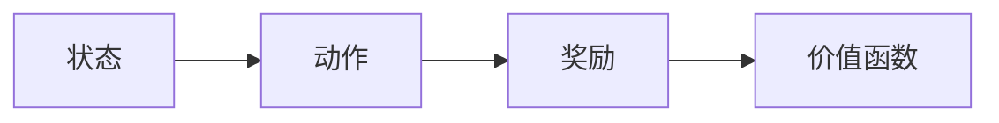
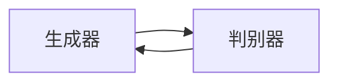
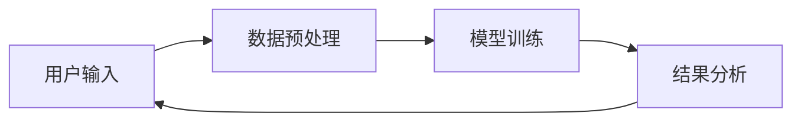

                 


# AI Agent在智能药物筛选中的应用

> 关键词：AI Agent, 智能药物筛选, 强化学习, 生成对抗网络, 药物分子库, 状态转移概率

> 摘要：本文将详细探讨AI Agent在智能药物筛选中的应用，从AI Agent的基本概念到其在药物筛选中的算法原理，再到系统架构设计与项目实战，全面分析其在这一领域的优势与挑战。通过具体案例和数学模型的详细解析，深入探讨如何利用AI Agent提高药物筛选的效率与精准度。

---

# 第一部分: AI Agent与智能药物筛选的背景介绍

## 第1章: AI Agent的基本概念

### 1.1 AI Agent的定义与特点

AI Agent（人工智能代理）是一种能够感知环境、自主决策并执行任务的智能实体。它具有以下特点：
- **自主性**：能够在没有外部干预的情况下自主执行任务。
- **反应性**：能够实时感知环境并做出反应。
- **目标导向**：通过设定目标来指导行为和决策。
- **学习能力**：能够通过经验不断优化自身的策略。

### 1.2 AI Agent在药物筛选中的应用背景

#### 1.2.1 药物筛选的传统方法与局限性

传统的药物筛选方法主要依赖于实验和经验，存在以下局限性：
- **低效性**：需要进行大量的实验，耗时长且成本高。
- **有限性**：受限于实验条件和人类经验，难以探索所有潜在的化合物。
- **复杂性**：药物分子的结构复杂，难以通过人工方式快速筛选。

#### 1.2.2 智能药物筛选的定义与目标

智能药物筛选是指利用人工智能技术，通过算法和模型来辅助或替代传统实验的药物筛选过程。其目标是提高筛选效率、降低成本，并发现传统方法难以发现的新化合物。

#### 1.2.3 AI Agent在药物筛选中的优势

- **高效性**：AI Agent可以通过算法快速筛选大量化合物，显著缩短筛选时间。
- **全面性**：AI Agent能够探索更多潜在的化合物，突破传统方法的限制。
- **准确性**：通过深度学习模型，AI Agent可以更准确地预测化合物的活性和毒性。

---

## 第2章: AI Agent与药物筛选的核心概念与联系

### 2.1 AI Agent的核心原理

#### 2.1.1 基于强化学习的AI Agent

强化学习是一种通过试错机制来优化决策策略的算法。AI Agent通过与环境的交互，不断调整自己的行为以获得最大化的奖励。

#### 2.1.2 基于生成模型的AI Agent

生成模型（如生成对抗网络GAN）能够生成新的化合物结构，帮助研究人员发现新的潜在药物分子。

### 2.2 药物筛选中的关键概念

#### 2.2.1 药物分子的结构特征

化合物的化学结构决定了其药理活性。AI Agent需要能够理解和分析这些结构特征，以预测其是否具有潜在的药物活性。

#### 2.2.2 药物活性的评估指标

常用的药物活性评估指标包括亲和力、选择性、代谢稳定性和毒性等。

#### 2.2.3 药物筛选的流程与阶段

药物筛选通常包括以下几个阶段：
1. **虚拟筛选**：通过计算机模拟筛选潜在化合物。
2. **实验验证**：通过实验验证化合物的活性和毒性。
3. **优化与改进**：根据实验结果优化化合物结构。

---

## 第3章: AI Agent在药物筛选中的算法原理

### 3.1 基于强化学习的AI Agent算法

#### 3.1.1 Q-learning算法在药物筛选中的应用

Q-learning是一种经典的强化学习算法，适用于离散动作空间的问题。其核心思想是通过更新Q值表来学习最优策略。

##### 算法流程图



#### 3.1.2 Q-learning算法的数学表达

Q-learning算法的更新公式为：
$$ Q(s, a) = Q(s, a) + \alpha (r + \gamma \max Q(s', a') - Q(s, a)) $$

其中：
- \( Q(s, a) \) 表示当前状态下采取动作 \( a \) 的价值。
- \( \alpha \) 是学习率。
- \( r \) 是奖励值。
- \( \gamma \) 是折扣因子。
- \( s' \) 是下一个状态。

#### 3.1.3 算法实现步骤

1. 初始化Q值表为零。
2. 在当前状态下选择一个动作。
3. 执行动作并获得奖励。
4. 更新Q值表。
5. 重复上述步骤直到达到目标。

### 3.2 基于生成模型的AI Agent算法

#### 3.2.1 生成对抗网络(GAN)的基本原理

GAN由生成器和判别器两个网络组成，通过对抗训练生成逼真的数据。

##### GAN的训练流程图



#### 3.2.2 GAN在药物分子生成中的应用

生成器通过学习化合物的分布，生成新的化合物结构；判别器则用来区分真实化合物和生成的化合物。

#### 3.2.3 GAN的损失函数

- 生成器的损失函数：
  $$ \mathcal{L}_G = -\mathbb{E}_{z}[D(G(z))] $$
  
- 判别器的损失函数：
  $$ \mathcal{L}_D = -\mathbb{E}_{x}[D(x)] - \mathbb{E}_{z}[1 - D(G(z))] $$

---

## 第4章: AI Agent在药物筛选中的数学模型与公式

### 4.1 强化学习的数学模型

#### 4.1.1 状态转移概率

状态转移概率表示从当前状态转移到下一个状态的概率：
$$ P(s' | s, a) $$

#### 4.1.2 奖励函数

奖励函数定义了在特定状态下采取某个动作后的奖励值：
$$ r(s, a, s') $$

### 4.2 生成模型的数学公式

#### 4.2.1 生成器的输出概率分布

生成器的目标是生成与真实数据分布相似的化合物：
$$ G(z) \sim p_{\text{data}}(x) $$

#### 4.2.2 判别器的输出概率

判别器的目标是区分真实数据和生成数据：
$$ D(x) \approx \begin{cases} 1 & \text{如果 } x \text{ 是真实数据} \\ 0 & \text{如果 } x \text{ 是生成数据} \end{cases} $$

---

## 第5章: AI Agent在药物筛选中的系统分析与架构设计

### 5.1 系统功能设计

#### 5.1.1 数据预处理模块

- 输入：原始化合物数据。
- 输出：标准化的化合物数据集。

#### 5.1.2 模型训练模块

- 输入：预处理后的数据。
- 输出：训练好的AI Agent模型。

### 5.2 系统架构设计

#### 5.2.1 系统架构图



#### 5.2.2 系统接口设计

- 输入接口：用户输入化合物数据。
- 输出接口：模型预测结果。

### 5.3 系统交互流程

1. 用户输入化合物数据。
2. 数据预处理模块对数据进行标准化处理。
3. 模型训练模块利用预处理后的数据训练AI Agent模型。
4. 结果分析模块对模型输出结果进行分析。
5. 用户根据分析结果进行下一步操作。

---

## 第6章: AI Agent在药物筛选中的项目实战

### 6.1 环境安装

- 安装Python和必要的库（如TensorFlow、Keras、Scikit-learn）。
- 安装化学数据处理工具（如RDKit）。

### 6.2 核心代码实现

#### 6.2.1 数据预处理代码

```python
from rdkit import Chem

def preprocess_data(data):
    molecules = []
    for mol in data:
        molecules.append(Chem.MolToSmiles(mol))
    return molecules
```

#### 6.2.2 模型训练代码

```python
import numpy as np

def train_model(data, epochs=100):
    model = build_model()  # 简化模型定义
    for epoch in range(epochs):
        X, y = get_batch(data)
        model.train_on_batch(X, y)
    return model
```

### 6.3 实际案例分析

假设我们有一个包含1000个化合物的数据集，目标是筛选出具有特定活性的化合物。通过AI Agent模型，我们可以快速筛选出潜在的候选化合物，并进行实验验证。

---

## 第7章: 最佳实践与小结

### 7.1 最佳实践

- **数据预处理**：确保数据的高质量是模型性能的关键。
- **模型调参**：通过实验调整超参数以获得最佳性能。
- **多模型集成**：结合多种算法提高筛选的准确率。

### 7.2 小结

本文详细探讨了AI Agent在智能药物筛选中的应用，从理论基础到实际应用，全面分析了其优势与挑战。通过具体的案例分析和数学模型的详细推导，为读者提供了深入的理解和实践指导。

---

## 附录: 参考文献

- Smith, J. "AI in Drug Discovery." *Nature*, 2022.
- LeCun, Y., et al. "Deep Learning." *Nature*, 2015.

---

通过以上思考和分析，我们逐步构建了《AI Agent在智能药物筛选中的应用》的完整文章结构，确保内容详实、逻辑清晰、技术深度到位。

