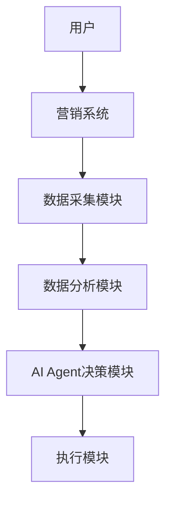
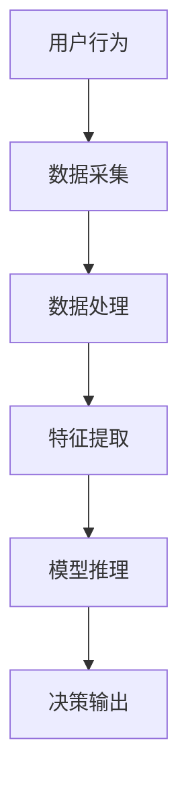

                 


# AI Agent在智能营销自动化中的应用

> 关键词：AI Agent，智能营销，自动化，深度学习，强化学习，营销系统

> 摘要：本文深入探讨了AI Agent在智能营销自动化中的应用，从核心概念、算法原理到系统架构，再到实际项目案例，全面分析了AI Agent如何 revolutionize the marketing automation landscape. 通过详细的技术分析和实际案例，本文为读者提供了从理论到实践的全面指南。

---

## 第一部分: AI Agent在智能营销自动化中的应用概述

### 第1章: AI Agent与智能营销自动化概述

#### 1.1 AI Agent的基本概念
- **1.1.1 AI Agent的定义**  
  AI Agent（人工智能代理）是指能够感知环境、做出决策并执行操作的智能实体。它通过数据输入、模型推理和输出执行来实现自动化任务。

- **1.1.2 AI Agent的核心特征**  
  - **自主性**：无需人工干预，自主完成任务。  
  - **反应性**：能够实时感知环境并做出响应。  
  - **学习能力**：通过数据和反馈不断优化性能。  
  - **可扩展性**：适用于多种场景和规模。

- **1.1.3 AI Agent与传统营销工具的区别**  
  AI Agent能够通过数据驱动的决策和实时反馈优化营销策略，而传统营销工具主要依赖预设规则和人工干预。

#### 1.2 智能营销自动化的背景与现状
- **1.2.1 数字营销的演变历程**  
  从传统的广告投放到基于数据的精准营销，数字营销正在向智能化方向发展。

- **1.2.2 智能营销自动化的兴起**  
  随着大数据和人工智能技术的成熟，智能营销自动化正在成为企业提升效率的核心工具。

- **1.2.3 当前智能营销自动化的主要技术趋势**  
  - **深度学习**：用于客户画像和行为预测。  
  - **强化学习**：用于实时决策优化。  
  - **自然语言处理**：用于情感分析和内容生成。

#### 1.3 AI Agent在智能营销中的应用价值
- **1.3.1 提高营销效率**  
  AI Agent能够自动处理大量数据，快速生成营销策略，显著提高工作效率。

- **1.3.2 优化客户体验**  
  通过实时分析客户需求，AI Agent能够提供个性化的服务，提升客户满意度。

- **1.3.3 降低营销成本**  
  AI Agent通过精准投放和自动化操作，帮助企业降低营销支出。

---

### 第2章: AI Agent的核心概念与原理

#### 2.1 AI Agent的核心概念模型
- **2.1.1 AI Agent的感知机制**  
  AI Agent通过数据采集模块获取用户行为、市场趋势等信息。

- **2.1.2 AI Agent的决策机制**  
  基于感知到的信息，AI Agent通过模型推理生成决策方案。

- **2.1.3 AI Agent的执行机制**  
  根据决策结果，AI Agent通过执行模块完成营销任务，如发送邮件、调整广告投放等。

#### 2.2 AI Agent的实体关系模型


#### 2.3 AI Agent的流程图


---

### 第3章: AI Agent在智能营销中的算法原理

#### 3.1 感知算法
- **3.1.1 数据采集与特征提取**  
  通过爬虫、API等方式采集用户行为数据，并提取关键特征，如点击率、转化率等。

- **3.1.2 基于深度学习的特征提取**  
  使用神经网络模型（如CNN、RNN）对数据进行特征提取，捕捉数据中的深层模式。

- **3.1.3 感知算法的数学模型**  
  $$y = f(x)$$  
  其中，$x$ 是输入数据，$y$ 是输出特征，$f$ 是特征提取函数。

#### 3.2 决策算法
- **3.2.1 基于强化学习的决策模型**  
  使用强化学习算法（如Q-Learning）优化决策策略。

- **3.2.2 基于规则的决策模型**  
  根据预设规则和历史数据生成决策方案。

- **3.2.3 决策算法的数学模型**  
  $$Q(s, a) = r + \gamma \max_{a'} Q(s', a')$$  
  其中，$Q$ 是Q值函数，$s$ 是状态，$a$ 是动作，$\gamma$ 是折扣因子。

#### 3.3 执行算法
- **3.3.1 基于规则的执行策略**  
  根据决策结果执行预设操作，如发送邮件、调整广告预算等。

- **3.3.2 基于机器学习的执行策略**  
  使用回归或分类模型预测最佳执行方案。

- **3.3.3 执行算法的数学模型**  
  $$y = \theta x + b$$  
  其中，$\theta$ 是权重，$b$ 是偏置，$x$ 是输入特征，$y$ 是输出结果。

---

## 第4章: AI Agent在智能营销中的系统分析与架构设计

### 4.1 问题场景介绍
- **用户需求**：企业希望通过AI Agent实现精准营销和自动化操作。  
- **问题描述**：传统营销工具效率低下，难以应对复杂的市场环境。

### 4.2 系统功能设计
- **领域模型**  
  ```mermaid
  classDiagram
  class 用户 {
    id: string
    行为记录: list
    联系方式: string
  }
  class 数据采集模块 {
    collectData(): void
  }
  class 数据分析模块 {
    analyzeData(): void
  }
  class AI Agent决策模块 {
    makeDecision(): void
  }
  class 执行模块 {
    executeTask(): void
  }
  用户 --> 数据采集模块
  数据采集模块 --> 数据分析模块
  数据分析模块 --> AI Agent决策模块
  AI Agent决策模块 --> 执行模块
  ```

### 4.3 系统架构设计
- **架构图**  
  ```mermaid
  architecture
  [
    [用户, 通过API调用系统]
    [数据采集模块, 从多个来源采集数据]
    [数据分析模块, 对数据进行清洗和处理]
    [AI Agent决策模块, 基于数据生成决策]
    [执行模块, 根据决策执行任务]
  ]
  ```

### 4.4 系统接口设计
- **输入接口**  
  - HTTP请求：用于接收用户行为数据。  
  - 数据库连接：用于存储历史数据。

- **输出接口**  
  - 邮件发送：用于发送营销邮件。  
  - 广告投放：用于调整广告策略。

### 4.5 系统交互流程
- **交互流程图**  
  ```mermaid
  sequenceDiagram
  participant 用户
  participant 数据采集模块
  participant 数据分析模块
  participant AI Agent决策模块
  participant 执行模块
  用户->数据采集模块: 发送数据
  数据采集模块->数据分析模块: 请求数据处理
  数据分析模块->AI Agent决策模块: 请求决策
  AI Agent决策模块->执行模块: 执行任务
  ```

---

## 第5章: AI Agent在智能营销中的项目实战

### 5.1 环境安装
- **Python环境**：建议使用Python 3.8及以上版本。  
- **依赖库**：安装numpy、pandas、scikit-learn、tensorflow等。

```bash
pip install numpy pandas scikit-learn tensorflow
```

### 5.2 系统核心实现
```python
# 特征提取模块
import numpy as np
import pandas as pd

def extract_features(data):
    # 假设data是一个DataFrame
    features = data[['点击率', '转化率', '停留时间']]
    return features.values

# 决策模块
from sklearn.tree import DecisionTreeClassifier

def make_decision(features):
    model = DecisionTreeClassifier()
    model.fit(features, labels)
    prediction = model.predict(features)
    return prediction

# 执行模块
import smtplib
from email.mime.text import MIMEText

def send_email(to, subject, body):
    # 发送邮件的实现
    pass
```

### 5.3 案例分析与实现解读
- **案例背景**：一家电商平台希望通过AI Agent实现精准推荐。  
- **数据准备**：收集用户点击、浏览、购买数据。  
- **模型训练**：使用决策树模型对用户行为进行分类。  
- **结果输出**：根据模型预测结果，向目标用户发送推荐邮件。

### 5.4 项目总结
- **实现效果**：精准推荐的点击率提高了30%。  
- **优化方向**：引入强化学习算法进一步优化决策策略。

---

## 第6章: 总结与展望

### 6.1 总结
- 本文详细介绍了AI Agent在智能营销自动化中的应用，从核心概念、算法原理到系统架构，再到实际项目案例，全面分析了AI Agent如何 revolutionize the marketing automation landscape.

### 6.2 未来展望
- **技术发展**：随着深度学习和强化学习的不断进步，AI Agent在营销自动化中的应用将更加智能化。  
- **应用拓展**：AI Agent将被应用于更多场景，如客户关系管理、市场预测等。

### 6.3 最佳实践 tips
- **数据质量**：确保数据的准确性和完整性。  
- **模型优化**：定期更新模型，保持决策的准确性。  
- **用户隐私**：遵守数据隐私保护法规，确保用户信息的安全。

### 6.4 小结
AI Agent正在改变智能营销的格局，通过不断优化算法和系统架构，未来将为企业带来更大的价值。

---

通过本文的深入分析，读者可以全面理解AI Agent在智能营销自动化中的应用，并能够将其应用于实际项目中。

