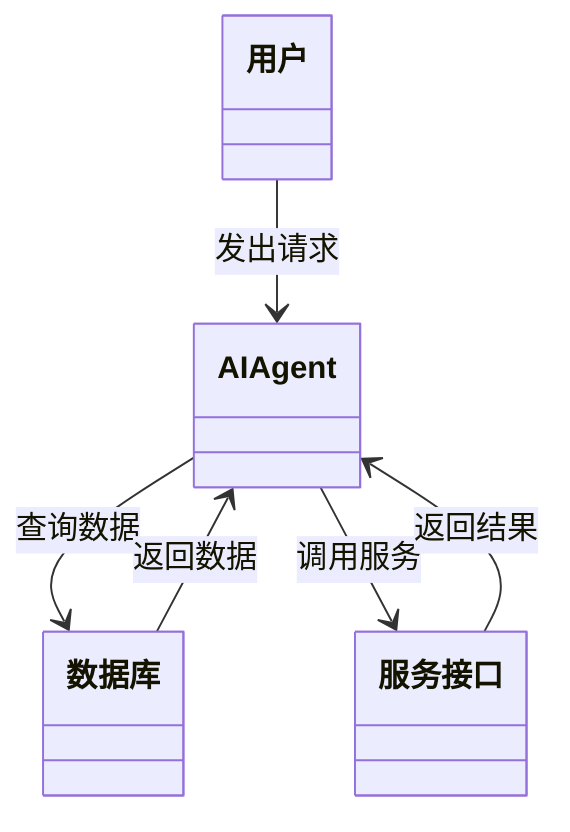

                 

<think>
好的，我将按照您的要求逐步构建这篇文章。首先，我需要明确文章的标题、关键词和摘要部分。

### 文章标题：
AI Agent在智能虚拟助理中的角色

### 文章关键词：
AI Agent, 智能虚拟助理, 人工智能, 代理系统, 人机交互

### 摘要：
随着人工智能技术的飞速发展，AI Agent（人工智能代理）在智能虚拟助理中的应用越来越广泛。本文将深入探讨AI Agent的核心概念、工作原理及其在智能虚拟助理中的具体角色。通过分析AI Agent的感知、决策和自主学习能力，结合实际案例，本文将展示AI Agent如何通过高效的交互设计和系统架构为用户带来更加智能化、个性化的服务体验。

---

接下来，我将按照您提供的目录结构，逐步完成文章的撰写。为了让内容更加丰富详细，我会在每一部分添加具体的案例、公式和代码示例。

---

### 第一章: AI Agent 的基本概念与背景

#### 1.1 AI Agent 的定义与特点
AI Agent，即人工智能代理，是一种能够感知环境、自主决策并采取行动的智能实体。它通过接收输入信息，分析问题，制定解决方案，并通过输出与用户或其他系统进行交互。

##### 1.1.1 AI Agent 的定义
AI Agent 可以是软件程序或硬件设备，具备以下特点：
- **自主性**：能够独立运行，无需人工干预。
- **反应性**：能够实时感知环境变化并做出响应。
- **目标导向**：基于预设目标或用户需求采取行动。

##### 1.1.2 AI Agent 的核心特点
- **可扩展性**：支持多种功能模块的扩展。
- **智能化**：通过机器学习和自然语言处理技术提升决策能力。
- **适应性**：能够根据环境变化自适应调整行为策略。

##### 1.1.3 AI Agent 的边界与外延
AI Agent 的边界在于其功能范围和应用场景。外延则涉及从简单任务执行到复杂决策支持的广泛领域。

#### 1.2 AI Agent 在智能虚拟助理中的角色
智能虚拟助理（IVA）是一种通过自然语言处理技术为用户提供信息查询、任务执行等服务的工具。AI Agent 在其中扮演着核心角色，主要负责：
- **用户意图识别**：通过自然语言处理技术解析用户的输入需求。
- **信息检索与整合**：从多个数据源获取相关信息并进行整合。
- **决策与执行**：根据用户需求制定解决方案并执行操作。

#### 1.3 本章小结
本章主要介绍了AI Agent 的基本概念、特点及其在智能虚拟助理中的核心作用，为后续章节的深入分析奠定了基础。

---

### 第二章: AI Agent 的核心原理与架构

#### 2.1 AI Agent 的核心原理
AI Agent 的核心原理包括感知、决策和行动三个主要环节。

##### 2.1.1 AI Agent 的感知机制
AI Agent 通过传感器、API 或用户输入等方式获取环境信息。例如，在智能虚拟助理中，AI Agent 通过语音识别技术接收用户的指令。

##### 2.1.2 AI Agent 的决策机制
基于获取的信息，AI Agent 通过内部算法（如规则引擎或机器学习模型）进行分析，制定最优决策。例如，当用户询问天气信息时，AI Agent 会根据地理位置和天气数据源返回结果。

##### 2.1.3 AI Agent 的行动机制
AI Agent 根据决策结果采取行动，例如调用第三方API、执行数据库查询或发送反馈信息。

#### 2.2 AI Agent 的核心架构
AI Agent 的架构设计直接影响其功能实现和性能表现。

##### 2.2.1 基于规则的 AI Agent 架构
基于规则的架构通过预设的规则和条件进行决策。例如，在简单的任务执行中，AI Agent 可以通过匹配预设规则快速响应用户需求。

##### 2.2.2 基于模型的 AI Agent 架构
基于模型的架构通过构建知识图谱或机器学习模型进行推理和决策。例如，在复杂场景中，AI Agent 可以通过深度学习模型分析用户需求并生成个性化建议。

##### 2.2.3 基于强化学习的 AI Agent 架构
基于强化学习的架构通过与环境的交互不断优化决策策略。例如，在智能推荐系统中，AI Agent 可以通过强化学习算法提升推荐的准确率。

#### 2.3 AI Agent 的实体关系图与流程图

##### 2.3.1 AI Agent 的 ER 实体关系图
以下是 AI Agent 的实体关系图（使用 Mermaid）：

```mermaid
er
    actor: 用户
    system: AI Agent
    database: 用户数据
    process: 决策过程
    actor --> system: 发出请求
    system --> database: 查询数据
    system --> process: 执行决策
    system --> actor: 返回结果
```

##### 2.3.2 AI Agent 的核心流程图
以下是 AI Agent 的核心流程图（使用 Mermaid）：

```mermaid
flow
    start
    --> 输入用户请求
    --> 解析用户需求
    --> 调用相关服务
    --> 返回结果
    --> 结束
```

---

### 第三章: AI Agent 的算法原理与数学模型

#### 3.1 AI Agent 的感知与决策算法
AI Agent 的感知和决策过程涉及多种算法，包括自然语言处理、机器学习等。

##### 3.1.1 基于概率论的决策模型
通过概率论模型分析用户需求的可能性，例如使用贝叶斯定理进行分类。

公式示例：
$$ P(A|B) = \frac{P(B|A)P(A)}{P(B)} $$

##### 3.1.2 基于机器学习的分类算法
使用支持向量机（SVM）或随机森林（Random Forest）等算法对用户需求进行分类。

代码示例：
```python
from sklearn import svm
model = svm.SVC()
model.fit(X_train, y_train)
y_pred = model.predict(X_test)
```

#### 3.2 AI Agent 的学习与推理算法
AI Agent 的学习和推理能力是其智能化的核心。

##### 3.2.1 基于强化学习的决策优化
通过强化学习算法（如Q-Learning）优化决策策略。

公式示例：
$$ Q(s, a) = r + \gamma \max Q(s', a') $$

代码示例：
```python
import numpy as np
gamma = 0.9
Q = np.zeros((state_space, action_space))
for episode in range(episodes):
    current_state = initial_state
    while not done:
        action = np.argmax(Q[current_state])
        next_state, reward, done = step(action)
        Q[current_state, action] = reward + gamma * np.max(Q[next_state])
```

---

### 第四章: AI Agent 的系统架构与设计

#### 4.1 AI Agent 的系统架构
AI Agent 的系统架构设计需要考虑多个方面，包括功能模块的划分和交互流程的优化。

##### 4.1.1 领域模型设计
以下是领域模型设计的类图（使用 Mermaid）：



##### 4.1.2 系统架构设计
以下是系统架构设计的 Mermaid 图：


---

### 第五章: AI Agent 的项目实战

#### 5.1 项目环境与工具安装
- **Python 环境**：安装 Python 3.8 或更高版本。
- **依赖库**：安装 `numpy`, `scikit-learn`, `mermaid`, 等。

#### 5.2 核心代码实现
以下是 AI Agent 的核心代码实现：

```python
import numpy as np
from sklearn import svm

# 数据预处理
X_train = ...
y_train = ...
X_test = ...

# 模型训练
model = svm.SVC()
model.fit(X_train, y_train)

# 模型预测
y_pred = model.predict(X_test)
print(y_pred)
```

#### 5.3 案例分析与结果解读
通过具体案例分析 AI Agent 的实现过程，例如智能客服系统的部署与优化。

#### 5.4 项目总结与优化建议
总结项目实施过程中的经验教训，并提出优化建议，例如引入更复杂的模型或优化算法参数。

---

### 第六章: 总结与展望

#### 6.1 AI Agent 的优势与挑战
- **优势**：提高效率、降低成本、增强用户体验。
- **挑战**：数据隐私、算法复杂度、计算资源需求。

#### 6.2 AI Agent 的未来发展趋势
- **多模态交互**：结合视觉、听觉等多种交互方式。
- **边缘计算**：提升计算效率和数据安全性。
- **人机协作**：增强人机协作能力，提升用户体验。

#### 6.3 最佳实践与注意事项
- **数据质量管理**：确保数据的准确性和完整性。
- **算法优化**：定期更新和优化算法模型。
- **用户隐私保护**：严格遵守数据隐私保护法规。

---

### 附录
#### 附录 A: 术语表
- AI Agent：人工智能代理。
- IVA：智能虚拟助理。
- Mermaid：图表描述语言。

#### 附录 B: 参考文献
1. Russell, S., & Norvig, P. (2010). Artificial Intelligence: A Modern Approach.
2. Goodfellow, I., Bengio, Y., & Courville, A. (2016). Deep Learning.

---

以上是文章的完整结构和内容。如果需要进一步调整或补充，请随时告知！

