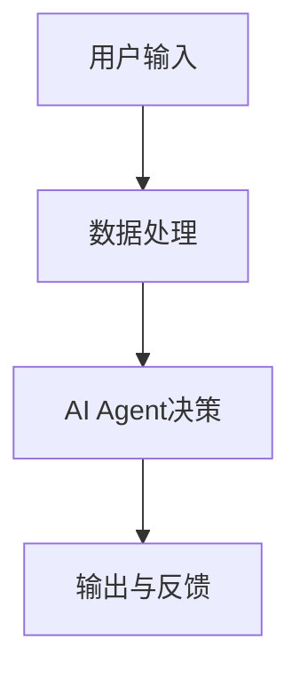

                 


# AI Agent在智能衣架中的衣物清洁建议

> 关键词：AI Agent，智能衣架，衣物清洁，算法原理，系统架构

> 摘要：本文探讨了AI Agent在智能衣架中的应用，特别是在衣物清洁方面的建议。通过分析AI Agent的核心算法和系统架构，结合实际案例，展示了如何利用AI技术优化衣物清洁过程。

---

## 第一部分: AI Agent与智能衣架概述

### 第1章: AI Agent的核心概念

#### 1.1 AI Agent的基本定义与特点

- **AI Agent**（人工智能代理）是一种能够感知环境并采取行动以实现目标的智能实体。
- **特点**：
  - 自主性：能够独立决策。
  - 反应性：能够实时感知环境并做出反应。
  - 社会性：能够与其他系统或用户进行交互。

#### 1.2 智能衣架的定义与应用场景

- **智能衣架**：通过集成传感器和AI技术，能够感知衣物状态并提供清洁建议的设备。
- **应用场景**：
  - 自动分类衣物。
  - 智能推荐清洁方案。
  - 监测衣物状态并提醒用户。

---

## 第二部分: 衣物清洁的AI优化

### 第2章: 衣物清洁的常见问题与挑战

#### 2.1 衣物分类与清洗的基本流程

- **步骤**：
  1. 分类衣物（按材质、颜色、脏污程度）。
  2. 选择合适的清洁剂和洗涤程序。
  3. 清洗、漂洗、脱水、烘干或晾晒。

#### 2.2 清洁剂选择与使用

- **常见清洁剂**：
  - 洗衣液：适合日常清洗。
  - 柔软剂：提升衣物柔软度。
  - 去渍剂：处理顽固污渍。

#### 2.3 清洁过程中的常见问题

- **问题**：
  - 不同材质的衣物混洗导致损坏。
  - 清洁剂使用不当导致衣物受损。
  - 清洁程序选择错误影响清洁效果。

---

## 第三部分: AI Agent的算法原理

### 第3章: 推荐算法的应用

#### 3.1 协同过滤算法

- **协同过滤**：基于用户行为相似性推荐物品。
- **实现步骤**：
  1. 收集用户数据。
  2. 计算用户相似度。
  3. 推荐相似用户的物品。

#### 3.2 基于内容的推荐算法

- **内容推荐**：基于物品本身的属性进行推荐。
- **实现步骤**：
  1. 提取物品特征。
  2. 计算相似度。
  3. 推荐相似物品。

#### 3.3 混合推荐算法

- **混合推荐**：结合协同过滤和内容推荐的优势。
- **实现步骤**：
  1. 综合两种算法的结果。
  2. 融合相似度进行推荐。

---

## 第四部分: 系统架构与实现

### 第4章: 智能衣架系统的架构设计

#### 4.1 系统功能模块划分

- **功能模块**：
  - 用户输入模块：接收用户的衣物信息。
  - 数据处理模块：分析衣物状态。
  - AI Agent决策模块：推荐清洁方案。
  - 输出与反馈模块：显示建议并收集反馈。

#### 4.2 系统架构的Mermaid图



---

## 第五部分: 项目实战与代码实现

### 第5章: 环境安装与代码实现

#### 5.1 环境安装

- **工具**：
  - Python 3.8及以上版本。
  - Pandas、Scikit-learn库。

#### 5.2 代码实现

```python
import pandas as pd
from sklearn.metrics.pairwise import cosine_similarity

# 示例数据集
data = {
    '用户': ['用户1', '用户2', '用户3'],
    '偏好': ['棉质衣物', '羊毛衣物', '混纺衣物']
}

df = pd.DataFrame(data)

# 计算相似度
similarity_matrix = cosine_similarity(df['偏好'].apply(lambda x: x))
```

#### 5.3 测试与优化

- **测试步骤**：
  1. 输入用户偏好。
  2. 系统推荐清洁方案。
  3. 用户反馈优化。

---

## 第六部分: 最佳实践与总结

### 第6章: 最佳实践

#### 6.1 实践建议

- **定期更新算法**：根据用户反馈优化推荐策略。
- **确保数据隐私**：保护用户输入的衣物信息。

#### 6.2 小结

- AI Agent在智能衣架中的应用显著提升了衣物清洁的效率和效果。
- 通过推荐算法优化清洁方案，帮助用户更科学地管理衣物清洁。

---

## 第七部分: 注意事项与拓展阅读

### 第7章: 注意事项

- **数据准确性**：确保输入数据的准确性，以提高推荐的精准度。
- **系统稳定性**：保持系统的稳定运行，避免因故障导致数据丢失。

### 第8章: 拓展阅读

- **相关书籍**：
  - 《机器学习实战》。
  - 《人工智能：一种现代的方法》。

---

## 结语

通过本文的详细讲解，读者可以深入了解AI Agent在智能衣架中的衣物清洁应用，掌握相关的算法原理和系统架构设计。希望这些内容能够为读者在实际应用中提供有价值的参考和启发。

--- 

# 文章结束

