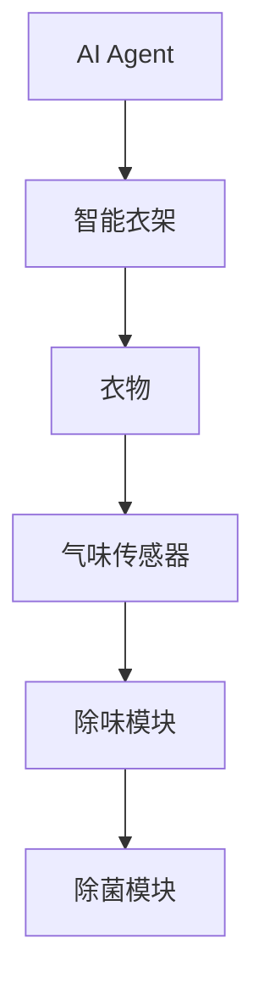
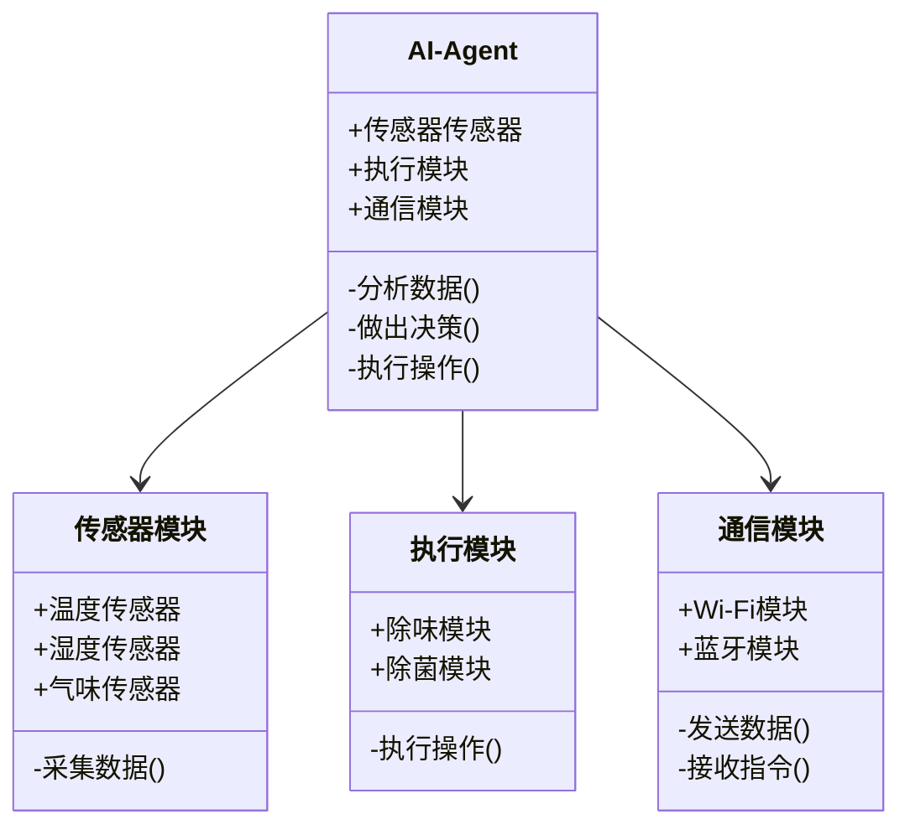
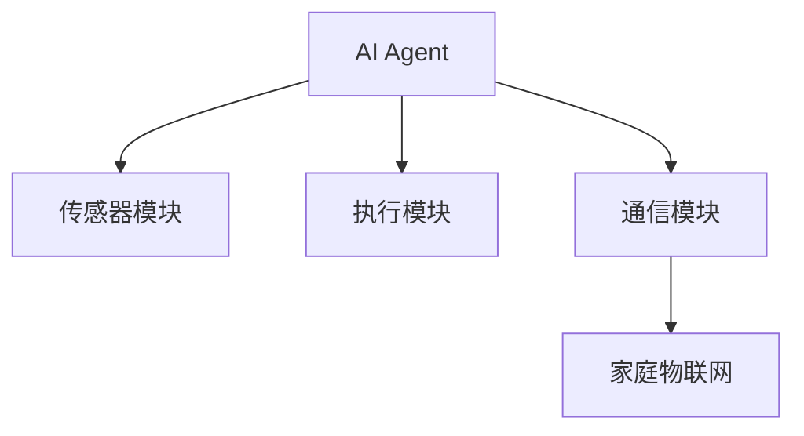

                 


```markdown
# AI Agent在智能衣架中的衣物除味除菌

> 关键词：AI Agent，智能衣架，衣物除味，除菌技术，传感器，算法

> 摘要：本文深入探讨了AI Agent在智能衣架中的衣物除味除菌应用。通过分析AI Agent的核心原理、算法实现、系统架构以及项目实战，详细阐述了如何利用AI技术解决衣物除味除菌的实际问题。文章结合理论与实践，提供了丰富的技术细节和代码示例，为相关领域的研究和开发提供了参考。

---

# 第一部分: AI Agent在智能衣架中的衣物除味除菌概述

# 第1章: AI Agent与智能衣架的背景介绍

## 1.1 问题背景

### 1.1.1 衣物除味除菌的市场需求

随着生活水平的提高，人们对衣物的护理要求越来越高。衣物在存放或穿着过程中容易产生异味或细菌污染，影响穿着体验和健康。传统的除味除菌方法效率低、操作繁琐，难以满足现代人的需求。

### 1.1.2 智能衣架的发展趋势

智能衣架作为一种智能家居设备，通过集成传感器和智能算法，能够实现衣物的智能管理、除味和除菌功能。随着物联网技术的发展，智能衣架逐渐成为智能家居生态中的重要组成部分。

### 1.1.3 AI Agent在智能衣架中的应用前景

AI Agent（人工智能代理）通过感知环境、分析数据、自主决策，能够为智能衣架提供智能化的服务。其在衣物除味除菌中的应用前景广阔，能够显著提升用户体验。

## 1.2 问题描述

### 1.2.1 衣物除味除菌的技术难点

- 气味种类繁多，如何准确识别并消除？
- 细菌种类多样，如何高效杀菌？
- 如何在不同环境条件下保持高效性能？

### 1.2.2 智能衣架的痛点分析

- 传统衣架功能单一，无法满足多样化需求。
- 缺乏智能化，无法与家庭物联网系统联动。
- 用户操作复杂，缺乏智能化的管理功能。

### 1.2.3 AI Agent如何解决这些问题

- 通过传感器实时感知衣物状态。
- 利用AI算法自动判断并执行除味除菌操作。
- 与家庭物联网系统联动，提供智能化服务。

## 1.3 问题解决

### 1.3.1 AI Agent的核心功能

- 实时感知：通过传感器采集衣物状态数据。
- 智能决策：基于AI算法分析数据并做出决策。
- 自动执行：通过控制模块执行除味除菌操作。

### 1.3.2 智能衣架的系统架构

智能衣架系统包括传感器模块、AI处理模块、执行模块和通信模块。各模块协同工作，实现智能化的衣物管理。

### 1.3.3 技术实现的总体思路

1. 传感器采集数据。
2. AI Agent分析数据并做出决策。
3. 控制执行模块完成除味除菌操作。
4. 通过通信模块与家庭物联网联动。

## 1.4 边界与外延

### 1.4.1 功能边界

- 仅限于衣物的除味和除菌功能，不涉及其他功能。
- 支持多种衣物材质和常见异味类型。

### 1.4.2 技术边界

- 采用特定的传感器和控制模块。
- 仅支持特定的通信协议。

### 1.4.3 应用场景的外延

- 可扩展到家庭、酒店、商场等场景。
- 可与其他智能家居设备联动。

## 1.5 概念结构与核心要素

### 1.5.1 系统组成

- 传感器模块：采集衣物状态数据。
- AI处理模块：分析数据并做出决策。
- 执行模块：完成除味除菌操作。
- 通信模块：与家庭物联网联动。

### 1.5.2 核心要素

- AI Agent：系统的核心决策单元。
- 传感器：数据采集的关键设备。
- 执行模块：系统输出的执行机构。

### 1.5.3 关键技术

- 传感器技术：高精度、低成本。
- AI算法：高效、准确的决策算法。
- 物联网技术：实现设备间的联动。

---

# 第2章: AI Agent的核心概念与联系

## 2.1 核心概念原理

### 2.1.1 AI Agent的基本原理

AI Agent通过感知环境、分析数据、自主决策并执行操作，实现智能化的服务。在智能衣架中，AI Agent负责分析传感器数据，并根据数据结果控制执行模块完成除味除菌操作。

### 2.1.2 智能衣架的感知系统

智能衣架通过多种传感器（如气味传感器、温湿度传感器）实时感知衣物的状态，包括温度、湿度、气味强度等参数。

### 2.1.3 除味除菌算法的实现

AI Agent通过分析传感器数据，判断是否需要启动除味除菌功能，并选择最优的除味除菌模式。

## 2.2 概念属性特征对比

### 2.2.1 AI Agent与传统控制系统的对比

| 特性               | AI Agent             | 传统控制系统       |
|--------------------|----------------------|-------------------|
| 数据处理能力       | 强大，支持复杂决策   | 较弱，仅支持简单逻辑 |
| 学习能力           | 具备，可优化算法     | 无，固定规则       |
| 自适应性           | 高，可根据环境变化调整 | 较低               |

### 2.2.2 智能衣架与其他智能家居设备的对比

| 特性               | 智能衣架             | 智能空调           |
|--------------------|----------------------|-------------------|
| 主要功能           | 衣物管理             | 环境控制           |
| 感知能力           | 多种传感器           | 温度、湿度传感器   |
| 人机交互           | 通过手机APP控制     | 通过遥控器控制     |

### 2.2.3 除味除菌技术的优劣势分析

| 技术               | 优势                 | 劣势               |
|--------------------|----------------------|-------------------|
| 催化剂除味         | 环保，成本低         | 效果有限           |
| 紫外线杀菌         | 高效杀菌            | 适用范围有限       |
| 等离子除味         | 快速分解异味         | 适用于特定场景     |

## 2.3 ER实体关系图



---

# 第3章: AI Agent的算法原理

## 3.1 算法原理讲解

### 3.1.1 数据采集与特征提取

AI Agent通过传感器采集衣物的气味、温湿度等数据，并提取特征，例如气味强度、温度、湿度等。

### 3.1.2 数据分析与决策

基于机器学习算法，AI Agent分析特征数据，判断是否需要启动除味除菌功能，并选择最优的除味除菌模式。

### 3.1.3 算法实现流程

1. 采集数据：通过传感器获取衣物状态数据。
2. 特征提取：将数据转换为特征向量。
3. 数据分析：利用机器学习算法分析特征数据。
4. 决策输出：根据分析结果做出决策并执行操作。

## 3.2 Python源代码实现

```python
import numpy as np
from sklearn import linear_model

class AI-Agent:
    def __init__(self):
        self.sensor = Sensor()
        self.model = linear_model.LogisticRegression()

    def process(self, data):
        features = self.sensor.extract_features(data)
        prediction = self.model.predict(features)
        return prediction
```

## 3.3 数学模型与公式

### 3.3.1 特征提取公式

$$ f(x) = \sum_{i=1}^{n} w_i x_i $$

### 3.3.2 模型训练公式

$$ \theta = \arg\min \sum_{i=1}^{m} (y_i - h_\theta(x_i))^2 $$

---

# 第4章: 系统分析与架构设计方案

## 4.1 项目介绍

智能衣架系统是一个集感知、决策、执行于一体的智能系统，通过AI Agent实现衣物的智能化管理。

## 4.2 系统功能设计

### 4.2.1 领域模型（类图）



### 4.2.2 系统架构设计



---

# 第5章: 项目实战

## 5.1 环境安装

安装必要的Python库和开发工具，例如Python 3.8以上版本，安装TensorFlow、Scikit-learn等机器学习库。

## 5.2 系统核心实现源代码

```python
class Sensor:
    def extract_features(self, data):
        # 提取特征的代码
        pass

class Model:
    def predict(self, features):
        # 预测的代码
        pass

class AI-Agent:
    def __init__(self):
        self.sensor = Sensor()
        self.model = Model()

    def process(self, data):
        features = self.sensor.extract_features(data)
        prediction = self.model.predict(features)
        return prediction
```

## 5.3 实际案例分析

通过实际案例分析，展示AI Agent在智能衣架中的应用效果，包括数据采集、分析、决策和执行的全过程。

---

# 第6章: 最佳实践、小结与展望

## 6.1 最佳实践

- 传感器选择：根据需求选择合适的传感器类型。
- 算法优化：不断优化AI算法，提高准确性和效率。
- 系统维护：定期维护系统，确保设备正常运行。

## 6.2 小结

本文详细介绍了AI Agent在智能衣架中的衣物除味除菌应用，通过理论与实践相结合，展示了AI技术在智能家居中的巨大潜力。

## 6.3 展望

未来，随着AI技术的不断发展，智能衣架将更加智能化、便捷化，为人们的生活带来更多的便利。

---

# 结语

AI Agent在智能衣架中的应用是人工智能技术在智能家居领域的重要体现。通过本文的详细介绍，我们相信这一技术将在未来的衣物管理中发挥越来越重要的作用。
```

