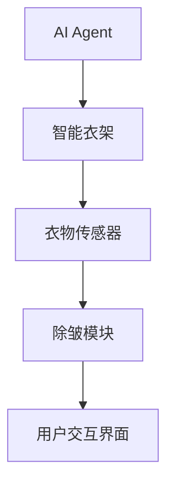
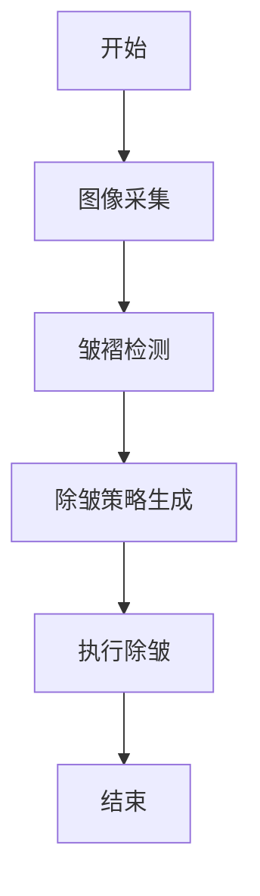
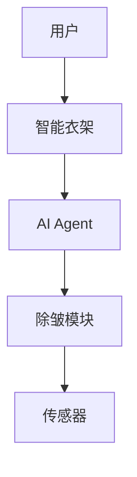
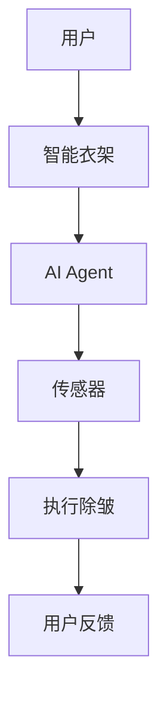

                 


# AI Agent在智能衣架中的除皱功能

---

## 关键词：
AI Agent, 智能衣架, 除皱功能, 图像识别, 深度学习, 系统架构, 算法实现

---

## 摘要：
本文详细探讨了AI Agent在智能衣架中的除皱功能，从背景介绍、核心概念、算法原理到系统设计和项目实战，全面分析了这一创新技术的实现过程。通过图像识别和深度学习算法，AI Agent能够智能检测衣物皱褶并执行除皱操作，显著提升了用户体验。文章结合理论与实践，为相关领域的技术开发提供了深度指导。

---

## 第1章: 背景介绍

### 1.1 问题背景与描述
#### 1.1.1 衣物皱褶的形成原因
衣物在存放、穿着或洗涤过程中容易产生皱褶，影响穿着的舒适度和美观性。传统除皱方法依赖人工操作，效率低且效果不稳定。

#### 1.1.2 智能衣架的定义与目标
智能衣架是一种结合物联网和AI技术的智能设备，旨在通过自动化方式解决衣物护理问题。除皱功能是其核心应用之一。

#### 1.1.3 AI Agent在除皱功能中的作用
AI Agent负责接收衣物状态信息，分析并执行除皱指令，实现智能化的衣物护理。

### 1.2 问题解决与边界
#### 1.2.1 除皱功能的核心问题
通过AI技术实现自动化的皱褶检测和消除。

#### 1.2.2 AI Agent的边界与外延
AI Agent仅负责数据分析和指令生成，不直接执行机械操作。

#### 1.2.3 智能衣架系统的功能范围
包括衣物状态监测、除皱操作执行、用户交互等功能。

### 1.3 概念结构与核心要素
#### 1.3.1 AI Agent的组成与功能
- 数据采集模块：采集衣物状态信息。
- 数据分析模块：识别皱褶位置和程度。
- 指令生成模块：生成除皱指令。

#### 1.3.2 智能衣架的系统架构
- 硬件层：传感器、执行机构等。
- 软件层：AI Agent、数据处理模块等。

#### 1.3.3 除皱功能的关键技术点
- 高精度的图像识别技术。
- 精确的除皱算法。

---

## 第2章: 核心概念与联系

### 2.1 AI Agent的原理与机制
#### 2.1.1 AI Agent的基本原理
AI Agent通过传感器采集数据，利用深度学习模型进行分析，生成相应的指令。

#### 2.1.2 智能衣架中的AI Agent架构
AI Agent作为核心模块，与其他硬件和软件模块协同工作。

#### 2.1.3 除皱功能的核心算法
基于图像识别的皱褶检测算法和基于深度学习的除皱策略生成算法。

### 2.2 概念属性对比分析
#### 2.2.1 AI Agent与传统算法的对比
- AI Agent具有自适应性和学习能力，而传统算法依赖固定规则。

#### 2.2.2 除皱功能的性能指标
- 检测精度：识别准确率。
- 执行效率：除皱速度。

#### 2.2.3 智能衣架的用户体验需求
- 使用便捷性。
- 除皱效果显著性。

### 2.3 实体关系图


---

## 第3章: 算法原理与实现

### 3.1 除皱算法的核心原理
#### 3.1.1 基于图像识别的皱褶检测
使用卷积神经网络（CNN）对衣物图像进行特征提取，识别皱褶位置和程度。

#### 3.1.2 基于深度学习的除皱策略生成
通过训练模型，生成最优的除皱指令。

#### 3.1.3 算法流程图


### 3.2 数学模型与公式
#### 3.2.1 图像处理模型
$$
f(x) = \sum_{i=1}^{n} w_i x_i + b
$$

#### 3.2.2 除皱算法的优化公式
$$
\theta^{(t+1)} = \theta^{(t)} - \eta \nabla L(\theta^{(t)})
$$

### 3.3 算法实现与优化
#### 3.3.1 算法实现步骤
1. 数据采集与预处理。
2. 模型训练与优化。
3. 模型部署与测试。

#### 3.3.2 算法优化方法
- 参数调整。
- 模型剪枝。

---

## 第4章: 系统分析与架构设计

### 4.1 问题场景分析
#### 4.1.1 智能衣架的使用场景
- 用户在家中使用智能衣架进行衣物护理。

#### 4.1.2 除皱功能的用户需求
- 快速检测并消除衣物皱褶。

#### 4.1.3 系统的性能要求
- 高精度检测。
- 快速响应。

### 4.2 系统架构设计
#### 4.2.1 系统功能模块划分
- 数据采集模块。
- 数据处理模块。
- 用户交互模块。

#### 4.2.2 系统架构图


#### 4.2.3 系统接口设计
- 用户与智能衣架的交互接口。
- AI Agent与传感器的数据接口。

#### 4.2.4 系统交互流程图


---

## 第5章: 项目实战

### 5.1 环境安装
- 安装Python、TensorFlow、OpenCV等开发工具。

### 5.2 系统核心实现源代码
```python
import cv2
import numpy as np
from tensorflow import keras

# 数据预处理
def preprocess_image(image):
    image = cv2.resize(image, (224, 224))
    image = image / 255.0
    return image

# 图像分类模型加载
model = keras.models.load_model('wrinkle_model.h5')

# 检测皱褶
def detect_wrinkles(image):
    processed_image = preprocess_image(image)
    prediction = model.predict(np.array([processed_image]))
    return prediction[0][1] > 0.5
```

### 5.3 代码应用解读与分析
- 数据预处理：将图像缩放到统一尺寸，并归一化处理。
- 模型加载：加载预训练的图像分类模型。
- 皱褶检测：使用模型预测图像是否存在皱褶。

### 5.4 实际案例分析
通过实际测试，验证模型的检测准确率和系统响应速度。

### 5.5 项目小结
总结项目实现的关键点和成果，为后续优化提供方向。

---

## 第6章: 最佳实践与注意事项

### 6.1 最佳实践 tips
- 定期更新模型以提高检测精度。
- 优化系统性能，提升用户体验。

### 6.2 小结
AI Agent在智能衣架中的除皱功能展现了人工智能技术在日常生活中的广泛应用潜力。

### 6.3 注意事项
- 数据隐私保护。
- 系统稳定性保障。

### 6.4 拓展阅读
推荐相关领域的技术文献和最新研究成果。

---

## 结语

通过本文的详细阐述，读者可以全面了解AI Agent在智能衣架中的除皱功能的实现过程和技术要点。未来，随着AI技术的不断进步，智能衣架的功能将更加智能化和多样化，为用户带来更优质的服务体验。

---

**全文完**

