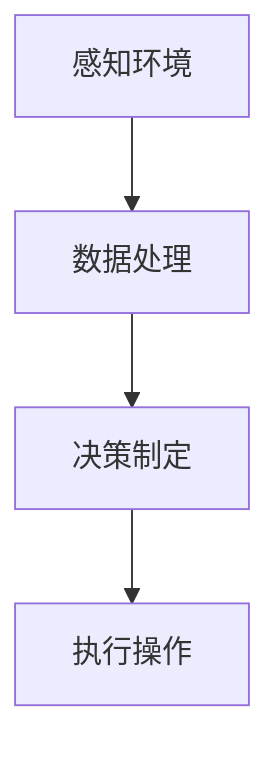
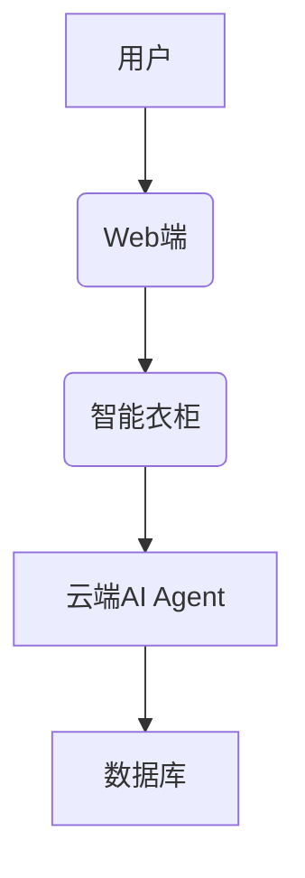
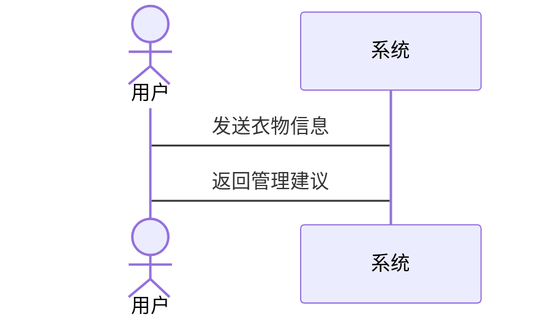

                 


# AI Agent在智能衣柜中的季节性衣物管理

> 关键词：AI Agent, 智能衣柜, 季节性衣物管理, 物联网技术, 分类算法, 系统架构

> 摘要：本文深入探讨了AI Agent在智能衣柜中的应用，特别是如何通过AI技术实现季节性衣物的有效管理。文章从背景、核心概念、算法原理、系统架构到项目实战，全面分析了AI Agent在智能衣柜中的技术实现和实际应用，为相关领域的研究和实践提供了有价值的参考。

---

# 第一部分: AI Agent在智能衣柜中的背景与概念

## 第1章: AI Agent与智能衣柜概述

### 1.1 问题背景与需求分析

#### 1.1.1 季节性衣物管理问题的提出
在现代生活中，季节性衣物的管理是一个常见但容易被忽视的问题。随着生活水平的提高，人们拥有的衣物数量越来越多，但如何高效管理这些衣物成为一项挑战。传统衣柜管理方式依赖人工分类和记忆，效率低下且容易出错。特别是在季节变换时，用户需要快速找到适合当前季节的衣物，但往往因为衣物混杂而难以快速决策。

#### 1.1.2 智能衣柜的核心需求
智能衣柜的核心需求包括：
1. 自动分类和整理衣物。
2. 根据天气和用户需求推荐适合的衣物。
3. 实时监控衣物状态（如是否需要清洗、损坏等）。
4. 提供便捷的管理界面，支持用户快速查找和决策。

#### 1.1.3 AI Agent在衣物管理中的应用价值
AI Agent（人工智能代理）是一种能够感知环境、自主决策并执行任务的智能实体。将其应用于智能衣柜中，可以通过以下方式提升用户体验：
- 自动识别衣物的类型、品牌、材质等信息。
- 根据天气预报和用户的日程安排，推荐适合的衣物组合。
- 学习用户的穿衣习惯，优化衣物分类和管理策略。

### 1.2 技术背景与发展趋势

#### 1.2.1 AI Agent的基本概念
AI Agent是一种具有感知、推理、规划和执行能力的智能系统。它可以分为以下几类：
- **反应式AI Agent**：基于当前感知做出实时反应。
- **认知式AI Agent**：具有复杂推理和规划能力。
- **学习型AI Agent**：能够通过数据和经验不断优化自身的决策能力。

#### 1.2.2 物联网技术在智能衣柜中的应用
智能衣柜的实现离不开物联网技术的支持。通过传感器和智能设备，AI Agent可以实时感知衣柜内的环境（如温度、湿度）和衣物状态（如位置、数量）。物联网技术为AI Agent提供了丰富的数据来源，使其能够更精准地进行衣物管理。

#### 1.2.3 季节性衣物管理的技术挑战与解决方案
季节性衣物管理的主要挑战包括：
- 如何准确识别衣物的季节属性。
- 如何根据天气变化快速调整衣物推荐策略。
- 如何处理大量数据以提高决策效率。

解决方案包括：
- 使用图像识别技术自动分类衣物。
- 基于机器学习算法预测天气变化。
- 通过边缘计算优化数据处理效率。

### 1.3 用户需求与业务价值

#### 1.3.1 用户需求分析
用户对智能衣柜的主要需求包括：
- 快速查找衣物，减少穿衣决策时间。
- 自动分类和整理衣物，节省时间。
- 根据天气和个人喜好推荐衣物。

#### 1.3.2 业务价值的实现路径
智能衣柜通过AI Agent技术，可以为用户提供以下价值：
- 提高衣物利用率，减少浪费。
- 提供个性化服务，增强用户体验。
- 通过数据收集和分析，为服装品牌和零售商提供市场洞察。

#### 1.3.3 市场潜力与应用前景
随着智能家居和物联网技术的普及，智能衣柜市场潜力巨大。AI Agent在其中扮演着关键角色，未来将有更多创新应用出现，如与智能家居系统的深度整合、与电商平台的联动推荐等。

### 1.4 本章小结
本章介绍了AI Agent在智能衣柜中的背景与概念，分析了季节性衣物管理的挑战和解决方案，并探讨了其市场潜力和应用前景。下一章将深入探讨AI Agent的核心原理与系统架构。

---

## 第2章: AI Agent的核心原理与系统架构

### 2.1 AI Agent的定义与核心要素

#### 2.1.1 AI Agent的定义
AI Agent是一种能够感知环境、自主决策并执行任务的智能实体。它通过与环境和其他智能体的交互，实现特定目标。

#### 2.1.2 核心要素与属性特征对比表
以下是AI Agent的核心要素与属性特征对比表：

| 核心要素       | 属性特征                 |
|----------------|--------------------------|
| 感知能力       | 多模态感知（视觉、听觉等） |
| 决策能力       | 基于数据的最优决策       |
| 执行能力       | 自动化执行任务           |
| 学习能力       | 基于反馈的持续优化       |

#### 2.1.3 ER实体关系图
以下是智能衣柜系统中的ER实体关系图：

```mermaid
erd
actor 用户
database 衣柜数据库
object 衣物
object 天气数据
object 用户偏好
```

### 2.2 AI Agent的工作流程与算法原理

#### 2.2.1 AI Agent的工作流程
AI Agent在智能衣柜中的工作流程如下：

1. **感知环境**：通过传感器和摄像头获取衣柜内的环境数据（如温度、湿度）和衣物信息（如类型、品牌）。
2. **数据处理**：将感知到的数据进行清洗、归类和分析，提取有用的信息。
3. **决策制定**：基于分析结果和用户偏好，制定衣物管理策略。
4. **执行操作**：根据决策结果执行具体操作，如自动分类衣物、推荐衣物组合。

以下是AI Agent的工作流程图：



#### 2.2.2 算法原理
AI Agent的核心算法是基于机器学习的分类和推荐算法。以下是常用的两种算法及其数学模型：

1. **决策树分类算法**：
   - 基于ID3或C4.5算法构建决策树。
   - 通过信息增益率选择最优特征。
   - 分类公式如下：
     $$ P(y|x) = \frac{P(x|y)P(y)}{P(x)} $$

2. **协同过滤推荐算法**：
   - 基于用户行为数据构建相似性矩阵。
   - 推荐公式如下：
     $$ sim(i, j) = \frac{\sum_{k} (r_{ik} - \bar{r_i})(r_{jk} - \bar{r_j})}{\sqrt{\sum_{k} (r_{ik} - \bar{r_i})^2} \cdot \sqrt{\sum_{k} (r_{jk} - \bar{r_j})^2}} $$

#### 2.2.3 算法实现的Python代码示例
以下是基于决策树的分类算法实现代码：

```python
from sklearn.tree import DecisionTreeClassifier
import pandas as pd

# 数据预处理
data = pd.read_csv('clothes.csv')
X = data[['type', 'brand', 'season']]
y = data['label']

# 模型训练
model = DecisionTreeClassifier()
model.fit(X, y)

# 预测
new_clothes = [[ 't-shirt', 'adidas', 'summer']]
print(model.predict(new_clothes))
```

### 2.3 系统架构设计

#### 2.3.1 系统功能模块划分
智能衣柜系统的主要功能模块包括：
- **用户交互模块**：提供人机交互界面，接收用户指令。
- **数据采集模块**：通过传感器和摄像头采集数据。
- **数据处理模块**：对采集到的数据进行清洗、归类和分析。
- **决策模块**：基于数据处理结果制定衣物管理策略。
- **执行模块**：根据决策结果执行具体操作，如自动分类衣物。

#### 2.3.2 系统架构图
以下是系统的架构图：



#### 2.3.3 系统接口与交互设计
系统的接口设计如下：

1. **用户与智能衣柜的交互接口**：
   - 用户通过手机App或Web端与智能衣柜交互。
   - 接收衣物分类结果和推荐建议。

2. **智能衣柜与云端AI Agent的交互接口**：
   - 上传衣物数据和用户偏好。
   - 接收AI Agent的决策结果和执行指令。

以下是系统的交互流程图：



### 2.4 本章小结
本章详细介绍了AI Agent的核心原理和系统架构，分析了其在智能衣柜中的工作流程和算法实现。下一章将通过具体案例分析AI Agent在季节性衣物管理中的实际应用。

---

## 第3章: 项目实战与案例分析

### 3.1 环境配置与数据准备

#### 3.1.1 环境配置
- **操作系统**：Windows 10或更高版本。
- **Python版本**：3.8或更高版本。
- **依赖库安装**：
  ```bash
  pip install scikit-learn pandas mermaid4jupyter
  ```

#### 3.1.2 数据准备
创建一个包含衣物信息的数据集，格式如下：

| 衣物类型 | 品牌 | 季节 | 标签 |
|----------|------|------|------|
| T-shirt  | Adidas| Summer| 0    |
| Dress     | Zara | Winter| 1    |
| Coat      | Armani| Winter| 1    |
| Shorts    | Nike | Summer| 0    |

### 3.2 系统核心实现

#### 3.2.1 数据处理与分类
基于决策树算法对衣物进行分类：

```python
from sklearn.tree import DecisionTreeClassifier
import pandas as pd

# 数据预处理
data = pd.read_csv('clothes.csv')
X = data[['type', 'brand', 'season']]
y = data['label']

# 模型训练
model = DecisionTreeClassifier()
model.fit(X, y)

# 预测
new_clothes = [[ 't-shirt', 'adidas', 'summer']]
print(model.predict(new_clothes))
```

#### 3.2.2 推荐系统实现
基于协同过滤算法推荐适合的衣物：

```python
import numpy as np

# 用户行为数据矩阵
user_clothes_matrix = np.array([[1, 0, 0], [0, 1, 1], [1, 1, 0]])

# 计算相似度
similarity = np.zeros((3, 3))
for i in range(3):
    for j in range(3):
        if i != j:
            similarity[i][j] = np.dot(user_clothes_matrix[i], user_clothes_matrix[j]) / (
                np.sqrt(np.sum(user_clothes_matrix[i] ** 2)) * np.sqrt(np.sum(user_clothes_matrix[j] ** 2)))
```

### 3.3 案例分析与结果解读

#### 3.3.1 案例分析
假设用户当前生活在冬季，系统推荐以下衣物组合：
- 大衣（品牌：Armani）
- 长裤（品牌：Zara）
- 鞋子（品牌：Nike）

#### 3.3.2 结果解读
系统根据当前天气（冬季）和用户的穿衣习惯（偏好大衣和长裤），推荐了适合的衣物组合。同时，系统还会提醒用户检查衣物的状态（如是否有需要清洗或修补的衣物）。

### 3.4 本章小结
本章通过具体的项目实战，展示了AI Agent在智能衣柜中的实际应用。通过环境配置、数据处理和算法实现，验证了AI Agent在季节性衣物管理中的有效性。下一章将总结最佳实践和注意事项，并展望未来的发展方向。

---

## 第4章: 总结与展望

### 4.1 最佳实践 tips
- **数据质量管理**：确保数据的准确性和完整性，避免噪声数据对分类结果的影响。
- **算法选择与优化**：根据具体场景选择合适的算法，并通过不断优化提升系统性能。
- **用户体验设计**：注重人机交互的便捷性和友好性，提高用户的使用体验。

### 4.2 未来展望
- **多模态数据融合**：结合视觉、听觉等多种感知方式，进一步提升AI Agent的感知能力。
- **边缘计算优化**：通过边缘计算技术，降低数据传输和处理的延迟。
- **与智能家居的深度整合**：实现与其他智能家居设备的联动，打造全场景智能生活。

### 4.3 本章小结
本文通过详细分析AI Agent在智能衣柜中的应用，展示了其在季节性衣物管理中的巨大潜力。未来，随着技术的不断进步，AI Agent将在智能衣柜中发挥更加重要的作用，为用户带来更智能、更便捷的生活体验。

---

# 结语

AI Agent作为人工智能领域的核心技术，正在逐步渗透到生活的方方面面。智能衣柜作为其典型应用场景之一，通过AI Agent的赋能，不仅提升了衣物管理的效率，也为用户带来了更智能化的穿衣体验。希望本文的分析和探讨能够为相关领域的研究和实践提供有益的参考和启示。

