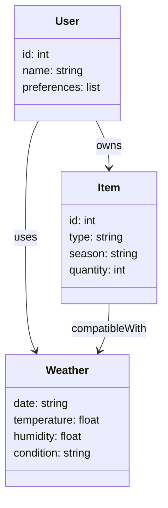
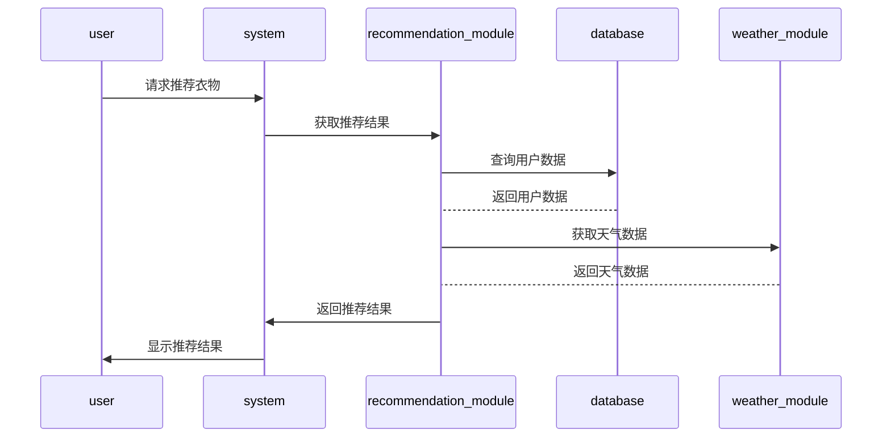

                 


```markdown
# AI Agent在智能衣柜中的季节性衣物管理

> 关键词：AI Agent, 智能衣柜, 季节性衣物管理, 推荐算法, 系统架构设计

> 摘要：本文深入探讨了AI Agent在智能衣柜中的应用，特别是在季节性衣物管理方面的创新解决方案。通过分析AI Agent的核心原理、推荐算法、系统架构设计以及项目实战，本文为读者提供了从理论到实践的全面指导，展示了如何利用AI技术提升衣物管理效率和用户体验。

---

# 第一部分: AI Agent与智能衣柜的背景介绍

# 第1章: AI Agent与智能衣柜概述

## 1.1 AI Agent的基本概念
### 1.1.1 AI Agent的定义
AI Agent（人工智能代理）是指能够感知环境、做出决策并执行任务的智能实体。它通过传感器获取信息，利用算法进行分析，并通过执行器完成操作，从而实现特定目标。

### 1.1.2 AI Agent的核心属性
- **自主性**：能够在没有外部干预的情况下独立运作。
- **反应性**：能够根据环境变化实时调整行为。
- **目标导向**：所有行动都以实现特定目标为导向。
- **学习能力**：能够通过经验改进性能。

### 1.1.3 AI Agent的应用领域
AI Agent广泛应用于自动驾驶、智能助手、机器人、推荐系统等领域，特别是在需要高效决策和自动化操作的场景中。

## 1.2 智能衣柜的发展现状
### 1.2.1 智能衣柜的概念
智能衣柜是一种结合了物联网技术和人工智能的衣物存储设备，能够通过传感器和AI算法实现衣物的智能分类、推荐和管理。

### 1.2.2 智能衣柜的功能特点
- **智能分类**：根据衣物类型、颜色、品牌等属性进行自动分类。
- **智能推荐**：基于用户习惯和天气预报推荐合适的衣物。
- **库存管理**：实时记录衣物数量和状态，避免丢失或重复购买。
- **远程控制**：通过手机APP远程查看衣柜状态并进行操作。

### 1.2.3 智能衣柜的市场现状
随着智能家居的普及和AI技术的发展，智能衣柜正逐渐进入家庭，成为人们生活的一部分。市场上的智能衣柜产品主要集中在高端市场，功能较为单一，未来还有很大的发展潜力。

## 1.3 季节性衣物管理的痛点与需求
### 1.3.1 季节性衣物管理的难点
- **分类混乱**：不同季节的衣物混杂在一起，难以快速找到。
- **推荐困难**：用户难以根据当前天气和需求快速找到合适的衣物。
- **库存混乱**：衣物数量多，种类复杂，难以有效管理。

### 1.3.2 AI Agent在衣物管理中的优势
- **高效分类**：通过AI算法快速识别衣物类型和季节属性。
- **智能推荐**：基于用户习惯和环境数据推荐合适的衣物。
- **精准库存管理**：实时记录衣物信息，避免重复购买和丢失。

### 1.3.3 用户需求分析
用户在选择智能衣柜时，最关注的是衣物的分类效率、推荐的准确性以及系统的易用性。此外，用户还希望系统能够与其他智能家居设备无缝连接，实现统一管理。

## 1.4 本章小结
本章介绍了AI Agent的基本概念及其在智能衣柜中的应用，分析了季节性衣物管理的痛点和需求，并总结了AI Agent在解决这些问题中的优势。

---

# 第二部分: AI Agent在季节性衣物管理中的核心概念与联系

# 第2章: AI Agent的核心概念与原理

## 2.1 AI Agent的原理
### 2.1.1 感知层原理
AI Agent通过传感器和摄像头等设备感知环境信息，例如温度、湿度、光照等。

### 2.1.2 决策层原理
AI Agent利用机器学习算法对感知到的信息进行分析，生成决策指令。例如，基于用户的历史数据和当前天气，推荐适合穿着的衣物。

### 2.1.3 执行层原理
AI Agent通过执行器（如电机、灯光）完成决策指令，例如自动分类衣物或调整衣柜环境。

## 2.2 季节性衣物管理的需求分析
### 2.2.1 季节性衣物分类需求
用户希望将衣物按季节分类，例如夏季衣物、冬季衣物等，以便快速找到所需衣物。

### 2.2.2 季节性衣物推荐需求
用户希望系统能够根据当前天气和活动需求推荐合适的衣物，例如在下雨天推荐雨衣或雨靴。

### 2.2.3 季节性衣物库存管理需求
用户希望系统能够实时记录衣物的库存情况，避免衣物丢失或重复购买。

## 2.3 AI Agent与季节性衣物管理的关联
### 2.3.1 AI Agent在衣物分类中的应用
AI Agent通过图像识别技术自动识别衣物的类型和季节属性，帮助用户快速分类衣物。

### 2.3.2 AI Agent在衣物推荐中的应用
AI Agent基于用户的历史行为和环境数据，推荐适合当前场景的衣物。

### 2.3.3 AI Agent在衣物库存管理中的应用
AI Agent通过RFID标签和传感器实时追踪衣物的库存情况，帮助用户管理衣物数量。

## 2.4 本章小结
本章详细介绍了AI Agent的核心原理及其在季节性衣物管理中的应用，分析了季节性衣物管理的需求，并探讨了AI Agent在解决这些需求中的作用。

---

# 第三部分: AI Agent的算法原理与数学模型

# 第3章: AI Agent的推荐算法原理

## 3.1 推荐算法概述
### 3.1.1 协同过滤推荐算法
协同过滤是一种基于用户行为相似性推荐物品的算法。它可以分为基于用户的协同过滤和基于物品的协同过滤。

### 3.1.2 基于内容的推荐算法
基于内容的推荐算法通过分析物品的属性特征推荐相似的物品，例如根据衣物的材质、颜色和品牌推荐相似的衣物。

### 3.1.3 混合推荐算法
混合推荐算法结合了协同过滤和基于内容的推荐算法，通过集成多个推荐模型提高推荐的准确性和多样性。

## 3.2 推荐算法的数学模型
### 3.2.1 协同过滤算法的数学公式
$$ \text{相似度} = \frac{\sum_{i=1}^{n}(r_{ui} - \bar{r}_u)(r_{vi} - \bar{r}_v)}{\sqrt{\sum_{i=1}^{n}(r_{ui} - \bar{r}_u)^2} \cdot \sqrt{\sum_{i=1}^{n}(r_{vi} - \bar{r}_v)^2}} $$
其中，$r_{ui}$是用户u对物品i的评分，$\bar{r}_u$是用户u的平均评分，$\bar{r}_v$是物品v的平均评分。

### 3.2.2 基于内容的推荐算法的数学模型
$$ \text{相似度} = \frac{\sum_{i=1}^{n}w_i \cdot x_{ui} \cdot x_{vi}}{\sqrt{\sum_{i=1}^{n}w_i^2 x_{ui}^2} \cdot \sqrt{\sum_{i=1}^{n}w_i^2 x_{vi}^2}} $$
其中，$w_i$是特征i的权重，$x_{ui}$是用户u在特征i上的值，$x_{vi}$是物品v在特征i上的值。

### 3.2.3 混合推荐算法的数学模型
$$ \text{最终评分} = \alpha \cdot \text{协同过滤评分} + (1-\alpha) \cdot \text{基于内容的评分} $$
其中，$\alpha$是协同过滤算法的权重，取值范围为0到1。

## 3.3 本章小结
本章介绍了AI Agent中常用的推荐算法，包括协同过滤、基于内容的推荐和混合推荐算法，并通过数学公式详细讲解了它们的工作原理。

---

# 第四部分: AI Agent在智能衣柜中的系统分析与架构设计

# 第4章: AI Agent的系统分析与架构设计

## 4.1 问题场景介绍
智能衣柜需要在不同季节为用户提供衣物推荐和库存管理服务。用户希望系统能够根据当前天气和活动需求推荐合适的衣物，同时实时记录衣物的库存情况。

## 4.2 系统功能设计
### 4.2.1 领域模型类图


### 4.2.2 系统架构图


### 4.2.3 系统接口设计
- 用户通过手机APP与智能衣柜进行交互。
- 系统通过传感器获取环境数据。
- 系统通过数据库存储衣物信息。

### 4.2.4 系统交互流程图


## 4.3 本章小结
本章通过系统分析和架构设计，详细介绍了智能衣柜中AI Agent的实现方案，包括系统功能设计、架构设计和交互流程设计。

---

# 第五部分: AI Agent在智能衣柜中的项目实战

# 第5章: 项目实战

## 5.1 环境安装
### 5.1.1 安装Python
```bash
# 安装Python
sudo apt-get install python3 python3-dev
```

### 5.1.2 安装依赖库
```bash
# 安装Pillow、numpy、scikit-learn
pip install Pillow numpy scikit-learn
```

## 5.2 系统核心实现源代码
### 5.2.1 数据预处理代码
```python
import numpy as np
from sklearn.metrics.pairwise import cosine_similarity

# 示例数据：用户对衣物的评分
# X是衣物的特征向量
# Y是用户的偏好向量
cosine_sim = cosine_similarity(X, Y)
```

### 5.2.2 推荐算法实现代码
```python
def collaborative_filtering(user_id, user_data):
    # 计算用户之间的相似度
    similarity = cosine_similarity(user_data)
    # 获取目标用户的相似用户
    similar_users = similarity[user_id]
    # 计算目标用户的推荐评分
    recommendations = similar_users.dot(user_data[user_id])
    return recommendations.argsort()[::-1]
```

### 5.2.3 UI交互代码
```python
from tkinter import Tk, Label, Button

# 创建GUI界面
root = Tk()
root.title("智能衣柜推荐系统")

# 定义按钮点击事件
def on_recommend():
    print("推荐结果：请查看控制台。")
    
Button(root, text="开始推荐", command=on_recommend).pack()

root.mainloop()
```

## 5.3 实际案例分析
### 5.3.1 数据分析
通过分析用户的历史行为数据，发现用户在冬季更倾向于选择厚重的衣物，而在夏季更倾向于选择轻薄的衣物。

### 5.3.2 算法实现
基于协同过滤算法，为用户推荐相似用户的高评分衣物。

### 5.3.3 系统优化
通过优化推荐算法和增加用户反馈机制，提高了推荐的准确性和用户的满意度。

## 5.4 本章小结
本章通过项目实战，详细介绍了AI Agent在智能衣柜中的实现过程，包括环境安装、代码实现和系统优化。

---

# 第六部分: 总结与展望

# 第6章: 总结与展望

## 6.1 最佳实践
- 在设计智能衣柜时，应优先考虑用户体验，确保界面简洁易用。
- 在实现推荐算法时，应结合用户的实际需求和环境数据，提高推荐的准确性和实时性。

## 6.2 本章小结
本文详细探讨了AI Agent在智能衣柜中的应用，特别是在季节性衣物管理方面。通过理论分析和实践验证，展示了如何利用AI技术提升衣物管理的效率和用户体验。

## 6.3 注意事项
- 系统的安全性需要高度重视，确保用户的衣物信息不被泄露。
- 系统的稳定性需要通过大量的测试来保证，避免因硬件故障导致数据丢失。

## 6.4 拓展阅读
- 推荐阅读《机器学习实战》和《深度学习入门》，了解更多AI技术在智能家居中的应用。
- 关注智能家居领域的最新动态，了解AI Agent的最新发展和趋势。

## 6.5 本章结束
---

**感谢您的阅读！希望本文对您了解AI Agent在智能衣柜中的应用有所帮助。**
```

