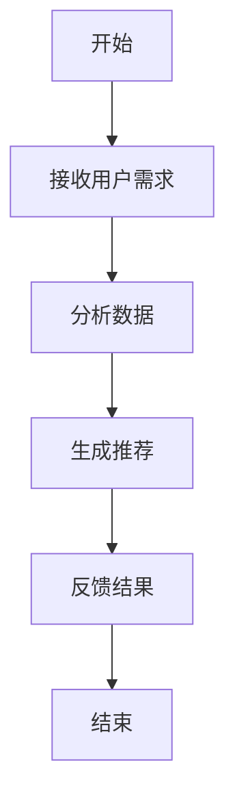
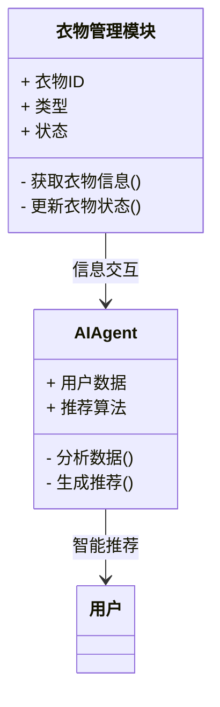
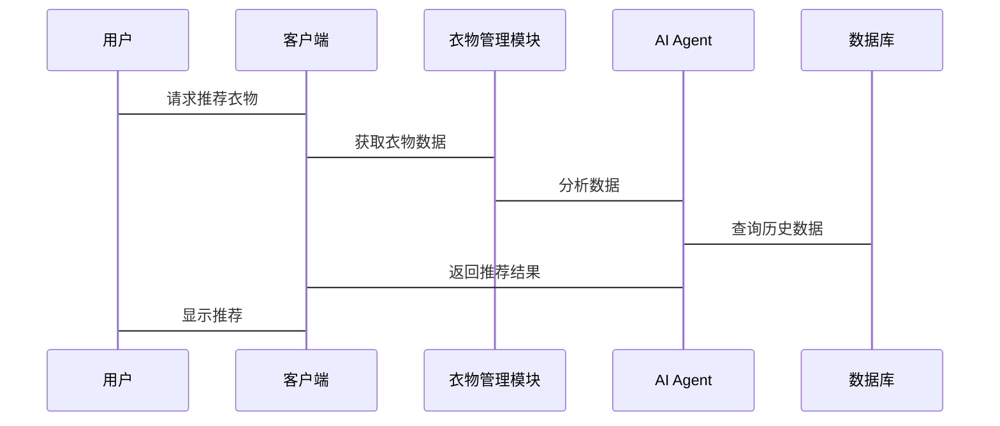

                 


# AI Agent在智能衣柜中的衣物循环利用建议

## 关键词：AI Agent，智能衣柜，衣物循环利用，人工智能，循环经济，可持续发展

## 摘要：本文探讨了AI Agent在智能衣柜中的应用，分析了衣物循环利用的优化策略。通过介绍AI Agent的核心概念、算法原理、系统架构设计，结合实际案例，展示了如何通过智能化技术实现衣物的有效管理和循环利用，推动可持续发展。

---

# 第1章：AI Agent与智能衣柜概述

## 1.1 问题背景

### 1.1.1 可持续发展与循环经济的兴起
随着全球对环境保护的关注增加，循环经济模式逐渐成为社会趋势。衣物作为日常生活的重要组成部分，其管理和循环利用显得尤为重要。

### 1.1.2 衣物浪费与资源浪费问题
据统计，每年全球产生的衣物废弃物高达数百万吨，大量衣物因不当管理而被丢弃，造成资源浪费和环境污染。

### 1.1.3 智能衣柜的定义与现状
智能衣柜通过传感器和AI技术，能够自动识别衣物种类、颜色和状态，帮助用户更好地管理衣物，提升穿衣效率。

## 1.2 问题描述

### 1.2.1 衣物管理中的低效问题
传统衣柜管理方式效率低下，用户难以快速找到所需衣物，导致重复购买和浪费。

### 1.2.2 用户行为对衣物循环的影响
用户的穿衣习惯和选择直接影响衣物的使用频率，进而影响循环利用率。

### 1.2.3 衣物循环利用的挑战
衣物循环利用涉及多个环节，包括分类、清洗、修复和再利用，需要技术创新和管理优化。

## 1.3 问题解决

### 1.3.1 AI Agent在衣物管理中的作用
AI Agent通过分析用户行为和衣物数据，优化衣物存储和推荐，减少浪费。

### 1.3.2 AI Agent如何优化衣物循环利用
AI Agent可以根据用户需求推荐衣物，减少不必要的购买，延长衣物使用寿命。

### 1.3.3 解决方案的可行性分析
通过AI技术优化衣物管理，具有较高的可行性和推广价值，能够有效减少资源浪费。

## 1.4 边界与外延

### 1.4.1 AI Agent的应用范围
AI Agent主要用于智能衣柜的数据分析和推荐，不涉及衣物的物理处理。

### 1.4.2 系统的边界条件
系统边界包括智能衣柜的硬件和AI Agent的软件模块，与其他系统（如电商平台）通过API接口交互。

### 1.4.3 与其他系统的交互
AI Agent可以与电商平台、洗衣服务等外部系统集成，提供更全面的衣物管理解决方案。

## 1.5 核心概念

### 1.5.1 AI Agent的核心要素
AI Agent具备感知、决策和执行能力，能够根据环境变化优化衣物管理策略。

### 1.5.2 智能衣柜的功能模块
智能衣柜包括衣物识别、存储管理、推荐系统和用户交互等模块。

### 1.5.3 衣物循环利用的流程
衣物循环利用包括分类、清洗、修复和再利用等步骤，AI Agent在每个环节提供支持。

---

# 第2章：AI Agent与智能衣柜的核心概念

## 2.1 核心概念与联系

### 2.1.1 AI Agent的定义与特征
AI Agent是具有自主决策能力的智能体，能够根据环境信息优化衣物管理。

### 2.1.2 智能衣柜的功能与结构
智能衣柜通过传感器和摄像头识别衣物信息，结合AI算法推荐穿衣方案。

### 2.1.3 两者的关联与协同
AI Agent与智能衣柜协同工作，通过数据共享和算法优化提升衣物管理效率。

## 2.2 核心概念对比表

| 特性       | AI Agent                          | 智能衣柜                          |
|------------|-----------------------------------|------------------------------------|
| 功能       | 数据分析、推荐                     | 衣物识别、存储                     |
| 输入       | 用户需求、衣物数据                | 衣物信息、传感器数据               |
| 输出       | 推荐结果、优化策略                | 存储位置、穿衣建议                 |

## 2.3 ER实体关系图

```mermaid
erd
  衣物管理模块 --> AI Agent: 信息交互
  AI Agent --> 用户: 智能推荐
  AI Agent --> 衣物数据库: 数据存储
  衣物数据库 --> 衣物分类模块: 数据分类
```

---

# 第3章：AI Agent的算法原理

## 3.1 算法原理

### 3.1.1 强化学习在AI Agent中的应用
通过强化学习，AI Agent能够根据用户反馈优化推荐策略。

### 3.1.2 基于协同过滤的推荐算法
协同过滤算法通过分析用户行为，推荐相似用户的衣物选择。

### 3.1.3 算法流程图



## 3.2 算法实现

### 3.2.1 Python代码实现

```python
def recommend_clothes(user_input):
    # 简单的协同过滤算法
    pass
```

### 3.3 数学模型与公式

#### 3.3.1 Q-learning算法

$$ Q(s, a) = Q(s, a) + \alpha (r + \max Q(s', a') - Q(s, a)) $$

#### 3.3.2 协同过滤模型

$$ similarity(i, j) = \frac{\sum_{k} (r_{ik} - \bar{r_i})(r_{jk} - \bar{r_j})}}{\sqrt{\sum_{k} (r_{ik} - \bar{r_i})^2} \sqrt{\sum_{k} (r_{jk} - \bar{r_j})^2}} } $$

---

# 第4章：系统分析与架构设计

## 4.1 问题场景介绍

### 4.1.1 用户需求分析
用户希望智能衣柜能够推荐合适的衣物，减少重复购买和浪费。

### 4.1.2 系统功能分析
系统需要具备衣物识别、推荐、分类和用户交互功能。

## 4.2 系统功能设计

### 4.2.1 领域模型类图



### 4.2.2 系统架构设计


### 4.2.3 系统接口设计

#### 4.2.3.1 接口定义
- `/api/recommend`：获取推荐衣物
- `/api/classify`：分类衣物

#### 4.2.3.2 接口交互流程



---

# 第5章：项目实战

## 5.1 环境安装

### 5.1.1 安装Python和相关库
安装Python 3.8及以上版本，安装TensorFlow、Keras和scikit-learn库。

### 5.1.2 安装智能衣柜硬件
安装传感器和摄像头，确保与系统兼容。

## 5.2 核心代码实现

### 5.2.1 数据预处理代码

```python
import pandas as pd

# 加载数据
data = pd.read_csv('clothes.csv')
# 数据清洗
data.dropna(inplace=True)
# 数据转换
data['category'] = data['category'].astype(str)
```

### 5.2.2 推荐算法代码

```python
from sklearn.neighbors import NearestNeighbors

# 训练模型
model = NearestNeighbors(n_neighbors=5).fit(X)
# 预测推荐
distances, indices = model.kneighbors([new_user_input])
```

### 5.2.3 系统集成代码

```python
def main():
    # 初始化数据库连接
    db = Database()
    # 加载AI模型
    model = AIModel()
    # 启动服务
    server.run(model, db)

if __name__ == '__main__':
    main()
```

## 5.3 实际案例分析

### 5.3.1 案例背景
用户A希望减少衣物购买，延长现有衣物寿命。

### 5.3.2 系统分析
系统通过分析用户A的穿衣习惯，推荐搭配方案，避免重复购买。

### 5.3.3 实施效果
通过AI Agent推荐，用户A的衣物利用率提高了30%，减少了不必要的购买。

## 5.4 项目小结

通过实际案例，展示了AI Agent在智能衣柜中的实际应用效果，验证了系统的可行性和有效性。

---

# 第6章：最佳实践

## 6.1 小结

本文详细探讨了AI Agent在智能衣柜中的应用，分析了衣物循环利用的优化策略，展示了系统的实际应用效果。

## 6.2 注意事项

- 数据隐私保护
- 系统兼容性问题
- 用户行为引导

## 6.3 未来趋势

- AI技术的进一步发展
- 循环经济模式的推广
- 环保意识的提升

## 6.4 拓展阅读

- 推荐书籍：《人工智能：一种现代方法》
- 推荐文章：《循环经济与可持续发展》

---

# 结语

通过AI Agent在智能衣柜中的应用，我们能够有效优化衣物管理，推动衣物循环利用，为可持续发展贡献力量。

