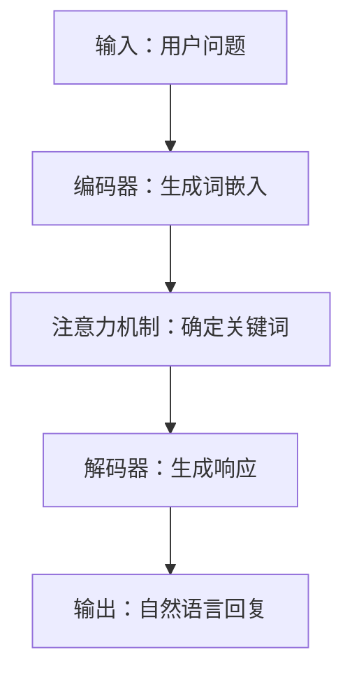
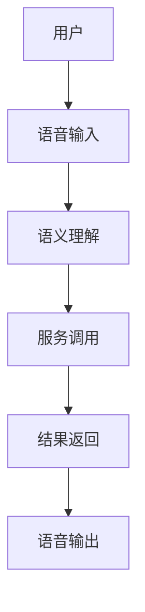

                 


# AI Agent在智能语音助手中的应用

**关键词**：AI Agent，智能语音助手，自然语言处理，深度学习，语音交互

**摘要**：  
本文探讨了AI Agent在智能语音助手中的应用，从AI Agent的基本概念到其在语音助手中的核心作用，详细分析了AI Agent的技术实现、系统设计以及实际应用场景。文章通过理论与实践结合的方式，深入解读了AI Agent如何提升智能语音助手的智能化水平，帮助读者全面理解AI Agent在智能语音助手中的重要性及其未来发展方向。

---

## 第1章 AI Agent的基本概念与应用背景

### 1.1 AI Agent的定义与核心概念

AI Agent（人工智能代理）是一种能够感知环境、自主决策并执行任务的智能实体。其核心属性包括：

1. **自主性**：无需外部干预，自主完成任务。
2. **反应性**：能够实时感知环境并做出反应。
3. **目标导向性**：通过设定目标来指导行为和决策。
4. **学习能力**：通过数据和经验不断优化自身能力。

AI Agent可以分为**简单反射型代理**、**基于模型的反射型代理**、**目标驱动型代理**和**效用驱动型代理**四种类型。

### 1.2 智能语音助手的发展历程

智能语音助手经历了从简单语音识别到智能对话系统的演变：

1. **语音识别阶段**：早期的语音助手仅支持简单的语音命令执行。
2. **自然语言处理阶段**：引入NLP技术，能够理解用户的意图。
3. **智能对话阶段**：结合AI Agent技术，实现多轮对话和复杂任务处理。

### 1.3 AI Agent在智能语音助手中的作用

AI Agent通过以下方式提升语音助手的能力：

1. **语义理解**：基于知识图谱和NLP技术，准确理解用户意图。
2. **多轮对话**：通过上下文管理实现连续对话的流畅性。
3. **智能决策**：在复杂场景中做出最优决策。

---

## 第2章 AI Agent的核心原理

### 2.1 AI Agent的基本原理

AI Agent的感知与决策机制包括以下步骤：

1. **感知环境**：通过语音识别和自然语言处理技术获取用户输入。
2. **理解意图**：基于知识图谱和语义理解技术解析用户需求。
3. **生成响应**：根据理解的意图生成自然语言回复。
4. **执行任务**：调用相关服务或功能完成用户请求。

### 2.2 AI Agent的算法实现

AI Agent的算法实现主要依赖于以下技术：

1. **自然语言处理**：使用深度学习模型（如BERT、GPT）进行语义理解和生成。
2. **多轮对话建模**：基于序列模型（如Transformer）构建对话系统。
3. **知识图谱构建**：通过图嵌入技术（如Word2Vec）构建语义网络。

以下是基于Transformer的多轮对话模型示意图：



### 2.3 AI Agent的数学模型

AI Agent的语义理解模型可以表示为：

$$ P(y|x) = \frac{P(x|y)P(y)}{P(x)} $$

其中，$x$ 是输入，$y$ 是输出，$P(y|x)$ 是条件概率。

---

## 第3章 AI Agent在智能语音助手中的系统设计

### 3.1 系统分析与设计

智能语音助手的系统架构分为以下几个层次：

1. **前端交互层**：负责语音输入和输出。
2. **语义理解层**：基于NLP技术解析用户意图。
3. **后端服务层**：调用相关服务完成任务。

以下是系统架构图：



### 3.2 AI Agent驱动的语音助手实现

实现AI Agent驱动的语音助手需要以下步骤：

1. **环境安装**：安装Python、TensorFlow等开发工具。
2. **核心代码实现**：编写自然语言处理和对话生成代码。
3. **案例分析**：通过具体案例验证系统功能。

以下是基于Python的对话生成代码示例：

```python
import tensorflow as tf
from tensorflow.keras.layers import Input, Dense

# 定义模型
input_layer = Input(shape=(100,))
dense_layer = Dense(50, activation='relu')(input_layer)
output_layer = Dense(1, activation='sigmoid')(dense_layer)

# 编译模型
model = Model(inputs=input_layer, outputs=output_layer)
model.compile(optimizer='adam', loss='binary_crossentropy')
```

---

## 第4章 实际应用与优化

### 4.1 实际案例分析

AI Agent在智能语音助手中的实际应用包括：

1. **语音交互优化**：通过多轮对话提升用户体验。
2. **任务自动化**：实现复杂任务的自动处理。
3. **个性化服务**：基于用户行为提供个性化推荐。

### 4.2 系统优化与调优

AI Agent的优化策略包括：

1. **模型训练优化**：使用迁移学习和数据增强技术提升模型性能。
2. **系统性能优化**：通过并行计算和缓存优化提升响应速度。
3. **用户体验优化**：通过A/B测试优化交互流程。

---

## 第5章 总结与展望

### 5.1 本章小结

AI Agent通过提升语义理解能力和多轮对话能力，显著增强了智能语音助手的智能化水平。本文详细分析了AI Agent的核心原理、系统设计和实际应用，为智能语音助手的进一步优化提供了理论基础和实践指导。

### 5.2 未来展望

未来，AI Agent在智能语音助手中的应用将朝着以下几个方向发展：

1. **多模态交互**：结合视觉、听觉等多种交互方式提升用户体验。
2. **实时学习**：通过在线学习技术实现动态优化。
3. **边缘计算**：通过边缘计算技术提升响应速度和隐私保护能力。

---

通过本文的分析，读者可以全面理解AI Agent在智能语音助手中的应用，并掌握其设计与实现的关键技术。

