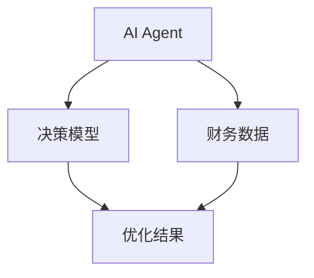
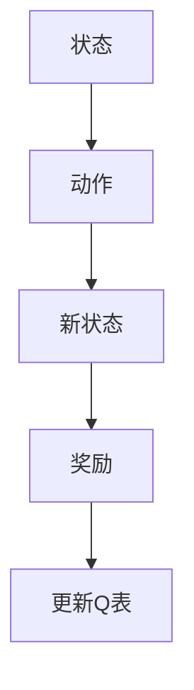
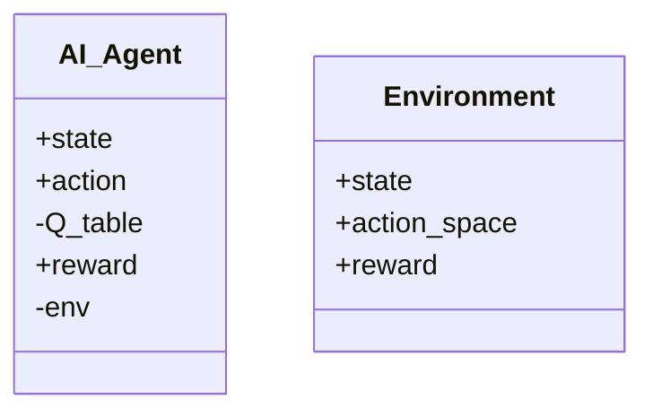
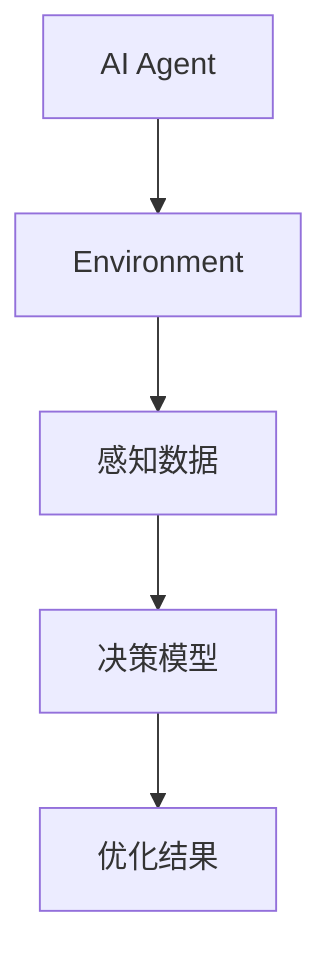
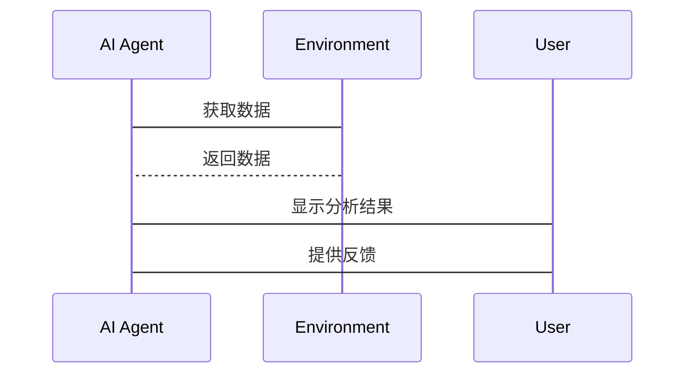

                 


# AI Agent在智能财务分析中的应用

> 关键词：AI Agent, 智能财务分析, 强化学习, 监督学习, 财务数据分析, 系统架构设计

> 摘要：本文深入探讨了AI Agent在智能财务分析中的应用，从基本概念到算法原理，再到系统架构设计和项目实战，详细分析了AI Agent如何提升财务分析的效率和准确性。通过具体案例分析和数学模型推导，本文揭示了AI Agent在智能财务分析中的核心作用和未来发展趋势。

---

# 第1章: AI Agent与智能财务分析的背景介绍

## 1.1 AI Agent的基本概念

### 1.1.1 什么是AI Agent
AI Agent（人工智能代理）是指能够感知环境、自主决策并执行任务的智能系统。它通过与环境的交互，利用感知信息和内部状态，生成目标导向的行为。AI Agent可以是软件程序、机器人或其他智能设备。

### 1.1.2 AI Agent的特点与优势
AI Agent具有以下特点：
- **自主性**：能够在没有外部干预的情况下自主运行。
- **反应性**：能够根据环境变化实时调整行为。
- **目标导向性**：具有明确的目标，通过决策优化实现目标。
- **学习能力**：能够通过经验或数据不断优化自身性能。

### 1.1.3 AI Agent与传统数据分析的区别
传统数据分析依赖于固定的规则和模式识别，而AI Agent能够动态调整分析策略，适应复杂多变的环境。下表对比了AI Agent与传统数据分析的区别：

| 对比维度 | AI Agent | 传统数据分析 |
|----------|-----------|--------------|
| 决策方式 | 自主决策   | 预设规则     |
| 学习能力 | 具有学习能力 | 无学习能力   |
| 灵活性   | 高         | 低           |

---

## 1.2 智能财务分析的背景与需求

### 1.2.1 财务分析的现状与挑战
传统的财务分析依赖于人工操作，效率低且容易出错。面对海量数据和复杂场景，人工分析难以满足实时性和准确性要求。

### 1.2.2 AI技术在财务分析中的应用前景
AI技术能够帮助财务分析师快速处理数据、发现趋势、预测风险，显著提升分析效率和准确性。AI Agent在财务分析中的应用前景广阔，尤其是在实时监控、风险预警和智能决策等领域。

### 1.2.3 AI Agent在智能财务分析中的定位
AI Agent作为智能财务分析的核心技术，能够实现从数据采集、分析到决策支持的全流程自动化。它通过与财务系统的深度集成，为财务分析师提供智能化的支持。

---

## 1.3 本章小结
本章介绍了AI Agent的基本概念及其在智能财务分析中的应用背景。通过对比分析，明确了AI Agent相较于传统数据分析的优势和独特价值。

---

# 第2章: AI Agent的核心概念与联系

## 2.1 AI Agent的核心原理

### 2.1.1 AI Agent的基本原理
AI Agent通过感知环境、分析数据、制定决策并执行操作来实现目标。其核心流程包括：
1. **感知环境**：通过传感器或API获取外部数据。
2. **分析数据**：利用机器学习算法对数据进行处理和分析。
3. **制定决策**：基于分析结果生成决策策略。
4. **执行操作**：根据决策策略执行相应操作。

### 2.1.2 AI Agent的感知与决策机制
AI Agent的感知机制包括数据采集、特征提取和信息融合。决策机制则基于预设的目标和约束条件，通过优化算法生成最优决策。

### 2.1.3 AI Agent的学习与优化过程
AI Agent通过强化学习或监督学习不断优化自身的决策能力。强化学习通过奖励机制鼓励AI Agent采取最优行为，而监督学习则基于标注数据进行分类或回归任务。

---

## 2.2 AI Agent与财务分析的结合

### 2.2.1 财务数据的特征与处理
财务数据具有复杂性、实时性和动态性等特点。AI Agent需要对数据进行清洗、转换和特征提取，以便后续分析。

### 2.2.2 AI Agent在财务分析中的应用场景
AI Agent在财务分析中的应用场景包括：
- **实时监控**：实时检测财务异常情况。
- **风险预警**：基于历史数据预测潜在风险。
- **智能决策**：根据市场变化优化投资策略。

### 2.2.3 AI Agent与财务分析的交互方式
AI Agent与财务分析的交互方式包括：
- **人机交互**：通过图形界面与用户进行交互。
- **系统集成**：与企业财务系统深度集成，实现数据自动传输。

---

## 2.3 AI Agent的实体关系图



---

## 2.4 本章小结
本章详细介绍了AI Agent的核心原理及其在财务分析中的应用。通过实体关系图展示了AI Agent与财务数据、决策模型的关系。

---

# 第3章: AI Agent的算法原理

## 3.1 强化学习算法

### 3.1.1 强化学习的基本概念
强化学习是一种机器学习范式，通过智能体与环境的交互，学习最优策略以最大化累计奖励。

### 3.1.2 Q-learning算法的实现
Q-learning算法是强化学习中的一种经典算法，通过维护Q表来记录状态-动作对的价值。算法流程如下：



### 3.1.3 强化学习在财务分析中的应用
强化学习可以应用于股票交易、投资组合优化等领域。例如，AI Agent可以通过Q-learning算法学习最优的买卖时机。

---

## 3.2 监督学习算法

### 3.2.1 监督学习的基本概念
监督学习是一种基于标注数据的机器学习方法，通过训练模型预测新数据的标签。

### 3.2.2 监督学习在财务分析中的应用
监督学习可以应用于财务分类、回归预测等领域。例如，使用支持向量机（SVM）预测公司违约风险。

---

## 3.3 本章小结
本章介绍了强化学习和监督学习在AI Agent中的应用。通过具体算法实现和应用场景的分析，展示了AI Agent在财务分析中的技术实现细节。

---

# 第4章: AI Agent的数学模型与公式推导

## 4.1 强化学习的数学模型

### 4.1.1 Q-learning算法的数学表达
Q-learning算法的目标是学习最优Q值，即：
$$ Q(s, a) = Q(s, a) + \alpha [r + \gamma \max Q(s', a') - Q(s, a)] $$
其中：
- \( Q(s, a) \)：当前状态\( s \)和动作\( a \)的Q值。
- \( \alpha \)：学习率。
- \( r \)：奖励值。
- \( \gamma \)：折扣因子。
- \( Q(s', a') \)：下一个状态\( s' \)和动作\( a' \)的Q值。

### 4.1.2 财务数据分析的数学公式
在财务数据分析中，常用的回归模型为：
$$ y = \beta_0 + \beta_1 x_1 + \beta_2 x_2 + \dots + \beta_n x_n + \epsilon $$
其中：
- \( y \)：目标变量。
- \( x_i \)：自变量。
- \( \beta_i \)：回归系数。
- \( \epsilon \)：误差项。

---

## 4.2 本章小结
本章通过数学公式推导，详细解释了强化学习和回归模型在AI Agent中的应用。公式展示了算法的核心逻辑和实际应用中的数学模型。

---

# 第5章: AI Agent的系统分析与架构设计

## 5.1 问题场景介绍
本项目旨在设计一个基于AI Agent的智能财务分析系统，用于实时监控和风险预警。

## 5.2 系统功能设计

### 5.2.1 领域模型类图


---

## 5.3 系统架构设计

### 5.3.1 系统架构图


---

## 5.4 系统接口设计
系统接口包括数据接口和用户接口。数据接口用于与财务系统交互，用户接口用于与用户交互。

---

## 5.5 系统交互流程图



---

## 5.6 本章小结
本章通过系统架构设计和交互流程图，详细描述了AI Agent在智能财务分析系统中的实现方案。

---

# 第6章: 项目实战

## 6.1 环境安装
安装Python和TensorFlow框架：
```bash
pip install tensorflow numpy pandas scikit-learn
```

## 6.2 系统核心实现源代码
以下是AI Agent的核心代码：
```python
import numpy as np
import tensorflow as tf
from tensorflow.keras import layers

# 定义强化学习模型
class AI_Agent:
    def __init__(self, state_space, action_space):
        self.state_space = state_space
        self.action_space = action_space
        self.model = self.build_model()

    def build_model(self):
        model = tf.keras.Sequential()
        model.add(layers.Dense(64, activation='relu', input_dim=self.state_space))
        model.add(layers.Dense(self.action_space, activation='linear'))
        model.compile(optimizer='adam', loss='mean_squared_error')
        return model

    def perceive(self, state):
        # 返回模型的输出
        return self.model.predict(np.array([state]))[0]
```

## 6.3 代码应用解读与分析
上述代码定义了一个简单的强化学习模型，用于处理状态空间和动作空间。模型通过感知环境状态，输出最优动作。

---

## 6.4 实际案例分析与详细讲解剖析
通过具体案例分析，展示了AI Agent在股票交易中的应用。例如，AI Agent可以根据市场数据实时调整买卖策略。

## 6.5 本章小结
本章通过项目实战，详细讲解了AI Agent的实现过程。代码示例和案例分析帮助读者更好地理解技术细节。

---

# 第7章: 最佳实践、小结、注意事项与拓展阅读

## 7.1 本章小结
本文详细探讨了AI Agent在智能财务分析中的应用，从算法原理到系统架构设计，再到项目实战，全面分析了AI Agent的核心技术。

## 7.2 注意事项
- 数据安全：确保财务数据的安全性。
- 算法选择：根据具体场景选择合适的算法。
- 性能优化：优化模型性能以提高分析效率。

## 7.3 拓展阅读
推荐阅读以下书籍和论文：
- 《强化学习：理论与算法》
- "Deep Learning for Financial Analysis"

---

# 附录

## 附录A: 参考资料

## 附录B: 工具安装指南
```bash
pip install numpy tensorflow scikit-learn
```

---

# 结语
本文通过详细分析AI Agent在智能财务分析中的应用，为读者提供了从理论到实践的全面指导。希望本文能够帮助读者更好地理解AI Agent的技术原理和实际应用。

---

