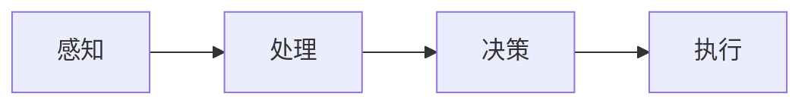
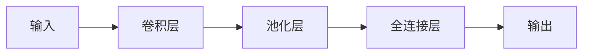
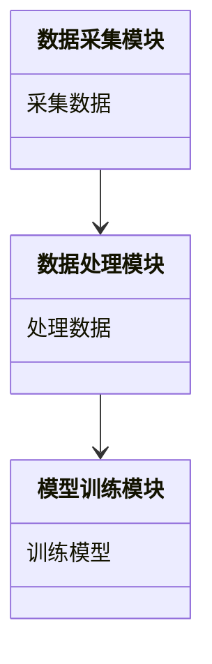
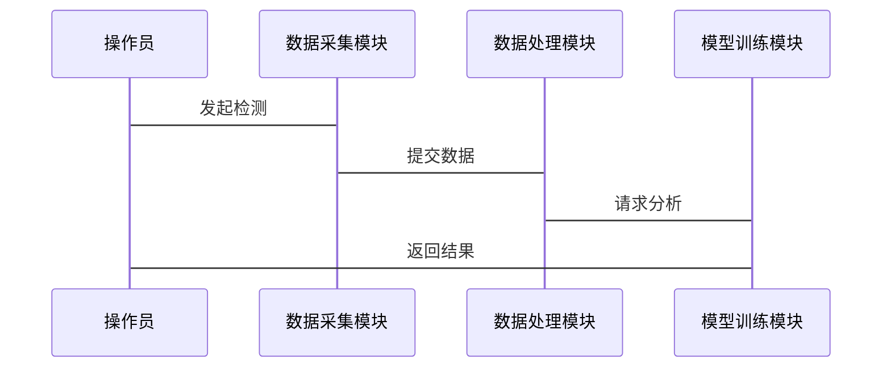

                 


# AI Agent在智能质量控制中的应用

> 关键词：AI Agent，智能质量控制，机器学习，深度学习，质量检测

> 摘要：本文探讨AI Agent在智能质量控制中的应用，分析其核心概念、算法原理、系统架构，并通过案例展示其实现过程，最后总结最佳实践和未来趋势。

---

# 第1章 AI Agent与智能质量控制概述

## 1.1 AI Agent的基本概念

### 1.1.1 AI Agent的定义
AI Agent（人工智能代理）是指能够感知环境、自主决策并执行任务的智能实体。它通过传感器获取数据，利用算法处理信息，并通过执行器与环境交互。

### 1.1.2 AI Agent的核心特性
| 特性 | 描述 |
|------|------|
| 自主性 | 能够独立决策和行动 |
| 反应性 | 能够实时响应环境变化 |
| 学习性 | 能够通过经验改进性能 |

### 1.1.3 AI Agent与传统自动化的区别
| 方面 | AI Agent | 传统自动化 |
|------|---------|------------|
| 决策 | 自主学习 | 预设规则     |
| 灵活性 | 高      | 较低        |
| 效率 | 高      | 一般        |

---

## 1.2 智能质量控制的背景与需求

### 1.2.1 质量控制的传统方法与局限性
传统质量控制依赖人工检测，效率低、易出错。现代制造业对高精度、高效率的需求推动了智能化转型。

### 1.2.2 AI Agent在质量控制中的优势
1. **高效性**：快速处理大量数据。
2. **准确性**：减少人为错误，提高检测精度。
3. **适应性**：能快速调整策略应对变化。

---

# 第2章 AI Agent的核心概念与工作原理

## 2.1 AI Agent的核心概念

### 2.1.1 AI Agent的结构
- **感知层**：通过传感器获取数据。
- **决策层**：利用算法进行分析和决策。
- **执行层**：通过执行器完成任务。

### 2.1.2 AI Agent的工作流程


---

## 2.2 AI Agent的算法与模型

### 2.2.1 常见算法
1. **支持向量机（SVM）**：用于分类任务。
2. **卷积神经网络（CNN）**：用于图像识别。

### 2.2.2 SVM的数学模型
$$ \text{目标函数：} \min \frac{1}{2}||\theta||^2 $$
$$ \text{约束条件：} y_i(\theta \cdot x_i + b) \geq 1 $$

### 2.2.3 CNN的结构


---

# 第3章 质量控制的智能分析方法

## 3.1 图像识别在质量检测中的应用

### 3.1.1 图像预处理
- 去噪、归一化等步骤。

### 3.1.2 模型训练与测试
使用CNN进行缺陷分类。

### 3.1.3 结果分析
通过混淆矩阵评估模型性能。

---

## 3.2 自然语言处理（NLP）在质量反馈中的应用

### 3.2.1 数据预处理
分词、去停用词等。

### 3.2.2 情感分析
利用词嵌入技术分析客户反馈。

---

## 3.3 预测性维护

### 3.3.1 基于时间序列的预测
使用LSTM预测设备故障。

### 3.3.2 实施步骤
数据采集、模型训练、结果分析。

---

# 第4章 系统架构设计

## 4.1 系统功能设计

### 4.1.1 功能模块
- 数据采集模块
- 数据处理模块
- 模型训练模块

### 4.1.2 实体关系图


---

## 4.2 系统架构设计

### 4.2.1 分层架构
- 数据层、业务层、表现层。

### 4.2.2 系统交互流程


---

# 第5章 项目实战

## 5.1 环境搭建

### 5.1.1 安装Python
使用Anaconda安装所需库。

### 5.1.2 安装依赖
```bash
pip install numpy matplotlib tensorflow
```

---

## 5.2 核心代码实现

### 5.2.1 数据预处理
```python
import numpy as np
def preprocess(data):
    # 归一化处理
    return data / np.max(data)
```

### 5.2.2 模型训练
```python
import tensorflow as tf
model = tf.keras.Sequential([
    tf.keras.layers.Conv2D(32, (3,3), activation='relu'),
    tf.keras.layers.MaxPooling2D((2,2)),
    tf.keras.layers.Flatten(),
    tf.keras.layers.Dense(10, activation='softmax')
])
model.compile(optimizer='adam', loss='sparse_categorical_crossentropy', metrics=['accuracy'])
model.fit(preprocessed_data, labels, epochs=10)
```

---

## 5.3 案例分析

### 5.3.1 缺陷检测案例
使用CNN对电子元件进行缺陷分类。

### 5.3.2 结果分析
计算准确率、召回率等指标。

---

## 5.4 项目总结

### 5.4.1 成功经验
- 数据质量对模型性能影响大。
- 模型部署需考虑计算资源。

### 5.4.2 改进方向
- 引入多模态数据。
- 优化模型结构。

---

# 第6章 最佳实践与未来展望

## 6.1 最佳实践

### 6.1.1 数据管理
确保数据多样性和代表性。

### 6.1.2 模型优化
定期更新模型，保持性能。

## 6.2 未来展望

### 6.2.1 多模态数据融合
结合图像、文本等多种数据源。

### 6.2.2 边缘计算
在设备端直接部署模型，减少延迟。

---

# 第7章 总结

AI Agent通过智能化手段显著提升了质量控制的效率和精度。随着技术进步，其应用将更加广泛，助力制造业迈向智能化。

---

# 参考文献

1. LeCun, Y., Bengio, Y., & Hinton, G. (2015). Deep learning. Nature, 521(7555), 436-444.
2. Bishop, C. M. (2006). Pattern recognition and machine learning. Springer.

---

希望这篇文章能够为读者提供全面的视角，理解AI Agent在智能质量控制中的潜力和实现方法。

