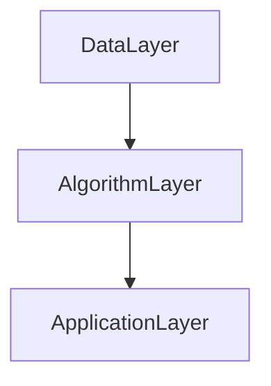

                 


# AI Agent在智能资产定价中的应用

> **关键词**: AI Agent, 资产定价, 强化学习, 机器学习, 智能系统, 投资策略

> **摘要**: 本文详细探讨了AI Agent在智能资产定价中的应用，从基本概念到算法原理，再到系统架构和项目实战，系统性地分析了AI Agent如何提升资产定价的效率和准确性。文章结合理论与实践，展示了AI Agent在金融领域的巨大潜力和实际应用价值。

---

# 第一部分: AI Agent与智能资产定价的背景与概念

## 第1章: AI Agent的基本概念与资产定价的现状

### 1.1 AI Agent的定义与核心原理

AI Agent，即人工智能代理，是一种能够感知环境、自主决策并采取行动的智能实体。它通过传感器获取信息，利用算法处理数据，做出决策，并通过执行器与环境交互。AI Agent的核心原理在于其学习能力和适应性，能够通过经验优化决策策略。

### 1.2 资产定价的基本概念

资产定价是金融领域的重要任务，旨在确定资产在市场上的公允价值。传统方法依赖于财务指标和市场数据，但面对复杂市场环境，其局限性日益明显。资产定价的关键挑战包括数据复杂性、市场动态变化和非理性行为等因素。

### 1.3 AI Agent在资产定价中的应用背景

AI Agent凭借其强大的数据处理和决策能力，为资产定价带来了新的可能性。其优势体现在实时数据处理、复杂模式识别和动态调整能力。当前资产定价技术的局限性主要在于难以应对非线性关系和市场突发事件，而AI Agent能够有效弥补这些不足。

---

## 第2章: AI Agent的核心概念与属性

### 2.1 AI Agent的核心概念

AI Agent由感知模块、决策模块和执行模块组成，具备自主性、反应性、目标导向和学习能力。这些属性使其能够适应复杂环境，优化决策过程。

### 2.2 AI Agent的属性特征对比

通过表格对比分析AI Agent与传统算法的区别，突出其在感知、决策和学习方面的优势。

| 属性         | AI Agent                     | 传统算法                     |
|--------------|------------------------------|------------------------------|
| 感知能力     | 强，能处理多源数据           | 弱，依赖预处理数据           |
| 决策能力     | 自主决策，适应动态变化       | 需人工干预，规则固定         |
| 学习能力     | 能够在线学习和自适应         | 不能学习，仅基于固定规则     |

### 2.3 AI Agent的ER实体关系图

ER图展示了AI Agent与资产、市场数据等实体之间的关系，帮助理解系统架构。

```mermaid
er
  actor AI-Agent {
    identifier: id
    attribute: 感知能力, 决策能力
  }
  actor 资产 {
    identifier: id
    attribute: 类型, 市场价值
  }
  actor 市场数据 {
    identifier: id
    attribute: 时间戳, 价格
  }
  relation 实体关系 {
    from AI-Agent到资产: 提供定价建议
    from AI-Agent到市场数据: 使用数据进行决策
    from 资产到市场数据: 依赖市场信息进行定价
  }
```

---

## 第3章: AI Agent的算法原理与数学模型

### 3.1 AI Agent的核心算法原理

AI Agent主要采用强化学习、监督学习和聚类与分类算法。

#### 强化学习算法原理

强化学习通过试错机制优化决策策略，核心是通过奖励机制调整动作以最大化累积奖励。

#### 监督学习算法原理

监督学习基于标注数据训练模型，用于预测资产价格。

#### 聚类与分类算法原理

这些算法用于识别市场模式和分类资产类型。

### 3.2 AI Agent的数学模型与公式

#### 强化学习的数学模型

状态空间S，动作空间A，策略π:S→A，价值函数V(s)。

$$ V(s) = \max_{a \in A} [ r(s,a) + \gamma V(s') ] $$

其中，r是奖励函数，γ是折扣因子，s'是下一状态。

#### 监督学习的数学模型

线性回归模型：

$$ y = w x + b $$

其中，y为目标变量，x为输入特征，w为权重，b为截距。

---

## 第4章: 智能资产定价系统的架构设计

### 4.1 系统功能设计

系统包括资产数据采集、特征提取、AI Agent决策和结果输出模块。

#### 资产数据采集模块

收集资产的历史价格、财务数据和市场信息。

#### 资产特征提取模块

提取关键特征，如波动率和收益。

#### AI Agent决策模块

根据特征生成定价策略。

#### 结果输出与可视化模块

展示定价结果和分析报告。

### 4.2 系统架构设计

系统采用分层架构，包括数据层、算法层和应用层。



---

## 第5章: 项目实战与案例分析

### 5.1 环境安装与配置

安装Python、TensorFlow和Keras等工具。

### 5.2 核心代码实现

实现强化学习模型的训练和预测。

#### 强化学习代码示例

```python
import numpy as np
class AIAgent:
    def __init__(self, state_space, action_space):
        self.state_space = state_space
        self.action_space = action_space
        # 初始化策略参数
        self.theta = np.random.randn(state_space, action_space)
    
    def act(self, state):
        return np.argmax(self.theta[state])
    
    def update(self, state, action, reward):
        # 简单的策略更新方法
        self.theta[state][action] += reward * 0.1
```

### 5.3 案例分析与解读

以股票定价为例，展示AI Agent如何优化定价策略。

### 5.4 项目小结

总结项目成果和经验教训，强调AI Agent在资产定价中的潜力。

---

## 第6章: 最佳实践与未来展望

### 6.1 最佳实践 tips

- 数据质量至关重要，需清洗和预处理。
- 选择合适算法，避免过拟合。
- 实时监控和调整模型。

### 6.2 小结

AI Agent通过强大的学习和决策能力，显著提升了资产定价的效率和准确性。

### 6.3 注意事项

- 数据隐私和模型风险需谨慎处理。
- 模型需持续更新，适应市场变化。

### 6.4 拓展阅读

推荐相关书籍和论文，鼓励深入学习。

---

通过以上内容，本文全面分析了AI Agent在智能资产定价中的应用，从理论到实践，为读者提供了系统的指导和参考。

