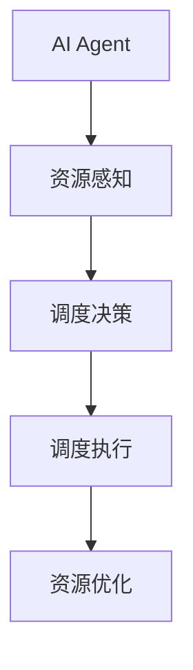
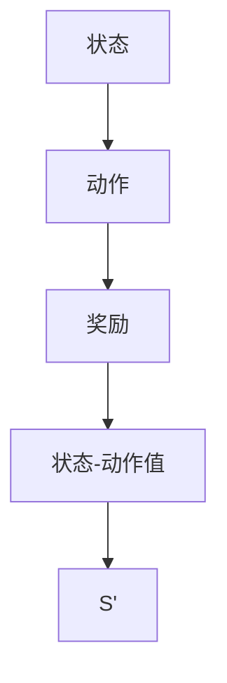
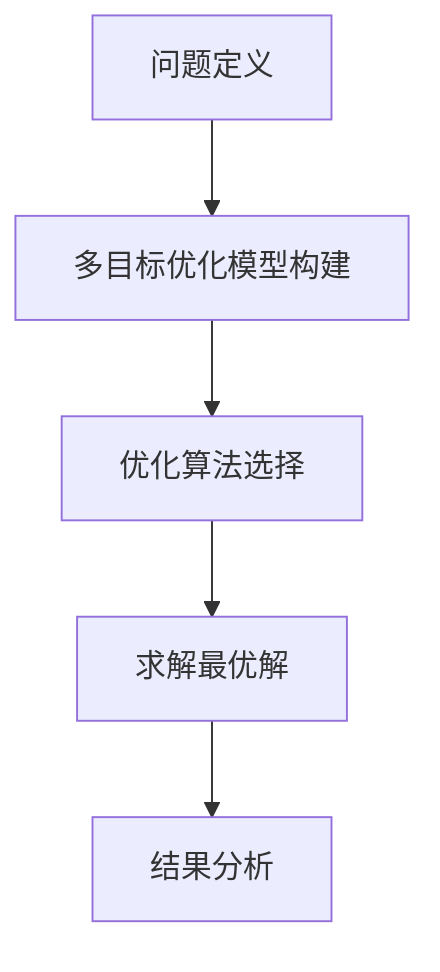
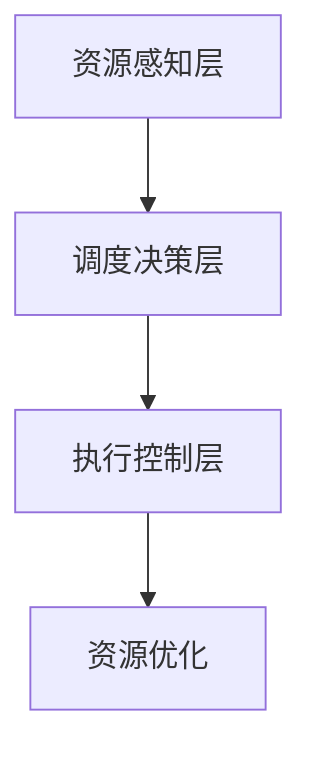
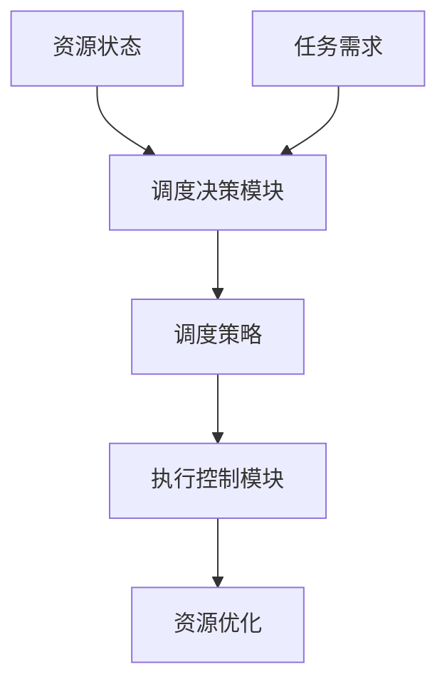

                 


# AI Agent在智能资源调度中的应用

## 关键词：AI Agent，资源调度，智能优化，多目标优化，强化学习，分布式系统

## 摘要：  
随着人工智能技术的快速发展，AI Agent（人工智能代理）在资源调度中的应用日益广泛。资源调度涉及计算资源、数据资源、网络资源等多种类型，其目标是在有限的资源条件下，实现任务的高效分配与优化。传统的资源调度算法往往依赖于固定的规则或简单的优化策略，难以应对复杂多变的动态环境。而AI Agent通过感知、决策和执行机制，能够实时适应环境变化，从而显著提升资源调度的效率和智能化水平。本文将从AI Agent的基本概念、核心原理、算法实现、系统架构等多个维度，详细探讨AI Agent在智能资源调度中的应用，并通过实际案例展示其优势。

---

# 第一部分：AI Agent与智能资源调度的背景介绍

## 第1章：AI Agent的基本概念与问题背景

### 1.1 AI Agent的定义与核心特征  
AI Agent是一种具有自主决策能力的智能实体，能够根据环境信息自主选择最优行动策略。其核心特征包括：  
- **自主性**：无需外部干预，自主完成任务。  
- **反应性**：能够实时感知环境并做出反应。  
- **目标导向性**：基于目标驱动行为。  
- **学习能力**：通过经验优化决策策略。  

### 1.2 资源调度的定义与分类  
资源调度是指在分布式系统中，对计算资源（如CPU、内存）、数据资源（如存储空间）和网络资源（如带宽）进行合理分配的过程。根据应用场景的不同，资源调度可以分为以下几类：  
- **计算资源调度**：如云计算中的虚拟机调度。  
- **数据资源调度**：如分布式数据库中的数据分片管理。  
- **网络资源调度**：如网络流量的负载均衡。  

### 1.3 AI Agent在资源调度中的问题背景  
传统资源调度算法（如负载均衡算法、贪心算法）在面对动态变化的环境时，往往表现出以下问题：  
- **静态性**：无法适应任务需求和资源条件的动态变化。  
- **局部最优**：难以实现全局最优。  
- **缺乏智能性**：无法根据历史经验优化调度策略。  

通过引入AI Agent，可以有效解决上述问题。AI Agent能够实时感知资源状态和任务需求，结合历史数据和上下文信息，制定更优的调度策略。  

---

## 第2章：AI Agent的核心原理与资源调度的关系  

### 2.1 AI Agent的核心原理  
AI Agent的核心原理可以概括为感知、决策和执行三个阶段：  
- **感知阶段**：通过传感器或数据采集模块，获取环境中的实时信息。  
- **决策阶段**：基于感知信息，结合预设的目标和约束条件，生成最优行动策略。  
- **执行阶段**：将决策结果转化为具体行动，并实时反馈执行效果。  

### 2.2 资源调度的核心原理  
资源调度的核心在于如何在多目标约束下，实现资源的高效分配。其主要步骤包括：  
- **资源感知**：采集系统的资源使用状态。  
- **调度决策**：根据资源状态和任务需求，制定调度策略。  
- **调度优化**：通过优化算法，提升资源利用率。  

### 2.3 AI Agent与资源调度的关系  
AI Agent与资源调度的关系可以用以下表格和Mermaid图表示：  

#### 对比分析表：AI Agent与传统调度算法的对比  

| 特性                | AI Agent                          | 传统调度算法                  |
|---------------------|-----------------------------------|------------------------------|
| **决策依据**         | 环境感知、历史数据、上下文信息    | 固定规则、局部信息            |
| **适应性**           | 强，能实时调整策略               | 弱，难以应对动态变化            |
| **目标导向性**       | 强，基于目标优化                 | 弱，基于简单规则              |
| **学习能力**         | 强，能通过经验优化策略            | 无，依赖预设规则              |

#### Mermaid图：AI Agent与资源调度的关系  



从图中可以看出，AI Agent通过感知资源状态，生成调度决策，并通过执行优化资源分配，从而实现智能化的资源调度。

---

## 第3章：资源调度中的AI Agent实现  

### 3.1 基于强化学习的资源调度算法  
强化学习是一种通过试错机制优化决策的算法。在资源调度中，可以使用强化学习来优化任务分配策略。以下是强化学习的基本流程：  

#### 强化学习算法流程图  



#### 强化学习的数学模型  
强化学习的目标是通过最大化累计奖励来优化策略。其数学模型可以表示为：  
$$ Q(s, a) = Q(s, a) + \alpha (r + \max_{a'} Q(s', a') - Q(s, a)) $$  
其中：  
- $Q(s, a)$：状态$s$下动作$a$的值函数。  
- $\alpha$：学习率。  
- $r$：奖励。  
- $\max_{a'} Q(s', a')$：下一状态的最大值函数。  

### 3.2 基于多目标优化的调度策略  
多目标优化是一种在多个目标之间寻求平衡的优化方法。在资源调度中，多目标优化可以用于在资源利用率、任务响应时间和成本之间找到最优解。  

#### 多目标优化的数学模型  
多目标优化问题可以表示为：  
$$ \min_{x} f(x) $$  
$$ \text{subject to } g(x) \leq 0 $$  
其中，$f(x)$是目标函数，$g(x)$是约束条件。  

#### 多目标优化的实现流程图  



---

## 第4章：AI Agent在资源调度中的系统架构  

### 4.1 系统架构设计  
AI Agent在资源调度中的系统架构可以分为以下三个层次：  
1. **资源感知层**：负责采集系统的资源状态和任务需求。  
2. **调度决策层**：基于感知信息，生成调度策略。  
3. **执行控制层**：将调度策略转化为具体行动，并实时反馈执行效果。  

#### Mermaid图：系统架构设计  



### 4.2 系统功能设计  
系统功能设计包括以下模块：  
- **资源感知模块**：采集资源使用状态和任务需求。  
- **调度决策模块**：基于强化学习或多目标优化算法，生成调度策略。  
- **执行控制模块**：将调度策略转化为具体行动，并实时反馈执行效果。  

#### Mermaid图：系统功能模块图  



---

## 第5章：AI Agent在资源调度中的项目实战  

### 5.1 环境配置  
在实际项目中，可以使用以下工具和框架：  
- **编程语言**：Python  
- **深度学习框架**：TensorFlow或PyTorch  
- **强化学习库**：OpenAI Gym  

### 5.2 核心代码实现  
以下是一个基于强化学习的资源调度算法的Python代码示例：  

```python
import numpy as np

class ResourceScheduler:
    def __init__(self, num_resources):
        self.num_resources = num_resources
        self.state = np.zeros(num_resources)
    
    def get_state(self):
        return self.state
    
    def act(self, action):
        new_state = self.state.copy()
        new_state[action] += 1
        return new_state
    
    def get_reward(self, state, action):
        reward = np.sum(state) - np.sum(self.state)
        return reward

# 初始化调度器
scheduler = ResourceScheduler(4)

# 强化学习循环
for episode in range(100):
    state = scheduler.get_state()
    action = np.random.randint(0, scheduler.num_resources)
    new_state = scheduler.act(action)
    reward = scheduler.get_reward(new_state, action)
    # 更新策略
    print(f" Episode {episode}, Action: {action}, Reward: {reward}")
```

### 5.3 案例分析  
通过上述代码，我们可以实现一个简单的资源调度算法。在实际应用中，可以根据具体需求扩展算法的功能，例如引入多目标优化或更复杂的强化学习策略。  

---

## 第6章：最佳实践与小结  

### 6.1 最佳实践  
- **数据质量**：确保数据的实时性和准确性。  
- **算法选择**：根据具体场景选择合适的算法。  
- **系统优化**：定期优化系统架构，提升性能。  

### 6.2 小结  
AI Agent通过感知、决策和执行机制，显著提升了资源调度的智能化水平。在实际应用中，AI Agent能够实时适应环境变化，优化资源分配，从而提高系统的效率和性能。未来，随着AI技术的不断发展，AI Agent在资源调度中的应用将更加广泛和深入。

---

通过以上章节的详细讲解，我们全面探讨了AI Agent在智能资源调度中的应用，从理论到实践，为读者提供了系统的知识体系和实际操作指南。

