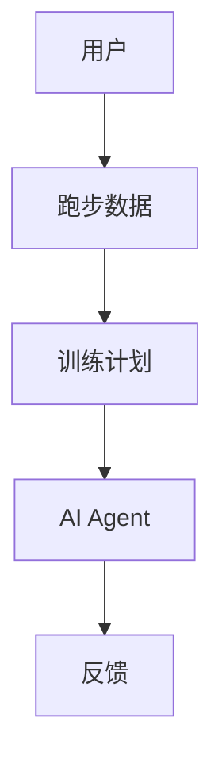
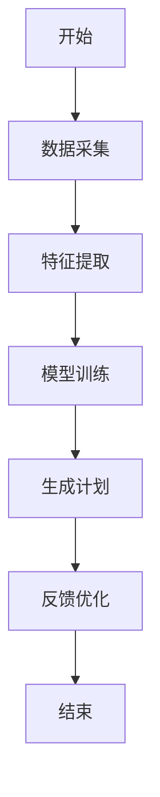
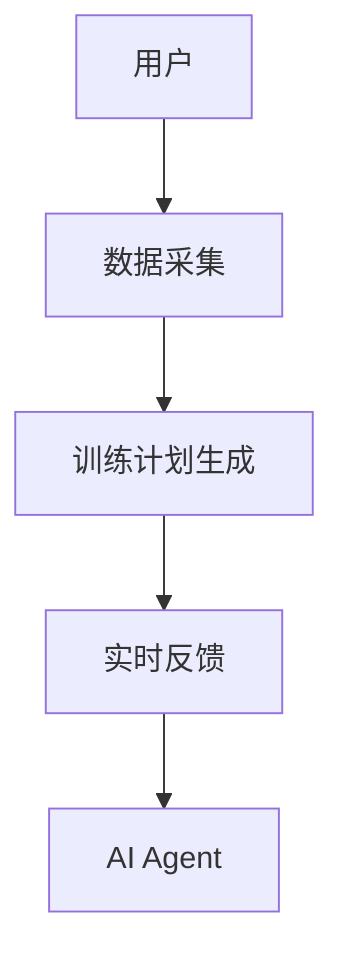
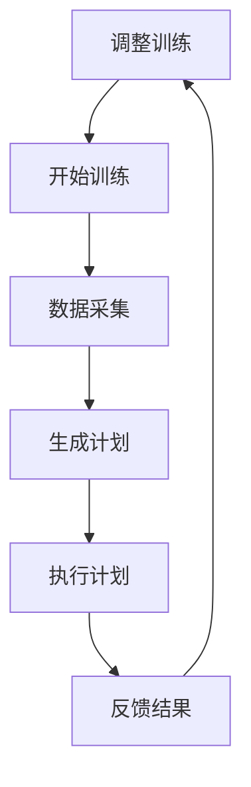

                 


# AI Agent在智能跑步机中的训练计划

## 关键词
AI Agent, 智能跑步机, 训练计划, 强化学习, 算法原理

## 摘要
本文探讨AI Agent在智能跑步机中的应用，详细分析其算法原理、系统架构和项目实战，展示AI技术如何优化跑步训练体验。

---

# 第一部分: AI Agent与智能跑步机的背景与概念

## 第1章: AI Agent的基本概念

### 1.1 AI Agent的定义与特征
AI Agent是能够感知环境并自主决策的智能体，具备自主性、反应性、目标导向等核心特征。

### 1.2 智能跑步机的发展历程
从机械式到电子式，再到AI驱动型，每一代的进步都离不开技术的发展。

### 1.3 AI Agent在跑步机中的应用背景
传统跑步机无法满足个性化需求，AI Agent通过智能化解决方案优化训练效果。

---

## 第2章: AI Agent的核心概念与联系

### 2.1 核心概念原理
AI Agent通过强化学习和监督学习优化训练计划，实时调整以适应用户需求。

### 2.2 对比表格
| 概念    | AI Agent                | 传统算法               |
|---------|--------------------------|------------------------|
| 特征     | 实时反馈、个性化         | 预设程序、固定模式      |
| 优势     | 自适应能力强             | 简单易用               |

### 2.3 ER实体关系图


---

## 第3章: AI Agent的算法原理

### 3.1 算法概述
AI Agent采用强化学习，通过奖励机制优化训练计划。

### 3.2 强化学习流程图


### 3.3 数学模型
强化学习的数学公式：
$$ Q(s, a) = Q(s, a) + \alpha (r + \max_{a'} Q(s', a') - Q(s, a)) $$

---

## 第4章: 系统分析与架构设计

### 4.1 项目背景
AI Agent应用于智能跑步机，优化用户训练计划。

### 4.2 功能设计
- 用户数据采集模块
- 训练计划生成模块
- 实时反馈模块

### 4.3 架构设计


### 4.4 接口设计
- 数据接口：采集心率、步频等数据
- API接口：与跑步机硬件通信

### 4.5 交互设计


---

## 第5章: 项目实战

### 5.1 环境安装
安装必要的库：
```bash
pip install numpy matplotlib scikit-learn
```

### 5.2 核心代码实现
```python
import numpy as np

class AIAgent:
    def __init__(self):
        self.learning_rate = 0.1
        self.q_values = {}

    def get_action(self, state):
        if state not in self.q_values:
            self.q_values[state] = 0
        return 'run_fast'

    def update(self, state, action, reward, next_state):
        current_q = self.q_values[state]
        next_max_q = max(self.q_values.get(next_state, 0))
        new_q = current_q + self.learning_rate * (reward + next_max_q - current_q)
        self.q_values[state] = new_q
```

### 5.3 案例分析
案例：制定减脂训练计划，AI Agent通过实时反馈调整速度和时间。

---

## 第6章: 总结与展望

### 6.1 最佳实践
- 定期更新模型
- 结合多传感器数据

### 6.2 小结
AI Agent显著提升了智能跑步机的功能，为用户提供个性化训练体验。

### 6.3 注意事项
- 数据隐私保护
- 硬件兼容性问题

### 6.4 拓展阅读
推荐学习强化学习和AI系统设计的相关书籍。

---

# 结语
AI Agent在智能跑步机中的应用前景广阔，随着技术进步，未来的训练计划将更加个性化和高效。

