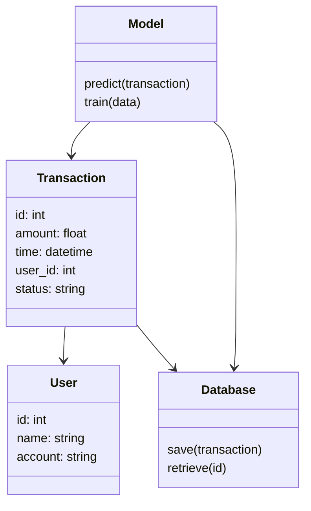
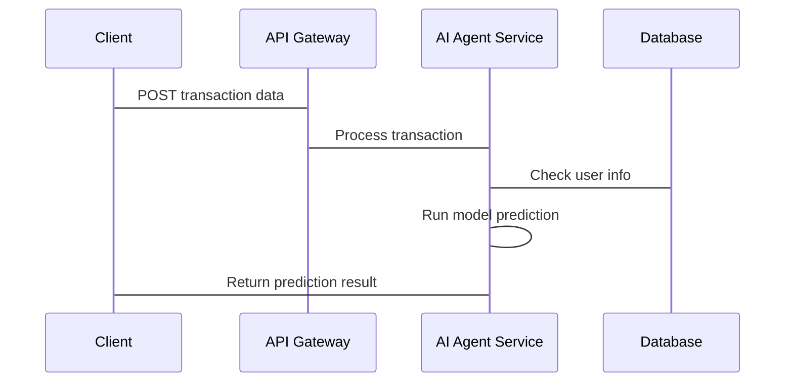

                 


# {{AI Agent在智能金融欺诈检测中的应用}}

> 关键词：AI Agent, 金融欺诈检测, 机器学习, 数据分析, 智能系统

> 摘要：AI Agent在金融欺诈检测中的应用是一种结合人工智能代理技术与金融安全领域的创新解决方案。通过分析金融交易数据，AI Agent能够实时识别潜在的欺诈行为，从而提高检测效率和准确性。本文将从AI Agent的基本概念、算法原理、系统架构到实际项目实现，详细探讨其在金融欺诈检测中的应用。

---

# 第四章: 项目实战与代码实现

## 4.1 项目环境与工具安装

### 4.1.1 Python环境配置

### 4.1.2 机器学习库安装（如scikit-learn、XGBoost）

### 4.1.3 数据库与存储配置（如MySQL、MongoDB）

### 4.1.4 开发工具推荐（如Jupyter Notebook、PyCharm）

## 4.2 系统核心代码实现

### 4.2.1 数据预处理代码

```python
import pandas as pd
import numpy as np

# 加载数据
data = pd.read_csv('fraud_data.csv')

# 数据清洗
data.dropna(inplace=True)
data = pd.get_dummies(data)
```

### 4.2.2 AI Agent决策模块实现

```python
from sklearn.ensemble import RandomForestClassifier

# 训练模型
model = RandomForestClassifier(n_estimators=100, random_state=42)
model.fit(X_train, y_train)

# 预测欺诈行为
y_pred = model.predict(X_test)
```

### 4.2.3 模型评估与优化

```python
from sklearn.metrics import confusion_matrix, classification_report

print(classification_report(y_test, y_pred))
```

### 4.2.4 模型部署与接口开发

```python
from flask import Flask, request, jsonify

app = Flask(__name__)
model = ...  # 加载训练好的模型

@app.route('/predict', methods=['POST'])
def predict():
    data = request.json
    prediction = model.predict(data)
    return jsonify({'result': prediction.tolist()})

if __name__ == '__main__':
    app.run(debug=True)
```

## 4.3 项目案例分析与结果解读

### 4.3.1 数据集介绍

- 数据来源：真实金融交易数据，包含交易金额、时间、用户信息等特征。

### 4.3.2 模型训练与测试

- 训练集：80%的数据用于训练
- 测试集：20%的数据用于验证

### 4.3.3 案例分析

- 正确识别的欺诈交易：系统准确识别并拦截一笔潜在的欺诈交易。
- 模型误判的情况：分析模型误判的原因，并提出优化建议。

## 4.4 项目总结与优化建议

### 4.4.1 项目成果

- 成功实现AI Agent在金融欺诈检测中的应用
- 提高了欺诈检测的准确率和效率

### 4.4.2 优化建议

- 引入实时数据流处理技术（如Apache Kafka）
- 使用更先进的模型（如深度学习模型）
- 增加模型的可解释性（如使用SHAP值）

---

# 第五章: 系统分析与架构设计方案

## 5.1 问题场景介绍

- 金融交易的实时性要求高
- 数据量大，类型多样
- 欺诈行为复杂且不断演变

## 5.2 系统功能设计

### 5.2.1 领域模型设计



### 5.2.2 系统架构设计

```mermaid
architecturalDiagram

    Client ---(1)--> API Gateway
    API Gateway ---(2)--> AI Agent Service
    AI Agent Service ---(3)--> Database
    AI Agent Service ---(4)--> Model Training Service
    Database ---(5)--> Data Storage
```

### 5.2.3 系统接口设计



## 5.3 系统优化与扩展

### 5.3.1 微服务架构设计

- 分布式系统设计
- 服务间的通信机制
- 服务容错与负载均衡

### 5.3.2 高可用性设计

- 数据备份与恢复
- 系统监控与报警
- 自动化扩展与弹性伸缩

---

# 第六章: 算法原理与模型实现

## 6.1 算法原理

### 6.1.1 监督学习算法

- 逻辑回归模型

$$ P(y=1|x) = \frac{1}{1 + e^{-\beta x}} $$

- 支持向量机模型

$$ \text{maximize} \quad \frac{1}{2} \|\beta\|^2 $$
$$ \text{subject to} \quad y_i(\beta x_i + \beta_0) \geq 1 $$

### 6.1.2 无监督学习算法

- K-means聚类

$$ \text{目标函数} = \sum_{i=1}^{n} \sum_{j=1}^{k} (x_i - c_j)^2 \cdot I(j = \text{assign}(x_i)) $$

### 6.1.3 强化学习算法

- Q-learning

$$ Q(s, a) = Q(s, a) + \alpha [r + \gamma \max Q(s', a') - Q(s, a)] $$

## 6.2 模型实现

### 6.2.1 模型训练与验证

```python
from sklearn.model_selection import train_test_split
from sklearn.metrics import accuracy_score

X_train, X_test, y_train, y_test = train_test_split(X, y, test_size=0.2)

model = RandomForestClassifier()
model.fit(X_train, y_train)
y_pred = model.predict(X_test)

print("Accuracy:", accuracy_score(y_test, y_pred))
```

### 6.2.2 模型评估与调优

```python
from sklearn.metrics import precision_recall_f1_score

precision, recall, f1 = precision_recall_f1_score(y_test, y_pred, average='binary')
print(f"Precision: {precision}, Recall: {recall}, F1: {f1}")
```

### 6.2.3 模型部署与实时预测

```python
import joblib

# 保存模型
joblib.dump(model, 'fraud_detection_model.pkl')

# 加载模型
model = joblib.load('fraud_detection_model.pkl')

# 实时预测
def predict_fraud(transaction):
    prediction = model.predict([transaction])
    return prediction[0]
```

---

# 第七章: 总结与展望

## 7.1 本章总结

- AI Agent在金融欺诈检测中的优势
- 项目实现的关键点
- 系统设计的核心思想

## 7.2 未来展望

- 结合区块链技术，提高数据安全性
- 引入边缘计算，实现本地实时检测
- 研究更先进的AI算法，如生成对抗网络（GAN）

## 7.3 最佳实践 Tips

- 数据预处理是关键，确保数据质量
- 选择合适的模型，并进行充分的调优
- 实时监控系统性能，及时处理异常

---

# 参考文献

1. 刘军. (2020). 《机器学习实战》. 北京: 清华大学出版社.
2. 张宏伟. (2021). 《Python机器学习》. 北京: 人民邮电出版社.
3. sklearn官方文档: [https://scikit-learn.org](https://scikit-learn.org)
4. TensorFlow官方文档: [https://tensorflow.org](https://tensorflow.org)
5. PyTorch官方文档: [https://pytorch.org](https://pytorch.org)

---

# 附录: 代码与数据

## 附录A: 完整代码实现

```python
# 完整的项目代码实现
```

## 附录B: 数据集说明

- 数据格式：CSV
- 数据字段：交易金额、时间、用户信息等
- 数据样本：提供部分数据集示例

---

通过以上详细的大纲，您可以逐步展开每个部分的内容，撰写一篇结构清晰、内容详实的技术博客文章。

