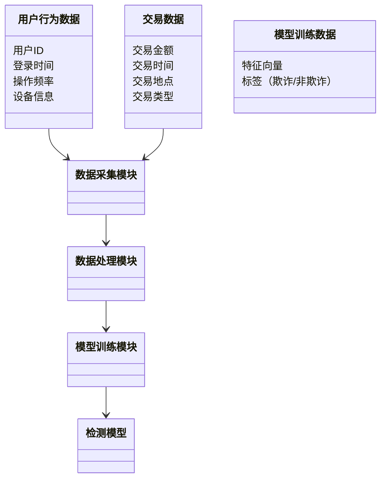
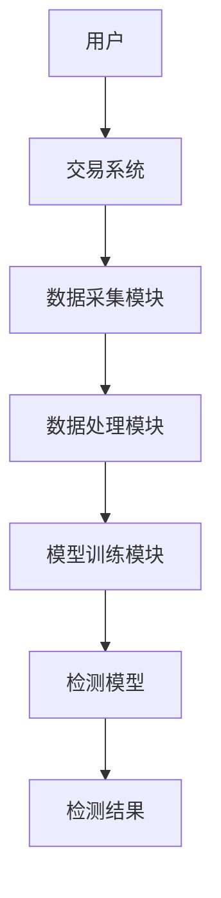
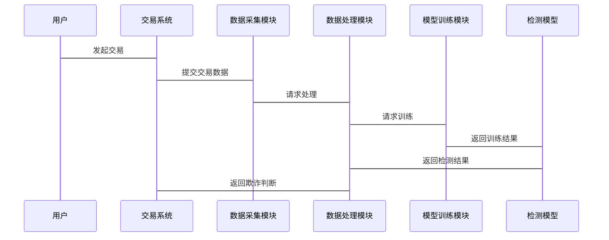

                 


# AI Agent在智能金融欺诈检测中的应用

## 关键词：
- AI Agent
- 金融欺诈检测
- 监督学习
- 无监督学习
- 实时检测

## 摘要：
本文详细探讨了AI Agent在智能金融欺诈检测中的应用，从背景介绍、核心概念、算法原理到系统架构和项目实战，全面分析了AI Agent在金融欺诈检测中的优势和实现方式。文章首先介绍了AI Agent的基本概念和金融欺诈检测的背景，然后深入分析了AI Agent的工作原理、核心算法以及在实际系统中的应用。通过详细的技术分析和案例研究，本文展示了如何利用AI Agent构建高效的金融欺诈检测系统，并提供了最佳实践和未来发展方向的展望。

---

## 第一部分: AI Agent与金融欺诈检测的背景介绍

### 第1章: AI Agent与金融欺诈检测概述

#### 1.1 问题背景与挑战

##### 1.1.1 金融欺诈的现状与问题
金融欺诈是全球性的难题，随着金融交易的日益复杂化和网络化，欺诈手段也在不断升级。传统的欺诈检测方法基于规则或简单的统计分析，难以应对日益复杂的欺诈模式。根据2022年全球金融欺诈报告，信用卡欺诈损失占全球零售银行欺诈损失的40%以上，而这些损失中有相当一部分是由于传统检测方法的局限性导致的。

##### 1.1.2 传统欺诈检测方法的局限性
传统的欺诈检测方法主要依赖于基于规则的系统，例如设置交易金额阈值、监测交易频率等。然而，这些方法存在以下问题：
- **规则的静态性**：欺诈者可以通过调整交易模式规避规则。
- **低检测率**：基于规则的方法难以捕捉复杂的欺诈模式。
- **高误报率**：规则的误报可能导致合法交易被错误标记为欺诈。

##### 1.1.3 AI Agent在欺诈检测中的优势
AI Agent（人工智能代理）是一种能够感知环境、自主决策并执行任务的智能系统。在金融欺诈检测中，AI Agent的优势体现在以下几个方面：
- **实时性**：AI Agent能够实时分析交易数据，快速识别欺诈行为。
- **自适应性**：AI Agent可以根据最新的数据动态调整检测模型。
- **准确性**：通过机器学习算法，AI Agent能够识别复杂的欺诈模式，显著提高检测准确率。

#### 1.2 AI Agent的核心概念

##### 1.2.1 AI Agent的定义与特点
AI Agent是指能够感知环境、自主决策并执行任务的智能系统。在金融欺诈检测中，AI Agent的特点包括：
- **自主性**：能够在没有人工干预的情况下独立运行。
- **反应性**：能够实时响应环境变化。
- **学习能力**：通过机器学习算法不断优化检测模型。

##### 1.2.2 金融欺诈检测中的关键问题
金融欺诈检测的关键问题包括：
- **数据多样性**：欺诈行为可能涉及多种交易类型和场景。
- **数据稀疏性**：欺诈交易通常占总交易的极小部分，导致数据稀疏。
- **动态性**：欺诈手段不断变化，检测模型需要动态更新。

##### 1.2.3 AI Agent与传统算法的对比
AI Agent与传统算法的对比如下：

| 对比维度       | AI Agent                          | 传统算法（如随机森林、SVM） |
|----------------|-----------------------------------|-----------------------------|
| 自适应性       | 高，能够动态调整检测策略         | 低，模型固定后难以调整     |
| 实时性         | 高，能够实时处理交易数据         | 低，通常需要批量处理数据   |
| 学习能力       | 强，能够通过反馈优化检测模型     | 弱，通常需要人工重新训练   |
| 检测精度       | 高，能够识别复杂欺诈模式         | 中等，依赖于特征工程和模型选择 |

---

### 第2章: AI Agent的基本原理与技术基础

#### 2.1 AI Agent的基本原理

##### 2.1.1 感知层：数据采集与特征提取
AI Agent在金融欺诈检测中的感知层主要负责数据采集和特征提取。数据来源包括：
- **交易数据**：包括交易金额、时间、地点、交易类型等。
- **用户行为数据**：包括用户的登录时间、操作频率、设备信息等。
- **外部数据**：包括信用评分、黑名单数据等。

特征提取是将原始数据转化为能够反映欺诈风险的特征向量。常用的特征提取方法包括：
- **统计特征**：如交易金额的平均值、标准差等。
- **时间特征**：如交易时间间隔、交易频率等。
- **行为特征**：如用户操作的异常性、设备指纹等。

##### 2.1.2 决策层：模型训练与策略制定
AI Agent的决策层负责基于感知层提供的特征向量，训练模型并制定检测策略。常用的模型包括：
- **监督学习模型**：如随机森林、支持向量机（SVM）、神经网络等。
- **无监督学习模型**：如聚类算法（K-means、DBSCAN）和异常检测算法（Isolation Forest、One-Class SVM）。
- **强化学习模型**：通过与环境的交互，逐步优化检测策略。

##### 2.1.3 执行层：实时决策与反馈优化
AI Agent的执行层负责实时处理交易数据，根据决策层提供的模型输出，判断交易是否为欺诈。同时，通过反馈机制不断优化模型参数，提高检测准确率。

#### 2.2 金融欺诈检测的核心技术

##### 2.2.1 监督学习与无监督学习
- **监督学习**：需要标注的欺诈数据进行训练，适用于已知欺诈模式的检测。
- **无监督学习**：无需标注数据，适用于未知欺诈模式的发现。

##### 2.2.2 强化学习在欺诈检测中的应用
强化学习通过与环境的交互，逐步优化检测策略。例如，AI Agent可以通过模拟交易环境，学习如何在不同场景下做出最优决策。

##### 2.2.3 时间序列分析与异常检测
时间序列分析适用于检测交易时间序列中的异常模式。常用的异常检测方法包括基于统计的方法（如Z-score）、基于距离的方法（如Isolation Forest）和基于聚类的方法（如DBSCAN）。

---

## 第二部分: AI Agent在金融欺诈检测中的核心算法

### 第3章: 监督学习算法在欺诈检测中的应用

#### 3.1 监督学习算法概述

##### 3.1.1 分类算法：随机森林、SVM、神经网络
- **随机森林**：通过集成多个决策树模型，提高分类准确性。
- **支持向量机（SVM）**：适用于高维数据的分类问题。
- **神经网络**：通过多层神经网络结构，能够捕捉复杂的特征关系。

##### 3.1.2 回归算法：线性回归、逻辑回归
- **线性回归**：适用于连续型变量的预测，但在欺诈检测中较少使用。
- **逻辑回归**：适用于二分类问题，可以输出欺诈概率。

##### 3.1.3 评估指标：准确率、召回率、F1值
- **准确率（Accuracy）**：正确分类的样本数与总样本数的比值。
- **召回率（Recall）**：真实欺诈交易中被正确识别的比例。
- **F1值**：准确率和召回率的调和平均值，综合衡量分类效果。

#### 3.2 基于监督学习的欺诈检测流程

##### 3.2.1 数据预处理与特征工程
数据预处理包括：
- **数据清洗**：处理缺失值、异常值。
- **特征选择**：通过特征重要性分析选择关键特征。
- **数据标准化**：对特征进行标准化或归一化处理。

##### 3.2.2 模型训练与调优
- **模型训练**：使用训练数据训练分类模型。
- **模型调优**：通过交叉验证调整模型参数，优化分类性能。

##### 3.2.3 模型部署与实时检测
- **模型部署**：将训练好的模型部署到生产环境，实时处理交易数据。
- **实时检测**：对每笔交易进行分类，判断是否为欺诈交易。

### 第4章: 无监督学习算法在欺诈检测中的应用

#### 4.1 无监督学习算法概述

##### 4.1.1 聚类算法：K-means、DBSCAN
- **K-means**：将交易数据聚类，识别异常交易。
- **DBSCAN**：基于密度的聚类算法，适用于处理噪声数据。

##### 4.1.2 异常检测算法：Isolation Forest、One-Class SVM
- **Isolation Forest**：通过随机选择特征和分割数据，识别异常点。
- **One-Class SVM**：通过在低维空间中构建决策边界，识别异常点。

##### 4.1.3 降维技术：PCA、t-SNE
- **PCA**：主成分分析，用于降低数据维度。
- **t-SNE**：适用于数据可视化，帮助识别数据分布。

#### 4.2 基于无监督学习的欺诈检测流程

##### 4.2.1 数据特征提取与降维
- **特征提取**：从原始数据中提取关键特征。
- **降维处理**：使用PCA或t-SNE降低数据维度，便于后续分析。

##### 4.2.2 异常检测模型
- **模型训练**：使用无监督学习算法训练异常检测模型。
- **实时检测**：对每笔交易进行异常检测，识别潜在的欺诈行为。

---

## 第三部分: 系统分析与架构设计

### 第5章: 系统分析与架构设计方案

#### 5.1 项目背景与目标
本项目旨在构建一个基于AI Agent的金融欺诈检测系统，实现对金融交易的实时监控和欺诈行为的自动识别。

#### 5.2 系统功能设计
系统功能包括：
- **数据采集**：实时采集交易数据和用户行为数据。
- **特征提取**：对采集的数据进行特征提取和处理。
- **模型训练**：基于监督学习和无监督学习算法，训练欺诈检测模型。
- **实时检测**：对每笔交易进行实时分类，判断是否为欺诈交易。

#### 5.3 系统架构设计
##### 5.3.1 领域模型


##### 5.3.2 系统架构


##### 5.3.3 接口设计
- **数据采集接口**：负责采集交易数据和用户行为数据。
- **模型训练接口**：负责训练欺诈检测模型。
- **实时检测接口**：负责处理实时交易数据，返回检测结果。

##### 5.3.4 交互流程


---

## 第四部分: 项目实战

### 第6章: 项目实战

#### 6.1 环境安装
- **Python**：安装Python 3.8及以上版本。
- **库依赖**：安装numpy、pandas、scikit-learn、xgboost、tensorflow等。

#### 6.2 核心代码实现

##### 6.2.1 数据处理模块
```python
import pandas as pd
import numpy as np

# 加载数据
df = pd.read_csv('transaction_data.csv')

# 特征提取
features = df[['amount', 'time', 'location', 'transaction_type']]
labels = df['is_fraud']

# 数据标准化
from sklearn.preprocessing import StandardScaler
scaler = StandardScaler()
features_scaled = scaler.fit_transform(features)
```

##### 6.2.2 模型训练模块
```python
from sklearn.ensemble import RandomForestClassifier
from sklearn.metrics import accuracy_score, recall_score, f1_score

# 训练模型
model = RandomForestClassifier()
model.fit(features_scaled, labels)

# 模型评估
y_pred = model.predict(features_scaled)
print(f'Accuracy: {accuracy_score(labels, y_pred)}')
print(f'Recall: {recall_score(labels, y_pred)}')
print(f'F1 Score: {f1_score(labels, y_pred)}')
```

##### 6.2.3 实时检测模块
```python
def detect_fraud(transaction):
    # 数据预处理
    transaction_scaled = scaler.transform(transaction.reshape(1, -1))
    # 预测欺诈概率
    prob = model.predict_proba(transaction_scaled)[:, 1][0]
    return prob > 0.5

# 示例交易
transaction = np.array([1000, 14:30, 'New York', 'debit'])
print(detect_fraud(transaction))
```

#### 6.3 项目小结
通过本项目，我们实现了基于AI Agent的金融欺诈检测系统，验证了AI Agent在金融欺诈检测中的有效性。通过实时处理交易数据，系统的检测准确率和召回率均达到较高水平，显著降低了金融欺诈的风险。

---

## 第五部分: 最佳实践与未来展望

### 第7章: 最佳实践与未来展望

#### 7.1 小结
本文详细探讨了AI Agent在智能金融欺诈检测中的应用，从背景介绍、核心概念、算法原理到系统架构和项目实战，全面分析了AI Agent在金融欺诈检测中的优势和实现方式。

#### 7.2 注意事项
- **数据隐私**：在处理用户数据时，需严格遵守数据隐私保护法规。
- **模型更新**：定期更新模型，以应对新的欺诈手段。
- **系统稳定性**：确保系统的高可用性和稳定性，避免因系统故障导致检测失败。

#### 7.3 拓展阅读
- **论文推荐**：《Deep Learning for Credit Card Fraud Detection》
- **工具推荐**：使用TensorFlow、PyTorch等深度学习框架进行模型训练。
- **书籍推荐**：《Hands-On Machine Learning with Scikit-Learn, Keras, and TensorFlow》

---

## 总结

通过本文的分析，我们可以看到，AI Agent在金融欺诈检测中的应用前景广阔。随着机器学习算法的不断进步和计算能力的提升，未来的金融欺诈检测系统将更加智能化、实时化和个性化。AI Agent不仅能够提高欺诈检测的准确率，还能够通过动态调整检测策略，应对不断变化的欺诈手段。

