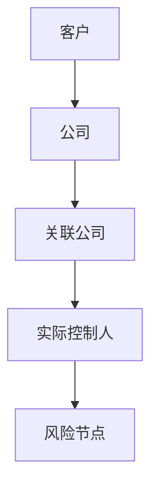
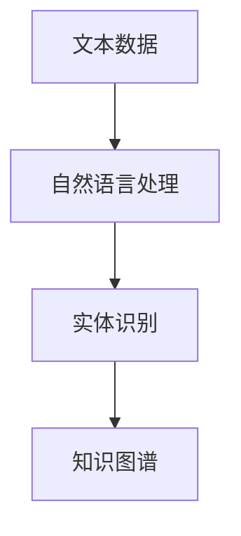
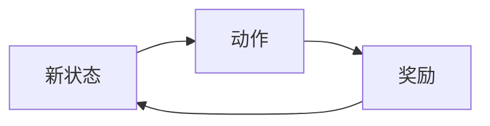
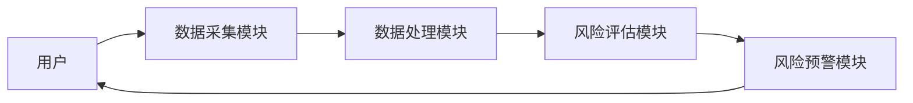

                 


# AI Agent在智能金融风险评估中的应用

> **关键词**：AI Agent, 金融风险评估, 智能决策, 强化学习, 知识图谱, 多模态数据  
>
> **摘要**：本文详细探讨了AI Agent在智能金融风险评估中的应用，从核心概念、算法原理到系统架构和项目实战，结合实际案例，分析了AI Agent如何通过多模态数据处理、知识图谱构建和强化学习等技术手段，提升金融风险评估的智能化水平和决策效率。文章还总结了AI Agent在金融领域的优势与挑战，并提出了未来的发展方向。

---

# 第一部分: AI Agent与智能金融风险评估的背景与概念

## 第1章: AI Agent的基本概念与应用背景

### 1.1 AI Agent的定义与核心特征

#### 1.1.1 什么是AI Agent
AI Agent（人工智能代理）是指能够感知环境、自主决策并执行任务的智能体。与传统的算法不同，AI Agent具有以下核心特征：

- **主动性**：AI Agent能够主动采取行动，而不是仅仅被动地响应输入。
- **反应性**：AI Agent能够实时感知环境变化并做出反应。
- **学习性**：AI Agent能够通过经验改进自身性能。
- **社交性**：AI Agent能够与其他Agent或人类进行交互和协作。

#### 1.1.2 AI Agent与传统算法的区别
AI Agent的核心区别在于其“智能”属性，具体体现在以下几个方面：

| 对比维度       | 传统算法                          | AI Agent                          |
|----------------|-----------------------------------|------------------------------------|
| 决策方式       | 基于规则或固定模型                | 基于动态环境反馈和自适应学习      |
| 交互能力       | 单向输入输出                      | 双向交互，支持协作与对话          |
| 环境适应性     | 静态或预定义环境                  | 动态环境，支持实时调整与优化      |

#### 1.1.3 AI Agent在金融领域的应用价值
AI Agent在金融领域的应用价值主要体现在以下几个方面：

1. **实时决策支持**：AI Agent能够快速响应市场变化，提供实时决策支持。
2. **个性化服务**：AI Agent能够根据用户需求提供定制化的金融服务。
3. **风险管理优化**：AI Agent能够通过多模态数据和知识图谱，提升风险评估的准确性。

### 1.2 金融风险评估的基本概念

#### 1.2.1 金融风险的定义与分类
金融风险是指在金融活动中可能发生的损失或收益波动。常见的金融风险包括：

- **市场风险**：由于市场价格波动引起的损失。
- **信用风险**：由于债务人违约引起的损失。
- **流动性风险**：由于资产无法快速变现引起的损失。
- **操作风险**：由于内部操作失误引起的损失。

#### 1.2.2 金融风险评估的常用方法
常用的金融风险评估方法包括：

- **VaR（Value at Risk）**：衡量在一定置信水平下的潜在损失。
- **信用评分模型**：基于历史数据对客户信用风险进行评估。
- **马科维茨投资组合理论**：通过优化资产配置降低风险。

#### 1.2.3 金融风险评估的挑战与需求
随着金融市场的复杂化，传统的金融风险评估方法面临以下挑战：

- **数据维度高**：金融市场涉及多模态数据（如文本、图像、数值等）。
- **实时性要求高**：金融市场的波动需要实时响应。
- **模型解释性**：复杂的模型需要具备可解释性，以满足监管要求。

### 1.3 AI Agent在金融风险评估中的应用价值

#### 1.3.1 AI Agent在金融领域的应用场景
AI Agent在金融领域的应用场景包括：

- **智能投顾**：为投资者提供个性化的投资建议。
- **风险预警**：实时监测市场风险，提前预警。
- **智能风控**：基于多模态数据进行风险评估和控制。

#### 1.3.2 AI Agent在金融风险评估中的优势
AI Agent在金融风险评估中的优势包括：

- **多模态数据处理**：能够整合文本、图像、数值等多种数据源。
- **知识图谱构建**：通过知识图谱实现对金融市场的深度理解。
- **自适应学习**：能够根据市场变化动态调整风险评估模型。

#### 1.3.3 金融行业对AI Agent的需求与趋势
随着AI技术的不断发展，金融行业对AI Agent的需求日益增长。未来，AI Agent将在以下方面发挥更大作用：

- **实时决策支持**：提升金融交易的实时性和准确性。
- **智能化风控**：通过知识图谱和强化学习实现智能化风控。
- **个性化服务**：为客户提供更加个性化的金融服务。

---

## 第2章: AI Agent在智能金融风险评估中的核心概念

### 2.1 AI Agent的决策机制

#### 2.1.1 基于知识图谱的决策逻辑
知识图谱是一种将实体及其关系以图结构表示的技术。在金融风险评估中，知识图谱可以帮助AI Agent理解市场中的复杂关系。例如，可以通过知识图谱识别同一实际控制人控制的多家公司，从而发现潜在的关联交易风险。



#### 2.1.2 基于强化学习的决策优化
强化学习是一种通过试错机制优化决策的算法。在金融风险评估中，AI Agent可以通过强化学习优化风险控制策略。例如，AI Agent可以通过调整投资组合的资产配置，最大化收益并最小化风险。


#### 2.1.3 基于概率推理的风险评估
概率推理是一种基于概率论的推理方法。在金融风险评估中，AI Agent可以通过概率推理对风险事件发生的可能性进行评估。例如，AI Agent可以通过分析历史数据，计算某只股票下跌的概率。

### 2.2 金融风险评估的核心要素

#### 2.2.1 风险因子的提取与分析
风险因子是指影响金融资产价格波动的因素。常见的风险因子包括：

- **市场因子**：如市场指数、行业指数等。
- **风格因子**：如市值因子、价值因子等。
- **流动性因子**：如换手率、流通股本等。

#### 2.2.2 风险模型的构建与验证
风险模型是金融风险评估的核心工具。常见的风险模型包括：

- **线性回归模型**：用于预测资产收益与风险因子的关系。
- **逻辑回归模型**：用于分类风险事件（如违约、波动等）。
- **随机森林模型**：用于非线性关系的建模。

#### 2.2.3 风险数据的获取与处理
金融风险评估需要大量的高质量数据支持。数据来源包括：

- **公开数据**：如股票价格、财务报表等。
- **外部数据**：如新闻、社交媒体等。
- **内部数据**：如交易记录、客户行为数据等。

### 2.3 AI Agent与金融风险评估的结合点

#### 2.3.1 数据驱动的风险分析
AI Agent可以通过多模态数据驱动风险分析。例如，AI Agent可以通过分析新闻、社交媒体和财务报表，识别潜在的市场风险。

#### 2.3.2 智能化风险预警系统
AI Agent可以通过实时监控市场数据，识别潜在风险事件并发出预警。例如，AI Agent可以通过监测市场情绪指数，预测市场波动。

#### 2.3.3 自适应风险控制策略
AI Agent可以通过自适应学习优化风险控制策略。例如，AI Agent可以通过强化学习动态调整投资组合的资产配置，以应对市场变化。

---

## 第3章: AI Agent在智能金融风险评估中的核心原理

### 3.1 AI Agent的感知与认知机制

#### 3.1.1 多模态数据的感知与处理
AI Agent需要处理多种类型的数据，包括文本、图像和数值等。例如，AI Agent可以通过自然语言处理技术分析新闻和财务报告，提取关键词和实体关系。



#### 3.1.2 知识图谱的构建与推理
知识图谱的构建需要将数据中的实体及其关系进行结构化。例如，AI Agent可以通过构建公司之间的关联关系图，识别潜在的关联交易风险。

#### 3.1.3 基于深度学习的语义理解
深度学习技术在语义理解中具有重要作用。例如，AI Agent可以通过BERT模型理解新闻标题的含义，并预测其对市场的影响。

### 3.2 AI Agent的决策与执行机制

#### 3.2.1 基于强化学习的决策优化
强化学习是优化决策的重要方法。例如，AI Agent可以通过强化学习优化投资组合的配置，以最大化收益并最小化风险。



#### 3.2.2 基于博弈论的策略选择
博弈论是研究策略选择的重要工具。例如，AI Agent可以通过博弈论模型预测对手的策略，并制定最优应对策略。

#### 3.2.3 基于动态规划的风险控制
动态规划是一种优化方法。例如，AI Agent可以通过动态规划优化风险控制策略，以应对市场的不确定性。

### 3.3 AI Agent的自适应与进化机制

#### 3.3.1 基于元学习的自适应能力
元学习是一种快速适应新任务的技术。例如，AI Agent可以通过元学习快速适应新的金融市场环境。

#### 3.3.2 基于遗传算法的优化策略
遗传算法是一种模拟自然选择的优化方法。例如，AI Agent可以通过遗传算法优化风险控制模型的参数。

#### 3.3.3 基于在线学习的实时更新
在线学习是一种实时更新模型的技术。例如，AI Agent可以通过在线学习实时更新风险评估模型，以应对市场的变化。

---

## 第4章: AI Agent在智能金融风险评估中的算法与系统架构

### 4.1 AI Agent的算法原理与数学模型

#### 4.1.1 基于强化学习的决策优化
强化学习是一种通过试错机制优化决策的算法。在金融风险评估中，AI Agent可以通过强化学习优化风险控制策略。例如，AI Agent可以通过调整投资组合的资产配置，最大化收益并最小化风险。

```latex
$$
\text{目标函数} = \max_{\theta} \mathbb{E}[R(s, a)]
$$

其中，$R(s, a)$ 是状态 $s$ 下采取动作 $a$ 的奖励。
```

#### 4.1.2 基于知识图谱的风险分析
知识图谱的构建需要将数据中的实体及其关系进行结构化。例如，AI Agent可以通过构建公司之间的关联关系图，识别潜在的关联交易风险。

#### 4.1.3 基于概率推理的风险评估
概率推理是一种基于概率论的推理方法。在金融风险评估中，AI Agent可以通过概率推理对风险事件发生的可能性进行评估。例如，AI Agent可以通过分析历史数据，计算某只股票下跌的概率。

### 4.2 AI Agent的系统架构设计

#### 4.2.1 系统功能设计
AI Agent驱动的金融风险评估系统需要具备以下功能：

1. **数据采集**：从多种数据源采集数据。
2. **数据处理**：对数据进行清洗和预处理。
3. **风险评估**：基于模型进行风险评估。
4. **风险预警**：实时监测风险事件并发出预警。
5. **决策支持**：提供决策支持和优化建议。

#### 4.2.2 系统架构设计
金融风险评估系统的架构设计需要考虑以下几个方面：



---

## 第5章: AI Agent在智能金融风险评估中的项目实战

### 5.1 项目背景与目标
本项目旨在利用AI Agent技术，构建一个智能金融风险评估系统。项目目标包括：

1. **实现多模态数据的采集与处理**。
2. **构建知识图谱并进行风险分析**。
3. **基于强化学习优化风险控制策略**。

### 5.2 项目实现

#### 5.2.1 环境安装
项目需要以下环境：

- **Python 3.8+**
- **TensorFlow 2.0+**
- **PyTorch 1.8+**
- **自然语言处理库（如spaCy、NLTK）**

#### 5.2.2 核心代码实现
以下是基于强化学习的风险评估代码示例：

```python
import numpy as np
import tensorflow as tf

class AI-Agent:
    def __init__(self, state_dim, action_dim):
        self.state_dim = state_dim
        self.action_dim = action_dim
        self.model = self.build_model()

    def build_model(self):
        model = tf.keras.Sequential()
        model.add(tf.keras.layers.Dense(64, activation='relu', input_dim=self.state_dim))
        model.add(tf.keras.layers.Dense(self.action_dim, activation='linear'))
        model.compile(optimizer=tf.keras.optimizers.Adam(learning_rate=0.01), loss='mse')
        return model

    def act(self, state):
        state = tf.convert_to_tensor(state, dtype=tf.float32)
        prediction = self.model.predict(state)
        action = np.argmax(prediction[0])
        return action

# 示例使用
state_dim = 10
action_dim = 5
agent = AI-Agent(state_dim, action_dim)
state = np.random.random(state_dim)
action = agent.act(state)
print("Action:", action)
```

#### 5.2.3 代码解读与分析
上述代码实现了一个简单的强化学习模型。AI Agent通过感知环境状态，选择最优动作。在金融风险评估中，状态可以是市场数据，动作可以是投资组合调整策略。

### 5.3 实际案例分析
以股票风险评估为例，AI Agent可以通过以下步骤进行风险评估：

1. **数据采集**：采集股票价格、财务数据、新闻等。
2. **数据处理**：清洗和预处理数据。
3. **知识图谱构建**：构建公司之间的关联关系图。
4. **风险评估**：基于强化学习模型预测股票风险。
5. **风险预警**：实时监测风险事件并发出预警。

---

## 第6章: AI Agent在智能金融风险评估中的最佳实践

### 6.1 小结
本文详细探讨了AI Agent在智能金融风险评估中的应用，从核心概念到系统架构，再到项目实战，全面展示了AI Agent的优势和潜力。

### 6.2 注意事项
在实际应用中，需要注意以下几点：

1. **数据隐私与安全**：金融数据涉及敏感信息，需严格遵守数据隐私法规。
2. **模型解释性**：复杂的模型需要具备可解释性，以满足监管要求。
3. **系统稳定性**：金融系统需要高可用性和稳定性，确保实时响应和决策的准确性。

### 6.3 拓展阅读
建议读者进一步阅读以下内容：

- **强化学习**：深入学习强化学习的理论与应用。
- **知识图谱**：探索知识图谱在金融领域的更多应用场景。
- **多模态数据处理**：研究如何更好地处理和融合多模态数据。

---

通过本文的详细讲解，读者可以全面了解AI Agent在智能金融风险评估中的应用，并能够结合实际需求，设计和实现类似的系统。未来，随着AI技术的不断发展，AI Agent将在金融领域发挥更大的作用，为金融行业带来更多创新和价值。

