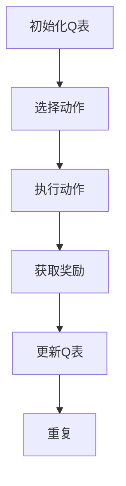
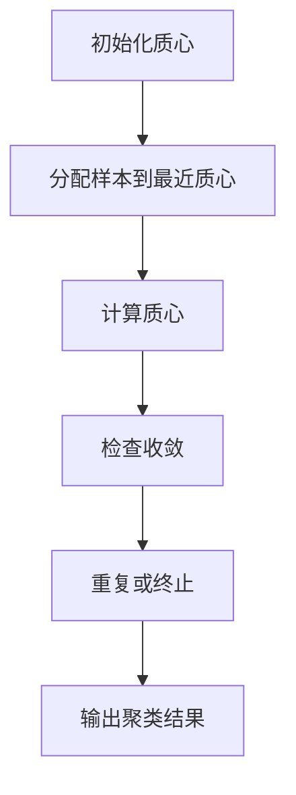
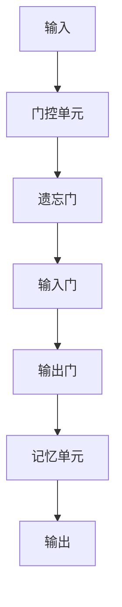
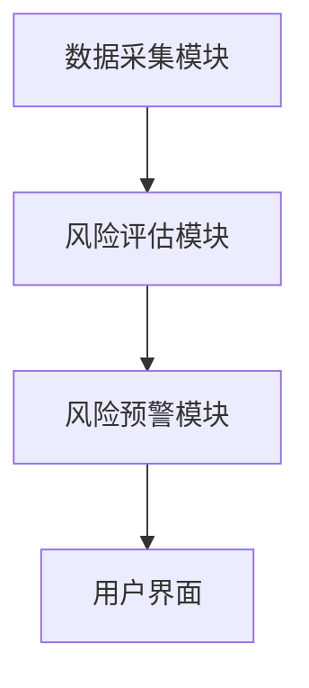
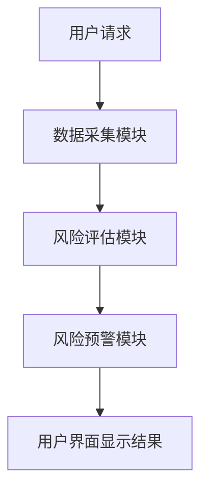

                 


# AI Agent在智能金融风险评估中的应用

**关键词：** AI Agent, 金融风险评估, 强化学习, 时间序列分析, 系统架构设计

**摘要：**  
本文系统地探讨了AI Agent在智能金融风险评估中的应用，从基本概念到算法原理，再到系统架构设计和项目实战，进行了深入分析。文章首先介绍了AI Agent和金融风险评估的基本概念，然后详细讲解了AI Agent的核心原理与技术，包括强化学习、聚类分析和时间序列分析等算法的原理和实现。接着，从系统分析与架构设计的角度，讨论了金融风险评估系统的功能模块和系统架构。最后，通过项目实战部分，展示了如何在实际项目中应用这些技术和算法，并对最佳实践、未来趋势和总结进行了探讨。

---

## 第1章: AI Agent与金融风险评估概述

### 1.1 AI Agent的基本概念
#### 1.1.1 AI Agent的定义
AI Agent（人工智能代理）是指能够感知环境、自主决策并执行任务的智能实体。它可以是一个软件程序，也可以是一个物理设备，通过传感器和执行器与外部环境交互。

#### 1.1.2 AI Agent的核心特征
- **自主性**：能够自主决策，无需外部干预。
- **反应性**：能够实时感知环境并做出反应。
- **目标导向**：具有明确的目标，并通过行动实现目标。
- **学习能力**：能够通过经验改进自身的决策能力。

#### 1.1.3 AI Agent与传统算法的区别
AI Agent不仅仅是简单的算法，它是一个具有自主性和目标导向的智能实体，能够与环境动态交互。而传统算法通常是在固定条件下执行特定任务，不具备自主性和目标导向。

### 1.2 金融风险评估的基本概念
#### 1.2.1 金融风险的定义
金融风险是指由于市场波动、信用违约、流动性风险等因素导致的金融资产损失的可能性。

#### 1.2.2 金融风险的分类
- **市场风险**：由于市场价格波动引起的损失。
- **信用风险**：由于债务人违约引起的损失。
- **流动性风险**：由于资产无法快速变现引起的损失。
- **操作风险**：由于内部操作失误引起的损失。

#### 1.2.3 金融风险评估的重要性
金融风险评估是金融管理和决策的重要组成部分，能够帮助投资者、企业和金融机构更好地管理和规避风险。

### 1.3 AI Agent在金融风险评估中的应用前景
#### 1.3.1 AI Agent在金融领域的潜在应用
AI Agent可以用于金融市场的实时监控、交易决策、风险预警等领域。

#### 1.3.2 金融风险评估中的AI Agent优势
- **高效性**：能够快速处理大量数据，提供实时风险评估。
- **准确性**：通过机器学习算法提高风险评估的准确性。
- **适应性**：能够根据市场变化动态调整风险评估策略。

#### 1.3.3 金融风险评估中的AI Agent挑战
- **数据隐私**：金融数据的隐私性和安全性问题。
- **算法解释性**：复杂的算法可能导致决策过程缺乏透明性。
- **市场动态**：金融市场的不确定性和波动性对AI Agent的适应性提出了更高的要求。

### 1.4 本章小结
本章介绍了AI Agent和金融风险评估的基本概念，分析了AI Agent在金融风险评估中的优势和挑战。这为后续章节的深入分析奠定了基础。

---

## 第2章: AI Agent的核心原理与技术

### 2.1 AI Agent的基本原理
#### 2.1.1 知识表示
知识表示是AI Agent理解和处理信息的基础。常用的表示方法包括符号逻辑、语义网络和知识图谱等。

#### 2.1.2 行为选择
行为选择是AI Agent根据当前状态和目标，选择最优行动的过程。常用的策略包括基于规则的决策和基于学习的决策。

#### 2.1.3 状态感知
状态感知是AI Agent通过传感器或数据源获取环境信息的过程。常用的技术包括自然语言处理、计算机视觉和时间序列分析等。

### 2.2 AI Agent的决策机制
#### 2.2.1 基于规则的决策
基于规则的决策是指通过预定义的规则和逻辑推理来做出决策。例如，如果市场波动超过一定阈值，则触发风险预警。

#### 2.2.2 基于学习的决策
基于学习的决策是指通过机器学习算法从历史数据中学习决策策略。例如，使用支持向量机（SVM）或随机森林（Random Forest）进行分类或回归任务。

#### 2.2.3 基于强化学习的决策
强化学习是一种通过试错机制优化决策策略的方法。例如，使用Q-learning算法在金融交易中优化买卖决策。

### 2.3 AI Agent的通信与协作
#### 2.3.1 多智能体系统
多智能体系统是指多个AI Agent协同工作的系统。例如，在金融交易中，多个智能体可以协同完成订单执行和风险管理。

#### 2.3.2 智能体之间的通信协议
智能体之间的通信需要遵循特定的协议，例如使用消息队列（Message Queue）进行异步通信。

#### 2.3.3 智能体协作的实现方法
智能体协作可以通过分布式计算、事件驱动和中间件技术实现。

### 2.4 本章小结
本章详细讲解了AI Agent的核心原理与技术，包括知识表示、行为选择、状态感知、决策机制和通信协作等。这些内容为后续章节的应用分析提供了理论基础。

---

## 第3章: 金融风险评估中的AI Agent算法原理

### 3.1 强化学习算法
#### 3.1.1 Q-learning算法
Q-learning是一种经典的强化学习算法，通过维护Q表记录状态-动作对的期望奖励，逐步优化决策策略。

**Q-learning算法流程图（使用mermaid）：**



**数学公式：**
$$ Q(s, a) = Q(s, a) + \alpha (r + \gamma \max Q(s', a') - Q(s, a)) $$

#### 3.1.2 Deep Q-Networks (DQN)算法
DQN算法通过深度神经网络近似Q值函数，能够处理高维状态空间和动作空间。

**DQN算法流程图（使用mermaid）：**

```mermaid
graph TD
    A[接收状态s] --> B[选择动作a]
    B --> C[执行动作a]
    C --> D[获取奖励r]
    D --> E[存储经验 (s, a, r, s')]
    E --> F[训练网络]
    F --> G[更新目标网络]
    G --> H[重复]
```

### 3.2 聚类分析算法
#### 3.2.1 K-means算法
K-means算法是一种无监督聚类算法，适用于将客户按风险等级进行分组。

**K-means算法流程图（使用mermaid）：**



### 3.3 时间序列分析算法
#### 3.3.1 ARIMA模型
ARIMA（自回归积分滑动平均模型）是一种广泛应用于时间序列预测的统计模型。

**ARIMA模型公式：**
$$ ARIMA(p, d, q) = y_t = \phi_1 y_{t-1} + \dots + \phi_p y_{t-p} + \theta_1 \epsilon_{t-1} + \dots + \theta_q \epsilon_{t-q} + \epsilon_t $$

#### 3.3.2 LSTM网络
LSTM（长短期记忆网络）是一种特殊的RNN，适用于处理时间序列数据中的长期依赖关系。

**LSTM结构图（使用mermaid）：**



### 3.4 本章小结
本章详细讲解了金融风险评估中常用的AI Agent算法，包括强化学习、聚类分析和时间序列分析等。这些算法为金融风险评估提供了强大的技术支撑。

---

## 第4章: 金融风险评估系统的系统分析与架构设计

### 4.1 系统需求分析
#### 4.1.1 功能需求
- 数据采集：从金融市场获取实时数据。
- 风险评估：基于AI Agent算法进行风险评估。
- 风险预警：根据评估结果触发预警机制。

#### 4.1.2 性能需求
- 响应时间：实时处理能力。
- 扩展性：能够处理大规模数据。

### 4.2 系统架构设计
#### 4.2.1 功能模块划分
- 数据采集模块：负责数据的获取和预处理。
- 风险评估模块：基于AI Agent算法进行风险评估。
- 风险预警模块：根据评估结果触发预警。

#### 4.2.2 系统架构图（使用mermaid）：



### 4.3 系统实现
#### 4.3.1 数据采集与预处理
使用API获取金融市场数据，并进行清洗和特征提取。

#### 4.3.2 系统接口设计
定义清晰的接口规范，确保模块之间的通信顺畅。

#### 4.3.3 系统交互流程图（使用mermaid）：



### 4.4 本章小结
本章从系统分析与架构设计的角度，详细讨论了金融风险评估系统的实现方案，为后续章节的项目实战奠定了基础。

---

## 第5章: 项目实战——基于AI Agent的金融风险评估系统开发

### 5.1 环境搭建
#### 5.1.1 安装Python
使用Anaconda安装Python环境，并安装必要的库，如TensorFlow、Keras、Pandas等。

#### 5.1.2 数据源获取
从金融数据API获取实时数据，如Yahoo Finance。

### 5.2 核心代码实现
#### 5.2.1 数据预处理
编写代码对数据进行清洗和特征提取。

```python
import pandas as pd
data = pd.read_csv('financial_data.csv')
data = data.dropna()
data = data[ ['open', 'high', 'low', 'close', 'volume'] ]
```

#### 5.2.2 AI Agent算法实现
基于强化学习的交易策略实现。

```python
import numpy as np
class Agent:
    def __init__(self, state_space, action_space):
        self.state_space = state_space
        self.action_space = action_space
        # 初始化Q表
        self.Q = np.zeros((state_space, action_space))
    
    def choose_action(self, state, epsilon):
        if np.random.random() < epsilon:
            return np.random.randint(self.action_space)
        else:
            return np.argmax(self.Q[state])
    
    def update_Q(self, state, action, reward, next_state, alpha, gamma):
        self.Q[state, action] += alpha * (reward + gamma * np.max(self.Q[next_state]) - self.Q[state, action])
```

#### 5.2.3 风险评估与预警
实现基于聚类分析的风险分组和基于时间序列分析的风险预测。

```python
from sklearn.cluster import KMeans
model = KMeans(n_clusters=3)
clusters = model.fit_predict(data)
```

### 5.3 案例分析
通过实际案例分析，展示系统在风险评估中的应用效果。

### 5.4 项目总结
总结项目开发的经验和教训，提出改进建议。

### 5.5 本章小结
本章通过项目实战，详细讲解了基于AI Agent的金融风险评估系统的开发过程，展示了AI Agent在实际应用中的强大能力。

---

## 第6章: 最佳实践与未来展望

### 6.1 最佳实践
#### 6.1.1 数据质量管理
确保数据的准确性和完整性。

#### 6.1.2 算法选择与调优
根据具体场景选择合适的算法，并进行参数调优。

#### 6.1.3 系统安全性
保护金融数据的安全性和隐私性。

### 6.2 未来展望
#### 6.2.1 多模态AI Agent
结合自然语言处理和计算机视觉技术，提升AI Agent的综合能力。

#### 6.2.2 自适应算法
开发能够自适应市场变化的动态算法。

#### 6.2.3 金融知识图谱
构建金融领域的知识图谱，提高AI Agent的理解能力。

### 6.3 本章小结
本章总结了AI Agent在金融风险评估中的最佳实践，并展望了未来的发展方向，为读者提供了宝贵的参考。

---

## 第7章: 总结与致谢

### 7.1 总结
本文系统地探讨了AI Agent在智能金融风险评估中的应用，从理论到实践进行了全面分析。

### 7.2 致谢
感谢在撰写本文过程中给予帮助和支持的家人、朋友和同事。

---

## 参考文献
1. Russell, S. J., & Norvig, P. (2010). Artificial Intelligence: A Modern Approach.
2. 张某某. (2020). 基于强化学习的金融风险管理研究.
3. LeCun, Y., Bengio, Y., & Hinton, G. (2015). Deep learning.

---

以上是《AI Agent在智能金融风险评估中的应用》的完整目录和内容概览。每一章都按照逻辑顺序展开，确保读者能够从基础到实践，全面理解AI Agent在金融风险评估中的应用。

