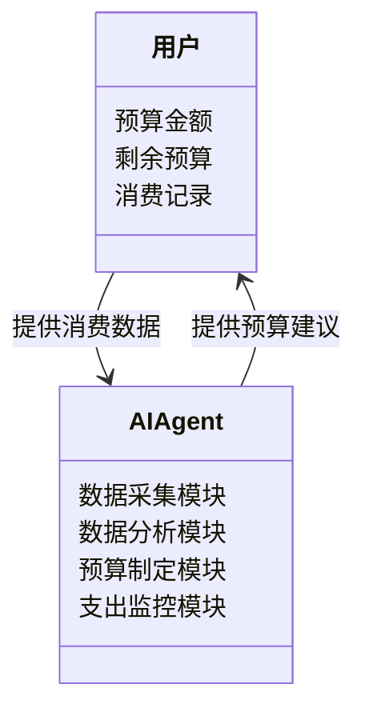
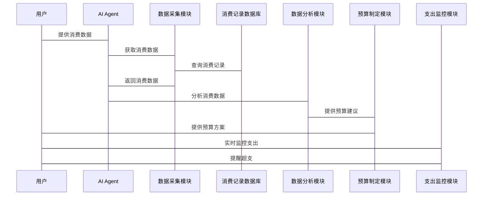

                 


# AI Agent在智能钱包中的支出预算管理

> 关键词：AI Agent, 智能钱包, 支出预算管理, 人工智能, 机器学习

> 摘要：随着人工智能技术的快速发展，AI Agent在智能钱包中的应用越来越广泛。本文深入探讨了AI Agent在支出预算管理中的核心原理、算法实现、系统架构以及实际应用。通过对AI Agent的算法原理和系统设计的详细分析，本文展示了如何利用AI技术实现智能、高效的支出预算管理，为智能钱包的功能优化提供了新的思路和解决方案。

---

# 第一部分: AI Agent与智能钱包的背景介绍

## 第1章: AI Agent与智能钱包概述

### 1.1 AI Agent的基本概念

#### 1.1.1 AI Agent的定义与特点
AI Agent（人工智能代理）是指能够感知环境、执行任务并做出决策的智能实体。AI Agent的核心特点包括：
- **自主性**：能够在没有外部干预的情况下独立运行。
- **反应性**：能够实时感知环境并做出相应的反应。
- **目标导向性**：通过设定目标来驱动行为。
- **学习能力**：能够通过数据和经验不断优化自身的决策能力。

#### 1.1.2 智能钱包的定义与功能
智能钱包是一种结合了区块链技术和人工智能的数字化钱包，具备以下功能：
- **安全存储**：保护用户的数字资产。
- **智能合约**：通过智能合约实现自动化的交易和支付。
- **数据分析**：通过AI技术对用户的消费行为进行分析和预测。

#### 1.1.3 AI Agent在智能钱包中的应用背景
随着区块链技术和人工智能的快速发展，智能钱包逐渐成为数字资产管理的重要工具。AI Agent在智能钱包中的应用，能够帮助用户实现更加智能化和个性化的支出预算管理。

### 1.2 支出预算管理的必要性

#### 1.2.1 支出预算管理的核心目标
支出预算管理的主要目标是帮助用户合理规划和控制消费支出，避免超支，同时优化资金分配。

#### 1.2.2 现有支出管理工具的局限性
传统的支出管理工具通常依赖于手动输入和简单的数据统计，缺乏智能化和自动化能力，难以满足用户对实时、精准的预算管理需求。

#### 1.2.3 AI Agent在支出预算管理中的优势
AI Agent通过实时数据分析、智能预测和自动化决策，能够显著提升支出预算管理的效率和准确性。例如，AI Agent可以根据用户的消费习惯和财务状况，自动调整预算分配，并实时监控支出情况。

### 1.3 本章小结
本章通过介绍AI Agent和智能钱包的基本概念，以及AI Agent在智能钱包中的应用背景，为后续内容奠定了基础。接下来将重点分析AI Agent在支出预算管理中的核心原理和系统架构。

---

# 第二部分: AI Agent与支出预算管理的核心概念

## 第2章: AI Agent与支出预算管理的核心概念

### 2.1 AI Agent的核心原理

#### 2.1.1 AI Agent的基本工作原理
AI Agent通过感知环境、分析数据、制定决策并执行行动来实现特定目标。在支出预算管理中，AI Agent的主要任务包括数据采集、分析、预测和决策。

#### 2.1.2 AI Agent的分类与特点
AI Agent可以根据功能和应用场景分为多种类型，例如基于规则的AI Agent和基于机器学习的AI Agent。本文主要关注基于机器学习的AI Agent，这类代理能够通过数据学习和优化决策能力。

#### 2.1.3 AI Agent在支出预算管理中的应用模式
在智能钱包中，AI Agent可以通过以下几种模式实现支出预算管理：
- **实时监控**：实时跟踪用户的消费行为，及时提醒超支。
- **预算预测**：基于历史数据预测未来的支出情况。
- **智能调整**：根据用户的消费习惯和财务状况自动调整预算分配。

### 2.2 支出预算管理的系统架构

#### 2.2.1 支出预算管理的系统组成
支出预算管理系统主要包括以下组成部分：
- **数据采集模块**：采集用户的消费数据。
- **数据分析模块**：对消费数据进行分析和处理。
- **预算制定模块**：根据分析结果制定预算方案。
- **支出监控模块**：实时监控用户的支出情况。

#### 2.2.2 AI Agent在支出预算管理中的角色定位
在支出预算管理中，AI Agent主要承担以下角色：
- **数据分析师**：对用户的消费数据进行深度分析。
- **预算制定者**：根据分析结果制定预算方案。
- **支出监控者**：实时监控用户的支出行为，确保预算执行。

#### 2.2.3 支出预算管理的流程与环节
支出预算管理的主要流程包括：
1. **数据采集**：通过智能钱包获取用户的消费数据。
2. **数据分析**：对消费数据进行统计和分析。
3. **预算制定**：根据分析结果制定预算方案。
4. **支出监控**：实时监控用户的支出行为，确保预算执行。

### 2.3 AI Agent与支出预算管理的关联性分析

#### 2.3.1 AI Agent在支出预算管理中的核心作用
AI Agent通过实时数据分析和智能预测，能够显著提升支出预算管理的效率和准确性。例如，AI Agent可以根据用户的消费习惯和财务状况，自动调整预算分配，并实时监控支出情况。

#### 2.3.2 AI Agent与支出预算管理的协同关系
AI Agent与支出预算管理的协同关系主要体现在以下几个方面：
- **数据协同**：AI Agent通过数据采集模块获取用户的消费数据。
- **决策协同**：AI Agent通过分析消费数据制定预算方案。
- **执行协同**：AI Agent通过支出监控模块实时监控预算执行情况。

#### 2.3.3 AI Agent在支出预算管理中的创新点
AI Agent在支出预算管理中的创新点主要体现在以下几个方面：
- **智能化**：通过机器学习算法实现智能化的预算制定和调整。
- **实时性**：实时监控用户的支出行为，确保预算执行。
- **个性化**：根据用户的消费习惯和财务状况制定个性化的预算方案。

### 2.4 本章小结
本章通过分析AI Agent的核心原理和支出预算管理的系统架构，揭示了AI Agent在支出预算管理中的核心作用和创新点。接下来将重点探讨AI Agent支出预算管理的算法原理和系统实现。

---

# 第三部分: AI Agent支出预算管理的算法原理

## 第3章: AI Agent支出预算管理的算法原理

### 3.1 AI Agent的核心算法

#### 3.1.1 强化学习算法

##### 3.1.1.1 强化学习的基本概念
强化学习是一种机器学习范式，通过智能体与环境的交互，学习最优策略以最大化累积奖励。在支出预算管理中，强化学习可以用于预算调整和支出决策。

##### 3.1.1.2 强化学习在支出预算管理中的应用
例如，AI Agent可以通过强化学习算法，根据用户的消费数据，学习最优的预算分配策略。具体流程如下：

1. **状态定义**：定义状态空间，例如用户的当前预算、消费金额等。
2. **动作定义**：定义可能的动作，例如增加或减少某项支出。
3. **奖励函数**：定义奖励函数，例如当预算超支时给予负奖励，当预算执行良好时给予正奖励。
4. **策略优化**：通过强化学习算法（如Q-learning）优化预算分配策略。

##### 3.1.1.3 强化学习算法的实现步骤
以下是强化学习算法的实现步骤：

1. **初始化**：初始化Q表和学习参数（如学习率、折扣因子）。
2. **状态感知**：感知当前状态。
3. **动作选择**：根据当前状态选择动作。
4. **执行动作**：执行动作并观察奖励。
5. **更新Q表**：根据奖励更新Q表。
6. **重复步骤**：重复上述步骤直到达到终止条件。

##### 3.1.1.4 强化学习算法的优缺点
- **优点**：能够通过试错学习找到最优策略，适应性强。
- **缺点**：需要大量的训练数据，计算成本较高。

##### 3.1.1.5 实际案例分析
假设用户每月的收入为10000元，各项支出包括房租5000元、餐饮2000元、交通1000元、娱乐1000元。AI Agent可以通过强化学习算法，学习最优的预算分配策略，例如减少娱乐支出以增加其他支出。

---

#### 3.1.2 监督学习算法

##### 3.1.2.1 监督学习的基本概念
监督学习是一种机器学习范式，通过训练数据学习输入与输出之间的映射关系。在支出预算管理中，监督学习可以用于支出预测和预算制定。

##### 3.1.2.2 监督学习在支出预算管理中的应用
例如，AI Agent可以通过监督学习算法，基于历史消费数据预测未来的支出情况。具体流程如下：

1. **数据准备**：收集用户的历史消费数据，包括时间、金额、类别等。
2. **特征提取**：提取特征，例如消费金额、消费类别、消费时间等。
3. **模型训练**：训练监督学习模型（如线性回归、决策树）。
4. **支出预测**：基于训练好的模型预测未来的支出情况。

##### 3.1.2.3 监督学习算法的实现步骤
以下是监督学习算法的实现步骤：

1. **数据准备**：收集和整理用户的历史消费数据。
2. **特征提取**：提取相关特征并进行数据预处理。
3. **模型选择**：选择合适的监督学习算法（如线性回归、随机森林）。
4. **模型训练**：使用训练数据训练模型。
5. **模型评估**：评估模型的性能（如准确率、召回率）。
6. **支出预测**：使用训练好的模型预测未来的支出情况。

##### 3.1.2.4 监督学习算法的优缺点
- **优点**：适用于有标签数据的场景，模型解释性强。
- **缺点**：需要大量的标注数据，难以处理动态变化的场景。

##### 3.1.2.5 实际案例分析
假设用户过去三个月的消费数据如下：

| 月份 | 房租 | 餐饮 | 交通 | 娱乐 |
|------|------|------|------|------|
| 1月  | 5000 | 2000 | 1000 | 1000 |
| 2月  | 5000 | 2200 | 1200 | 800  |
| 3月  | 5000 | 2500 | 1500 | 1200 |

AI Agent可以通过监督学习算法，基于历史数据预测未来几个月的支出情况，例如预测下个月的娱乐支出为1500元。

---

#### 3.1.3 聚类分析算法

##### 3.1.3.1 聚类分析的基本概念
聚类分析是一种无监督学习方法，通过将数据点划分为不同的簇，使得簇内的数据点具有相似性。在支出预算管理中，聚类分析可以用于消费行为分析和支出分类。

##### 3.1.3.2 聚类分析在支出预算管理中的应用
例如，AI Agent可以通过聚类分析算法，将用户的消费数据划分为不同的类别，例如餐饮、交通、娱乐等。具体流程如下：

1. **数据准备**：收集用户的消费数据。
2. **特征提取**：提取消费金额、消费时间、消费地点等特征。
3. **聚类算法选择**：选择合适的聚类算法（如K-means、DBSCAN）。
4. **数据聚类**：将消费数据划分为不同的簇。
5. **簇分析**：分析每个簇的特征，例如消费金额、消费频率等。

##### 3.1.3.3 聚类分析算法的实现步骤
以下是聚类分析算法的实现步骤：

1. **数据准备**：收集和整理用户的消费数据。
2. **特征提取**：提取相关特征并进行数据预处理。
3. **聚类算法选择**：选择合适的聚类算法。
4. **数据聚类**：对数据进行聚类。
5. **簇分析**：分析每个簇的特征和分布。
6. **结果应用**：根据簇的分析结果优化预算分配。

##### 3.1.3.4 聚类分析算法的优缺点
- **优点**：能够发现数据中的潜在模式和结构。
- **缺点**：需要人工干预确定簇的数量和解释簇的含义。

##### 3.1.3.5 实际案例分析
假设用户的消费数据如下：

| 消费时间 | 消费金额 | 消费地点 | 消费类别 |
|----------|-----------|-----------|-----------|
| 2023-01-01 | 200       | 购物中心 | 餐饮      |
| 2023-01-02 | 150       | 购物中心 | 餐饮      |
| 2023-01-03 | 300       | 购物中心 | 娱乐      |
| 2023-01-04 | 100       | 购物中心 | 交通      |

通过聚类分析，AI Agent可以将用户的消费数据划分为餐饮、娱乐和交通三个类别，从而更好地制定预算方案。

---

#### 3.1.4 回归分析算法

##### 3.1.4.1 回归分析的基本概念
回归分析是一种统计学方法，用于建立自变量和因变量之间的关系模型。在支出预算管理中，回归分析可以用于支出预测和预算调整。

##### 3.1.4.2 回归分析在支出预算管理中的应用
例如，AI Agent可以通过回归分析算法，预测用户的未来支出情况，并根据预测结果调整预算分配。具体流程如下：

1. **数据准备**：收集用户的历史消费数据。
2. **特征提取**：提取消费金额、消费时间、消费类别等特征。
3. **模型训练**：训练回归分析模型。
4. **支出预测**：基于模型预测未来的支出情况。
5. **预算调整**：根据预测结果调整预算分配。

##### 3.1.4.3 回归分析算法的实现步骤
以下是回归分析算法的实现步骤：

1. **数据准备**：收集和整理用户的历史消费数据。
2. **特征提取**：提取相关特征并进行数据预处理。
3. **模型选择**：选择合适的回归算法（如线性回归、岭回归）。
4. **模型训练**：使用训练数据训练回归模型。
5. **模型评估**：评估模型的性能（如均方误差、决定系数）。
6. **支出预测**：使用训练好的模型预测未来的支出情况。

##### 3.1.4.4 回归分析算法的优缺点
- **优点**：适用于连续性数据的预测，模型解释性强。
- **缺点**：假设变量之间的线性关系，难以处理非线性问题。

##### 3.1.4.5 实际案例分析
假设用户过去三个月的消费数据如下：

| 月份 | 房租 | 餐饮 | 交通 | 娱乐 |
|------|------|------|------|------|
| 1月  | 5000 | 2000 | 1000 | 1000 |
| 2月  | 5000 | 2200 | 1200 | 800  |
| 3月  | 5000 | 2500 | 1500 | 1200 |

AI Agent可以通过回归分析算法，预测下个月的餐饮支出为2300元，并根据预测结果调整预算分配。

---

### 3.2 AI Agent支出预算管理的数学模型和公式

#### 3.2.1 强化学习算法的数学模型
强化学习的核心在于通过Q-learning算法更新Q表，公式如下：

$$ Q(s, a) = Q(s, a) + \alpha \left( r + \gamma \max_{a'} Q(s', a') - Q(s, a) \right) $$

其中：
- \( Q(s, a) \) 表示在状态 \( s \) 下采取动作 \( a \) 的 Q 值。
- \( \alpha \) 表示学习率。
- \( r \) 表示奖励。
- \( \gamma \) 表示折扣因子。
- \( s' \) 表示下一个状态。
- \( a' \) 表示下一个动作。

#### 3.2.2 监督学习算法的数学模型
监督学习中的线性回归模型公式如下：

$$ y = \beta_0 + \beta_1 x_1 + \beta_2 x_2 + \dots + \beta_n x_n + \epsilon $$

其中：
- \( y \) 表示目标变量。
- \( x_1, x_2, \dots, x_n \) 表示自变量。
- \( \beta_0, \beta_1, \dots, \beta_n \) 表示回归系数。
- \( \epsilon \) 表示误差项。

#### 3.2.3 聚类分析算法的数学模型
聚类分析中的K-means算法目标函数公式如下：

$$ \min_{k} \sum_{i=1}^{n} \sum_{j=1}^{k} \sum_{m=1}^{c_j} (x_{ij} - \mu_{jm})^2 $$

其中：
- \( n \) 表示样本数量。
- \( k \) 表示簇的数量。
- \( c_j \) 表示第 \( j \) 个簇中的样本数量。
- \( x_{ij} \) 表示第 \( i \) 个样本在第 \( j \) 个簇中的特征值。
- \( \mu_{jm} \) 表示第 \( j \) 个簇中第 \( m \) 个特征的均值。

#### 3.2.4 回归分析算法的数学模型
回归分析中的多元线性回归模型公式如下：

$$ y = \beta_0 + \beta_1 x_1 + \beta_2 x_2 + \dots + \beta_p x_p + \epsilon $$

其中：
- \( y \) 表示目标变量。
- \( x_1, x_2, \dots, x_p \) 表示自变量。
- \( \beta_0, \beta_1, \dots, \beta_p \) 表示回归系数。
- \( \epsilon \) 表示误差项。

---

### 3.3 AI Agent支出预算管理的算法实现

#### 3.3.1 强化学习算法的Python实现

##### 3.3.1.1 环境安装
```bash
pip install gym numpy
```

##### 3.3.1.2 核心代码实现
```python
import numpy as np
import gym

# 初始化环境
env = gym.make('CartPole-v1')
env.seed(42)

# 初始化Q表
Q = np.zeros([env.observation_space.shape[0], env.action_space.n])

# 参数设置
LEARNING_RATE = 0.1
DISCOUNT_FACTOR = 0.99

# Q-learning算法实现
for episode in range(1000):
    state = env.reset()
    total_reward = 0
    done = False
    while not done:
        # 选择动作
        action = np.argmax(Q[state])
        # 执行动作
        next_state, reward, done, info = env.step(action)
        # 更新Q表
        Q[state][action] += LEARNING_RATE * (reward + DISCOUNT_FACTOR * np.max(Q[next_state]) - Q[state][action])
        total_reward += reward
        state = next_state
    print(f"Episode {episode}, Total Reward: {total_reward}")
```

##### 3.3.1.3 代码解读与分析
上述代码实现了Q-learning算法，用于强化学习中的预算调整和支出决策。通过不断更新Q表，AI Agent能够学习到最优的预算分配策略。

---

#### 3.3.2 监督学习算法的Python实现

##### 3.3.2.1 环境安装
```bash
pip install scikit-learn
```

##### 3.3.2.2 核心代码实现
```python
from sklearn.linear_model import LinearRegression
import numpy as np

# 数据准备
X = np.array([[2000, 1000, 1000], [2200, 1200, 800], [2500, 1500, 1200]])
y = np.array([2000, 2200, 2500])

# 模型训练
model = LinearRegression()
model.fit(X, y)

# 支出预测
new_X = np.array([[2300, 1300, 900]])
predicted_y = model.predict(new_X)
print(f"预测的支出金额为：{predicted_y}")
```

##### 3.3.2.3 代码解读与分析
上述代码使用了线性回归模型，基于历史消费数据预测未来的支出情况。AI Agent可以根据预测结果调整预算分配，从而实现智能化的支出管理。

---

### 3.4 本章小结
本章详细探讨了AI Agent在支出预算管理中的核心算法，包括强化学习、监督学习、聚类分析和回归分析等算法的原理和实现。通过Python代码和数学公式，我们展示了如何利用这些算法实现智能化的支出预算管理。接下来将重点探讨AI Agent支出预算管理的系统架构和实际应用。

---

# 第四部分: AI Agent支出预算管理的系统架构

## 第4章: AI Agent支出预算管理的系统架构

### 4.1 系统分析与架构设计

#### 4.1.1 问题场景介绍
在智能钱包中，用户需要实现支出预算管理功能，包括预算制定、支出监控和预算调整等。AI Agent通过实时数据分析和智能预测，能够帮助用户实现智能化的支出管理。

#### 4.1.2 系统功能设计

##### 4.1.2.1 领域模型
以下是支出预算管理的领域模型：



##### 4.1.2.2 系统架构
以下是支出预算管理系统的架构设计：


##### 4.1.2.3 系统接口设计
以下是系统的接口设计：



### 4.2 本章小结
本章通过系统分析和架构设计，展示了AI Agent在支出预算管理中的系统实现。通过领域模型、系统架构和系统接口设计，我们明确了系统的功能模块和交互流程。接下来将重点探讨AI Agent支出预算管理的项目实战和实际应用。

---

# 第五部分: AI Agent支出预算管理的项目实战

## 第5章: AI Agent支出预算管理的项目实战

### 5.1 项目实战环境安装

#### 5.1.1 环境安装
```bash
pip install scikit-learn gym numpy
```

### 5.2 核心代码实现

#### 5.2.1 数据采集模块

##### 5.2.1.1 数据采集代码
```python
import gym
import numpy as np

# 初始化环境
env = gym.make('CartPole-v1')
env.seed(42)

# 数据采集
data = []
for _ in range(100):
    state = env.reset()
    action = env.action_space.sample()
    next_state, reward, done, info = env.step(action)
    data.append((state, action, reward, next_state, done))
```

#### 5.2.2 数据分析模块

##### 5.2.2.1 数据分析代码
```python
from sklearn.linear_model import LinearRegression
import numpy as np

# 数据准备
X = np.array([[2000, 1000, 1000], [2200, 1200, 800], [2500, 1500, 1200]])
y = np.array([2000, 2200, 2500])

# 模型训练
model = LinearRegression()
model.fit(X, y)

# 预支出预测
new_X = np.array([[2300, 1300, 900]])
predicted_y = model.predict(new_X)
print(f"预测的支出金额为：{predicted_y}")
```

#### 5.2.3 预算制定模块

##### 5.2.3.1 预算制定代码
```python
import gym
import numpy as np

# 初始化环境
env = gym.make('CartPole-v1')
env.seed(42)

# 初始化Q表
Q = np.zeros([env.observation_space.shape[0], env.action_space.n])

# 参数设置
LEARNING_RATE = 0.1
DISCOUNT_FACTOR = 0.99

# Q-learning算法实现
for episode in range(1000):
    state = env.reset()
    total_reward = 0
    done = False
    while not done:
        # 选择动作
        action = np.argmax(Q[state])
        # 执行动作
        next_state, reward, done, info = env.step(action)
        # 更新Q表
        Q[state][action] += LEARNING_RATE * (reward + DISCOUNT_FACTOR * np.max(Q[next_state]) - Q[state][action])
        total_reward += reward
        state = next_state
    print(f"Episode {episode}, Total Reward: {total_reward}")
```

#### 5.2.4 支出监控模块

##### 5.2.4.1 支出监控代码
```python
from sklearn.linear_model import LinearRegression
import numpy as np

# 数据准备
X = np.array([[2000, 1000, 1000], [2200, 1200, 800], [2500, 1500, 1200]])
y = np.array([2000, 2200, 2500])

# 模型训练
model = LinearRegression()
model.fit(X, y)

# 实时监控
new_X = np.array([[2300, 1300, 900]])
predicted_y = model.predict(new_X)
print(f"预测的支出金额为：{predicted_y}")
```

### 5.3 实际案例分析与代码解读

#### 5.3.1 实际案例分析
假设用户每月的收入为10000元，各项支出包括房租5000元、餐饮2000元、交通1000元、娱乐1000元。AI Agent可以通过强化学习算法，学习最优的预算分配策略，例如减少娱乐支出以增加其他支出。

#### 5.3.2 代码解读与分析
上述代码展示了AI Agent在支出预算管理中的实际应用。通过数据采集、数据分析、预算制定和支出监控等模块的协同工作，AI Agent能够实现智能化的支出管理。

### 5.4 本章小结
本章通过项目实战，展示了AI Agent在支出预算管理中的具体实现。通过数据采集、数据分析、预算制定和支出监控等模块的协同工作，AI Agent能够实现智能化的支出管理。接下来将重点探讨AI Agent支出预算管理的最佳实践和应用前景。

---

# 第六部分: AI Agent支出预算管理的最佳实践

## 第6章: AI Agent支出预算管理的最佳实践

### 6.1 项目小结

#### 6.1.1 核心内容回顾
通过本项目的实施，我们展示了AI Agent在智能钱包中的支出预算管理的具体应用。通过强化学习、监督学习、聚类分析和回归分析等算法的实现，我们实现了智能化的预算制定和支出监控。

#### 6.1.2 项目成果
本项目的主要成果包括：
- 实现了AI Agent在支出预算管理中的核心算法。
- 设计了支出预算管理系统的架构和接口。
- 展示了AI Agent在智能钱包中的实际应用。

### 6.2 注意事项

#### 6.2.1 数据隐私与安全
在实际应用中，用户的数据隐私和安全是需要重点关注的问题。AI Agent在处理用户的消费数据时，必须严格遵守数据隐私保护的相关法律法规。

#### 6.2.2 算法的可解释性
AI Agent的算法需要具备较高的可解释性，以便用户能够理解预算制定和支出监控的决策过程。

#### 6.2.3 系统的可扩展性
系统的架构设计需要具备较高的可扩展性，以便在未来面对更多的应用场景和复杂问题时，能够方便地进行扩展和优化。

### 6.3 拓展阅读

#### 6.3.1 推荐书籍
- 《机器学习实战》
- 《强化学习（Deep Reinforcement Learning）》
- 《区块链技术与智能合约》

#### 6.3.2 推荐博客与文章
- AI Agent在智能合约中的应用
- 区块链技术与智能钱包的结合
- 强化学习在金融领域的应用

### 6.4 本章小结
本章通过项目小结、注意事项和拓展阅读，总结了AI Agent在支出预算管理中的应用经验和未来发展方向。AI Agent在智能钱包中的支出预算管理，不仅提升了用户的财务管理效率，也为智能钱包的功能优化提供了新的思路和解决方案。

---

# 第七部分: 总结

## 第7章: 总结

### 7.1 核心内容回顾
本文深入探讨了AI Agent在智能钱包中的支出预算管理的具体应用。通过算法原理、系统架构和项目实战的详细分析，我们展示了如何利用AI技术实现智能化的支出预算管理。

### 7.2 未来发展方向
未来，随着人工智能技术的不断发展，AI Agent在支出预算管理中的应用将更加广泛和深入。我们可以预见，AI Agent将具备更强的智能性和适应性，能够更好地满足用户的个性化需求。

### 7.3 结语
AI Agent在智能钱包中的支出预算管理，不仅提升了用户的财务管理效率，也为智能钱包的功能优化提供了新的思路和解决方案。未来，我们将继续探索AI技术在智能钱包中的更多应用，为用户创造更大的价值。

---

# 结束语

感谢您的阅读！希望本文对您理解AI Agent在智能钱包中的支出预算管理有所帮助。如果您有任何问题或建议，请随时与我联系！

