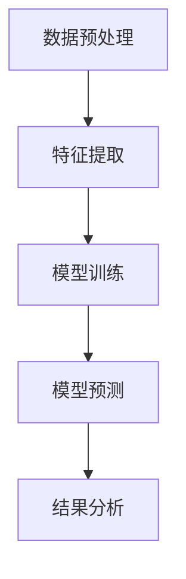
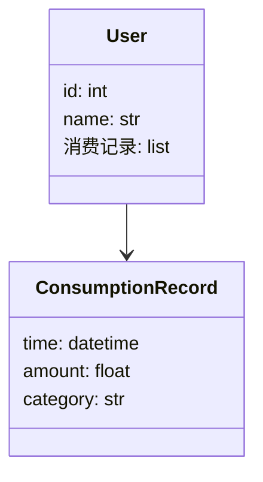
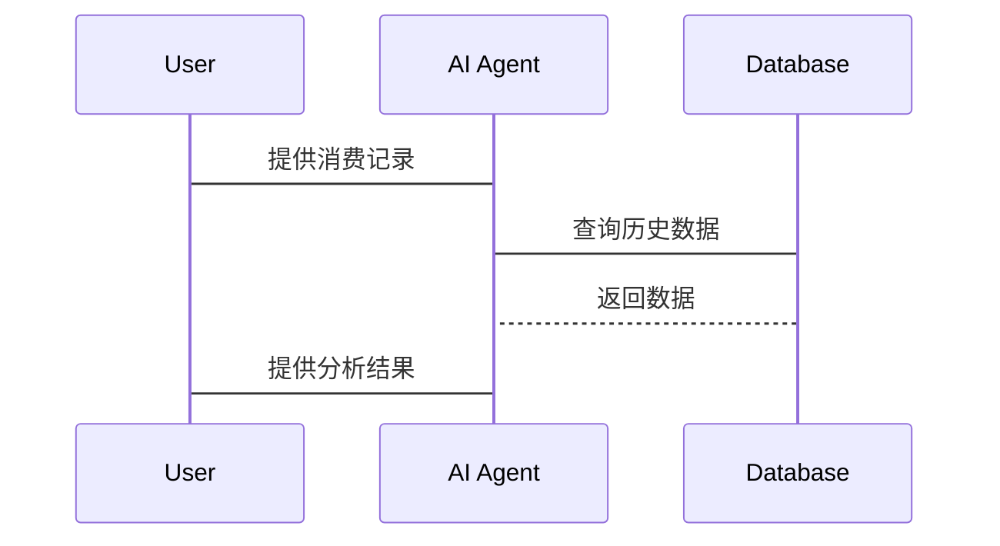

                 


# AI Agent在智能钱包中的消费习惯分析

> 关键词：AI Agent, 智能钱包, 消费习惯分析, 机器学习, 智能合约, 数据隐私

> 摘要：本文深入探讨了AI Agent在智能钱包中的消费习惯分析应用。通过分析消费数据，结合机器学习算法，AI Agent能够预测用户的消费行为，优化消费决策，提升用户体验。文章从背景介绍、核心概念、算法原理、系统架构到项目实战，全面解析了AI Agent在智能钱包中的应用，最后总结了最佳实践和未来发展方向。

---

# 第1章: AI Agent与智能钱包的背景介绍

## 1.1 AI Agent的基本概念

### 1.1.1 什么是AI Agent
AI Agent（人工智能代理）是一种能够感知环境、自主决策并执行任务的智能实体。它可以基于输入的数据进行分析、推理和预测，从而做出最优决策。

### 1.1.2 AI Agent的核心特点
- **自主性**：AI Agent能够独立执行任务，无需人工干预。
- **反应性**：能够实时感知环境变化并做出反应。
- **学习能力**：通过机器学习算法不断优化自身模型。
- **目标导向**：以特定目标为导向，追求最优解。

### 1.1.3 AI Agent与传统程序的区别
| 特性 | AI Agent | 传统程序 |
|------|----------|----------|
| 感知环境 | 是       | 否       |
| 自主决策 | 是       | 否       |
| 学习能力 | 是       | 否       |
| 实时性 | 强       | 弱       |

## 1.2 智能钱包的概念与特点

### 1.2.1 智能钱包的定义
智能钱包是一种结合了区块链技术的数字钱包，能够通过智能合约自动执行预设的规则，实现自动化交易和资金管理。

### 1.2.2 智能钱包的核心功能
- **自动化交易**：基于智能合约自动执行交易。
- **资金管理**：根据预设规则管理资金分配。
- **消费记录分析**：记录和分析用户的消费行为。

### 1.2.3 智能钱包与传统钱包的对比
| 功能 | 智能钱包 | 传统钱包 |
|------|----------|----------|
| 自动化交易 | 是       | 否       |
| 智能合约 | 是       | 否       |
| 消费分析 | 是       | 否       |

## 1.3 AI Agent在智能钱包中的应用背景

### 1.3.1 数字货币的兴起
数字货币的普及推动了智能钱包的发展，用户需要更智能的工具来管理数字资产。

### 1.3.2 智能合约的概念
智能合约是一种自动执行的协议，能够基于预设条件自动执行交易，为智能钱包提供了技术基础。

### 1.3.3 消费习惯分析的必要性
通过分析用户的消费习惯，智能钱包可以提供个性化的消费建议，优化用户的资金管理。

## 1.4 本章小结
本章介绍了AI Agent和智能钱包的基本概念，并分析了AI Agent在智能钱包中的应用背景，为后续章节奠定了基础。

---

# 第2章: 消费习惯分析的核心概念

## 2.1 消费习惯分析的定义

### 2.1.1 消费习惯的定义
消费习惯是指用户在特定场景下的消费行为模式，包括消费频率、金额和偏好。

### 2.1.2 消费习惯分析的目标
- **预测消费行为**：通过历史数据预测未来的消费行为。
- **优化消费决策**：基于分析结果提供消费建议。
- **提升用户体验**：通过个性化服务提升用户满意度。

## 2.2 AI Agent在消费习惯分析中的作用

### 2.2.1 AI Agent如何理解消费数据
AI Agent通过收集和分析用户的消费数据，提取特征并构建模型。

### 2.2.2 AI Agent如何预测消费行为
基于机器学习算法，AI Agent能够预测用户的消费行为，例如预测下一次消费的时间和金额。

### 2.2.3 AI Agent如何优化消费决策
AI Agent可以根据用户的消费习惯和财务状况，提出优化建议，例如减少不必要的开支。

## 2.3 消费习惯分析的关键指标

### 2.3.1 消费频率分析
- **定义**：用户在特定时间段内的消费次数。
- **应用场景**：分析用户的活跃程度。

### 2.3.2 消费金额分析
- **定义**：每次消费的金额。
- **应用场景**：识别用户的消费能力。

### 2.3.3 消费偏好分析
- **定义**：用户对不同商品或服务的偏好程度。
- **应用场景**：推荐个性化产品。

## 2.4 本章小结
本章详细介绍了消费习惯分析的核心概念，并分析了AI Agent在其中的作用，为后续章节的技术实现奠定了基础。

---

# 第3章: AI Agent消费习惯分析的算法原理

## 3.1 机器学习在消费习惯分析中的应用

### 3.1.1 机器学习的基本概念
机器学习是一种通过数据训练模型，使其能够进行预测或分类的技术。

### 3.1.2 常见的机器学习算法
- **决策树**：用于分类和回归。
- **随机森林**：基于决策树的集成算法。
- **神经网络**：用于复杂的模式识别。

### 3.1.3 机器学习在消费预测中的优势
- **自动化**：无需手动特征提取。
- **高精度**：通过训练数据提升预测准确性。
- **可解释性**：部分算法（如决策树）具有较高的可解释性。

## 3.2 算法实现与流程

### 3.2.1 数据预处理
```python
import pandas as pd
import numpy as np

# 数据加载
data = pd.read_csv('consumption.csv')

# 去除缺失值
data = data.dropna()

# 标准化处理
from sklearn.preprocessing import StandardScaler
scaler = StandardScaler()
data_scaled = scaler.fit_transform(data)
```

### 3.2.2 算法选择与实现
```python
from sklearn.tree import DecisionTreeRegressor

# 训练模型
model = DecisionTreeRegressor()
model.fit(X_train, y_train)

# 预测结果
y_pred = model.predict(X_test)
```

### 3.2.3 算法流程图


## 3.3 数学模型与公式

### 3.3.1 决策树模型
- **定义**：基于特征的分裂规则构建树状结构。
- **公式**：决策树通过信息增益率或基尼指数选择最优特征。

### 3.3.2 聚类分析
- **公式**：K-means算法用于将用户分为不同的消费群体。

## 3.4 本章小结
本章详细介绍了机器学习在消费习惯分析中的应用，并通过具体代码示例展示了算法的实现过程。

---

# 第4章: 系统分析与架构设计

## 4.1 问题场景介绍

### 4.1.1 系统目标
- **目标**：分析用户的消费习惯，提供个性化的消费建议。

### 4.1.2 问题分析
- **数据来源**：用户的消费记录。
- **数据特征**：消费时间、金额、地点等。

## 4.2 系统功能设计

### 4.2.1 领域模型类图


### 4.2.2 系统架构设计
```mermaid
split
    split
        User
        ConsumptionRecord
    end
    AI Agent
    Database
    User Interface
    Model Training
```

## 4.3 系统接口设计

### 4.3.1 接口描述
- **输入接口**：用户消费记录的上传。
- **输出接口**：消费习惯分析结果的展示。

### 4.3.2 交互流程图


## 4.4 本章小结
本章从系统设计的角度，详细分析了AI Agent在智能钱包中的消费习惯分析系统的架构和接口设计。

---

# 第5章: 项目实战

## 5.1 环境安装

### 5.1.1 安装Python
```bash
python --version
pip install --upgrade pip
```

### 5.1.2 安装机器学习库
```bash
pip install scikit-learn
pip install pandas
pip install numpy
```

## 5.2 系统核心实现

### 5.2.1 核心代码
```python
import pandas as pd
from sklearn.tree import DecisionTreeRegressor
from sklearn.model_selection import train_test_split

# 数据加载
data = pd.read_csv('consumption.csv')

# 特征选择
X = data[['time', 'amount', 'category']]
y = data['label']

# 数据分割
X_train, X_test, y_train, y_test = train_test_split(X, y, test_size=0.2)

# 模型训练
model = DecisionTreeRegressor()
model.fit(X_train, y_train)

# 预测结果
y_pred = model.predict(X_test)

# 输出结果
print('预测结果:', y_pred)
```

### 5.2.2 代码解读
- **数据加载**：读取消费记录数据。
- **特征选择**：提取消费时间、金额和类别作为特征。
- **数据分割**：将数据分为训练集和测试集。
- **模型训练**：使用决策树算法训练模型。
- **预测结果**：对测试集进行预测并输出结果。

## 5.3 实际案例分析

### 5.3.1 数据分析
- **消费记录**：用户在过去一个月的消费记录。
- **分析结果**：预测下一次消费的时间和金额。

### 5.3.2 结果解读
- **消费频率**：用户每周消费两次。
- **消费金额**：平均每次消费500元。
- **消费偏好**：用户偏好电子产品。

## 5.4 项目小结
本章通过实际案例展示了AI Agent在智能钱包中的消费习惯分析的实现过程，并对结果进行了详细解读。

---

# 第6章: 最佳实践与注意事项

## 6.1 最佳实践

### 6.1.1 数据隐私保护
- **加密存储**：确保用户数据的安全性。
- **访问控制**：限制数据的访问权限。

### 6.1.2 模型调优建议
- **特征工程**：选择合适的特征提升模型性能。
- **超参数优化**：通过网格搜索优化模型参数。

### 6.1.3 系统优化
- **性能优化**：使用分布式计算提升处理效率。
- **容错设计**：确保系统在故障时能够自动恢复。

## 6.2 小结
本章总结了AI Agent在智能钱包中的消费习惯分析的最佳实践和注意事项，为实际应用提供了宝贵的参考。

---

# 第7章: 未来发展方向

## 7.1 技术趋势

### 7.1.1 AI Agent的进化
- **自我学习**：AI Agent能够通过反馈不断优化自身模型。
- **多模态分析**：结合文本、图像等多种数据源进行分析。

### 7.1.2 区块链技术的融合
- **智能合约升级**：通过区块链技术实现更复杂的智能合约。
- **去中心化应用**：推动去中心化金融（DeFi）的发展。

## 7.2 应用场景拓展

### 7.2.1 个性化服务
- **精准营销**：基于消费习惯推荐个性化产品。
- **风险管理**：预测潜在的财务风险。

### 7.2.2 跨平台应用
- **多钱包支持**：支持多种数字钱包的消费习惯分析。
- **跨平台数据整合**：整合不同平台的消费数据，提供更全面的分析结果。

## 7.3 本章小结
本章展望了AI Agent在智能钱包中的消费习惯分析的未来发展方向，指出了技术趋势和应用场景的拓展方向。

---

# 结语

AI Agent在智能钱包中的消费习惯分析是一项具有广阔前景的技术。通过机器学习算法和智能合约的结合，AI Agent能够为用户提供个性化的消费建议，优化资金管理。未来，随着技术的不断进步，AI Agent在智能钱包中的应用将更加广泛和深入，为用户带来更智能化、个性化的服务。

---

**附录**
- **附录A**：常用机器学习算法简介
- **附录B**：数据隐私保护的法律法规
- **附录C**：AI Agent在智能合约中的具体应用

