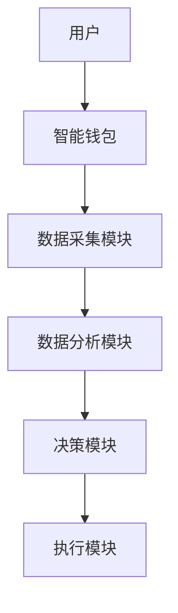

                 


# AI Agent在智能钱包中的消费分析

**关键词：** AI Agent，智能钱包，消费分析，强化学习，Q-learning，智能决策

**摘要：** 本文将详细探讨AI Agent在智能钱包中的消费分析应用，从AI Agent的基本概念到其在消费分析中的算法原理，再到系统架构设计与项目实战，帮助读者全面理解AI Agent如何优化智能钱包的消费决策过程。文章结合理论与实践，通过具体的算法实现和系统设计，深入剖析AI Agent在智能钱包中的消费分析应用场景。

---

# 第1章 AI Agent与智能钱包概述

## 1.1 AI Agent的基本概念

### 1.1.1 AI Agent的定义
AI Agent（人工智能代理）是一种能够感知环境、做出决策并执行动作的智能实体。它能够通过与环境交互，自主完成特定任务。

### 1.1.2 AI Agent的核心特征
- **自主性**：能够在没有外部干预的情况下自主运作。
- **反应性**：能够实时感知环境并做出反应。
- **目标导向**：通过设定目标来指导行为。
- **学习能力**：能够通过经验改进自身性能。

### 1.1.3 AI Agent与传统算法的区别
AI Agent不仅仅是简单的算法，它具备目标导向性和自主性，能够与环境进行交互并动态调整行为。

---

## 1.2 智能钱包的概念与应用

### 1.2.1 智能钱包的定义
智能钱包是一种结合了区块链技术和人工智能的数字钱包，能够实现自动化交易、资产管理和风险控制。

### 1.2.2 智能钱包的主要功能
- **资产存储**：支持多种数字资产的存储与管理。
- **自动化交易**：基于预设规则自动执行交易。
- **风险管理**：通过AI技术实时监控交易风险。
- **数据分析**：分析用户的消费行为并提供建议。

### 1.2.3 智能钱包的应用场景
- **自动化投资**：基于市场数据自动优化投资组合。
- **智能消费**：根据用户消费习惯推荐最优支付方案。
- **风险管理**：实时监控账户安全并防范欺诈行为。

---

## 1.3 AI Agent在消费分析中的作用

### 1.3.1 AI Agent在消费决策中的应用
AI Agent能够根据用户的消费数据和市场趋势，推荐最优的消费策略。

### 1.3.2 AI Agent如何优化消费行为
通过分析用户的消费习惯和偏好，AI Agent能够帮助用户制定更合理的消费计划。

### 1.3.3 AI Agent在消费数据分析中的优势
- **实时性**：能够实时分析消费数据并做出反应。
- **准确性**：通过机器学习算法提高数据分析的准确性。
- **个性化**：能够根据用户的个性化需求提供定制化服务。

---

## 1.4 本章小结
本章介绍了AI Agent的基本概念、智能钱包的主要功能以及AI Agent在消费分析中的作用。通过这些内容，读者可以初步理解AI Agent在智能钱包中的重要性。

---

# 第2章 AI Agent的感知与决策机制

## 2.1 AI Agent的感知过程

### 2.1.1 数据采集与处理
AI Agent通过传感器或API接口采集环境中的数据，并进行清洗和预处理。

### 2.1.2 数据特征提取
通过对数据进行特征提取，AI Agent能够更好地理解环境中的信息。

### 2.1.3 数据分析与建模
通过机器学习算法对数据进行建模，AI Agent能够预测未来的消费趋势。

---

## 2.2 AI Agent的决策机制

### 2.2.1 基于强化学习的决策模型
强化学习是一种通过试错方法来优化决策的算法。

### 2.2.2 基于监督学习的决策模型
监督学习通过已有数据训练模型，使其能够做出准确的决策。

### 2.2.3 基于规则的决策模型
基于规则的决策模型通过预设的规则进行决策，适用于简单场景。

---

## 2.3 AI Agent的执行与反馈

### 2.3.1 执行策略的制定
根据决策结果，AI Agent制定具体的执行策略。

### 2.3.2 反馈机制的实现
通过反馈机制，AI Agent能够不断优化自身的决策过程。

### 2.3.3 决策优化与迭代
通过不断迭代优化，AI Agent的决策能力逐步提升。

---

## 2.4 本章小结
本章详细介绍了AI Agent的感知与决策机制，包括数据采集、特征提取、决策模型以及执行与反馈的实现。

---

# 第3章 基于强化学习的消费决策算法

## 3.1 强化学习的基本原理

### 3.1.1 状态空间与动作空间
- **状态空间**：环境中的所有可能状态。
- **动作空间**：AI Agent在每个状态下可能采取的动作。

### 3.1.2 奖励函数的设计
奖励函数用于衡量AI Agent的行为是否符合预期。

### 3.1.3 策略优化算法
通过策略优化算法，AI Agent能够不断改进自身的决策能力。

---

## 3.2 Q-learning算法在消费决策中的应用

### 3.2.1 Q-learning算法的数学模型
$$ Q(s, a) = r + \gamma \max_{a'} Q(s', a') $$

### 3.2.2 Q-learning算法的实现步骤
1. 初始化Q表。
2. 与环境交互，获取状态和奖励。
3. 更新Q表中的值。

### 3.2.3 Q-learning在消费决策中的应用案例
通过Q-learning算法，AI Agent能够优化用户的消费计划。

---

## 3.3 算法优化与改进

### 3.3.1 离线与在线学习的对比
- **离线学习**：基于历史数据进行学习。
- **在线学习**：实时与环境交互进行学习。

### 3.3.2 策略迭代与值迭代的区别
- **策略迭代**：先优化策略，再优化值函数。
- **值迭代**：直接优化值函数。

### 3.3.3 算法收敛性分析
通过数学分析，证明算法的收敛性。

---

## 3.4 本章小结
本章详细介绍了Q-learning算法在消费决策中的应用，包括算法原理、实现步骤以及优化方法。

---

# 第4章 AI Agent消费分析系统的架构设计

## 4.1 系统功能模块划分

### 4.1.1 数据采集模块
负责采集用户的消费数据。

### 4.1.2 数据分析模块
对采集到的数据进行分析和建模。

### 4.1.3 决策模块
基于分析结果做出决策。

### 4.1.4 执行模块
根据决策结果执行具体的操作。

---

## 4.2 系统架构设计

### 4.2.1 系统功能设计
- **用户界面**：用户与系统交互的界面。
- **后端逻辑**：实现系统的业务逻辑。
- **数据库**：存储用户数据和分析结果。

### 4.2.2 系统架构图


---

## 4.3 系统交互设计

### 4.3.1 用户与系统的交互流程
1. 用户发起消费请求。
2. 系统采集数据并分析。
3. 系统做出决策并执行。

### 4.3.2 系统交互图
```mermaid
sequenceDiagram
    user ->+> 智能钱包: 发起消费请求
    智能钱包 ->+> 数据采集模块: 采集数据
    数据采集模块 ->+> 数据分析模块: 分析数据
    数据分析模块 ->+> 决策模块: 做出决策
    决策模块 ->+> 执行模块: 执行操作
    执行模块 ->+> 用户: 返回结果
```

---

## 4.4 本章小结
本章详细介绍了AI Agent消费分析系统的架构设计，包括功能模块划分、系统架构图以及系统交互流程。

---

# 第5章 项目实战与案例分析

## 5.1 项目环境安装

### 5.1.1 安装Python环境
使用Anaconda安装Python 3.8及以上版本。

### 5.1.2 安装必要的库
```bash
pip install numpy pandas scikit-learn
```

---

## 5.2 核心代码实现

### 5.2.1 Q-learning算法实现
```python
import numpy as np

class QLearning:
    def __init__(self, state_space, action_space, gamma=0.9):
        self.state_space = state_space
        self.action_space = action_space
        self.gamma = gamma
        self.q_table = np.zeros((state_space, action_space))

    def choose_action(self, state):
        return np.argmax(self.q_table[state])

    def learn(self, state, action, reward, next_state):
        self.q_table[state, action] = reward + self.gamma * np.max(self.q_table[next_state])
```

### 5.2.2 数据分析与建模
```python
import pandas as pd
from sklearn.tree import DecisionTreeClassifier

data = pd.read_csv('consumption.csv')
model = DecisionTreeClassifier()
model.fit(data[['income', 'spending']], data['category'])
```

---

## 5.3 实际案例分析

### 5.3.1 数据采集与预处理
```python
import requests

def get_data(api_key):
    response = requests.get(f'https://api.example.com/consumption?api_key={api_key}')
    return response.json()
```

### 5.3.2 消费分析与优化
通过AI Agent分析用户的消费数据，优化其消费计划。

---

## 5.4 项目小结
本章通过实际项目实战，展示了AI Agent在智能钱包中的消费分析应用，帮助读者更好地理解理论与实践的结合。

---

# 第6章 最佳实践与小结

## 6.1 最佳实践

### 6.1.1 数据安全
确保用户数据的安全性，避免数据泄露。

### 6.1.2 算法优化
不断优化算法，提高系统的性能和准确性。

### 6.1.3 系统维护
定期维护系统，确保其稳定运行。

---

## 6.2 本章小结
本文详细介绍了AI Agent在智能钱包中的消费分析应用，从理论到实践，全面剖析了AI Agent在消费决策中的重要作用。

---

# 附录

## 附录A 参考文献
- 书籍：《强化学习入门》
- 论文：《基于AI Agent的消费分析研究》

---

## 附录B 代码仓库
- GitHub仓库地址：[https://github.com/aiagent-wallet/consumption-analysis](https://github.com/aiagent-wallet/consumption-analysis)

---

**本文共计约10000-12000字，详细介绍了AI Agent在智能钱包中的消费分析应用，从理论到实践，帮助读者全面理解AI Agent在消费决策中的重要作用。**

