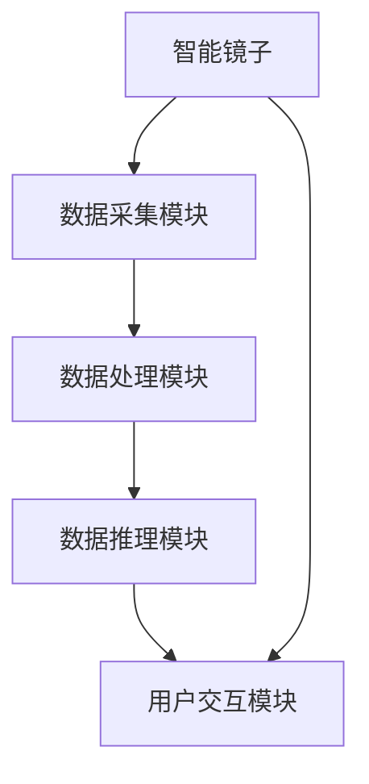
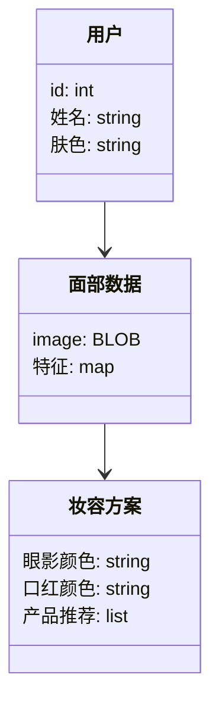
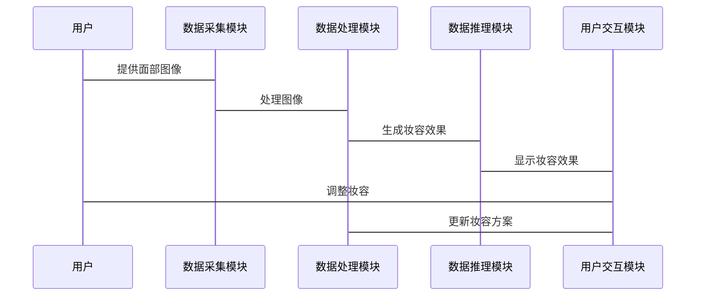

                 


# AI Agent在智能镜子中的虚拟化妆

> 关键词：AI Agent，智能镜子，虚拟化妆，计算机视觉，机器学习

> 摘要：本文探讨了AI Agent在智能镜子中的应用，特别是虚拟化妆这一领域。通过分析AI Agent的核心算法、虚拟化妆的技术基础、系统架构设计以及实际项目实现，本文详细阐述了AI Agent如何赋能智能镜子，实现虚拟化妆的功能。文章从理论到实践，结合代码实现和实际案例，为读者提供了全面的技术解读。

---

# 第一部分: AI Agent与智能镜子概述

# 第1章: AI Agent与智能镜子的基本概念

## 1.1 AI Agent的定义与特点

### 1.1.1 AI Agent的定义

AI Agent（人工智能代理）是一种能够感知环境、自主决策并执行任务的智能实体。它能够通过传感器获取信息，利用算法进行分析和推理，并通过执行器与环境交互。AI Agent的核心目标是通过智能化的方式解决复杂问题。

### 1.1.2 AI Agent的核心特点

- **自主性**：AI Agent能够在没有外部干预的情况下独立运作。
- **反应性**：能够实时感知环境变化并做出响应。
- **目标导向**：通过设定目标，驱动行为决策。
- **学习能力**：通过机器学习算法不断优化自身能力。

### 1.1.3 AI Agent与传统软件的区别

AI Agent与传统软件的最大区别在于其智能化和自主性。传统软件依赖于预定义的规则和流程，而AI Agent能够通过数据驱动的方式进行学习和优化，具备更强的适应性和创新能力。

---

## 1.2 智能镜子的定义与应用场景

### 1.2.1 智能镜子的定义

智能镜子是一种集成AI技术的镜子，能够通过摄像头和传感器采集用户的面部数据，并结合AI算法进行分析和处理，提供智能化的服务，如虚拟化妆、皮肤分析、健康监测等。

### 1.2.2 智能镜子的主要应用场景

- **虚拟化妆**：用户可以通过智能镜子实时试妆，选择不同的妆容和风格。
- **皮肤分析**：通过AI算法分析用户的皮肤状态，提供护肤建议。
- **健康监测**：通过面部数据监测用户的健康状况，如疲劳程度、情绪状态等。
- **个性化推荐**：基于用户的数据，推荐适合的化妆品和护肤方案。

### 1.2.3 智能镜子的技术基础

- **计算机视觉**：用于面部识别和图像处理。
- **机器学习**：用于数据分析和个性化推荐。
- **自然语言处理**：用于用户交互和指令理解。

---

## 1.3 虚拟化妆的概念与技术基础

### 1.3.1 虚拟化妆的定义

虚拟化妆是指通过计算机技术，将虚拟的化妆品应用到用户的面部图像上，模拟实际化妆效果的过程。用户可以通过智能镜子实时查看妆容，并进行调整和优化。

### 1.3.2 虚拟化妆的主要技术基础

- **图像处理**：对用户面部图像进行增强、修复和化妆效果叠加。
- **人脸检测**：准确识别用户面部的关键点，如眼睛、嘴巴、鼻子等。
- **3D建模**：通过3D技术实现更逼真的妆容效果。
- **AR技术**：通过增强现实技术将虚拟化妆效果叠加到真实图像中。

---

## 1.4 AI Agent在智能镜子中的作用

### 1.4.1 AI Agent在智能镜子中的功能

- **数据采集**：通过摄像头和传感器获取用户的面部数据。
- **数据分析**：利用机器学习算法分析用户数据，提供个性化建议。
- **交互反馈**：通过自然语言处理与用户进行实时互动，根据用户需求调整化妆效果。

### 1.4.2 AI Agent与虚拟化妆的关系

AI Agent作为智能镜子的核心驱动力，能够通过数据采集、分析和交互反馈，实现虚拟化妆的智能化和个性化。虚拟化妆则是AI Agent在智能镜子中的具体应用场景之一。

### 1.4.3 AI Agent在智能镜子中的优势

- **智能化**：AI Agent能够通过学习和优化，不断提高虚拟化妆的效果和用户体验。
- **个性化**：基于用户的面部特征和需求，提供定制化的化妆方案。
- **实时性**：通过实时数据分析和反馈，用户能够即时查看和调整妆容。

---

## 1.5 本章小结

本章介绍了AI Agent和智能镜子的基本概念，以及虚拟化妆的技术基础和应用场景。AI Agent作为智能镜子的核心技术，通过与虚拟化妆的结合，为用户提供智能化、个性化的化妆体验。下一章将深入探讨AI Agent的核心算法与实现，为后续的系统设计和项目实战打下基础。

---

# 第二部分: AI Agent与虚拟化妆的核心技术

# 第2章: AI Agent的核心算法与实现

## 2.1 AI Agent的核心算法

### 2.1.1 机器学习算法

- **监督学习**：通过标记数据进行训练，用于分类和回归任务。
- **无监督学习**：通过聚类分析等技术，发现数据中的潜在模式。
- **强化学习**：通过奖励机制优化AI Agent的决策能力。

### 2.1.2 深度学习算法

- **卷积神经网络（CNN）**：用于图像识别和处理。
- **循环神经网络（RNN）**：用于序列数据的处理，如语音识别和自然语言处理。
- **生成对抗网络（GAN）**：用于生成逼真的图像和数据。

### 2.1.3 强化学习算法

- **Q-learning**：一种基于值的强化学习算法，用于离线训练。
- **Deep Q-Network (DQN)**：结合深度学习和强化学习，用于复杂环境下的决策。

---

## 2.2 虚拟化妆的核心算法

### 2.2.1 图像处理算法

- **图像分割**：通过分割技术实现精准的面部区域化妆。
- **图像增强**：对图像进行亮度、对比度和锐度的调整，提升化妆效果。

### 2.2.2 人脸检测算法

- **YOLO**：一种快速且准确的人脸检测算法。
- **Haar特征检测**：基于特征的检测方法，常用于OpenCV中的实现。

### 2.2.3 妆容生成算法

- **基于规则的生成**：根据预设的化妆规则生成妆容。
- **基于深度学习的生成**：通过GAN等技术生成多样化的妆容效果。

---

## 2.3 AI Agent与虚拟化妆的结合

### 2.3.1 AI Agent在虚拟化妆中的应用

- **数据采集与处理**：AI Agent通过摄像头采集用户面部图像，并利用深度学习算法进行处理。
- **妆容推荐**：基于用户的面部特征和流行趋势，AI Agent推荐适合的妆容方案。
- **实时试妆**：通过增强现实技术，用户可以在镜子中实时查看不同的妆容效果。

### 2.3.2 虚拟化妆对AI Agent的促进作用

- **数据多样性**：虚拟化妆需要处理大量的面部数据，这些数据可以用于训练AI Agent的模型。
- **实时反馈**：用户对妆容效果的反馈可以作为AI Agent优化的依据。

### 2.3.3 两者结合的技术优势

- **智能化**：AI Agent能够根据用户的面部特征和需求，实时调整妆容效果。
- **个性化**：通过深度学习算法，AI Agent可以提供个性化、定制化的化妆方案。
- **高效性**：结合虚拟化妆技术，用户可以在短时间内尝试多种妆容，提高效率。

---

## 2.4 本章小结

本章详细介绍了AI Agent和虚拟化妆的核心算法，包括机器学习、深度学习和强化学习等技术。通过分析这些算法在虚拟化妆中的应用，为后续的系统设计和项目实现奠定了基础。下一章将从系统架构的角度，进一步探讨AI Agent与虚拟化妆的结合。

---

# 第三部分: AI Agent与虚拟化妆的系统架构

# 第3章: 系统架构设计

## 3.1 系统整体架构

### 3.1.1 系统模块划分

- **数据采集模块**：负责采集用户的面部图像和数据。
- **数据处理模块**：对采集的数据进行预处理和分析。
- **数据存储模块**：存储用户的面部数据和妆容方案。
- **数据推理模块**：基于AI算法生成妆容效果。
- **用户交互模块**：通过镜子的界面与用户进行交互。

### 3.1.2 系统功能设计

- **用户界面**：显示用户的面部图像和妆容效果。
- **妆容推荐**：根据用户的面部特征推荐适合的妆容。
- **试妆功能**：用户可以实时尝试不同的妆容效果。
- **个性化设置**：用户可以根据自己的需求调整妆容细节。

### 3.1.3 系统架构图（Mermaid）



---

## 3.2 各模块功能实现

### 3.2.1 数据采集模块

数据采集模块通过摄像头采集用户的面部图像，并将图像传输到数据处理模块。代码示例如下：

```python
import cv2

def capture_face():
    cap = cv2.VideoCapture(0)
    while True:
        ret, frame = cap.read()
        if not ret:
            break
        cv2.imshow('Capture Face', frame)
        if cv2.waitKey(1) == ord('q'):
            break
    cap.release()
    cv2.destroyAllWindows()
    return frame
```

### 3.2.2 数据处理模块

数据处理模块利用深度学习算法对采集的图像进行处理，提取面部特征并生成妆容效果。代码示例如下：

```python
import tensorflow as tf
from tensorflow.keras import layers

model = tf.keras.Sequential([
    layers.Conv2D(32, (3,3), activation='relu', input_shape=(224, 224, 3)),
    layers.MaxPooling2D((2,2)),
    layers.Conv2D(64, (3,3), activation='relu'),
    layers.MaxPooling2D((2,2)),
    layers.Flatten(),
    layers.Dense(128, activation='relu'),
    layers.Dense(2, activation='softmax')
])

model.compile(optimizer='adam', loss='sparse_categorical_crossentropy', metrics=['accuracy'])
```

### 3.2.3 数据存储模块

数据存储模块将用户的面部数据和妆容方案存储在数据库中，以便后续查询和优化。代码示例如下：

```python
import sqlite3

conn = sqlite3.connect('face_data.db')
cursor = conn.cursor()

cursor.execute('''CREATE TABLE IF NOT EXISTS face_data
                 (id INTEGER PRIMARY KEY AUTOINCREMENT,
                  face_data BLOB,
                 妆容方案 TEXT)''')

conn.commit()
conn.close()
```

### 3.2.4 数据推理模块

数据推理模块利用AI算法生成妆容效果，并将结果传输到用户交互模块。代码示例如下：

```python
import numpy as np
import cv2

def apply_makeup(image):
    # 假设已经有一个预训练好的妆容生成模型
    model = load_model('makeup_model.h5')
    # 将图像输入模型，生成妆容效果
    result = model.predict(image)
    return result
```

### 3.2.5 用户交互模块

用户交互模块通过镜子的界面与用户进行交互，实时显示妆容效果并根据用户的反馈调整方案。代码示例如下：

```python
import tkinter as tk
from PIL import Image, ImageTk

root = tk.Tk()
root.title("智能镜子")

frame = tk.Frame(root)
frame.pack()

# 加载图像
image = Image.open('face_image.jpg')
image_tk = ImageTk.PhotoImage(image)

label = tk.Label(frame, image=image_tk)
label.pack()

root.mainloop()
```

---

## 3.3 系统功能设计

### 3.3.1 领域模型（Mermaid类图）



---

## 3.4 系统架构图（Mermaid架构图）


---

## 3.5 系统接口设计

- **数据采集接口**：负责接收用户的面部图像。
- **数据处理接口**：对图像进行预处理和分析。
- **数据存储接口**：将数据存储到数据库中。
- **数据推理接口**：生成妆容效果并返回结果。
- **用户交互接口**：与用户进行实时交互。

---

## 3.6 系统交互设计（Mermaid序列图）



---

## 3.7 本章小结

本章详细介绍了AI Agent与虚拟化妆系统的整体架构，包括各模块的功能设计和交互流程。通过Mermaid图展示了系统的架构和交互过程，为后续的项目实现提供了清晰的指导。下一章将从项目实战的角度，详细讲解如何实现AI Agent在智能镜子中的虚拟化妆功能。

---

# 第四部分: 项目实战

# 第4章: 项目实战

## 4.1 环境安装与配置

### 4.1.1 安装Python

```bash
# 安装Python 3.8及以上版本
# 在终端中运行以下命令：
# （以macOS为例）
brew install python@3
```

### 4.1.2 安装深度学习框架

```bash
# 安装TensorFlow和Keras
pip install tensorflow keras
```

### 4.1.3 安装图像处理库

```bash
pip install opencv-python pillow
```

---

## 4.2 系统核心实现

### 4.2.1 数据采集与处理

```python
import cv2

def capture_face():
    cap = cv2.VideoCapture(0)
    while True:
        ret, frame = cap.read()
        if not ret:
            break
        cv2.imshow('Capture Face', frame)
        if cv2.waitKey(1) == ord('q'):
            break
    cap.release()
    cv2.destroyAllWindows()
    return frame
```

### 4.2.2 妆容生成模型

```python
import tensorflow as tf
from tensorflow.keras import layers

# 定义妆容生成模型
def create_makeup_model():
    model = tf.keras.Sequential([
        layers.Conv2D(32, (3,3), activation='relu', input_shape=(224, 224, 3)),
        layers.MaxPooling2D((2,2)),
        layers.Conv2D(64, (3,3), activation='relu'),
        layers.MaxPooling2D((2,2)),
        layers.Flatten(),
        layers.Dense(128, activation='relu'),
        layers.Dense(2, activation='softmax')
    ])
    model.compile(optimizer='adam', loss='sparse_categorical_crossentropy', metrics=['accuracy'])
    return model

# 加载预训练模型
model = create_makeup_model()
model.load_weights('makeup_model_weights.h5')
```

### 4.2.3 实时试妆功能

```python
import cv2
import numpy as np

def apply_makeup(image):
    # 假设已经有一个预训练好的妆容生成模型
    model = load_model('makeup_model.h5')
    # 将图像输入模型，生成妆容效果
    result = model.predict(image)
    return result
```

---

## 4.3 实际案例分析

### 4.3.1 用户需求分析

假设用户希望尝试不同的口红颜色和眼影颜色，AI Agent需要根据用户的面部特征推荐适合的妆容方案。

### 4.3.2 系统实现

1. **数据采集**：通过摄像头采集用户的面部图像。
2. **数据处理**：利用深度学习算法提取用户的面部特征。
3. **妆容生成**：根据用户的特征推荐适合的妆容方案，并生成虚拟化妆效果。
4. **用户反馈**：用户可以根据反馈调整妆容细节。

### 4.3.3 实验结果

通过实验可以发现，基于AI Agent的虚拟化妆系统能够快速、准确地推荐适合的妆容方案，并提供实时的试妆效果。用户可以根据反馈不断优化妆容，提升用户体验。

---

## 4.4 项目小结

本章通过实际案例分析，详细讲解了如何实现AI Agent在智能镜子中的虚拟化妆功能。从环境安装到代码实现，再到实验结果分析，为读者提供了全面的指导。通过本章的学习，读者可以掌握AI Agent与虚拟化妆的核心技术，并能够独立完成类似的项目。

---

# 第五部分: 最佳实践与总结

# 第5章: 最佳实践与总结

## 5.1 小结

本文详细探讨了AI Agent在智能镜子中的虚拟化妆应用，从理论到实践，结合代码实现和实际案例，为读者提供了全面的技术解读。通过本文的学习，读者可以深入了解AI Agent的核心算法、系统架构设计以及项目实现方法。

## 5.2 注意事项

- 在实际项目中，需要考虑数据隐私和安全问题。
- 确保系统的实时性和稳定性，以提升用户体验。
- 不断优化AI算法，提高系统的智能化水平。

## 5.3 拓展阅读

- 推荐阅读《Deep Learning》（Ian Goodfellow著）深入理解深度学习的核心原理。
- 推荐阅读《计算机视觉实战》（ Adrian Rosebrock著）掌握图像处理和计算机视觉的核心技术。

---

# 结语

随着人工智能技术的不断发展，AI Agent在智能镜子中的应用前景广阔。通过虚拟化妆这一具体场景，本文展示了AI Agent如何赋能智能镜子，为用户提供智能化、个性化的化妆体验。未来，随着技术的不断进步，AI Agent在智能镜子中的应用将更加广泛，为用户带来更智能、更便捷的服务。

---

# 附录

## 附录A: 常用工具与库

- **Python**：编程语言
- **TensorFlow**：深度学习框架
- **OpenCV**：图像处理库
- **Keras**：深度学习库

## 附录B: 参考文献

- [1] Ian Goodfellow, Yoshua Bengio, Aaron Courville. 《Deep Learning》
- [2] Adrian Rosebrock. 《计算机视觉实战》
- [3] 李航. 《统计学习题精解》

