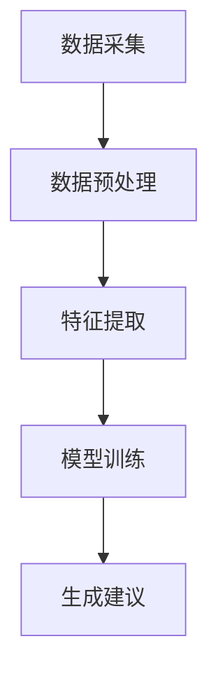
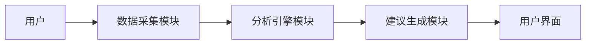

                 


# AI Agent在智能镜框中的面部护理建议

## 关键词：AI Agent, 智能镜框, 面部护理, 人工智能算法, 机器学习

## 摘要：本文探讨AI Agent在智能镜框中的应用，分析其如何通过数据采集与处理、智能算法、系统架构设计等技术手段，实现个性化的面部护理建议。文章详细介绍了AI Agent的核心原理、算法模型、系统架构，并通过实际案例展示了AI在面部护理中的潜力和优势。

---

## 第1章: AI Agent与智能镜框的背景介绍

### 1.1 AI Agent的基本概念
- **1.1.1 AI Agent的定义**：AI Agent是能够感知环境、自主决策并采取行动以实现目标的智能实体。
- **1.1.2 AI Agent的核心属性**：自主性、反应性、目标导向、社交能力。
- **1.1.3 AI Agent与传统软件的区别**：传统软件依赖用户输入，AI Agent能主动感知和决策。

### 1.2 智能镜框的定义与特点
- **1.2.1 智能镜框的功能概述**：集成传感器和AI技术，实时监测面部特征。
- **1.2.2 智能镜框的技术特点**：高精度传感器、AI算法、用户交互界面。
- **1.2.3 智能镜框的市场现状**：市场需求增长迅速，应用前景广阔。

### 1.3 面部护理的背景与需求
- **1.3.1 面部护理的基本概念**：通过清洁、保湿等方式维护皮肤健康。
- **1.3.2 当前面部护理的主要方式**：传统方法依赖经验，效率低。
- **1.3.3 AI在面部护理中的应用潜力**：精准分析，提供个性化建议。

### 1.4 本章小结
本章介绍了AI Agent和智能镜框的基本概念，分析了AI在面部护理中的潜力。

---

## 第2章: AI Agent的核心原理

### 2.1 AI Agent的核心原理
- **2.1.1 数据采集与处理**：使用摄像头和传感器获取面部数据。
- **2.1.2 智能分析与决策**：通过机器学习模型分析数据，生成护理建议。
- **2.1.3 个性化建议生成**：根据用户特征定制建议。

### 2.2 AI Agent与智能镜框的结合
- **2.2.1 数据采集方式**：光学传感器、摄像头。
- **2.2.2 数据分析与处理**：特征提取、分类、预测。
- **2.2.3 个性化建议的生成与展示**：通过镜子显示建议。

### 2.3 核心概念对比分析
- **2.3.1 AI Agent与传统软件的对比**：AI Agent具有自主性和智能性。
- **2.3.2 智能镜框与其他智能设备的对比**：专注于面部数据，提供个性化建议。
- **2.3.3 面部护理与其他健康监测方式的对比**：更注重个性化和实时性。

### 2.4 本章小结
本章详细讲解了AI Agent的核心原理及其在智能镜框中的应用。

---

## 第3章: AI Agent的算法原理与数学模型

### 3.1 AI Agent的算法原理
- **3.1.1 数据采集与预处理**：
  - 数据采集：使用摄像头获取面部图像。
  - 数据清洗：去除噪声，标准化处理。
- **3.1.2 AI Agent的核心算法**：
  - 机器学习算法：随机森林、支持向量机。
  - 深度学习算法：卷积神经网络（CNN）用于图像识别。
  - 自然语言处理算法：生成自然的护理建议。

### 3.2 算法流程图


### 3.3 数学模型
- **线性回归模型**：
  $$ y = \beta_0 + \beta_1x + \epsilon $$
  其中，$y$ 是目标变量，$x$ 是自变量，$\beta_0$ 和 $\beta_1$ 是系数，$\epsilon$ 是误差项。
- **卷积神经网络（CNN）**：
  $$ \text{Activation} = \sigma(w \cdot x + b) $$
  其中，$\sigma$ 是激活函数，$w$ 是权重，$x$ 是输入，$b$ 是偏置。

### 3.4 本章小结
本章详细介绍了AI Agent的算法原理和数学模型，为后续实现打下基础。

---

## 第4章: 系统分析与架构设计

### 4.1 系统功能设计
- **数据采集模块**：负责采集面部图像和传感器数据。
- **分析引擎模块**：利用AI算法分析数据，生成护理建议。
- **建议生成模块**：根据分析结果生成个性化建议。

### 4.2 系统架构设计


### 4.3 系统接口设计
- 数据采集接口：与摄像头和传感器通信。
- 用户界面接口：显示建议和交互操作。

### 4.4 本章小结
本章详细分析了系统的架构设计和功能模块。

---

## 第5章: 项目实战

### 5.1 环境安装
- 安装Python、TensorFlow、OpenCV。

### 5.2 核心代码实现
```python
import cv2
import tensorflow as tf

# 数据预处理
def preprocess_image(image):
    # 缩放图像
    resized = cv2.resize(image, (128, 128))
    # 转换为张量
    tensor = tf.convert_to_tensor(resized, dtype=tf.float32)
    return tensor

# 加载预训练模型
model = tf.keras.models.load_model('face_care_model.h5')

# 生成建议
def generate建议(image):
    preprocessed = preprocess_image(image)
    prediction = model.predict(preprocessed)
    return prediction
```

### 5.3 代码解读与分析
- 数据预处理：将图像缩放到固定大小，转换为张量。
- 模型加载：使用预训练的深度学习模型进行预测。
- 结果分析：根据预测结果生成护理建议。

### 5.4 实际案例分析
- 用户A：皮肤干燥，建议使用保湿霜。
- 用户B：有轻微皱纹，建议使用抗皱产品。

### 5.5 本章小结
本章通过实战项目展示了AI Agent在智能镜框中的具体实现。

---

## 第6章: 最佳实践与总结

### 6.1 小结
- AI Agent在智能镜框中的应用潜力巨大。
- 通过数据采集、分析和建议生成，实现个性化的面部护理。

### 6.2 注意事项
- 数据隐私保护：确保用户数据安全。
- 算法优化：提高模型的准确性和效率。
- 用户体验：设计友好的交互界面。

### 6.3 拓展阅读
- 推荐学习AI相关的书籍和课程，深入了解机器学习和深度学习。

### 6.4 本章小结
本章总结了AI Agent在智能镜框中的应用，并提供了实践建议。

---

## 结语

通过本文的详细介绍，读者可以全面了解AI Agent在智能镜框中的面部护理建议。AI技术的应用为面部护理带来了新的可能性，未来随着技术的进步，智能镜框将在健康监测和个性化护理方面发挥更大的作用。

