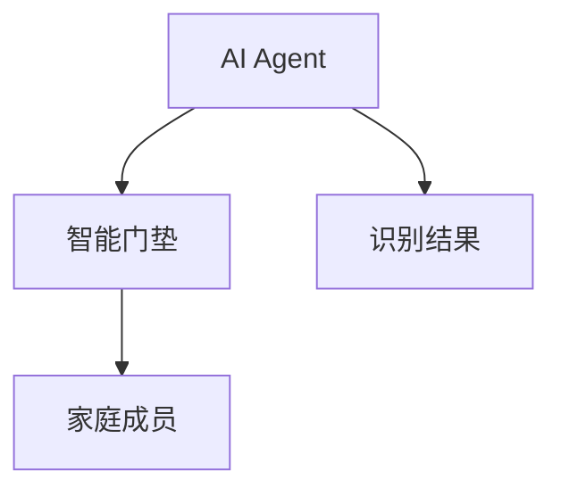
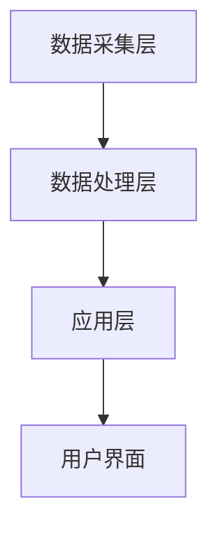

                 


```markdown
# AI Agent在智能门垫中的家庭成员识别

> 关键词：AI Agent, 智能门垫, 家庭成员识别, 数据分析, 传感器技术, 算法实现

> 摘要：本文详细探讨了AI Agent在智能门垫中的家庭成员识别技术，从背景介绍、核心概念、算法原理、系统架构到项目实战，全面分析了该技术的实现过程和应用价值。通过理论与实践结合，展示了如何利用AI Agent和传感器技术实现高效的家庭成员识别。

---

# 第1章: 背景介绍

## 1.1 问题背景

### 1.1.1 智能门垫的发展现状
- 智能门垫的普及与应用场景
- 当前技术的主要挑战

### 1.1.2 家庭成员识别的必要性
- 家庭成员识别的实际需求
- 智能门垫数据的特点

### 1.1.3 当前技术的局限性
- 传统识别方法的不足
- AI Agent的优势

## 1.2 问题描述

### 1.2.1 家庭成员识别的核心问题
- 数据采集、特征提取、分类识别
- 多人识别的挑战

### 1.2.2 智能门垫数据的特点
- 数据类型与格式
- 数据的实时性与准确性

### 1.2.3 识别系统的功能需求
- 实时性、准确性、可扩展性

## 1.3 问题解决思路

### 1.3.1 AI Agent的核心作用
- AI Agent的定义与分类
- AI Agent在识别系统中的应用

### 1.3.2 数据驱动的识别方法
- 数据采集与预处理
- 特征提取与分类

### 1.3.3 系统设计的初步框架
- 系统模块划分
- 功能流程设计

## 1.4 系统边界与外延

### 1.4.1 系统的功能边界
- 核心功能与辅助功能
- 边界条件与约束

### 1.4.2 与其他智能家居设备的交互
- 数据共享与协同工作
- 交互接口设计

### 1.4.3 系统的可扩展性
- 模块化设计
- 功能扩展的可能性

## 1.5 概念结构与核心要素

### 1.5.1 AI Agent的基本构成
- 感知层、决策层、执行层
- 各层之间的关系

### 1.5.2 智能门垫的数据模型
- 数据结构与存储方式
- 数据流的处理流程

### 1.5.3 家庭成员识别的流程图
- 识别流程的可视化
- 关键步骤的详细说明

---

# 第2章: 核心概念与联系

## 2.1 AI Agent的基本原理

### 2.1.1 AI Agent的定义与分类
- 智能体与代理的定义
- AI Agent的分类及其特点

### 2.1.2 AI Agent的核心属性
- 智能性、自主性、反应性、社会性
- 属性之间的相互作用

### 2.1.3 AI Agent与传统算法的区别
- 算法驱动 vs 智能体驱动
- 响应机制的差异

## 2.2 智能门垫的技术特点

### 2.2.1 智能门垫的数据采集方式
- 压力传感器、重量传感器
- 数据采集的精度与频率

### 2.2.2 门垫传感器的工作原理
- 压力传感器的原理
- 数据采集的物理模型

### 2.2.3 数据的实时性与准确性
- 数据传输的实时性
- 数据处理的准确性

## 2.3 核心概念对比

### 2.3.1 AI Agent的基本构成
- 感知层、决策层、执行层
- 各层之间的关系

### 2.3.2 智能门垫的数据模型
- 数据结构与存储方式
- 数据流的处理流程

### 2.3.3 家庭成员识别的流程图
- 识别流程的可视化
- 关键步骤的详细说明

## 2.4 实体关系图

### 2.4.1 实体关系的Mermaid图


### 2.4.2 关系的详细说明
- AI Agent与智能门垫的关系
- 智能门垫与家庭成员的关系
- 识别结果的反馈机制

---

# 第3章: 算法原理

## 3.1 AI Agent的算法实现

### 3.1.1 算法流程
- 数据采集、特征提取、分类识别
- 算法的详细步骤

### 3.1.2 数据预处理
- 数据清洗、归一化、特征提取
- 数据预处理的代码实现

### 3.1.3 分类算法
- K-近邻算法、支持向量机、随机森林
- 算法的优缺点分析

## 3.2 传感器数据的处理

### 3.2.1 数据采集的流程
- 传感器数据的采集与传输
- 数据的实时处理

### 3.2.2 数据的特征提取
- 时间序列特征、频域特征
- 特征提取的Python代码示例

### 3.2.3 数据的分类与识别
- 分类器的训练与测试
- 识别结果的输出

## 3.3 算法的数学模型

### 3.3.1 分类算法的数学公式
- K-近邻算法的距离计算公式
- 支持向量机的优化目标函数

### 3.3.2 特征提取的数学方法
- 傅里叶变换的公式
- 时间序列的统计特征计算

### 3.3.3 模型的优化与调参
- 超参数的调优方法
- 模型的评估指标

## 3.4 算法实现的代码示例

### 3.4.1 数据预处理代码
```python
import numpy as np
import pandas as pd

# 数据加载
data = pd.read_csv('sensor_data.csv')

# 数据清洗
data.dropna(inplace=True)

# 特征提取
features = data[['weight', 'pressure']]
```

### 3.4.2 分类器训练代码
```python
from sklearn.neighbors import KNeighborsClassifier

# 模型训练
model = KNeighborsClassifier(n_neighbors=3)
model.fit(features, labels)

# 模型预测
predicted_labels = model.predict(new_features)
```

## 3.5 算法的优化与改进

### 3.5.1 算法的优化方向
- 特征选择、模型集成、超参数调优
- 算法优化的具体方法

### 3.5.2 算法的改进措施
- 引入深度学习模型
- 数据增强技术的应用

---

# 第4章: 系统分析与架构设计

## 4.1 系统的功能设计

### 4.1.1 功能模块划分
- 数据采集模块、特征提取模块、分类识别模块
- 各模块的功能描述

### 4.1.2 功能流程设计
- 数据采集流程、特征提取流程、分类识别流程
- 流程的可视化

## 4.2 系统架构设计

### 4.2.1 模块化设计
- 数据采集层、数据处理层、应用层
- 各层之间的交互

### 4.2.2 微服务架构
- 服务的划分与交互
- 服务间的通信机制

### 4.2.3 系统的部署架构
- 单机部署、分布式部署
- 系统的扩展性设计

## 4.3 系统接口设计

### 4.3.1 接口定义
- API接口的定义与调用
- 接口的输入输出格式

### 4.3.2 接口的实现
- 数据采集接口、特征提取接口、分类识别接口
- 接口的实现代码

## 4.4 系统交互设计

### 4.4.1 交互流程
- 用户触发识别、系统响应
- 识别结果的反馈

### 4.4.2 交互的可视化
- 交互流程的Mermaid图
- 交互界面的设计

### 4.4.3 交互的优化
- 响应时间的优化
- 用户体验的提升

## 4.5 系统架构的Mermaid图

### 4.5.1 系统架构图


### 4.5.2 模块划分与交互关系
- 各模块之间的依赖关系
- 模块的交互流程

---

# 第5章: 项目实战

## 5.1 环境安装

### 5.1.1 开发环境的搭建
- Python、Jupyter Notebook的安装
- 开发工具的配置

### 5.1.2 依赖库的安装
- scikit-learn、numpy、pandas
- 其他需要的库的安装

## 5.2 系统核心实现

### 5.2.1 数据预处理代码
```python
import pandas as pd

# 数据加载
data = pd.read_csv('sensor_data.csv')

# 数据清洗
data.dropna(inplace=True)
```

### 5.2.2 特征提取代码
```python
import numpy as np

# 特征提取
features = data[['weight', 'pressure']]
```

### 5.2.3 分类器训练代码
```python
from sklearn.neighbors import KNeighborsClassifier

# 模型训练
model = KNeighborsClassifier(n_neighbors=3)
model.fit(features, labels)
```

## 5.3 代码应用解读

### 5.3.1 代码的功能解读
- 数据预处理代码的作用
- 特征提取代码的功能
- 分类器训练代码的实现

### 5.3.2 代码的优化建议
- 参数调整、模型优化
- 代码的可读性提升

## 5.4 实际案例分析

### 5.4.1 数据集的来源
- 数据集的获取与描述
- 数据集的特征分析

### 5.4.2 识别结果的展示
- 识别结果的可视化
- 识别准确率的分析

### 5.4.3 案例分析与总结
- 成功案例的分析
- 失败案例的总结

## 5.5 项目小结

### 5.5.1 项目的完成情况
- 项目目标的实现程度
- 项目中的问题与解决方案

### 5.5.2 项目的改进方向
- 系统的优化方向
- 项目功能的扩展

---

# 第6章: 总结与展望

## 6.1 系统总结

### 6.1.1 系统的功能总结
- 核心功能的实现
- 辅助功能的实现

### 6.1.2 系统的性能总结
- 识别准确率、响应时间
- 系统的稳定性

## 6.2 系统优缺点

### 6.2.1 系统的优点
- 高准确性、高实时性
- 易扩展性、易维护性

### 6.2.2 系统的缺点
- 识别精度受数据质量的影响
- 系统的复杂性较高

## 6.3 系统的优化建议

### 6.3.1 算法优化
- 引入更先进的AI算法
- 提升模型的泛化能力

### 6.3.2 系统优化
- 提升系统的可扩展性
- 优化系统的响应速度

## 6.4 未来展望

### 6.4.1 技术的发展方向
- AI技术的进一步发展
- 多传感器融合技术的应用

### 6.4.2 应用场景的扩展
- 更多家庭成员识别的应用场景
- 智能家居的进一步发展

## 6.5 最佳实践与注意事项

### 6.5.1 最佳实践
- 数据预处理的重要性
- 模型优化的注意事项

### 6.5.2 注意事项
- 数据隐私的保护
- 系统安全性的保障

---

# 附录: 参考文献与拓展阅读

## 附录A: 参考文献
- AI Agent相关的文献
- 智能门垫相关的文献
- 家庭成员识别相关的文献

## 附录B: 拓展阅读
- 深度学习在家庭成员识别中的应用
- 多传感器融合技术的研究进展
- 智能家居的最新发展

---

# 结束语

感谢您的阅读！希望本文对您了解AI Agent在智能门垫中的家庭成员识别有所帮助。如需进一步探讨或交流，请随时联系！
</think>

```markdown
# AI Agent在智能门垫中的家庭成员识别

> 关键词：AI Agent, 智能门垫, 家庭成员识别, 传感器技术, 数据分析, 算法实现

> 摘要：本文详细探讨了AI Agent在智能门垫中的家庭成员识别技术，从背景介绍、核心概念、算法原理、系统架构到项目实战，全面分析了该技术的实现过程和应用价值。通过理论与实践结合，展示了如何利用AI Agent和传感器技术实现高效的家庭成员识别。

---

# 第1章: 背景介绍

## 1.1 问题背景

### 1.1.1 智能门垫的发展现状
- 智能门垫的普及与应用场景
- 当前技术的主要挑战

### 1.1.2 家庭成员识别的必要性
- 家庭成员识别的实际需求
- 智能门垫数据的特点

### 1.1.3 当前技术的局限性
- 传统识别方法的不足
- AI Agent的优势

## 1.2 问题描述

### 1.2.1 家庭成员识别的核心问题
- 数据采集、特征提取、分类识别
- 多人识别的挑战

### 1.2.2 智能门垫数据的特点
- 数据类型与格式
- 数据的实时性与准确性

### 1.2.3 识别系统的功能需求
- 实时性、准确性、可扩展性

## 1.3 问题解决思路

### 1.3.1 AI Agent的核心作用
- AI Agent的定义与分类
- AI Agent在识别系统中的应用

### 1.3.2 数据驱动的识别方法
- 数据采集与预处理
- 特征提取与分类

### 1.3.3 系统设计的初步框架
- 系统模块划分
- 功能流程设计

## 1.4 系统边界与外延

### 1.4.1 系统的功能边界
- 核心功能与辅助功能
- 边界条件与约束

### 1.4.2 与其他智能家居设备的交互
- 数据共享与协同工作
- 交互接口设计

### 1.4.3 系统的可扩展性
- 模块化设计
- 功能扩展的可能性

## 1.5 概念结构与核心要素

### 1.5.1 AI Agent的基本构成
- 感知层、决策层、执行层
- 各层之间的关系

### 1.5.2 智能门垫的数据模型
- 数据结构与存储方式
- 数据流的处理流程

### 1.5.3 家庭成员识别的流程图
- 识别流程的可视化
- 关键步骤的详细说明

---

# 第2章: 核心概念与联系

## 2.1 AI Agent的基本原理

### 2.1.1 AI Agent的定义与分类
- 智能体与代理的定义
- AI Agent的分类及其特点

### 2.1.2 AI Agent的核心属性
- 智能性、自主性、反应性、社会性
- 属性之间的相互作用

### 2.1.3 AI Agent与传统算法的区别
- 算法驱动 vs 智能体驱动
- 响应机制的差异

## 2.2 智能门垫的技术特点

### 2.2.1 智能门垫的数据采集方式
- 压力传感器、重量传感器
- 数据采集的精度与频率

### 2.2.2 门垫传感器的工作原理
- 压力传感器的原理
- 数据采集的物理模型

### 2.2.3 数据的实时性与准确性
- 数据传输的实时性
- 数据处理的准确性

## 2.3 核心概念对比

### 2.3.1 AI Agent的基本构成
- 感知层、决策层、执行层
- 各层之间的关系

### 2.3.2 智能门垫的数据模型
- 数据结构与存储方式
- 数据流的处理流程

### 2.3.3 家庭成员识别的流程图
- 识别流程的可视化
- 关键步骤的详细说明

## 2.4 实体关系图

### 2.4.1 实体关系的Mermaid图


### 2.4.2 关系的详细说明
- AI Agent与智能门垫的关系
- 智能门垫与家庭成员的关系
- 识别结果的反馈机制

---

# 第3章: 算法原理

## 3.1 AI Agent的算法实现

### 3.1.1 算法流程
- 数据采集、特征提取、分类识别
- 算法的详细步骤

### 3.1.2 数据预处理
- 数据清洗、归一化、特征提取
- 数据预处理的代码实现

### 3.1.3 分类算法
- K-近邻算法、支持向量机、随机森林
- 算法的优缺点分析

## 3.2 传感器数据的处理

### 3.2.1 数据采集的流程
- 传感器数据的采集与传输
- 数据的实时处理

### 3.2.2 数据的特征提取
- 时间序列特征、频域特征
- 特征提取的Python代码示例

### 3.2.3 数据的分类与识别
- 分类器的训练与测试
- 识别结果的输出

## 3.3 算法的数学模型

### 3.3.1 分类算法的数学公式
- K-近邻算法的距离计算公式
- 支持向量机的优化目标函数

### 3.3.2 特征提取的数学方法
- 傅里叶变换的公式
- 时间序列的统计特征计算

### 3.3.3 模型的优化与调参
- 超参数的调优方法
- 模型的评估指标

## 3.4 算法实现的代码示例

### 3.4.1 数据预处理代码
```python
import numpy as np
import pandas as pd

# 数据加载
data = pd.read_csv('sensor_data.csv')

# 数据清洗
data.dropna(inplace=True)

# 特征提取
features = data[['weight', 'pressure']]
```

### 3.4.2 分类器训练代码
```python
from sklearn.neighbors import KNeighborsClassifier

# 模型训练
model = KNeighborsClassifier(n_neighbors=3)
model.fit(features, labels)

# 模型预测
predicted_labels = model.predict(new_features)
```

## 3.5 算法的优化与改进

### 3.5.1 算法的优化方向
- 特征选择、模型集成、超参数调优
- 算法优化的具体方法

### 3.5.2 算法的改进措施
- 引入深度学习模型
- 数据增强技术的应用

---

# 第4章: 系统分析与架构设计

## 4.1 系统的功能设计

### 4.1.1 功能模块划分
- 数据采集模块、特征提取模块、分类识别模块
- 各模块的功能描述

### 4.1.2 功能流程设计
- 数据采集流程、特征提取流程、分类识别流程
- 流程的可视化

## 4.2 系统架构设计

### 4.2.1 模块化设计
- 数据采集层、数据处理层、应用层
- 各层之间的交互

### 4.2.2 微服务架构
- 服务的划分与交互
- 服务间的通信机制

### 4.2.3 系统的部署架构
- 单机部署、分布式部署
- 系统的扩展性设计

## 4.3 系统接口设计

### 4.3.1 接口定义
- API接口的定义与调用
- 接口的输入输出格式

### 4.3.2 接口的实现
- 数据采集接口、特征提取接口、分类识别接口
- 接口的实现代码

## 4.4 系统交互设计

### 4.4.1 交互流程
- 用户触发识别、系统响应
- 识别结果的反馈

### 4.4.2 交互的可视化
- 交互流程的Mermaid图
- 交互界面的设计

### 4.4.3 交互的优化
- 响应时间的优化
- 用户体验的提升

## 4.5 系统架构的Mermaid图

### 4.5.1 系统架构图


### 4.5.2 模块划分与交互关系
- 各模块之间的依赖关系
- 模块的交互流程

---

# 第5章: 项目实战

## 5.1 环境安装

### 5.1.1 开发环境的搭建
- Python、Jupyter Notebook的安装
- 开发工具的配置

### 5.1.2 依赖库的安装
- scikit-learn、numpy、pandas
- 其他需要的库的安装

## 5.2 系统核心实现

### 5.2.1 数据预处理代码
```python
import pandas as pd

# 数据加载
data = pd.read_csv('sensor_data.csv')

# 数据清洗
data.dropna(inplace=True)
```

### 5.2.2 特征提取代码
```python
import numpy as np

# 特征提取
features = data[['weight', 'pressure']]
```

### 5.2.3 分类器训练代码
```python
from sklearn.neighbors import KNeighborsClassifier

# 模型训练
model = KNeighborsClassifier(n_neighbors=3)
model.fit(features, labels)
```

## 5.3 代码应用解读

### 5.3.1 代码的功能解读
- 数据预处理代码的作用
- 特征提取代码的功能
- 分类器训练代码的实现

### 5.3.2 代码的优化建议
- 参数调整、模型优化
- 代码的可读性提升

## 5.4 实际案例分析

### 5.4.1 数据集的来源
- 数据集的获取与描述
- 数据集的特征分析

### 5.4.2 识别结果的展示
- 识别结果的可视化
- 识别准确率的分析

### 5.4.3 案例分析与总结
- 成功案例的分析
- 失败案例的总结

## 5.5 项目小结

### 5.5.1 项目的完成情况
- 项目目标的实现程度
- 项目中的问题与解决方案

### 5.5.2 项目的改进方向
- 系统的优化方向
- 项目功能的扩展

---

# 第6章: 总结与展望

## 6.1 系统总结

### 6.1.1 系统的功能总结
- 核心功能的实现
- 辅助功能的实现

### 6.1.2 系统的性能总结
- 识别准确率、响应时间
- 系统的稳定性

## 6.2 系统优缺点

### 6.2.1 系统的优点
- 高准确性、高实时性
- 易扩展性、易维护性

### 6.2.2 系统的缺点
- 识别精度受数据质量的影响
- 系统的复杂性较高

## 6.3 系统的优化建议

### 6.3.1 算法优化
- 引入更先进的AI算法
- 提升模型的泛化能力

### 6.3.2 系统优化
- 提升系统的可扩展性
- 优化系统的响应速度

## 6.4 未来展望

### 6.4.1 技术的发展方向
- AI技术的进一步发展
- 多传感器融合技术的应用

### 6.4.2 应用场景的扩展
- 更多家庭成员识别的应用场景
- 智能家居的进一步发展

## 6.5 最佳实践与注意事项

### 6.5.1 最佳实践
- 数据预处理的重要性
- 模型优化的注意事项

### 6.5.2 注意事项
- 数据隐私的保护
- 系统安全性的保障

---

# 附录: 参考文献与拓展阅读

## 附录A: 参考文献
- AI Agent相关的文献
- 智能门垫相关的文献
- 家庭成员识别相关的文献

## 附录B: 拓展阅读
- 深度学习在家庭成员识别中的应用
- 多传感器融合技术的研究进展
- 智能家居的最新发展

---

# 结束语

感谢您的阅读！希望本文对您了解AI Agent在智能门垫中的家庭成员识别有所帮助。如需进一步探讨或交流，请随时联系！
```

