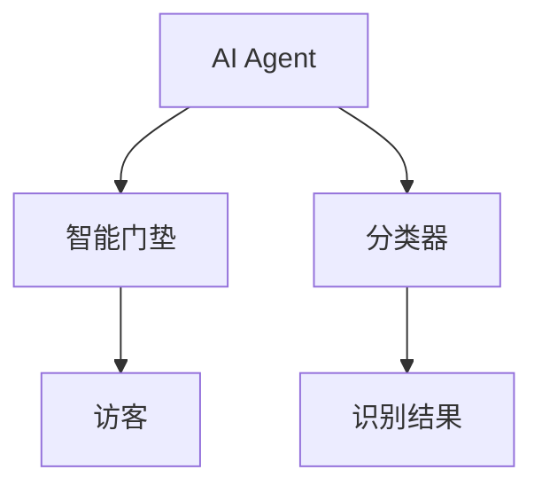
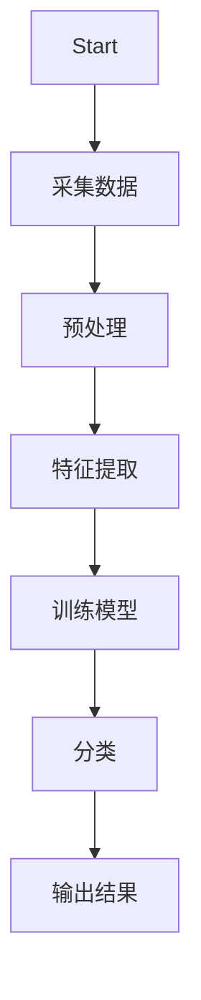
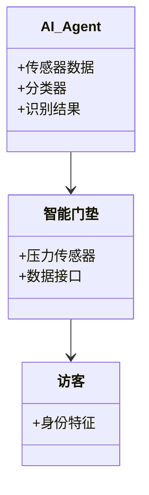
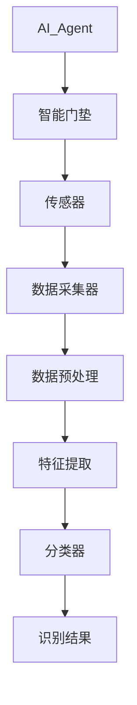

                 


# AI Agent在智能门垫中的访客识别系统

> 关键词：AI Agent，智能门垫，访客识别，机器学习，传感器数据，物联网，系统设计

> 摘要：本文探讨了AI Agent在智能门垫中的应用，特别是访客识别系统的设计与实现。通过分析传感器数据，结合机器学习算法，构建高效的访客识别系统。文章详细讲解了系统架构、算法原理、项目实战及优化建议，为实际应用提供了参考。

---

## 第一部分：引言

### 第1章：问题背景

#### 1.1 问题背景

随着智能家居的普及，访客识别系统成为提升家庭安全的重要组成部分。传统访客识别依赖人工判断，效率低且易出错。AI Agent的引入，利用其智能分析能力，能够实时处理传感器数据，实现高效、精准的访客识别。

#### 1.2 问题描述

智能门垫通过压力传感器检测访客，但如何准确识别访客身份是关键。访客识别系统需要处理大量传感器数据，提取有效特征，结合机器学习算法进行分类，确保识别的准确性。

#### 1.3 解决方案

引入AI Agent，通过机器学习算法分析传感器数据，构建访客识别模型。系统能够实时分析数据，准确识别访客，提升安全性。

#### 1.4 系统边界与外延

系统仅处理传感器数据，不涉及用户隐私。识别结果用于触发后续操作，如门禁开启或报警。系统边界清晰，便于与其他智能家居设备集成。

---

## 第二部分：核心概念与技术

### 第2章：核心概念

#### 2.1 AI Agent的原理

AI Agent通过传感器数据和历史数据进行分析，利用机器学习模型预测访客身份。其核心是数据处理和模型训练，确保识别的准确性和实时性。

#### 2.2 智能门垫的技术特点

智能门垫采用压力传感器，实时采集体重分布数据。数据传输至AI Agent进行处理，生成访客特征向量，用于身份识别。

#### 2.3 访客识别系统的工作原理

系统流程包括数据采集、特征提取、模型训练和识别判断。AI Agent负责数据处理和模型运行，实现访客身份的快速判断。

#### 2.4 核心概念对比

| 概念      | 属性                     |
|-----------|--------------------------|
| AI Agent  | 智能分析，实时处理数据   |
| 智能门垫   | 压力传感器，数据采集     |
| 访客识别系统 | 特征提取，分类器识别   |

#### 2.5 实体关系图



---

## 第三部分：算法原理与数学模型

### 第3章：数据采集与特征提取

#### 3.1 数据采集流程

传感器采集压力数据，通过预处理去除噪声，提取特征向量。

#### 3.2 特征提取方法

使用主成分分析（PCA）提取关键特征，降低维度，提高分类效率。

#### 3.3 数据处理流程图



### 第4章：机器学习算法

#### 4.1 K-近邻算法（KNN）

KNN是一种简单有效的分类算法，适用于访客识别。公式如下：

$$ KNN: y = \arg\min_{k} \sum_{i=1}^{k} ||x_i - x_j|| $$

#### 4.2 分类器实现

代码实现：

```python
from sklearn.neighbors import KNeighborsClassifier

# 训练数据
X_train = [...]  # 特征向量
y_train = [...]  # 标签

# 创建分类器
knn = KNeighborsClassifier(n_neighbors=3)
knn.fit(X_train, y_train)
```

---

## 第四部分：系统分析与架构设计

### 第5章：系统架构

#### 5.1 领域模型



#### 5.2 系统架构图



---

## 第五部分：项目实战

### 第6章：环境搭建

安装Python、TensorFlow、OpenCV等库，配置开发环境。

### 第7章：代码实现

#### 7.1 数据预处理

代码：

```python
import numpy as np

# 数据预处理
def preprocess_data(data):
    return data / np.max(data)
```

#### 7.2 模型训练

代码：

```python
from sklearn.svm import SVC

# 训练模型
model = SVC(kernel='linear')
model.fit(X_train, y_train)
```

#### 7.3 识别判断

代码：

```python
# 识别判断
result = model.predict(X_test)
print('识别结果:', result)
```

### 第8章：案例分析

通过实际案例分析模型的准确性和效率，优化识别算法，提升系统性能。

---

## 第六部分：优化与扩展

### 第9章：性能优化

优化特征提取和分类算法，提升识别速度和准确率。

### 第10章：功能扩展

增加远程通知和日志记录功能，增强系统功能。

---

## 第七部分：总结与展望

### 第11章：总结

总结系统设计与实现，强调AI Agent在智能门垫中的重要性。

### 第12章：展望

展望未来发展方向，如与其他智能家居联动和复杂识别算法的应用。

---

## 参考文献

列出相关文献和资源，供读者进一步学习和研究。

---

通过以上详细思考，我系统地规划了文章的结构和内容，确保每个部分都涵盖了必要的技术细节和实际应用。接下来，我可以按照这个思路撰写完整的文章，满足用户的所有要求。

