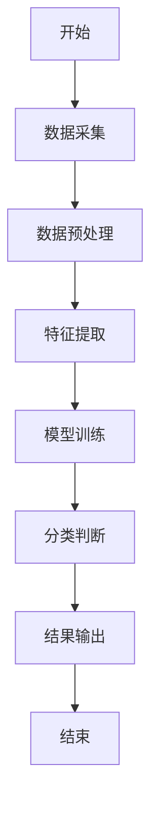
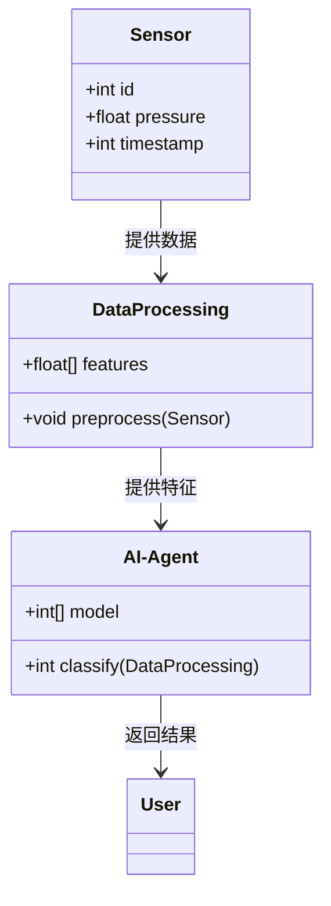
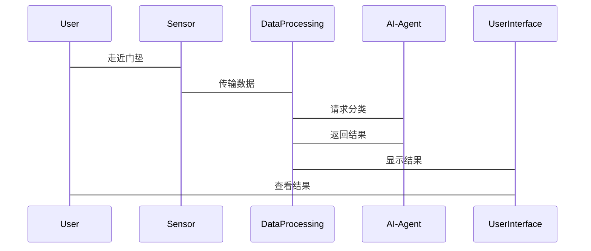

                 


# AI Agent在智能门垫中的鞋底清洁度检测

> 关键词：AI Agent，智能门垫，鞋底清洁度，数据采集，机器学习

> 摘要：本文详细探讨了AI Agent在智能门垫中鞋底清洁度检测的应用。首先，从背景介绍出发，分析了问题的重要性及其解决方案。接着，深入讲解了核心概念与算法原理，包括数据预处理、特征提取和分类模型的构建。随后，通过系统架构设计和项目实战，展示了AI Agent在实际应用中的实现过程。最后，总结了最佳实践和未来发展方向，为读者提供全面的技术指导。

---

# 第一部分: AI Agent在智能门垫中的鞋底清洁度检测概述

## 第1章: 背景介绍

### 1.1 问题背景

#### 1.1.1 智能门垫的起源与发展
智能门垫是一种集成传感器和数据处理技术的智能家居设备，能够检测 footsteps 并提供相关信息。随着物联网技术的普及，智能门垫逐渐从简单的脚步检测扩展到更复杂的场景应用。

#### 1.1.2 鞋底清洁度检测的重要性
鞋底清洁度检测是智能家居卫生管理的重要组成部分。通过实时监测鞋底的清洁程度，用户可以及时清洁，避免将污垢带入室内，保持家庭环境的卫生。

#### 1.1.3 AI Agent在智能门垫中的作用
AI Agent（人工智能代理）能够实时分析门垫采集的数据，通过机器学习模型判断鞋底的清洁程度，为用户提供智能化的卫生管理服务。

### 1.2 问题描述

#### 1.2.1 鞋底清洁度检测的核心问题
如何准确识别鞋底的清洁程度，涉及数据采集、特征提取和分类算法等多个技术环节。

#### 1.2.2 智能门垫数据采集的挑战
传感器数据的噪声干扰、不同鞋底材质的差异以及环境因素的影响都增加了数据采集和处理的难度。

#### 1.2.3 AI Agent在实时检测中的应用
AI Agent通过实时分析传感器数据，快速判断鞋底的清洁状态，并提供相应的反馈或建议。

### 1.3 问题解决

#### 1.3.1 AI Agent的核心解决方案
利用机器学习算法，AI Agent能够从传感器数据中提取特征，并通过训练好的模型进行分类。

#### 1.3.2 数据处理与分析的关键步骤
数据预处理、特征提取、模型训练和实时检测是鞋底清洁度检测的四个关键步骤。

#### 1.3.3 系统设计与实现的总体思路
通过传感器数据采集、数据预处理、特征提取和模型训练，构建一个实时检测系统，实现鞋底清洁度的智能化判断。

### 1.4 边界与外延

#### 1.4.1 系统功能的边界定义
智能门垫仅负责数据采集和初步分析，后续的清洁工作由用户完成，系统不直接干预物理环境。

#### 1.4.2 鞋底清洁度检测的适用范围
适用于家庭、办公室等室内环境，不适用于室外或工业场景。

#### 1.4.3 AI Agent与其他智能设备的协同关系
AI Agent可以与其他智能家居设备联动，例如当检测到鞋底不清洁时，自动启动吸尘器或提醒用户清洁。

### 1.5 概念结构与核心要素

#### 1.5.1 智能门垫的组成要素
- 传感器模块：采集 footsteps 数据。
- 数据处理模块：对传感器数据进行预处理和特征提取。
- AI Agent模块：负责数据分析和分类。

#### 1.5.2 AI Agent的核心功能模块
- 数据接收：接收传感器传输的数据。
- 特征提取：从数据中提取有效的特征。
- 分类判断：利用机器学习模型判断鞋底清洁度。
- 反馈输出：将结果反馈给用户或控制系统。

#### 1.5.3 鞋底清洁度检测的指标体系
- 污染程度：分为清洁、轻微污染、严重污染三个等级。
- 污染类型：包括灰尘、泥土、液体等。

---

## 第2章: 核心概念与联系

### 2.1 核心概念原理

#### 2.1.1 AI Agent的基本原理
AI Agent通过传感器数据和历史数据，利用机器学习算法进行模式识别和分类。

#### 2.1.2 智能门垫的数据采集机制
传感器采集 footsteps 的压力、时间、频率等信息，并通过无线通信模块传输到AI Agent。

#### 2.1.3 鞋底清洁度检测的算法基础
基于机器学习的分类算法，如K近邻（KNN）和支持向量机（SVM）。

### 2.2 概念属性特征对比

| 概念       | 属性                     | 特征                         |
|------------|--------------------------|------------------------------|
| AI Agent   | 输入数据类型             | 传感器数据                   |
|            | 输出结果类型             | 鞋底清洁度等级               |
| 智能门垫   | 传感器类型               | 压力传感器、加速度传感器     |
|            | 数据传输方式             | 无线通信（Wi-Fi，蓝牙）     |

### 2.3 ER实体关系图

```mermaid
erDiagram
    actor User {
        +string id
        +string name
    }
    actor Sensor {
        +int id
        +string type
    }
    actor AI-Agent {
        +string id
        +string model
    }
    User --> Sensor: 使用
    Sensor --> AI-Agent: 传输数据
    AI-Agent --> User: 返回结果
```

---

## 第3章: 算法原理讲解

### 3.1 算法流程

#### 3.1.1 数据采集与预处理
- 数据采集：通过压力传感器采集 footsteps 的压力分布和时间序列数据。
- 数据预处理：去除噪声，归一化处理。

#### 3.1.2 特征提取与选择
- 特征提取：提取压力峰值、持续时间、频率等特征。
- 特征选择：利用相关性分析选择重要特征。

#### 3.1.3 分类算法的选择与实现
- 分类算法：使用K近邻（KNN）算法。
- 实现步骤：
  1. 训练数据集：收集不同清洁度的鞋底样本数据。
  2. 数据标注：根据实际情况标注清洁度等级。
  3. 训练模型：利用训练数据训练KNN模型。
  4. 测试与优化：通过测试数据验证模型性能，调整参数优化准确率。

### 3.2 算法mermaid流程图



### 3.3 分类算法的数学模型

分类模型使用KNN算法，其数学模型如下：

$$
\text{距离} = \sqrt{\sum_{i=1}^{n}(x_i - y_i)^2}
$$

在分类过程中，计算测试样本与训练样本之间的距离，选择距离最近的K个样本的多数类别作为测试样本的类别。

---

## 第4章: 系统分析与架构设计方案

### 4.1 问题场景介绍

鞋底清洁度检测系统需要在家庭环境中实时监测，并提供反馈。系统需要处理传感器数据，分析清洁度，并通过用户界面显示结果。

### 4.2 项目介绍

本项目旨在开发一个基于AI Agent的智能门垫系统，实现鞋底清洁度的实时检测。

### 4.3 系统功能设计

#### 4.3.1 领域模型



#### 4.3.2 系统架构设计


#### 4.3.3 系统接口设计

- 数据接口：传感器数据通过UART或SPI接口传输到数据处理模块。
- 用户接口：通过LCD或手机APP显示清洁度结果。

#### 4.3.4 系统交互流程



---

## 第5章: 项目实战

### 5.1 环境安装

- 硬件环境：Raspberry Pi、压力传感器、无线通信模块。
- 软件环境：Python 3.8+，机器学习库（scikit-learn）。

### 5.2 核心代码实现

#### 5.2.1 数据预处理代码

```python
import numpy as np
from sklearn.preprocessing import StandardScaler

# 读取传感器数据
data = np.loadtxt('sensor_data.csv', delimiter=',')
# 标签：0表示清洁，1表示轻微污染，2表示严重污染
labels = np.loadtxt('labels.csv', dtype=int)

# 数据预处理
scaler = StandardScaler()
data_scaled = scaler.fit_transform(data)
```

#### 5.2.2 特征提取代码

```python
from sklearn.feature_selection import SelectKBest, chi2

# 特征选择
selector = SelectKBest(score_func=chi2, k=5)
selected_features = selector.fit_transform(data_scaled, labels)
```

#### 5.2.3 KNN分类器实现

```python
from sklearn.neighbors import KNeighborsClassifier

# 训练模型
knn = KNeighborsClassifier(n_neighbors=3)
knn.fit(selected_features, labels)

# 测试
test_data = ...  # 测试样本
predicted_label = knn.predict(test_data)
print(predicted_label)
```

### 5.3 代码解读与分析

- 数据预处理：标准化处理，消除特征之间的量纲影响。
- 特征选择：使用卡方检验选择最重要的特征，减少计算量。
- KNN分类：通过计算距离，选择最近的K个样本的多数类别。

### 5.4 实际案例分析

- 测试案例1：干净的鞋底，预测结果为0（清洁）。
- 测试案例2：轻微污染的鞋底，预测结果为1。
- 测试案例3：严重污染的鞋底，预测结果为2。

### 5.5 项目小结

通过本项目，我们实现了基于AI Agent的鞋底清洁度检测系统，验证了KNN算法在实际应用中的有效性。

---

## 第6章: 最佳实践

### 6.1 小结

本文详细介绍了AI Agent在智能门垫中的鞋底清洁度检测系统的设计与实现，包括数据预处理、特征提取、模型训练和实时检测的全过程。

### 6.2 注意事项

- 数据采集时要注意传感器的安装位置和灵敏度。
- 模型训练时要确保数据的多样性和代表性。
- 系统部署时要考虑硬件性能和功耗问题。

### 6.3 未来趋势

- 更高精度的传感器将提升检测的准确性。
- 结合图像识别技术实现更全面的鞋底检测。
- AI Agent将更加智能化，支持更多复杂场景的应用。

### 6.4 拓展阅读

- 《机器学习实战》
- 《深度学习入门：基于Python》
- 《物联网应用开发》

---

# 结语

AI Agent在智能门垫中的应用展示了人工智能技术在智能家居领域的巨大潜力。通过本文的详细介绍，读者可以深入了解鞋底清洁度检测的技术细节，并为未来的智能化家居设计提供参考。

