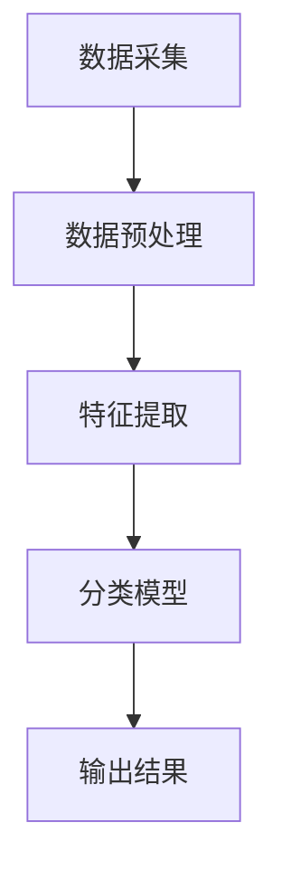
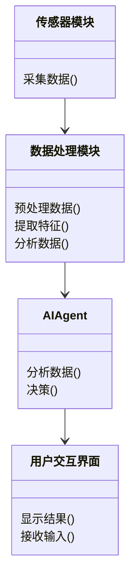
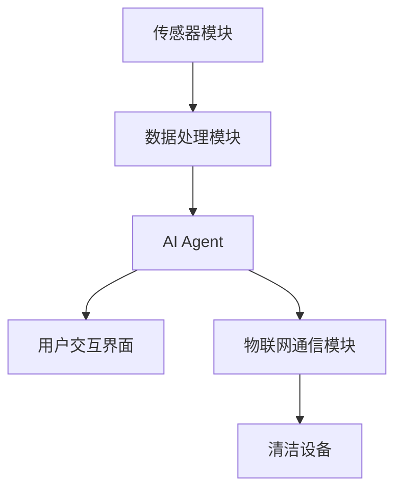
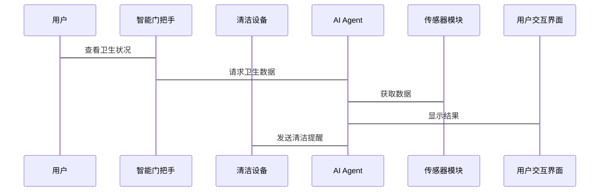

                 


# AI Agent在智能门把手中卫生状况监测

> 关键词：AI Agent、智能门把手、卫生监测、物联网、数据处理、算法原理

> 摘要：随着人们对公共场所卫生状况的关注度不断提高，AI Agent（人工智能代理）在智能门把手中的应用成为一种创新的解决方案。本文详细探讨了AI Agent在智能门把手中卫生状况监测的核心原理、系统架构、算法实现以及实际应用。通过分析AI Agent与智能门把手的协同工作，结合实际案例，本文为读者提供了一个全面了解AI Agent在卫生监测领域应用的视角。

---

# 第1章: 背景介绍

## 1.1 问题背景

### 1.1.1 公共场所卫生状况的重要性
公共场所的卫生状况直接关系到人们的健康安全。门把手作为高频接触的公共物品，是细菌和病毒传播的主要途径之一。如何实时监测门把手的卫生状况，及时提醒清洁人员进行清洁，是公共场所卫生管理的一个重要挑战。

### 1.1.2 传统卫生监测的局限性
传统的卫生监测方法依赖于人工检查，存在效率低、成本高、实时性差等问题。清洁人员无法实时掌握门把手的卫生状况，导致清洁工作可能存在遗漏或重复劳动。

### 1.1.3 AI Agent在卫生监测中的优势
AI Agent（人工智能代理）能够通过传感器数据采集、分析和决策，实时监测门把手的卫生状况，自动触发清洁提醒或通知清洁人员。这种方式不仅提高了卫生监测的效率，还降低了人工成本。

## 1.2 问题描述

### 1.2.1 智能门把手的卫生监测需求
智能门把手需要实时监测表面的细菌或污垢水平，能够根据监测结果动态调整清洁频率和清洁方式。

### 1.2.2 用户对卫生状况的关注点
用户希望了解门把手的卫生状况，尤其是在公共场所，用户对卫生安全的需求日益增加。

### 1.2.3 清洁人员的工作效率提升
AI Agent可以帮助清洁人员更高效地完成清洁任务，减少无效劳动，提高清洁效率。

## 1.3 问题解决

### 1.3.1 AI Agent的核心作用
AI Agent通过传感器数据采集、分析和决策，实现对门把手卫生状况的实时监测，并根据监测结果触发清洁提醒或清洁设备。

### 1.3.2 智能门把手的卫生监测解决方案
智能门把手集成传感器和AI Agent，实时监测表面卫生状况，并通过物联网与清洁系统联动，实现智能化清洁管理。

### 1.3.3 用户、清洁人员和AI Agent的协同工作
用户通过智能门把手的交互界面查看卫生状况，清洁人员根据AI Agent的提醒进行清洁，AI Agent负责实时监测和决策。

## 1.4 边界与外延

### 1.4.1 系统的边界定义
智能门把手卫生监测系统的边界包括传感器、AI Agent、物联网通信模块和用户交互界面。

### 1.4.2 系统外延的功能扩展
系统可以通过扩展功能支持多语言交互、用户行为分析、数据统计与分析等功能。

### 1.4.3 与其他智能设备的协同
智能门把手可以与智能楼宇系统、清洁设备联动，形成完整的智能卫生管理生态系统。

## 1.5 概念结构与核心要素

### 1.5.1 AI Agent的组成要素
- 数据采集模块：负责采集门把手的传感器数据。
- 数据分析模块：对传感器数据进行分析，判断卫生状况。
- 决策模块：根据分析结果触发清洁提醒或清洁设备。

### 1.5.2 智能门把手的结构特征
- 传感器模块：用于采集表面细菌或污垢数据。
- 数据处理模块：对传感器数据进行预处理和特征提取。
- 用户交互界面：用户查看卫生状况和操作界面。

### 1.5.3 系统的核心功能模块
- 数据采集模块：传感器实时采集数据。
- 数据分析模块：AI Agent分析数据，判断卫生状况。
- 用户交互模块：用户查看卫生状况，接收清洁提醒。

---

# 第2章: 核心概念与联系

## 2.1 AI Agent的核心原理

### 2.1.1 AI Agent的基本定义
AI Agent是一种能够感知环境、自主决策并采取行动的智能体。在智能门把手中，AI Agent负责采集数据、分析数据并触发清洁提醒。

### 2.1.2 AI Agent的核心算法
AI Agent的核心算法包括数据采集、特征提取、分类模型和决策逻辑。通过这些算法，AI Agent能够实现对门把手卫生状况的实时监测。

### 2.1.3 AI Agent与智能门把手的结合
AI Agent通过传感器采集数据，利用机器学习算法分析数据，判断门把手的卫生状况，并通过物联网通信模块通知清洁人员。

## 2.2 智能门把手的结构与功能

### 2.2.1 传感器模块
传感器模块负责采集门把手表面的细菌、污垢等数据。常用的传感器包括光学传感器、电化学传感器和红外传感器。

### 2.2.2 数据处理模块
数据处理模块对传感器采集的数据进行预处理、特征提取和分析，为AI Agent提供决策依据。

### 2.2.3 用户交互界面
用户交互界面是用户与智能门把手的交互窗口，用户可以通过界面查看卫生状况和操作门把手。

## 2.3 核心概念的联系

### 2.3.1 AI Agent与传感器的协同工作
AI Agent通过传感器获取数据，分析数据后触发清洁提醒或清洁设备。

### 2.3.2 数据处理模块的逻辑流程
数据处理模块首先对传感器数据进行预处理，然后提取特征，最后通过分类模型判断卫生状况。

### 2.3.3 用户交互的反馈机制
用户可以通过交互界面查看卫生状况，接收清洁提醒，并对系统进行操作。

## 2.4 核心概念属性特征对比

```markdown
| 特性         | AI Agent                | 智能门把手            |
|--------------|-------------------------|-----------------------|
| 核心功能     | 数据分析与决策         | 数据采集与反馈       |
| 技术基础     | 机器学习与算法         | 传感器与物联网技术    |
| 应用场景     | 实时监测与决策         | 用户交互与设备控制    |
| 输出结果     | 清洁提醒与决策建议     | 卫生状况数据与操作反馈|
```

## 2.5 ER实体关系图架构

```mermaid
er
actor(用户) -|> entity(智能门把手)
entity(智能门把手) -|> entity(传感器数据)
entity(传感器数据) -|> entity(数据分析结果)
entity(数据分析结果) -|> entity(清洁提醒)
```

---

# 第3章: 算法原理讲解

## 3.1 数据采集与预处理

### 3.1.1 数据采集
传感器采集门把手表面的细菌、污垢等数据，数据类型包括数值型、时间戳等。

### 3.1.2 数据预处理
数据预处理包括去噪、归一化和特征提取。例如，使用滑动窗口方法去除传感器噪声。

## 3.2 特征提取与分类模型

### 3.2.1 特征提取
从传感器数据中提取特征，例如细菌密度、污垢类型、温度、湿度等。

### 3.2.2 分类模型
使用机器学习算法对特征进行分类，判断门把手的卫生状况。常用的算法包括随机森林、支持向量机（SVM）和神经网络。

## 3.3 算法实现

### 3.3.1 分类模型的数学公式
随机森林分类器的数学公式如下：
$$
P(y|x) = \sum_{i=1}^{n} w_i \cdot I(f_i(x) = y)
$$
其中，$w_i$是决策树的重要性权重，$f_i(x)$是决策树的预测结果。

### 3.3.2 分类模型的流程图



---

# 第4章: 系统分析与架构设计方案

## 4.1 问题场景介绍

### 4.1.1 项目背景
智能门把手卫生监测系统旨在通过AI Agent实现对门把手卫生状况的实时监测，提升公共场所的卫生安全。

### 4.1.2 项目目标
实现对门把手卫生状况的实时监测、自动清洁提醒和用户交互功能。

## 4.2 系统功能设计

### 4.2.1 领域模型类图



### 4.2.2 系统架构设计



### 4.2.3 系统接口设计
系统接口包括传感器数据接口、用户交互接口和物联网通信接口。传感器数据接口用于采集数据，用户交互接口用于显示结果，物联网通信接口用于通知清洁设备。

### 4.2.4 系统交互流程图



---

# 第5章: 项目实战

## 5.1 环境安装

### 5.1.1 Python环境安装
安装Python 3.8及以上版本，安装必要的库：numpy、pandas、scikit-learn、matplotlib。

### 5.1.2 系统核心实现源代码

```python
import numpy as np
from sklearn.ensemble import RandomForestClassifier
from sklearn.metrics import accuracy_score

# 数据采集
data = np.random.rand(100, 5)  # 示例数据，5个特征，100个样本
labels = np.random.randint(0, 2, 100)  # 二分类问题

# 数据预处理
from sklearn.preprocessing import StandardScaler
scaler = StandardScaler()
data_scaled = scaler.fit_transform(data)

# 特征提取
from sklearn.decomposition import PCA
pca = PCA(n_components=3)
data_pca = pca.fit_transform(data_scaled)

# 模型训练
model = RandomForestClassifier(n_estimators=100)
model.fit(data_pca, labels)

# 模型预测
test_data = np.random.rand(10, 5)
test_data_scaled = scaler.transform(test_data)
test_data_pca = pca.transform(test_data_scaled)
predicted_labels = model.predict(test_data_pca)

# 模型评估
accuracy = accuracy_score(labels, predicted_labels)
print(f"模型准确率: {accuracy}")
```

### 5.1.3 代码功能解读
上述代码展示了如何通过随机森林算法对传感器数据进行分类。首先进行数据预处理和特征提取，然后训练模型，最后进行预测和评估。

### 5.1.4 代码应用解读与分析
代码中的传感器数据可以替换为实际采集的门把手卫生数据，通过调整模型参数可以提高分类准确率。

### 5.1.5 实际案例分析
以某办公楼门把手的卫生监测为例，通过传感器采集数据，AI Agent分析数据后，自动触发清洁提醒，清洁人员及时清洁门把手，确保卫生安全。

## 5.2 项目小结

### 5.2.1 项目总结
通过AI Agent和智能门把手的结合，实现了门把手卫生状况的实时监测和自动清洁提醒，提高了公共场所的卫生安全。

### 5.2.2 项目意义
AI Agent在智能门把手中的应用不仅提升了卫生监测的效率，还为公共场所的智能化管理提供了新的思路。

---

# 第6章: 最佳实践

## 6.1 小结

### 6.1.1 核心内容总结
本文详细介绍了AI Agent在智能门把手中卫生监测的核心原理、系统架构、算法实现和实际应用。

## 6.2 注意事项

### 6.2.1 数据隐私保护
在实际应用中，需注意保护用户隐私，确保数据不被滥用。

### 6.2.2 系统稳定性
确保系统的稳定性和可靠性，避免因传感器故障或网络问题导致服务中断。

### 6.2.3 系统维护
定期对系统进行维护和更新，确保传感器和AI Agent的性能。

## 6.3 拓展阅读

### 6.3.1 相关技术领域
建议读者进一步了解机器学习在物联网中的应用、传感器技术的发展和人工智能在公共卫生领域的应用。

### 6.3.2 热门技术话题
关注AI Agent在智能硬件中的应用、边缘计算在物联网中的应用等热门技术话题。

---

# 第7章: 结语

随着AI技术的不断发展，AI Agent在智能门把手中卫生监测的应用前景广阔。通过本文的分析，我们不仅了解了AI Agent的核心原理和系统架构，还通过实际案例展示了其在公共场所卫生管理中的巨大潜力。未来，随着技术的进一步发展，AI Agent将为公共场所的卫生安全提供更加强有力的支持。

