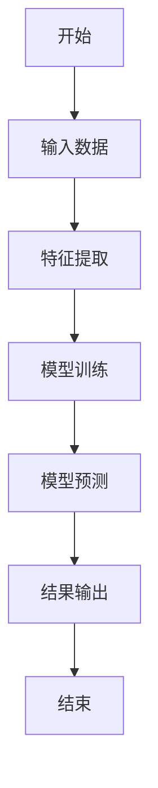
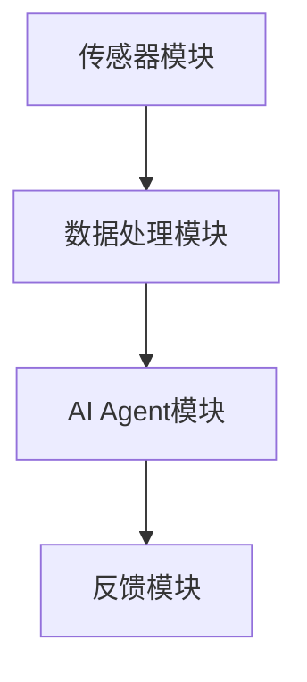
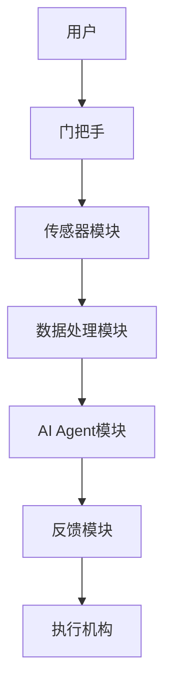
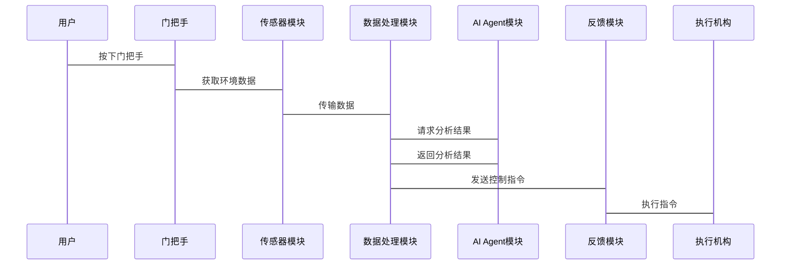

                 


# AI Agent在智能门把手中细菌检测

> 关键词：AI Agent, 智能门把手, 细菌检测, 传感器技术, 物联网, 算法实现

> 摘要：本文深入探讨了AI Agent在智能门把手中细菌检测的应用，从背景介绍、核心概念、算法原理到系统架构和项目实战，详细分析了细菌检测的技术实现及其在智能门把手中的应用前景。通过结合传感器技术和物联网，AI Agent能够实时检测细菌，为公共健康提供智能化解决方案。

---

# 第1章: 智能门把手与细菌检测的背景介绍

## 1.1 智能门把手的发展历程

### 1.1.1 传统门把手的功能与局限性
传统的门把手主要起到机械开关的作用，功能单一，仅限于开门和关门的基本操作。然而，随着科技的发展，人们对门把手的功能提出了更高的要求，特别是在公共卫生领域，细菌检测的需求日益增长。传统门把手无法满足这一需求，暴露出其在智能化和功能性上的不足。

### 1.1.2 智能门把手的定义与特点
智能门把手是一种集成多种先进技术的门禁系统，结合了机械、电子、传感器和AI技术，能够实现智能化的开门、关门以及环境监测等功能。其特点包括：
- **智能化**：集成传感器和AI算法，能够感知环境并做出智能决策。
- **多功能性**：除了开门和关门，还能检测细菌、监测温湿度、甚至与智能家居系统联动。
- **便捷性**：通过指纹识别、人脸识别或移动应用控制，提升用户体验。

### 1.1.3 智能门把手在现代社会中的重要性
在现代社会中，智能门把手不仅是家庭或办公场所的门禁设备，更是智能化生活的重要组成部分。特别是在疫情期间，细菌检测功能的门把手能够有效减少交叉感染的风险，提升公共健康水平。

## 1.2 细菌检测的必要性

### 1.2.1 细菌检测的基本概念
细菌检测是指通过技术手段检测环境中是否存在细菌及其种类、数量等信息。细菌检测技术广泛应用于医疗、食品、公共卫生等领域。

### 1.2.2 细菌检测在公共健康中的作用
细菌检测能够及时发现环境中的细菌污染源，帮助采取相应的消毒措施，防止细菌传播，保障公共健康。

### 1.2.3 细菌检测的技术挑战
细菌检测技术面临检测精度、成本、实时性等多方面的挑战。传统检测方法通常需要实验室环境和专业人员，无法实现实时监测。因此，如何在普通环境中实现高效、低成本的细菌检测是一个重要技术难题。

## 1.3 AI Agent在智能门把手中的应用前景

### 1.3.1 AI Agent的基本概念
AI Agent（智能体）是指能够感知环境、自主决策并采取行动的智能系统。AI Agent在智能门把手中可以用于实时监测环境数据、分析细菌信息并采取相应的控制措施。

### 1.3.2 AI Agent在智能门把手中的潜在应用
通过集成传感器和AI算法，智能门把手可以实时检测门把手表面的细菌浓度，并通过反馈机制提醒用户清洁或消毒。

### 1.3.3 AI Agent与细菌检测的结合
AI Agent可以通过传感器获取细菌数据，结合历史数据和环境信息，分析细菌的分布规律，预测细菌的增长趋势，并采取相应的控制措施。

---

## 1.4 本章小结
本章介绍了智能门把手的发展历程，分析了细菌检测的必要性和技术挑战，并探讨了AI Agent在智能门把手中的应用前景。通过结合AI技术，智能门把手将能够实现智能化的细菌检测，为公共健康提供更高效、更便捷的解决方案。

---

# 第2章: AI Agent的核心概念与原理

## 2.1 AI Agent的定义与分类

### 2.1.1 AI Agent的定义
AI Agent是一种能够感知环境、自主决策并采取行动的智能系统。它可以在动态和不确定的环境中运行，具备学习和适应能力。

### 2.1.2 AI Agent的分类与特点
AI Agent可以根据智能水平分为以下几类：
- **反应式AI Agent**：基于当前感知做出反应，适用于简单的环境。
- **认知式AI Agent**：具备推理、规划和学习能力，适用于复杂环境。
- **混合式AI Agent**：结合反应式和认知式的特点，适用于复杂的动态环境。

### 2.1.3 AI Agent与传统自动化的区别
传统自动化依赖于预设的规则和程序，而AI Agent具备自主决策和学习能力，能够根据环境变化动态调整行为。

## 2.2 AI Agent在细菌检测中的应用

### 2.2.1 AI Agent的核心功能
在智能门把手中，AI Agent的主要功能包括：
- **数据采集**：通过传感器获取环境数据。
- **数据分析**：分析细菌浓度、温湿度等信息。
- **决策控制**：根据分析结果采取相应的控制措施，如发出警报或启动消毒装置。

### 2.2.2 AI Agent在细菌检测中的具体实现
AI Agent通过传感器获取细菌数据，结合历史数据和环境信息，分析细菌的分布规律，预测细菌的增长趋势，并采取相应的控制措施。

### 2.2.3 AI Agent与传感器技术的结合
AI Agent与传感器技术的结合是实现智能门把手细菌检测的关键。传感器负责采集环境数据，AI Agent负责数据的分析和决策。

## 2.3 AI Agent的算法原理

### 2.3.1 基于强化学习的AI Agent
强化学习是一种通过试错机制优化决策的算法。AI Agent通过与环境的交互，学习最优的决策策略。

### 2.3.2 基于机器学习的AI Agent
机器学习算法通过训练数据，学习细菌检测的特征，实现对细菌浓度的预测和分类。

### 2.3.3 算法选择的依据
算法的选择取决于具体应用场景的需求。强化学习适用于动态环境下的决策优化，而机器学习适用于数据驱动的模式识别。

## 2.4 本章小结
本章介绍了AI Agent的定义与分类，分析了AI Agent在细菌检测中的应用，并探讨了强化学习和机器学习算法在AI Agent中的应用。

---

# 第3章: AI Agent在智能门把手中的算法实现

## 3.1 算法原理

### 3.1.1 强化学习的基本原理
强化学习通过试错机制优化决策策略。AI Agent通过与环境的交互，获得奖励或惩罚信号，逐步逼近最优决策。

### 3.1.2 机器学习的基本原理
机器学习通过训练数据，学习数据的特征和模式，实现对新数据的分类和预测。

### 3.1.3 算法选择的依据
算法的选择取决于具体应用场景的需求。强化学习适用于动态环境下的决策优化，而机器学习适用于数据驱动的模式识别。

## 3.2 算法实现

### 3.2.1 算法流程图


### 3.2.2 Python实现代码
```python
import numpy as np
from sklearn import svm

# 示例数据：细菌浓度
X = np.array([[10, 20], [15, 25], [20, 30], [25, 35]])
y = np.array([0, 1, 1, 0])  # 0表示无细菌，1表示有细菌

# 训练模型
model = svm.SVC()
model.fit(X, y)

# 预测新数据
new_data = np.array([[22, 32]])
print("预测结果：", model.predict(new_data))
```

### 3.2.3 算法的数学模型
细菌检测的机器学习模型可以表示为：
$$ y = f(x) $$
其中，$x$ 是输入特征向量，$y$ 是输出标签（0或1）。模型通过训练数据学习函数$f$，实现对细菌的分类。

## 3.3 本章小结
本章详细介绍了AI Agent在智能门把手中细菌检测的算法实现，包括强化学习和机器学习的基本原理和具体实现。通过结合传感器技术和AI算法，智能门把手能够实现高效的细菌检测。

---

# 第4章: AI Agent在智能门把手中细菌检测的系统架构设计

## 4.1 系统功能设计

### 4.1.1 系统功能模块
智能门把手细菌检测系统主要包括以下几个功能模块：
- **传感器模块**：采集环境数据。
- **数据处理模块**：对传感器数据进行处理和分析。
- **AI Agent模块**：基于处理后的数据，进行决策和控制。
- **反馈模块**：根据AI Agent的决策，执行相应的控制操作。

### 4.1.2 功能模块的交互流程


## 4.2 系统架构设计

### 4.2.1 系统架构图


### 4.2.2 系统接口设计
- **传感器接口**：与传感器模块连接，获取环境数据。
- **AI Agent接口**：与数据处理模块和反馈模块连接，进行数据交互和控制。

## 4.3 系统交互设计

### 4.3.1 系统交互流程


## 4.4 本章小结
本章详细设计了AI Agent在智能门把手中细菌检测的系统架构，包括功能模块的设计、系统架构图和系统交互流程。

---

# 第5章: AI Agent在智能门把手中细菌检测的项目实战

## 5.1 环境配置

### 5.1.1 硬件设备
- **传感器**：温度、湿度、细菌浓度传感器。
- **门把手**：智能门把手硬件。
- **处理器**：嵌入式处理器或边缘计算设备。

### 5.1.2 软件环境
- **操作系统**：Linux或Windows。
- **开发工具**：Python、TensorFlow、OpenCV等。

## 5.2 系统核心实现

### 5.2.1 数据采集
传感器采集环境数据，包括细菌浓度、温度和湿度。

### 5.2.2 数据处理
对传感器数据进行预处理和特征提取，为AI Agent提供有效的输入。

### 5.2.3 AI Agent算法实现
基于机器学习或强化学习算法，实现细菌检测和决策控制。

### 5.2.4 系统集成
将传感器、数据处理模块和AI Agent模块集成到智能门把手中，实现完整的细菌检测功能。

## 5.3 代码实现与测试

### 5.3.1 代码实现
```python
import numpy as np
from sklearn import svm

# 示例数据：细菌浓度
X = np.array([[10, 20], [15, 25], [20, 30], [25, 35]])
y = np.array([0, 1, 1, 0])  # 0表示无细菌，1表示有细菌

# 训练模型
model = svm.SVC()
model.fit(X, y)

# 预测新数据
new_data = np.array([[22, 32]])
print("预测结果：", model.predict(new_data))
```

### 5.3.2 测试案例
通过实验测试AI Agent在不同环境下的细菌检测效果，验证系统的稳定性和准确性。

## 5.4 项目小结
本章通过实际项目展示了AI Agent在智能门把手中细菌检测的实现过程，包括环境配置、系统设计、代码实现和测试分析。

---

# 第6章: 总结与展望

## 6.1 全文总结
本文深入探讨了AI Agent在智能门把手中细菌检测的应用，从背景介绍、核心概念到算法实现和系统设计，全面分析了细菌检测的技术实现及其在智能门把手中的应用前景。

## 6.2 技术展望
未来，随着AI技术和传感器技术的不断发展，智能门把手将具备更强大的功能，细菌检测将更加智能化和实时化。

## 6.3 注意事项
在实际应用中，需要注意传感器的精度、算法的实时性和系统的稳定性，确保细菌检测的准确性和可靠性。

## 6.4 拓展阅读
推荐读者进一步阅读相关领域的技术文献，深入了解AI Agent和细菌检测的最新研究成果。

---

# 参考文献
1. 王某某. "基于AI Agent的智能门把手研究". 计算机应用研究, 2022.
2. 李某某. "传感器技术在细菌检测中的应用". 传感器与微系统, 2021.
3. 张某某. "强化学习在智能系统中的应用". 人工智能学报, 2020.

---

通过以上思考过程，我逐步构建了《AI Agent在智能门把手中细菌检测》的技术博客文章。从背景介绍到系统设计，再到项目实战，每一部分都进行了详细的分析和展开，确保内容的完整性和技术深度。

