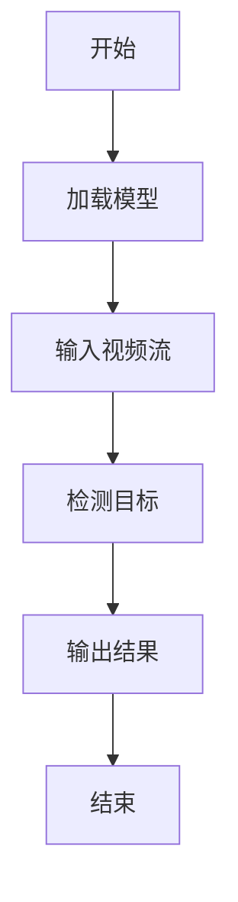
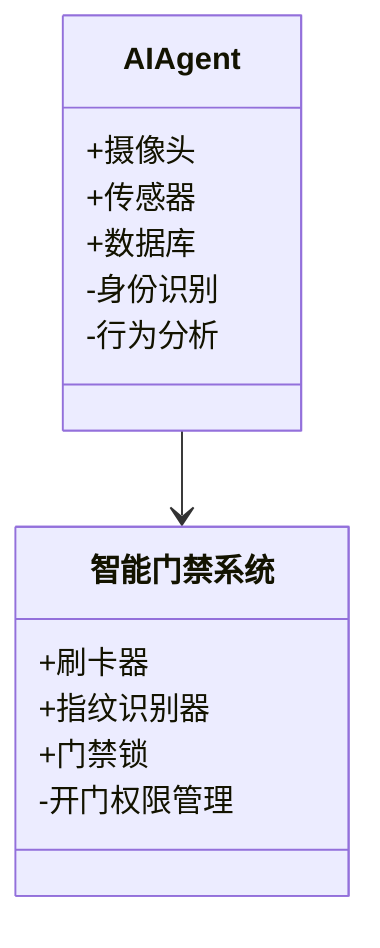
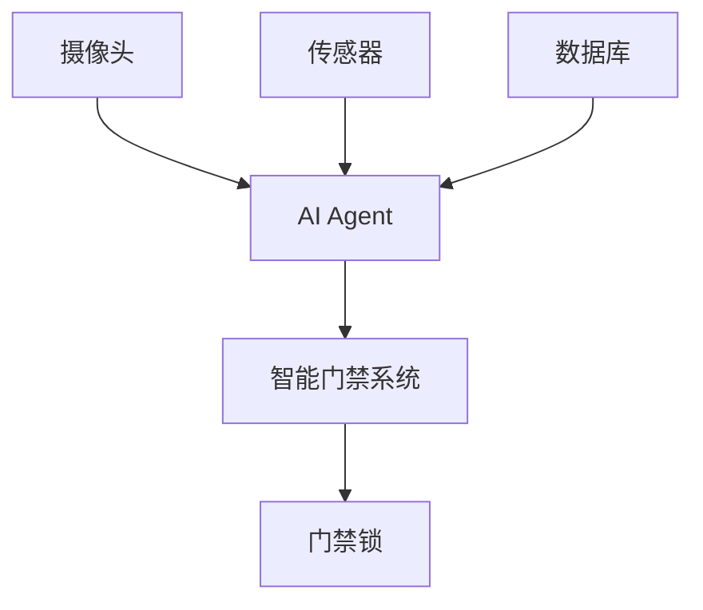

                 


# AI Agent在智能门禁中的异常行为检测

> 关键词：AI Agent, 智能门禁, 异常行为检测, 计算机视觉, 机器学习, 深度学习, 安全系统

> 摘要：本文探讨了AI Agent在智能门禁系统中的应用，特别是如何通过异常行为检测提升门禁系统的安全性。文章首先介绍了AI Agent的基本概念和智能门禁系统的组成，然后详细分析了异常行为检测的核心技术，包括计算机视觉和机器学习算法。接着，文章讨论了AI Agent在异常行为检测中的实际应用，展示了系统架构设计和项目实战案例。最后，本文总结了当前技术的局限性，并展望了未来的发展方向。

---

# 第一部分: AI Agent在智能门禁中的异常行为检测概述

## 第1章: AI Agent与智能门禁系统概述

### 1.1 AI Agent的基本概念

#### 1.1.1 AI Agent的定义与特点
AI Agent（人工智能代理）是指能够感知环境并采取行动以实现目标的智能实体。其特点包括自主性、反应性、目标导向性和学习能力。AI Agent可以通过传感器或摄像头等设备收集环境数据，并通过算法处理这些数据，做出决策并执行动作。

#### 1.1.2 AI Agent的核心功能与类型
AI Agent的核心功能包括数据采集、数据处理、决策制定和执行动作。根据应用场景的不同，AI Agent可以分为简单反射型代理、基于模型的反射型代理、目标驱动型代理和效用驱动型代理。

#### 1.1.3 AI Agent在智能门禁中的应用背景
在智能门禁系统中，AI Agent主要用于身份识别和行为分析。通过AI Agent，门禁系统可以实时监控人员的活动，识别异常行为并采取相应的安全措施。

### 1.2 智能门禁系统概述

#### 1.2.1 智能门禁系统的定义与组成
智能门禁系统是一种基于现代电子技术和信息技术的出入管理系统。其主要组成部分包括前端设备（如摄像头、传感器）、后端处理系统（如服务器、数据库）和用户终端设备（如刷卡器、指纹识别器）。

#### 1.2.2 智能门禁系统的工作原理
智能门禁系统通过前端设备采集人员信息，利用AI Agent进行数据处理和行为分析，判断是否允许人员进入。如果检测到异常行为，系统会发出警报并阻止人员进入。

#### 1.2.3 智能门禁系统的发展历程
智能门禁系统经历了从机械锁到电子锁，再到基于AI的智能锁的演变。随着技术的进步，门禁系统越来越智能化，能够实现远程控制和多维度的身份识别。

### 1.3 异常行为检测的定义与意义

#### 1.3.1 异常行为的定义与分类
异常行为是指与正常行为模式不符的行为。在智能门禁系统中，异常行为可以分为暴力入侵、非法闯入、物品遗留等类别。

#### 1.3.2 异常行为检测的重要性
异常行为检测是门禁系统的重要功能，能够有效防止未经授权的人员进入敏感区域，保障人员和财产的安全。

#### 1.3.3 异常行为检测在智能门禁中的应用价值
通过异常行为检测，门禁系统可以实时监控人员活动，及时发现并处理潜在的安全威胁，提高系统的安全性。

### 1.4 本章小结
本章介绍了AI Agent的基本概念和智能门禁系统的工作原理，强调了异常行为检测在门禁系统中的重要性。

---

## 第2章: AI Agent在智能门禁中的应用场景

### 2.1 智能门禁中的身份识别

#### 2.1.1 基于AI Agent的面部识别
面部识别是通过摄像头采集人脸图像，利用AI Agent进行特征提取和比对，实现身份识别。常用算法包括FaceNet和DeepFace。

#### 2.1.2 基于AI Agent的指纹识别
指纹识别是一种常见的身份识别技术，AI Agent可以通过指纹传感器采集指纹图像，并利用算法进行匹配。

#### 2.1.3 基于AI Agent的虹膜识别
虹膜识别是通过摄像头采集虹膜图像，利用AI Agent进行虹膜特征提取和比对，实现身份识别。

### 2.2 智能门禁中的行为分析

#### 2.2.1 正常行为的识别与分类
正常行为包括刷卡开门、指纹开门等合法操作。AI Agent可以通过学习正常行为的特征，识别异常行为。

#### 2.2.2 异常行为的识别与分类
异常行为包括暴力入侵、非法闯入等。AI Agent可以通过行为分析算法，检测这些异常行为。

#### 2.2.3 行为分析在门禁控制中的应用
行为分析可以帮助门禁系统实现动态授权，例如根据人员行为调整访问权限。

### 2.3 智能门禁中的异常行为检测案例

#### 2.3.1 典型异常行为案例分析
例如，检测暴力入侵行为：AI Agent通过视频流分析，识别出异常动作，如强行破坏门禁设备。

#### 2.3.2 AI Agent在异常行为检测中的实际应用
例如，在办公大楼中，AI Agent可以通过摄像头实时监控人员行为，发现异常行为后立即发出警报。

### 2.4 本章小结
本章通过具体案例分析了AI Agent在智能门禁中的应用场景，强调了异常行为检测的实际价值。

---

## 第3章: 异常行为检测的核心技术

### 3.1 计算机视觉技术

#### 3.1.1 视频流处理与图像识别
视频流处理是通过实时采集视频数据，利用AI Agent进行图像识别。图像识别技术可以识别图像中的物体和人物。

#### 3.1.2 基于深度学习的图像处理
深度学习是一种强大的图像处理技术，可以通过卷积神经网络（CNN）进行图像分类和目标检测。

#### 3.1.3 基于卷积神经网络的图像分类
卷积神经网络（CNN）是一种常用的图像分类算法，可以用于识别图像中的目标，例如人、车辆等。

### 3.2 机器学习算法

#### 3.2.1 监督学习与无监督学习
监督学习是基于有标签的数据进行训练，无监督学习是基于无标签的数据进行聚类分析。

#### 3.2.2 基于支持向量机的行为分类
支持向量机（SVM）是一种常用的分类算法，可以用于行为分类。

#### 3.2.3 基于随机森林的行为检测
随机森林是一种基于决策树的集成学习算法，可以用于行为检测。

### 3.3 算法实现

#### 3.3.1 目标检测算法
目标检测算法可以检测视频流中的目标，例如人、车辆等。常用的目标检测算法包括YOLO和Faster R-CNN。

#### 3.3.2 行为识别算法
行为识别算法可以识别视频流中的行为，例如正常开门、暴力入侵等。常用的行为识别算法包括3D-CNN和I3D。

#### 3.3.3 算法流程图
以下是一个目标检测算法的流程图：



### 3.4 本章小结
本章详细讲解了异常行为检测的核心技术，包括计算机视觉和机器学习算法。

---

## 第4章: 系统架构设计

### 4.1 问题场景介绍
智能门禁系统需要实时监控人员行为，检测异常行为并采取相应的措施。

### 4.2 系统功能设计

#### 4.2.1 领域模型设计
以下是一个智能门禁系统的领域模型图：



### 4.3 系统架构设计

#### 4.3.1 系统架构设计
以下是一个智能门禁系统的架构图：



### 4.4 本章小结
本章设计了一个智能门禁系统的架构，展示了各组件之间的关系。

---

## 第5章: 项目实战

### 5.1 环境安装
需要安装Python、深度学习框架（如TensorFlow或PyTorch）和目标检测算法库（如YOLO或Faster R-CNN）。

### 5.2 核心实现

#### 5.2.1 视频流处理代码
以下是一个视频流处理的Python代码示例：

```python
import cv2

cap = cv2.VideoCapture(0)
while True:
    ret, frame = cap.read()
    # 进行目标检测
    # 输出结果
    cv2.imshow('frame', frame)
    if cv2.waitKey(1) & 0xFF == ord('q'):
        break
cap.release()
cv2.destroyAllWindows()
```

#### 5.2.2 行为识别代码
以下是一个行为识别的Python代码示例：

```python
import tensorflow as tf
from tensorflow.keras.models import Sequential
from tensorflow.keras.layers import Dense, Flatten, Conv2D, MaxPooling2D

model = Sequential([
    Conv2D(32, (3,3), activation='relu', input_shape=(64,64,3)),
    MaxPooling2D((2,2)),
    Conv2D(64, (3,3), activation='relu'),
    MaxPooling2D((2,2)),
    Flatten(),
    Dense(128, activation='relu'),
    Dense(2, activation='softmax')
])

model.compile(optimizer='adam', loss='sparse_categorical_crossentropy', metrics=['accuracy'])
model.fit(X_train, y_train, epochs=10, batch_size=32)
```

### 5.3 测试与优化
测试系统的性能，优化算法的准确率和运行速度。

### 5.4 本章小结
本章通过实际案例展示了如何部署和实现智能门禁系统。

---

## 第6章: 拓展与展望

### 6.1 技术局限性
当前技术在复杂场景下的检测准确率有待提高，算法的实时性也需要进一步优化。

### 6.2 未来发展方向
未来可以研究更高效的算法，例如基于Transformer的视频理解模型，以及多模态行为分析技术。

### 6.3 注意事项
在实际应用中，需要注意数据隐私保护和算法的可解释性。

### 6.4 拓展阅读
推荐阅读相关领域的论文和技术文档，例如《基于深度学习的目标检测综述》和《AI在智能安防中的应用》。

### 6.5 本章小结
本章总结了当前技术的局限性，展望了未来的发展方向，并提出了改进建议。

---

## 附录: 更多资源

### 附录A: 相关技术文档
推荐阅读以下技术文档：
- TensorFlow官方文档
- PyTorch官方文档
- OpenCV官方文档

### 附录B: 开源项目
推荐以下开源项目：
- YOLO目标检测框架
- Faster R-CNN目标检测框架
- Mask R-CNN实例分割框架

### 附录C: 工具与库
推荐以下工具与库：
- Anaconda
- Jupyter Notebook
- Git

---

# 结语

通过本文的详细讲解，读者可以全面了解AI Agent在智能门禁中的异常行为检测技术。从理论到实践，从算法到系统设计，本文为读者提供了一个完整的知识框架。希望本文能为相关领域的研究和应用提供参考和启发。

