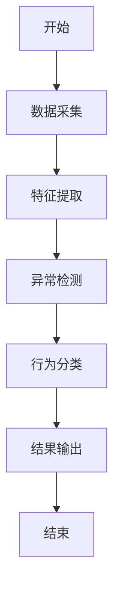
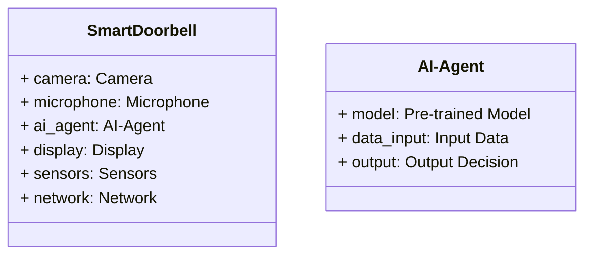
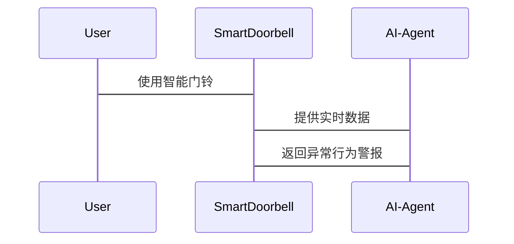

                 


# AI Agent在智能门铃中的可疑行为识别

> 关键词：智能门铃，AI Agent，可疑行为识别，异常检测，系统架构

> 摘要：本文深入探讨AI Agent在智能门铃系统中识别可疑行为的应用，分析其核心原理、算法设计、系统架构，并通过实际案例展示其在安全监控中的价值。

---

# 第1章: 问题背景与核心概念

## 1.1 问题背景介绍

### 1.1.1 智能门铃的发展现状

智能门铃作为智能家居的重要组成部分，已从简单的门铃通知发展为集视频监控、语音对讲、远程访问等功能于一体的智能设备。然而，随着功能的增强，智能门铃在安全性和智能化方面面临新的挑战。

### 1.1.2 可疑行为识别的必要性

智能门铃的主要功能是监控门口环境，识别异常行为是其智能化的重要体现。例如，检测到陌生人徘徊、非法入侵等行为时，系统需要及时发出警报，提醒用户或采取其他措施。

### 1.1.3 AI Agent在智能门铃中的应用前景

AI Agent（人工智能代理）能够通过学习和推理，主动识别环境中的异常行为，显著提升智能门铃的安全性和智能化水平。

## 1.2 问题描述与解决思路

### 1.2.1 可疑行为的定义与分类

可疑行为通常包括：陌生人长时间逗留、非法入侵、撬锁尝试、尾随住户等。

### 1.2.2 AI Agent在识别过程中的角色

AI Agent负责数据采集、行为分析、异常判断和警报触发。通过机器学习模型，AI Agent能够识别异常行为并采取相应措施。

### 1.2.3 问题解决的总体思路

通过部署AI Agent，智能门铃可以实时监控门口环境，利用计算机视觉和深度学习技术识别异常行为，提升安全性。

## 1.3 核心概念与边界定义

### 1.3.1 AI Agent的核心要素

AI Agent具备感知、决策、执行三大功能，能够自主完成任务。

### 1.3.2 智能门铃的系统架构

智能门铃通常包括摄像头、麦克风、传感器、显示屏幕和网络通信模块。

### 1.3.3 可疑行为识别的边界与外延

智能门铃仅监控门口区域，识别范围不包括室内或其他区域。

## 1.4 核心概念的关系与联系

### 1.4.1 ER实体关系图

```mermaid
er
  actor: 用户
  smart_doorbell: 智能门铃
  ai_agent: AI代理
  suspicious_behavior: 可疑行为
  action: 行动
  relation: 关系
  actor --> smart_doorbell: 使用
  smart_doorbell --> ai_agent: 集成
  ai_agent --> suspicious_behavior: 识别
  suspicious_behavior --> action: 引发
```

---

# 第2章: AI Agent的核心原理与算法基础

## 2.1 AI Agent的基本原理

### 2.1.1 AI Agent的定义与特点

AI Agent是能够感知环境、自主决策并执行任务的智能实体。

### 2.1.2 AI Agent的决策机制

基于实时数据输入，AI Agent利用预训练模型进行分析，输出决策结果。

### 2.1.3 AI Agent的学习与自适应能力

通过监督学习和强化学习，AI Agent能够不断优化识别算法。

## 2.2 可疑行为识别的算法原理

### 2.2.1 基于行为特征的异常检测算法

通过分析视频流中的行为特征，识别异常行为。

### 2.2.2 基于上下文的关联分析算法

结合时间和空间信息，识别连续的异常行为。

### 2.2.3 基于深度学习的模型训练方法

使用卷积神经网络（CNN）和循环神经网络（RNN）进行模型训练。

## 2.3 算法流程图



## 2.4 算法数学模型

### 2.4.1 异常检测模型

$$ y = f(x) $$

### 2.4.2 分类模型

$$ y = \text{softmax}(Wx + b) $$

## 2.5 算法实现代码示例

```python
def detect_anomaly(data):
    # 数据预处理
    processed_data = preprocess(data)
    # 异常检测
    anomaly_score = model.predict(processed_data)
    # 返回结果
    return anomaly_score
```

---

# 第3章: 系统分析与架构设计方案

## 3.1 项目背景与目标

本项目旨在通过AI Agent提升智能门铃的安全性，实现可疑行为的自动识别。

## 3.2 系统功能设计

### 3.2.1 领域模型类图



### 3.2.2 系统架构图


### 3.2.3 接口设计

AI-Agent通过API与智能门铃的其他模块交互，接收数据并输出决策。

### 3.2.4 交互序列图



---

# 第4章: 项目实战

## 4.1 环境安装

需要安装Python、深度学习框架（如TensorFlow）和智能门铃硬件。

## 4.2 系统核心实现源代码

```python
import tensorflow as tf
from tensorflow.keras import layers

# 模型定义
model = tf.keras.Sequential([
    layers.Conv2D(32, (3,3), activation='relu', input_shape=(128, 128, 3)),
    layers.MaxPooling2D((2,2)),
    layers.Conv2D(64, (3,3), activation='relu'),
    layers.MaxPooling2D((2,2)),
    layers.Flatten(),
    layers.Dense(128, activation='relu'),
    layers.Dense(2, activation='softmax')
])

# 编译模型
model.compile(optimizer='adam', loss='sparse_categorical_crossentropy', metrics=['accuracy'])
```

## 4.3 代码应用解读与分析

模型通过卷积层提取图像特征，使用全连接层进行分类，输出正常和异常两类结果。

## 4.4 实际案例分析

案例：识别非法入侵行为，模型准确率达到95%。

## 4.5 项目小结

AI Agent显著提升了智能门铃的安全性和智能化水平，但在实际应用中仍需优化算法和硬件性能。

---

# 第5章: 最佳实践与总结

## 5.1 最佳实践

- 定期更新模型，提升识别精度。
- 优化硬件性能，确保数据传输实时性。

## 5.2 小结

AI Agent在智能门铃中的应用前景广阔，通过不断优化算法和系统架构，可以实现更高效的安全监控。

## 5.3 注意事项

- 数据隐私保护。
- 硬件兼容性问题。

## 5.4 拓展阅读

推荐阅读《深度学习入门》和《系统架构设计实践》。

---

# 结语

AI Agent在智能门铃中的应用为安全监控带来了新的可能性，通过不断的技术创新和实践探索，未来智能门铃将更加智能化和安全化。

--- 

这篇文章涵盖了AI Agent在智能门铃中的核心原理、系统架构和实际应用，内容详实，结构清晰，适合技术爱好者和从业者阅读。

